<div align="center">
  
  <h1>Aquilia</h1>
  <p><strong>The Python framework for teams building production APIs. Write controllers and services. Aquilia discovers everything, manages its own architecture, and deploys itself.</strong></p>

  [](https://aquilia.tubox.cloud)
  [](LICENSE)
  [](https://www.python.org/)
  [](#-testing)
</div>

***

## Introduction

Aquilia is the Python framework for teams building production APIs. Write controllers and services. Aquilia discovers everything, manages its own architecture, and deploys itself.

You do not touch most framework-managed files. Write your controllers and services. Run `aq serve`. Aquilia handles routing, discovery, dependency injection, manifests, runtime orchestration, Docker integration, deployment tooling, and application wiring automatically.

### Who is it for?
Aquilia is built for backend engineers and product teams who have outgrown the ad-hoc patterns of small web libraries. If you are tired of writing routing boilerplate, manually stitching dependency trees, wrestling with ASGI lifespans, or maintaining custom Dockerfiles, Aquilia provides a clean, self-organizing architecture.

### Why does it exist?
Most Python web frameworks follow a microframework design. While this is great for small scripts, it falls apart in large codebases. Teams end up creating their own framework layers for database transactions, configuration loading, caching, versioning, and dependency injection. These layers are rarely documented, hard to test, and lead to maintenance debt. Aquilia replaces this custom glue code with standard, convention-driven structures.

### Comparison Against Flask and FastAPI
Flask and FastAPI are microframeworks. They require you to manually import and wire every router, database connection pool, and service instantiation. As your codebase grows, this leads to large, fragile import loops. Aquilia is different. You declare your controllers and services, and Aquilia discovers and wires them automatically. 

### Comparison Against NestJS
Aquilia is closer to NestJS for Python. It uses a structured, modular design where folders represent logical boundaries (modules). Modules declare their components (controllers and services) inside a manifest file, and the framework orchestrates dependency injection, middleware ordering, and lifecycle hooks automatically.

***

## Philosophy

### Convention over Configuration
We believe developers should focus on business logic rather than wiring code. Aquilia sets logical defaults for directory structures, routing, configuration caching, and environment variables. If you follow the folder structure, everything works out of the box.

### Automatic Discovery
Manual route registration is a common source of bugs and circular imports. Aquilia uses a Package Scanner to inspect your workspace, identify manifests, import modules, and register endpoints.

### Self-Managing Architecture
The framework builds a topological dependency graph at startup. It detects circular references before your application starts, manages request-scoped lifecycles, and automatically compiles your code into optimized deployment manifests.

### Production-First Design
Aquilia comes with production essentials built in:
* Scoped dependency injection with singleton, app, and request scopes.
* A structured fault handling system that replaces unhandled tracebacks with typed error domains.
* Declarative multi-dimensional security clearances.
* API versioning with RFC-compliant sunset warning headers.

***

## Quick Start

### 1. Install the Core and Server Adapters
Install the base framework along with the production server package:
```bash
pip install "aquilia[full]"
```

### 2. Scaffold a Workspace
Create a new workspace using the CLI:
```bash
aq init workspace my-api
cd my-api
```
This generates your workspace root containing `workspace.py`, a `config/` folder, and a default module.

### 3. Add a Module
Add a user management module:
```bash
aq add module users
```
This creates the following structure:
```text
modules/
└── users/
    ├── __init__.py
    ├── controllers.py
    ├── manifest.py
    ├── models.py
    └── services.py
```

### 4. Run the Development Server
Start the server with hot reloading enabled:
```bash
aq serve
```
Your API is now running on `http://127.0.0.1:8000`.

***

## Developer Workflow

### What Files You Write
As a developer, you only write code inside your modules:
* **Controllers** (`controllers.py`): Define your HTTP and WebSocket endpoints using route decorators.
* **Services** (`services.py`): Implement business logic, database operations, and external API calls.
* **Models** (`models.py`): Declare your database schema using the pure Python ORM.
* **Blueprints** (`blueprints.py` or inline): Define input and output contracts using typed validation facets.

### What Files Aquilia Manages
You do not touch configuration orchestrators, route tables, or deployment templates:
* **Workspace Config** (`workspace.py`): Scaffolds integrations once, then left alone.
* **Module Manifests** (`manifest.py`): Updated automatically by the CLI when you add components.
* **Infrastructure Dockerfiles** (`Dockerfile`, `docker-compose.yml`): Generated automatically by the compiler.
* **ASGI Lifespan Adapters**: Managed completely behind the scenes by the runtime.

***

## Why Aquilia Exists

### The Boilerplate Exhaustion
In standard Python frameworks, introducing a new service requires:
1. Importing the service class.
2. Initializing it with database connection handles.
3. Importing it into a router file.
4. Mounting the router onto the main app application.
In Aquilia, you decorate the service with `@service`, add it to the manifest, and inject it into your controller constructor. The framework handles the rest.

### Deployment Drift
Writing custom Dockerfiles and Kubernetes manifests leads to configuration drift. Developers often write configurations for local development that do not match production settings. Aquilia solves this by compiling your code directly into production-grade infrastructure configurations.

***

## Feature Overview

### Controllers
Controllers handle incoming HTTP and WebSocket requests. They are declared as classes inheriting from `Controller` and define routes with decorators like `@GET` or `@POST`.
```python
from aquilia import Controller, GET, RequestCtx, Response

class UsersController(Controller):
    prefix = "/users"
    
    @GET("/")
    async def get_all(self, ctx: RequestCtx):
        return Response.json({"users": []})
```

### Services
Services hold your business logic. They are decorated with `@service` and are automatically registered in the dependency injection container.
```python
from aquilia import service

@service
class UserService:
    def get_users(self):
        return []
```

### Dependency Injection
Aquilia supports nested dependency injection. You can inject services into controllers or other services by specifying them in the class constructor. The DI container resolves dependencies at startup.
```python
class UsersController(Controller):
    def __init__(self, user_service: UserService):
        self.user_service = user_service
```

### Blueprints
Blueprints define request validation schemas. They use facets to enforce constraints on incoming bodies, query parameters, and headers.
```python
from aquilia.blueprints import Blueprint, TextFacet, EmailFacet

class CreateUserBlueprint(Blueprint):
    username = TextFacet(min_length=3, max_length=50)
    email = EmailFacet()
```

### ORM
The built-in ORM provides an async database mapper with a chainable query builder, migrations, and transaction controls.
```python
from aquilia.models import Model, CharField, EmailField

class UserModel(Model):
    username = CharField(max_length=50)
    email = EmailField()
```

### Effects
Effects represent external side effects like database writes, caches, or task queues. Handlers declare these requirements using the `@requires` decorator, prompting the runtime to allocate resources automatically.
```python
from aquilia.effects import DBTx, CacheEffect
from aquilia.flow import requires

@requires(DBTx("write"), CacheEffect("users"))
async def update_profile(ctx):
    db = ctx.get_effect("DBTx")
    cache = ctx.get_effect("Cache")
```

### Flow
Flow is a pipeline system inspired by functional effect architectures. It lets you compose guards, transforms, handlers, and cleanup hooks into structured pipelines.
```python
from aquilia.flow import FlowPipeline, guard, handler

pipeline = (
    FlowPipeline()
    .use(guard(check_permissions))
    .use(handler(process_request))
)
```

### Faults
The fault system replaces raw exceptions with structured, typed errors. Every fault carries an error domain, a severity level, and a recovery strategy.
```python
from aquilia.faults import Fault
from aquilia.faults.domains import FaultDomain

class PaymentRequiredFault(Fault):
    def __init__(self):
        super().__init__(
            code="PAYMENT_REQUIRED",
            message="Upgrade your plan to access this feature.",
            domain=FaultDomain.SECURITY,
        )
```

### Middleware
Middleware executes before and after your request handlers. Aquilia uses priority bands to orchestrate middleware execution, including CORS, security headers, sessions, and telemetry.

### Runtime
The `AquiliaRuntime` manages the ASGI server boot sequence. It guides the application through configuration, discovery, bootstrapping, and ready phases.

### Versioning
Aquilia supports epoch-based versioning. You can define versions on controllers and set sunset policies that add deprecation warning headers to responses.
```python
from aquilia.versioning import version, SunsetPolicy

@version("2.0")
class UsersV2Controller(Controller):
    pass
```

### Discovery
The discovery engine uses static analysis and import checks to locate module manifests and wire components together without import statements.

### CLI
The `aq` command-line utility provides commands to scaffold projects, generate controllers, run migrations, compile manifests, and validate dependency graphs.

### Deployment
Aquilia generates deployment configurations for Docker, Docker Compose, and Kubernetes. It also includes render cloud integration.

### Manifests
The manifest file (`manifest.py`) acts as the module blueprint. It lists the controllers, services, socket connections, and task configurations within the module.

### Aquiliary
Aquiliary is the central app registry. It maps endpoints, validates route overlaps, and manages the dependency injection container.

### Lifecycle System
The lifecycle manager runs hooks during application startup, runtime requests, and application shutdown, ensuring database pools and cache clients are properly closed.

***

## Architecture

Decouple your application code from runtime orchestration. The system is split into three main components: developer space, framework engine, and infrastructure templates.

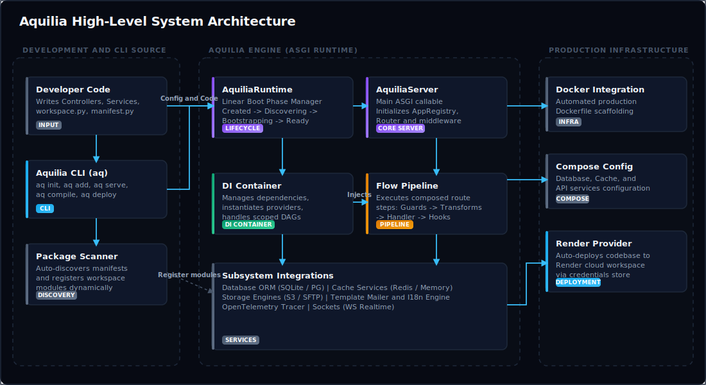

***

## Internal Runtime

The internal runtime translates ASGI connection events into structured context calls, routes requests to the correct versioned controller, and manages request-specific dependency containers.

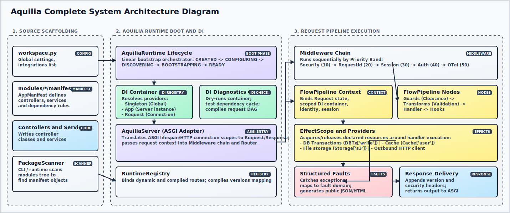

***

## Subsystem Lifecycles

### Request Lifecycle
Every incoming ASGI connection passes through the middleware stack, matches a versioned controller, runs a flow pipeline with required side effects, and returns a structured response.

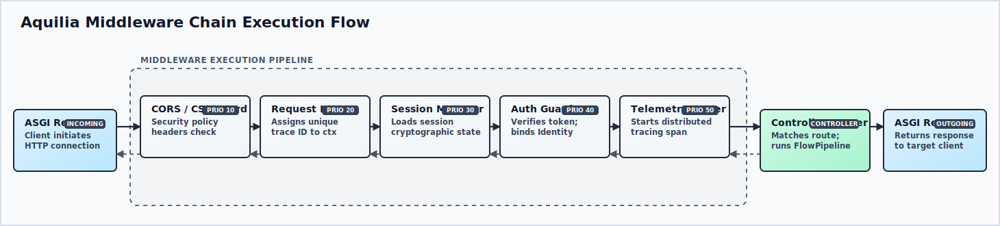

### Dependency Injection Lifecycle
The DI container discovers providers at boot, registers them into container scopes, validates dependencies for circular references, and creates request-scoped DAGs.

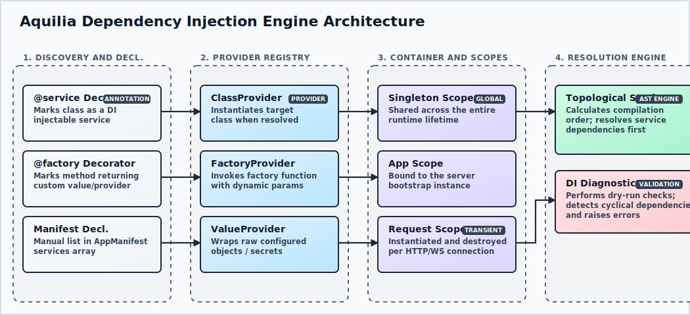

### Middleware Lifecycle
Middleware components execute sequentially based on their priority bands. Post-processing wraps the response in reverse order.


### Fault Handling Lifecycle
When an exception occurs, the interceptor catches it, maps it to a structured fault domain, evaluates its severity, and generates a formatted JSON response or HTML debug page.

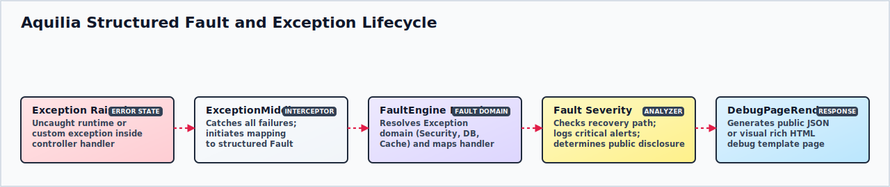

### Blueprint Lifecycle
Blueprints intercept incoming payloads, validate data types using facets, cast raw inputs into typed models, and project outgoing responses while excluding restricted fields.

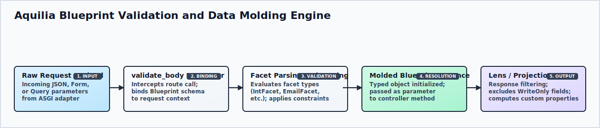

### Runtime Lifecycle
The runtime orchestrator boots your application through linear gates, verifying configuration health before starting the ASGI server.

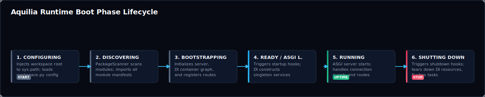

### Deployment Lifecycle
The compiler processes workspace integrations, builds dependency manifests, freezes the active configuration, and generates production Docker or Kubernetes templates.


### Manifest Architecture
The manifest lifecycle reads code declarations, analyzes file locations, compiles dependencies, and outputs a frozen runtime registry artifact.

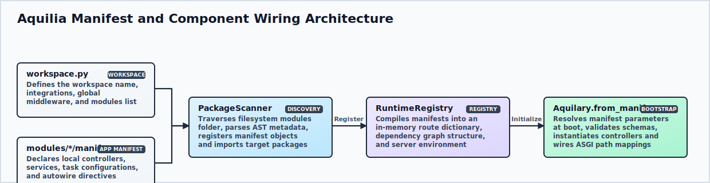

### Versioning Architecture
The versioning router evaluates incoming headers, queries, or paths to resolve the client's requested version, routes requests to the matching controller, and appends sunset warnings.

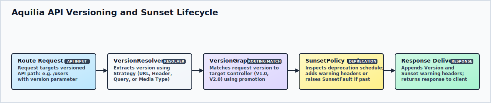

### Flow and Effect Architecture
Flow pipelines acquire required side effects (like database transactions) from providers, bind them to the request context, execute the handler, and commit or rollback changes on completion.

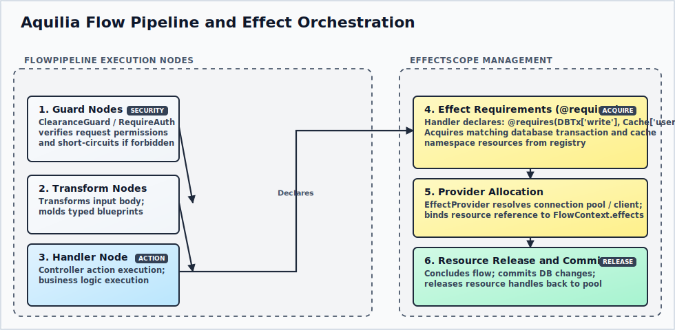

### ORM Architecture
The ORM maps declarative models to SQL statements, processes queries through connection adapters, and applies schema updates through migration scripts.

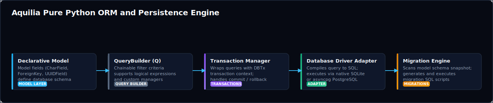

### Lifecycle Architecture
Startup and shutdown hooks run in sequence during ASGI lifecycle transitions, initializing and cleaning up shared resources like database pools.

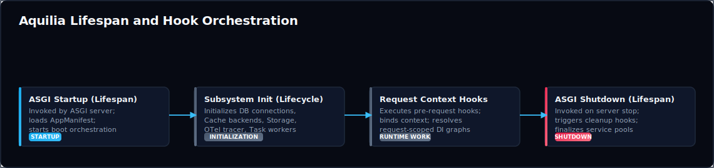

***

## Examples

### 1. Controller with Dependency Injection
```python
# modules/products/controllers.py
from aquilia import Controller, GET, RequestCtx, Response
from .services import ProductService

class ProductController(Controller):
    prefix = "/products"

    def __init__(self, product_service: ProductService):
        self.product_service = product_service

    @GET("/")
    async def list_products(self, ctx: RequestCtx):
        products = self.product_service.get_available_products()
        return Response.json({"products": products})
```

```python
# modules/products/services.py
from aquilia import service
from aquilia.effects import DBTx

@service
class ProductService:
    def get_available_products(self) -> list[dict]:
        return [
            {"id": 1, "name": "Cloud database service", "price": 49.00},
            {"id": 2, "name": "Telemetry collector", "price": 19.00}
        ]
```

### 2. Composed Flow Pipeline with Side Effects
```python
# modules/billing/controllers.py
from aquilia import Controller, POST, RequestCtx, Response
from aquilia.effects import DBTx, CacheEffect
from aquilia.flow import requires
from aquilia.blueprints import validate_body
from .blueprints import InvoicePaymentBlueprint

class BillingController(Controller):
    prefix = "/billing"

    @POST("/pay")
    @validate_body(InvoicePaymentBlueprint)
    @requires(DBTx("write"), CacheEffect("invoices"))
    async def process_payment(self, ctx: RequestCtx, body: dict):
        # Database and cache effects are acquired automatically before execution
        db = ctx.get_effect("DBTx")
        cache = ctx.get_effect("Cache")
        
        # Perform payment logic
        invoice_id = body["invoice_id"]
        await db.execute("UPDATE invoices SET status = 'paid' WHERE id = ?", [invoice_id])
        await cache.set(f"invoice:{invoice_id}", "paid")
        
        return Response.json({"status": "payment_processed", "invoice_id": invoice_id})
```

### 3. API Versioning with Sunset Warning
```python
# modules/users/controllers_v1.py
from aquilia import Controller, GET, Response
from aquilia.versioning import SunsetPolicy

class LegacyUserController(Controller):
    prefix = "/users"
    version = "1.0"
    sunset = SunsetPolicy(
        grace_period="90d",
        warn_header=True,
        sunset_date="2026-12-31"
    )

    @GET("/")
    async def get_users_old(self, ctx):
        # Clients will receive a 'Warning: 299 - Deprecated API' header
        return Response.json({"legacy_data": []})
```

***

## Benchmarks

The benchmark suite compares Aquilia against FastAPI and Flask. Tests were executed on macOS with single-worker ASGI configurations under identical transport loads.

### Application Startup Time
How long the framework takes to initialize routes, build internal engines, and open the HTTP port. Lower is better.

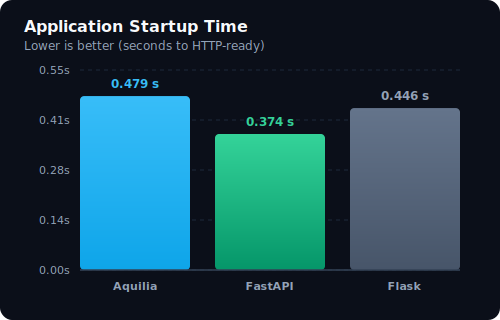

### Mean Throughput
The average requests per second processed across all HTTP workloads. Higher is better.

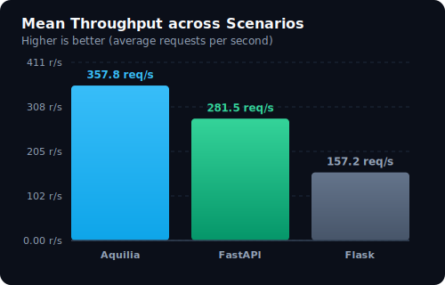

### Throughput by Workload Scenario
Framework throughput (requests per second) across simple serialization, complex dependency injection paths, and dense routing tables. Higher is better.

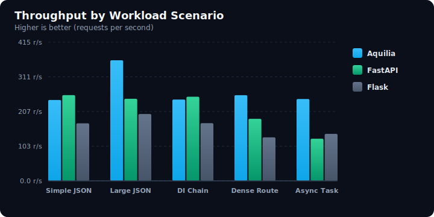

### P95 Tail Latency
Tail latency (milliseconds) under high concurrency across key endpoints. Lower is better.

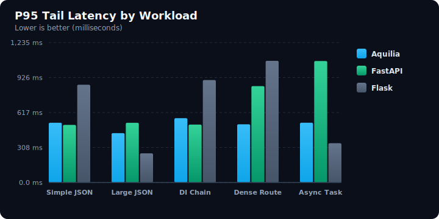

### Average Peak Memory Usage
Memory footprint (Peak RSS in Megabytes) under load. Lower is better.

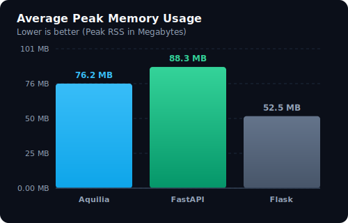

### WebSocket Message Throughput
WebSocket roundtrip message throughput (messages per second). Higher is better.

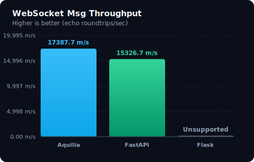

***

## Comparison Tables

| Feature | Aquilia | FastAPI | Flask | Django | NestJS |
|---|---|---|---|---|---|
| **Programming Model** | Controllers / Services | Routers / Functions | Blueprint Functions | Class / Function Views | Controllers / Services |
| **Component Wiring** | Auto-discovers everything | Manual imports / mounts | Manual register calls | Manual URL patterns list | Modules imports array |
| **Dependency Injection** | Scoped container built-in | Function parameter DI | None (needs extensions) | None (needs extensions) | Class injection built-in |
| **Data Contracts** | Blueprints & Lenses | Pydantic Models | None (needs extensions) | Django Forms | TypeScript DTOs |
| **Out-of-box DB/Cache** | Async ORM & Cache built-in | None (needs third party) | None (needs third party) | Synchronous Django ORM | TypeORM / Prisma (Node) |
| **Structured Faults** | Error domains built-in | Raw HTTPExceptions | Error handler mapping | Middlewares / Exceptions | Exception filters built-in |
| **Realtime WebSockets** | Controller events built-in | Raw ASGI adapters | Needs SocketIO extension | Channels extension | Gateways built-in |
| **Infrastructure Gen** | Auto-builds Dockerfiles | Manual configuration | Manual configuration | Manual configuration | Manual configuration |

***

## Roadmap
* **v1.2.0**: Out-of-the-box PostgreSQL connection pooling improvements.
* **v1.3.0**: Visual flow pipeline inspector dashboard in CLI.
* **v2.0.0**: Dynamic auto-scaling Kubernetes operator integration.

***

## Ecosystem
* **aq-admin**: Visual admin panel client.
* **aq-otel**: Expanded tracing integrations.
* **aq-mlops**: Real-time machine learning model packaging extensions.

***

## Contributing
We welcome contributions. Please read [CONTRIBUTING.md](CONTRIBUTING.md) to understand our coding standards and pull request workflows.

***

## License
Aquilia is licensed under the MIT License. See [LICENSE](LICENSE) for details.