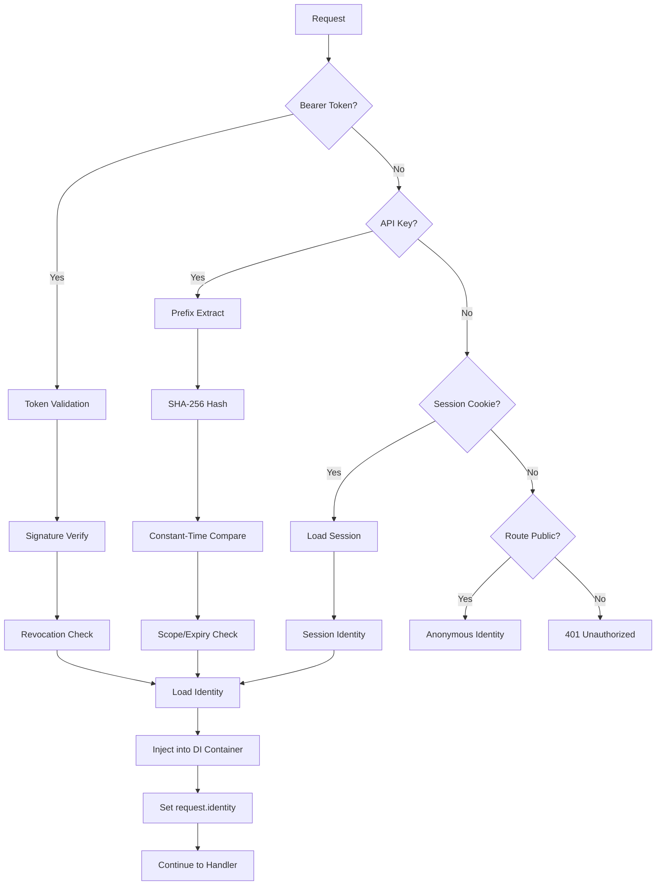

# Aquilia — API Architecture

> Endpoint structure, middleware pipeline, authentication flow, request validation, and response patterns.

---

## 1. API Structure

### Controller-Based Routing

Aquilia uses a **controller pattern** where each controller class groups related endpoints under a URL prefix:

```python
from aquilia import Controller, Get, Post, Put, Delete

class UsersController(Controller):
    prefix = "/api/v1/users"
    
    @Get("/")
    async def list_users(self, request):
        ...
    
    @Get("/{id:int}")
    async def get_user(self, request, id: int):
        ...
    
    @Post("/")
    async def create_user(self, request):
        ...
    
    @Put("/{id:int}")
    async def update_user(self, request, id: int):
        ...
    
    @Delete("/{id:int}")
    async def delete_user(self, request, id: int):
        ...
```

### HTTP Method Decorators

| Decorator | HTTP Method | Usage |
|-----------|-------------|-------|
| `@Get(path)` | GET | Read operations |
| `@Post(path)` | POST | Create operations |
| `@Put(path)` | PUT | Full update |
| `@Patch(path)` | PATCH | Partial update |
| `@Delete(path)` | DELETE | Delete operations |
| `@Head(path)` | HEAD | Metadata queries |
| `@Options(path)` | OPTIONS | CORS preflight |
| `@Sse(path)` | GET (SSE) | Server-Sent Events |
| `@Route(path, methods=[...])` | Multiple | Custom method combinations |

### URL Pattern System

Aquilia has a full URL pattern language with its own AST, parser, and compiler:

```
/users                          # Static segment
/users/{id}                     # Dynamic parameter (string)
/users/{id:int}                 # Typed parameter (int)
/users/{id:uuid}                # UUID parameter
/files/{path:path}              # Path parameter (catches /)
/items/{category}/{id:int}      # Multiple parameters
```

**Supported types:** `int`, `float`, `str`, `uuid`, `path`, `slug`

**Specificity scoring:** Static (100) > Typed param (50) > Untyped param (25) > Wildcard (1)

---

## 2. Middleware Pipeline

### Built-in Middleware (Execution Order)

| Priority | Middleware | Purpose |
|----------|-----------|---------|
| 3 | `ProxyFix` | CIDR-based trusted proxy header rewriting |
| 4 | `HTTPSRedirect` | Force HTTPS in production |
| 6 | `StaticFiles` | Serve static assets (radix trie, ETag, range) |
| 7 | `SecurityHeaders` | Helmet-style OWASP headers |
| 8 | `HSTS` | HTTP Strict Transport Security |
| 9 | `CSP` | Content Security Policy with per-request nonce |
| 10 | `CSRF` | Double-submit cookie with HMAC-SHA256 |
| 11 | `CORS` | Cross-Origin Resource Sharing |
| 12 | `RateLimit` | Token bucket + sliding window |
| 20 | `RequestID` | UUID request identifier (via `secrets.token_hex`) |
| 30 | `ErrorHandler` | Fault → HTTP status mapping, debug pages in dev |
| 40 | `Timing` | Request duration tracking, slow-request warnings |
| 50 | `Timeout` | Request timeout with 504 response |
| 60 | `Gzip` | Response compression (min 500 bytes) |
| 70 | `Session` | Session resolve/commit with rotation |
| 80 | `Auth` | Identity extraction (Bearer/API Key/Session) |
| 90 | `DI` | Request-scoped DI container |

### Middleware Scoping

```
Global Middleware (all routes)
  └── App Middleware (per-app/module)
      └── Controller Middleware (per-controller class)
          └── Route Middleware (per-endpoint)
```

### Custom Middleware

```python
async def my_middleware(request, handler):
    # Before
    response = await handler(request)
    # After
    return response
```

---

## 3. Authentication Flow

### Supported Authentication Methods

| Method | Header/Transport | Implementation |
|--------|-----------------|----------------|
| Bearer Token | `Authorization: Bearer <token>` | JWT-like with RS256/ES256/EdDSA |
| API Key | `X-API-Key: <key>` | SHA-256 hashed, prefix-based lookup |
| Session Cookie | `Cookie: session_id=<id>` | Server-side session with configurable store |
| OAuth 2.0 | Authorization Code + PKCE | Full OAuth 2.0 server |
| MFA | TOTP / WebAuthn / Backup codes | Second factor after primary auth |

### Authentication Pipeline



### Authorization Layers

1. **Flow Pipeline Guards** — Early termination before handler
2. **Clearance System** — 5-dimension access matrix (level/entitlements/conditions/compartments)  
3. **RBAC** — Role → permission mapping with hierarchy
4. **ABAC** — Attribute-based policy evaluation
5. **Scope Checking** — OAuth2 scope validation

---

## 4. Request Validation

### Blueprint-Based Validation

Blueprints provide a three-phase validation lifecycle:

```
cast (inbound type coercion) → seal (constraint validation) → mold (outbound formatting)
```

**Auto-detection:** If a handler parameter is annotated with a Blueprint type, the executor automatically casts and validates the request body.

### Validation Constraints (Facets)

| Constraint | Facet Types | Description |
|------------|-------------|-------------|
| `required` | All | Field must be present |
| `allow_null` | All | Permit null values |
| `default` | All | Default value if missing |
| `ge`, `le`, `gt`, `lt` | Numeric | Range bounds |
| `min_length`, `max_length` | String, List | Length bounds |
| `pattern` | String | Regex validation |
| `choices` | All | Whitelist of allowed values |
| `min_items`, `max_items` | List | Collection size bounds |
| `max_digits`, `decimal_places` | Decimal | Precision constraints |
| `read_only` | All | Excluded from input |
| `write_only` | All | Excluded from output |

### Request Size Limits

| Limit | Default | Configurable |
|-------|---------|--------------|
| Max body size | 10MB | `max_body_size` |
| Max JSON depth | 32 | `max_json_depth` |
| Max JSON size | 10MB | `max_json_size` |
| Max form fields | 1000 | `max_form_fields` |
| Max multipart file size | 10MB | Per-file limit |
| Max multipart total size | 50MB | Aggregate limit |

### Query Parameter Filtering

Django-inspired `FilterSet` with 20+ lookup operators:

| Operator | SQL Equivalent | Example |
|----------|---------------|---------|
| `exact` | `= ?` | `?name=John` |
| `iexact` | `LOWER(x) = LOWER(?)` | `?name__iexact=john` |
| `contains` | `LIKE '%?%'` | `?name__contains=oh` |
| `startswith` | `LIKE '?%'` | `?name__startswith=Jo` |
| `gt`, `gte`, `lt`, `lte` | `>`, `>=`, `<`, `<=` | `?age__gte=18` |
| `in` | `IN (...)` | `?status__in=active,pending` |
| `isnull` | `IS NULL` / `IS NOT NULL` | `?deleted_at__isnull=true` |
| `range` | `BETWEEN ? AND ?` | `?date__range=2024-01-01,2024-12-31` |

---

## 5. Response Patterns

### Content Negotiation

The renderer selection is driven by the `Accept` header (RFC 7231):

| Accept Header | Renderer | Content-Type |
|---------------|----------|--------------|
| `application/json` | JSONRenderer | `application/json` |
| `text/html` | HTMLRenderer | `text/html` |
| `application/xml` | XMLRenderer | `application/xml` |
| `text/csv` | CSVRenderer | `text/csv` |
| `application/yaml` | YAMLRenderer | `application/yaml` |
| `application/msgpack` | MessagePackRenderer | `application/msgpack` |
| `text/plain` | PlainTextRenderer | `text/plain` |
| `application/x-crous` | CROUSRenderer | `application/x-crous` |

### Response Types

```python
# Direct response
return Response.json({"users": users})

# Status codes
return Response.created({"id": user.id})
return Response.no_content()

# Streaming
return Response.stream(async_generator)

# Server-Sent Events
return Response.sse(event_stream)

# File download
return Response.file("/path/to/file.pdf")
return Response.download(bytes_data, filename="report.pdf")

# Redirect
return Response.redirect("/new-location")
return Response.redirect("/new-location", permanent=True)

# Error responses
return Response.error(404, "User not found")
```

### Pagination Strategies

| Strategy | Class | Best For |
|----------|-------|----------|
| Offset | `OffsetPagination` | Simple page/offset navigation |
| Limit-Offset | `LimitOffsetPagination` | API-style with limit/offset params |
| Cursor/Keyset | `CursorPagination` | Large datasets, O(1) page jumps |

**Cursor pagination** uses base64-encoded JSON cursors for opaque position markers. Max page size is enforced to prevent DoS.

### Error Response Format

All errors follow a consistent Fault-based format:

```json
{
    "error": {
        "domain": "AUTH",
        "code": "AUTH_001",
        "message": "Authentication required",
        "severity": "ERROR",
        "metadata": {}
    }
}
```

HTTP status code mapping:

| Fault Domain/Code | HTTP Status |
|-------------------|-------------|
| `AuthenticationRequired` | 401 |
| `PermissionDenied` | 403 |
| `NotFound` | 404 |
| `Conflict` | 409 |
| `ValidationError` | 422 |
| `RateLimitExceeded` | 429 |
| `InternalError` | 500 |

---

## 6. OpenAPI Documentation

Aquilia auto-generates OpenAPI 3.1.0 specifications:

- **`/openapi.json`** — JSON specification
- **`/docs`** — Swagger UI 5.18.2
- **`/redoc`** — ReDoc documentation

### Auto-Detection Features

1. **Request body schema** — Inferred from Blueprint type annotations on handler parameters
2. **Response schema** — Inferred from docstrings, return type annotations, and source analysis
3. **Path parameters** — Extracted from URL pattern types
4. **Query parameters** — Extracted from FilterSet and Query annotations
5. **Security schemes** — Auto-detected from pipeline guard class names (Bearer, OAuth2, API Key)
6. **Error responses** — Inferred from fault types in exception filters

---

## 7. Admin API

The admin panel exposes 80+ routes under `/admin/`:

| Area | Routes |
|------|--------|
| **Dashboard** | `GET /admin/` |
| **Auth** | `GET/POST /admin/login`, `POST /admin/logout` |
| **CRUD** | `GET/POST /admin/{model}/`, `GET/PUT/DELETE /admin/{model}/{id}` |
| **Audit** | `GET /admin/audit/` |
| **Monitoring** | `GET /admin/monitoring/` |
| **ORM** | `GET /admin/orm/tables`, `POST /admin/orm/query` |
| **Build** | `GET /admin/build/`, `POST /admin/build/run` |
| **Migrations** | `GET /admin/migrations/`, `POST /admin/migrations/run` |
| **Config** | `GET /admin/config/` |
| **Permissions** | `GET/POST /admin/permissions/` |
| **Workspace** | `GET /admin/workspace/` |
| **Containers** | `GET /admin/containers/` |
| **Pods** | `GET /admin/pods/` |
| **Storage** | `GET /admin/storage/` |
| **Tasks** | `GET /admin/tasks/` |
| **Errors** | `GET /admin/errors/` |
| **Testing** | `GET /admin/testing/` |
| **MLOps** | `GET /admin/mlops/` |
| **Mailer** | `GET /admin/mailer/` |
| **Query Inspector** | `GET /admin/query-inspector/` |

---

## 8. MLOps API

The MLOps subsystem exposes 30+ endpoints:

| Endpoint | Method | Purpose |
|----------|--------|---------|
| `/api/v1/models` | GET | List registered models |
| `/api/v1/models/{name}` | GET | Model details |
| `/api/v1/models/{name}/predict` | POST | Single prediction |
| `/api/v1/models/{name}/predict/batch` | POST | Batch prediction |
| `/api/v1/models/{name}/chat` | POST | LLM chat completion |
| `/api/v1/models/{name}/load` | POST | Load model to memory |
| `/api/v1/models/{name}/unload` | POST | Unload model |
| `/api/v1/models/{name}/metrics` | GET | Model metrics |
| `/api/v1/models/{name}/drift` | GET | Drift detection status |
| `/api/v1/models/{name}/rollout` | POST | Start canary rollout |
| `/api/v1/models/{name}/lineage` | GET | Model lineage DAG |
| `/api/v1/experiments` | GET | List A/B experiments |
| `/api/v1/artifacts` | GET | List model artifacts |
| `/api/v1/plugins` | GET | List installed plugins |
| `/healthz` | GET | Liveness probe |
| `/readyz` | GET | Readiness probe |
