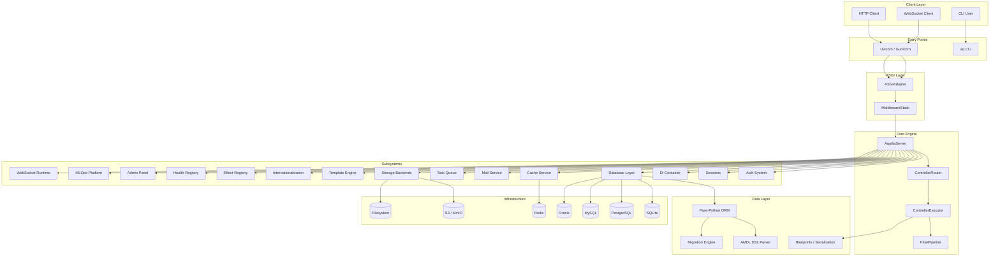
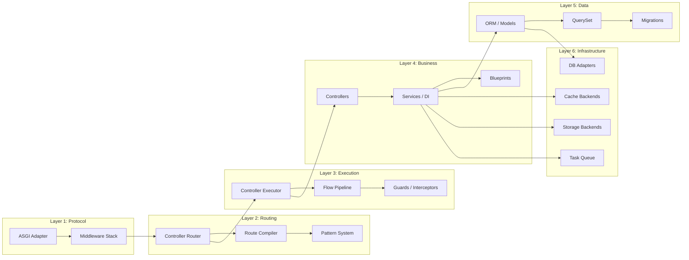
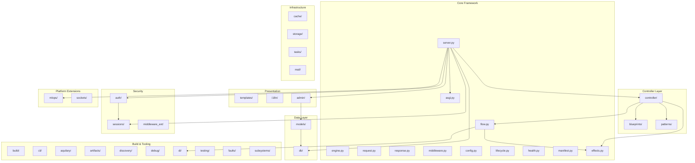

# Aquilia Framework — Architecture Documentation

> **Version:** 1.0.1 | **Python:** ≥3.10 | **Protocol:** ASGI | **License:** MIT

---

## 1. High-Level Architecture

Aquilia is a **production-grade, async-first Python web framework** built on the ASGI protocol. It is designed as a **modular, manifest-driven framework** that encompasses the entire lifecycle of a web application — from HTTP handling and ORM to ML model serving and admin panels.



---

## 2. Architectural Style

Aquilia follows a **layered modular architecture** with these key principles:

| Principle | Implementation |
|-----------|---------------|
| **Manifest-driven** | Every module declares its components via `ModuleManifest` — controllers, services, models, middleware, lifecycle hooks |
| **Effect system** | Typed resource lifecycle inspired by Effect-TS — DB, Cache, Queue, HTTP, Storage effects with automatic acquire/release |
| **Flow pipelines** | Guard → Transform → Handler → Hook execution with smart argument injection |
| **Convention over configuration** | Auto-discovery of controllers/services/models from package structure |
| **Dependency injection** | Hierarchical IoC container with 6 scopes (Singleton, App, Request, Transient, Pooled, Ephemeral) |
| **Fault domains** | Structured error handling with typed faults mapped to HTTP status codes |
| **Zero-import-time side effects** | Decorators attach metadata only; no execution until server startup |

### Architectural Layers



---

## 3. Core Services

### 3.1 AquiliaServer (`server.py` — 3,358 lines)

The **central orchestrator** — initializes, wires, and manages all subsystems. Responsible for:

- Configuration loading (workspace.py → YAML → env vars)
- Middleware chain construction (security, CORS, CSRF, rate-limiting, sessions, auth)
- Controller discovery and route compilation
- Admin panel wiring (80+ routes)
- OpenAPI spec generation (Swagger UI + ReDoc)
- Lifecycle coordination (startup/shutdown with dependency ordering)
- Health aggregation across all subsystems

### 3.2 ASGIAdapter (`asgi.py` — 406 lines)

Bridges raw ASGI protocol to the framework:
- Middleware chain cached after first build (O(1) hot path)
- O(1) static route matching via hash map, O(k) dynamic regex fallback
- Per-request DI container creation
- Built-in `/_health` endpoint before middleware chain
- Lifespan protocol handling (startup/shutdown)

### 3.3 Request / Response (`request.py` / `response.py`)

**Request** (1,970 lines): Production-grade ASGI request wrapper with streaming, multipart parsing, content negotiation, CROUS binary format, configurable limits (body size, JSON depth, field count).

**Response** (1,841 lines): Full HTTP response builder with SSE, file serving, CROUS binary, signed cookies (HMAC-SHA256), security headers, background tasks.

### 3.4 Controller System (`controller/`)

- **Decorators**: `@Get`, `@Post`, `@Put`, `@Delete`, `@Patch`, `@Head`, `@Options`, `@Sse`, `@Route`
- **Compiler**: Translates controller classes into executable route structures at compile time
- **Executor**: 12-phase request lifecycle — DI → Pipeline → Clearance → Interceptors → Parameter Binding → Handler → Filters → Pagination → Content Negotiation → Response
- **Router**: Two-tier architecture — O(1) static hash map + O(k) specificity-sorted regex
- **Factory**: Creates controller instances with full DI resolution and scope validation

### 3.5 Flow Pipeline (`flow.py` — 1,366 lines)

Typed pipeline system: **Guard → Transform → Handler → Hook**

- 5-phase execution with priority ordering
- Automatic effect lifecycle management (Collect → Acquire → Inject → Execute → Release)
- Smart argument injection via type-hints and naming conventions
- Composable via `|` operator

### 3.6 Effect System (`effects.py` — 771 lines)

Typed effect system inspired by **Effect-TS**:
- 6 effect types: Database, Cache, Queue, Task, HTTP, Storage
- Lifecycle: initialize → acquire (per-request) → release → shutdown
- DI integration: Registry and individual providers registered as DI tokens
- Health aggregation from all effect providers

---

## 4. Module Boundaries



---

## 5. Dependency Graph

### External Dependencies

| Category | Package | Purpose |
|----------|---------|---------|
| **Core** | `click` | CLI framework |
| **Core** | `PyYAML` | Configuration loading |
| **Core** | `uvicorn` | ASGI server |
| **Auth** | `cryptography` | RSA/ECDSA key management |
| **Auth** | `argon2-cffi` | Password hashing |
| **DB** | `aiosqlite` | Async SQLite |
| **DB** | `asyncpg` | Async PostgreSQL |
| **DB** | `aiomysql` | Async MySQL |
| **DB** | `oracledb` | Async Oracle |
| **Cache** | `redis` | Distributed caching |
| **Templates** | `jinja2` | Template rendering |
| **Files** | `aiofiles` | Async file I/O |
| **Multipart** | `python-multipart` | Form parsing |
| **Mail** | `aiosmtplib` | SMTP delivery |
| **Mail** | `aiobotocore` | AWS SES delivery |
| **Mail** | `httpx` | SendGrid delivery |
| **MLOps** | `numpy`, `torch`, `onnxruntime` | ML inference |
| **Testing** | `pytest`, `httpx`, `hypothesis` | Test suite |

### Internal Module Dependencies (simplified)

```
server.py
├── config.py ← config_builders.py
├── asgi.py ← middleware.py
├── controller/ ← blueprints/, patterns/, flow.py, effects.py
├── auth/ ← sessions/
├── db/ ← models/
├── admin/ ← models/, auth/
├── di/ (used by all modules)
├── cache/
├── storage/
├── tasks/
├── mail/
├── templates/ ← i18n/
├── sockets/
├── mlops/
├── health.py
├── lifecycle.py
├── faults/
└── aquilary/ ← manifest.py, build/, artifacts/
```

---

## 6. System Responsibilities

### What Aquilia Does

Aquilia is a **full-stack async Python web framework** that provides:

1. **HTTP/WebSocket serving** — ASGI-native with uvicorn
2. **MVC architecture** — Controllers, Models, Blueprints (serializers)
3. **Pure-Python ORM** — Active Record pattern with 4 database backends
4. **Complete auth system** — Password, API Key, OAuth 2.0, TOTP MFA, WebAuthn, RBAC/ABAC, Clearance levels
5. **Admin panel** — Auto-generated CRUD with audit logging, monitoring, query inspection
6. **Background tasks** — Priority-based job queue with dead letter, retry, scheduling
7. **ML model serving** — Full MLOps platform with inference pipelines, drift detection, A/B testing, model registry
8. **Template rendering** — Jinja2 with sandboxing, precompilation, caching
9. **Internationalization** — ICU MessageFormat, CLDR plural rules, 50+ languages
10. **Developer tooling** — CLI (`aq`), code generation, deployment scaffolding, build system

### Who the Users Are

- **Application developers** building Python web applications
- **ML engineers** deploying model inference services
- **Platform engineers** needing a batteries-included framework
- **DevOps** using the deploy/scaffold CLI commands

---

## 7. Key Design Decisions

| Decision | Rationale |
|----------|-----------|
| **ASGI-native** | Full async support for high-concurrency workloads |
| **Pure-Python ORM** | No SQLAlchemy dependency; full control over query generation and migration |
| **Manifest-driven modules** | Declarative module registration enables static analysis, dependency graphing, and build-time validation |
| **Effect system** | Typed resource lifecycle prevents resource leaks and enables testability |
| **Fault domains** | Structured errors prevent exception-based control flow and enable consistent error responses |
| **Blueprint ≠ Serializer** | Blueprints are first-class framework primitives with cast/seal/mold lifecycle, not just data serializers |
| **CROUS binary format** | Custom binary wire format for high-performance inter-service communication (with JSON fallback) |
| **Clearance system** | Military-style 5-tier access control beyond simple RBAC — supports entitlements, conditions, compartments |
| **Build pipeline** | 5-phase compile with incremental caching and content-hash-based invalidation |
| **Pattern compiler** | URL patterns compiled to AST with specificity scoring for deterministic route resolution |
