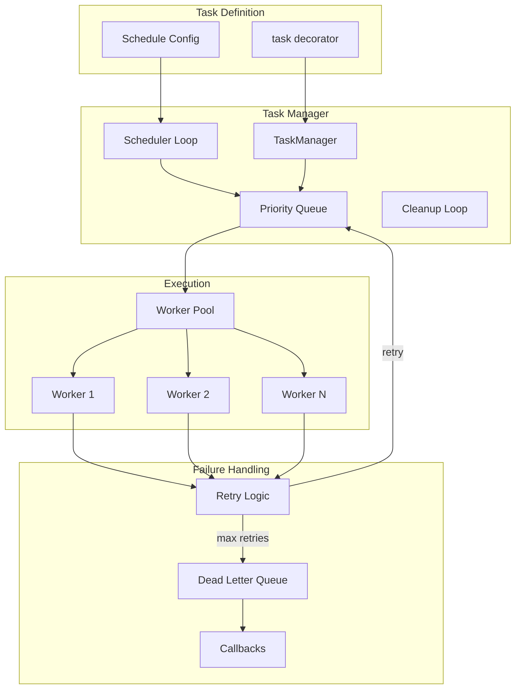
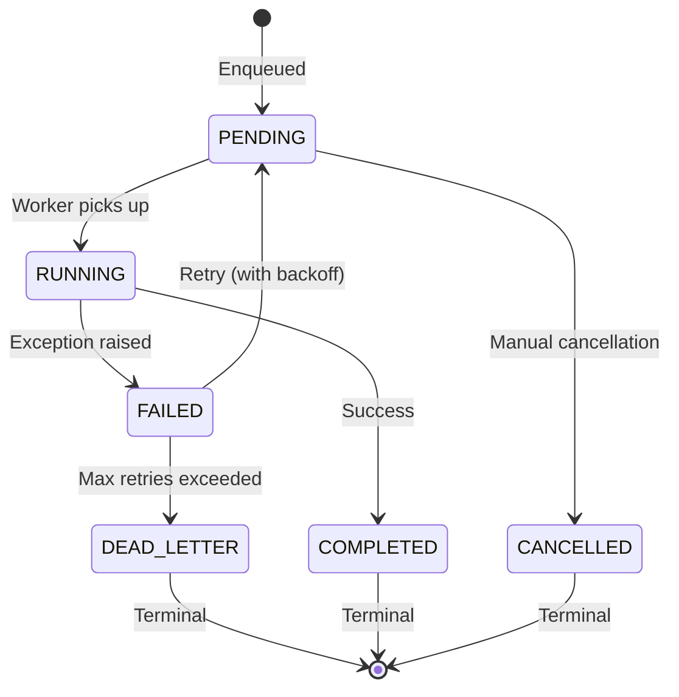

# Aquilia — Background Jobs

> Job scheduling, workers, task queues, and async architecture.

---

## 1. Task System Architecture



---

## 2. Task Definition

### The `@task` Decorator

```python
from aquilia import task

@task(
    name="send_welcome_email",
    max_retries=3,
    retry_delay=60,  # seconds
    priority=Priority.HIGH,
    timeout=300,  # 5 minutes
    dead_letter=True,
)
async def send_welcome_email(user_id: int, email: str):
    user = await User.objects.get(id=user_id)
    await mail.send(to=email, template="welcome", context={"user": user})
```

### Task Invocation

```python
# Immediate async enqueue
await send_welcome_email.delay(user_id=42, email="alice@example.com")

# With custom options
await send_welcome_email.send(
    args=(42, "alice@example.com"),
    priority=Priority.CRITICAL,
    delay=timedelta(minutes=5),  # delayed execution
)

# Bound to a specific queue
send_welcome_email.bind(queue="emails")
```

---

## 3. Job States



### Priority Levels

| Priority | Value | Use Case |
|----------|-------|----------|
| `CRITICAL` | 0 | System-critical tasks (auth, security) |
| `HIGH` | 1 | User-facing tasks (email, notifications) |
| `NORMAL` | 5 | Standard background work |
| `LOW` | 10 | Analytics, reporting |
| `BACKGROUND` | 20 | Cleanup, optimization |

---

## 4. Task Manager

The `TaskManager` is the central orchestrator:

### Lifecycle Methods

| Method | Description |
|--------|-------------|
| `initialize()` | Start worker loops, scheduler, cleanup |
| `shutdown()` | Graceful worker drain and stop |
| `enqueue(task, args, kwargs)` | Add job to priority queue |
| `get_job(job_id)` | Retrieve job status |
| `cancel(job_id)` | Cancel pending job |
| `retry_job(job_id)` | Manually retry failed job |
| `flush()` | Clear all pending jobs |
| `get_stats()` | Queue depth, worker count, throughput |

### Event Callbacks

```python
task_manager.on_complete(lambda result: log_completion(result))
task_manager.on_failure(lambda result: alert_team(result))
task_manager.on_dead_letter(lambda result: escalate(result))
```

---

## 5. Worker Architecture

### Worker Loop

```python
async def _worker_loop(self):
    while self._running:
        job = await self._queue.dequeue()
        if job is None:
            await asyncio.sleep(0.1)
            continue
        
        job.state = JobState.RUNNING
        job.started_at = datetime.utcnow()
        
        try:
            result = await asyncio.wait_for(
                self._execute_job(job),
                timeout=job.timeout
            )
            job.state = JobState.COMPLETED
            job.result = result
            await self._fire_callbacks("complete", job)
        except Exception as e:
            await self._handle_failure(job, e)
```

### Failure Handling

```python
async def _handle_failure(self, job, error):
    job.attempt += 1
    job.last_error = str(error)
    
    if job.can_retry():
        delay = job.next_retry_delay()  # Exponential backoff
        job.state = JobState.PENDING
        job.scheduled_at = datetime.utcnow() + timedelta(seconds=delay)
        await self._queue.enqueue(job)
    else:
        job.state = JobState.DEAD_LETTER
        await self._dead_letter.add(job)
        await self._fire_callbacks("dead_letter", job)
```

### Retry Strategy

- **Exponential backoff**: `base_delay * (2 ** attempt)`
- **Jitter**: Random ±25% to prevent thundering herd
- **Max retries**: Configurable per-task (default: 3)
- **Retry delay**: Configurable per-task (default: 60s)

---

## 6. Job Scheduling

### Interval Scheduling

```python
from aquilia import task, every

@task(schedule=every(30).minutes)
async def sync_inventory():
    ...

@task(schedule=every(1).hours)
async def generate_reports():
    ...

@task(schedule=every(1).days.at("03:00"))
async def cleanup_expired_sessions():
    ...
```

### Cron Scheduling

```python
from aquilia import task, cron

@task(schedule=cron("0 */6 * * *"))  # Every 6 hours
async def refresh_cache():
    ...

@task(schedule=cron("0 0 * * 1"))  # Every Monday midnight
async def weekly_digest():
    ...
```

### Scheduler Loop

```python
async def _scheduler_loop(self):
    while self._running:
        for task_desc in get_periodic_tasks():
            if task_desc.schedule.next_run() <= datetime.utcnow():
                await self.enqueue(task_desc)
        await asyncio.sleep(1)
```

---

## 7. TaskResult

Each job is tracked via a `TaskResult` dataclass:

| Field | Type | Description |
|-------|------|-------------|
| `id` | `str` | UUID job identifier |
| `task_name` | `str` | Registered task name |
| `args` | `tuple` | Positional arguments |
| `kwargs` | `dict` | Keyword arguments |
| `state` | `JobState` | Current state |
| `priority` | `Priority` | Execution priority |
| `attempt` | `int` | Current attempt number |
| `max_retries` | `int` | Maximum retry count |
| `created_at` | `datetime` | Enqueue time |
| `started_at` | `datetime` | Execution start |
| `completed_at` | `datetime` | Execution end |
| `scheduled_at` | `datetime` | Delayed execution time |
| `result` | `Any` | Return value (on success) |
| `last_error` | `str` | Error message (on failure) |
| `timeout` | `float` | Execution timeout (seconds) |

### Computed Properties

| Property | Description |
|----------|-------------|
| `is_terminal()` | COMPLETED, DEAD_LETTER, or CANCELLED |
| `is_runnable()` | PENDING and scheduled_at reached |
| `can_retry()` | attempt < max_retries |
| `next_retry_delay()` | Exponential backoff calculation |
| `duration_ms()` | Execution duration |
| `fingerprint()` | SHA-256 of task_name + args |

---

## 8. Backend Abstraction

The task queue uses an abstract `TaskBackend`:

```python
class TaskBackend(ABC):
    async def enqueue(self, job: TaskResult) -> None: ...
    async def dequeue(self) -> Optional[TaskResult]: ...
    async def get_job(self, job_id: str) -> Optional[TaskResult]: ...
    async def list_jobs(self, state: JobState) -> List[TaskResult]: ...
    async def get_stats(self) -> dict: ...
    async def cleanup(self, older_than: datetime) -> int: ...
    async def cancel(self, job_id: str) -> bool: ...
    async def retry(self, job_id: str) -> bool: ...
    async def flush(self) -> None: ...
```

### Current Implementation: InMemoryBackend

- Priority heapq for job ordering
- Dict-based job storage for O(1) lookup
- Suitable for single-process deployments

### Future Backends (planned)

- Redis-backed for multi-worker deployments
- PostgreSQL-backed for durability
- RabbitMQ/Celery integration

---

## 9. Integration with Effect System

Tasks can be used as effects via the `TaskEffectProvider`:

```python
from aquilia import effect, TaskEffect

@effect(TaskEffect)
async def my_handler(request, task_queue: TaskEffect):
    await task_queue.enqueue("process_upload", file_id=123)
```

The effect system handles lifecycle management — the task queue is acquired at request start and released at request end.

---

## 10. Monitoring & Observability

### Stats

```python
stats = await task_manager.get_stats()
# {
#     "pending": 42,
#     "running": 3,
#     "completed": 1523,
#     "failed": 12,
#     "dead_letter": 2,
#     "workers": 4,
#     "throughput_per_minute": 25.3,
# }
```

### Admin Integration

The admin panel at `/admin/tasks/` provides:
- Task queue overview with state breakdown
- Dead letter queue inspection
- Manual retry/cancel controls
- Task execution history
- Scheduled task configuration
