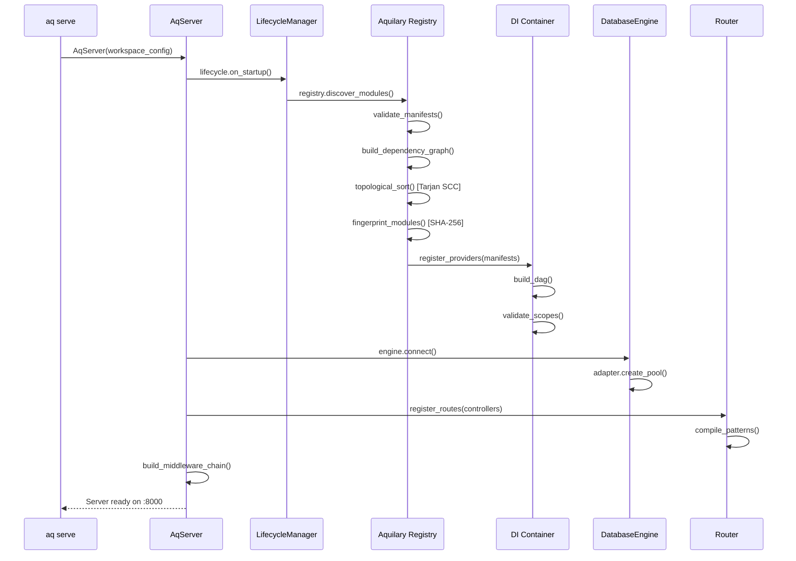
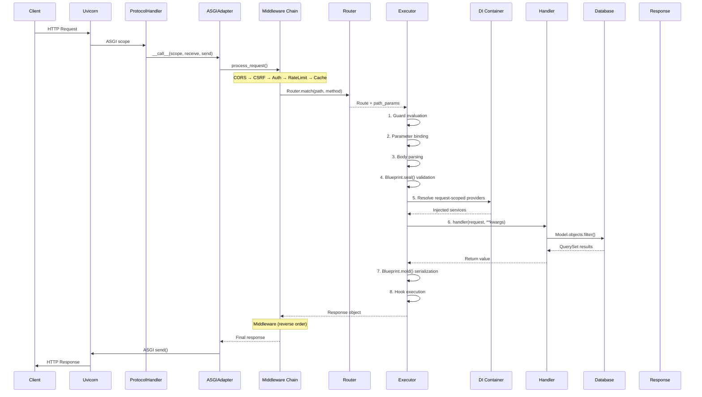
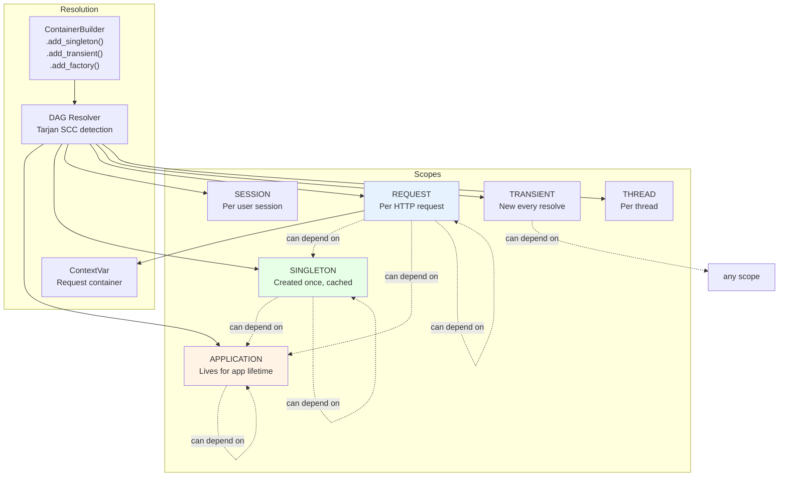
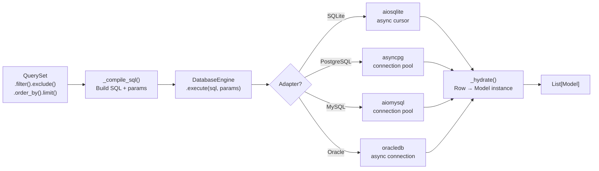
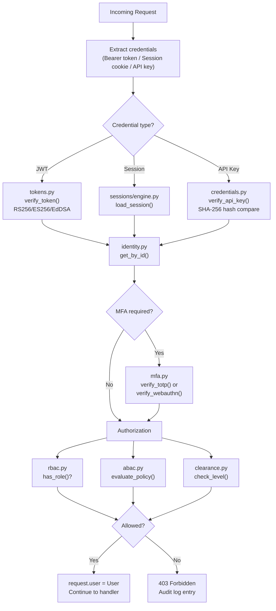
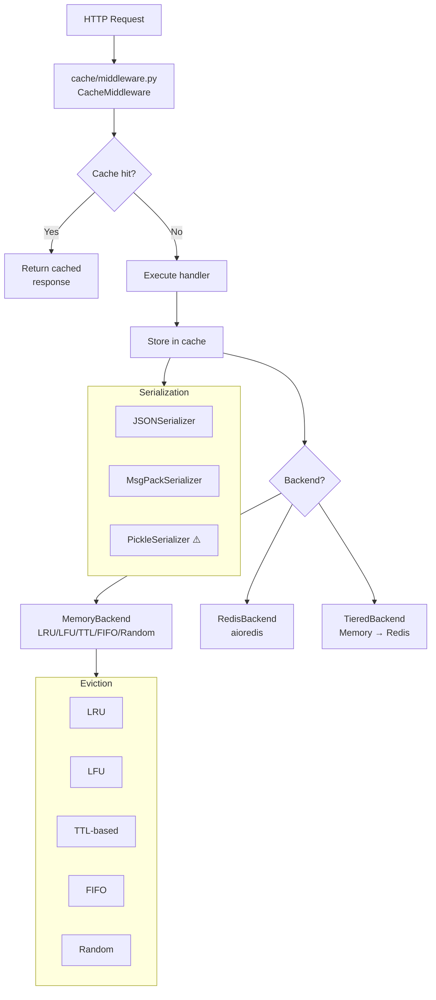

# Aquilia — Codebase Knowledge Graph

> Complete dependency map, call relationships, and structural topology of every subsystem.

---

## 1. High-Level Module Topology

```mermaid
graph TB
    subgraph Core["Core Layer"]
        SERVER["server.py<br/>AqServer (3,358L)"]
        ENGINE["engine.py<br/>ProtocolHandler"]
        ASGI["asgi.py<br/>ASGIAdapter"]
        REQ["request.py<br/>AqRequest (1,970L)"]
        RES["response.py<br/>AqResponse (1,841L)"]
        CONFIG["config.py + config_builders.py<br/>(5,498L)"]
        LIFECYCLE["lifecycle.py<br/>LifecycleManager"]
    end

    subgraph Pipeline["Request Pipeline"]
        MW["middleware.py<br/>MiddlewareChain"]
        FLOW["flow.py<br/>Guard/Transform/Hook"]
        CTRL["controller/<br/>(12 files, 6,600L)"]
        BP["blueprints/<br/>(8 files, 4,200L)"]
    end

    subgraph Module["Module System"]
        AQUILARY["aquilary/<br/>(9 files, 4,100L)"]
        MANIFEST["manifest.py<br/>ModuleManifest"]
        DI["di/<br/>(14 files, 4,500L)"]
        EFFECTS["effects.py<br/>Effect System"]
    end

    subgraph Data["Data Layer"]
        MODELS["models/<br/>(33 files, 16,700L)"]
        DB["db/<br/>(8 files, 2,900L)"]
        CACHE["cache/<br/>(14 files, 3,600L)"]
        SESSIONS["sessions/<br/>(9 files, 3,060L)"]
    end

    subgraph Security["Security Layer"]
        AUTH["auth/<br/>(22 files, 8,800L)"]
        MW_EXT["middleware_ext/<br/>(8 files, 3,150L)"]
    end

    subgraph Services["Service Layer"]
        MAIL["mail/<br/>(14 files, 4,350L)"]
        STORAGE["storage/<br/>(13 files, 3,070L)"]
        TASKS["tasks/<br/>(6 files, 1,700L)"]
        SOCKETS["sockets/<br/>(14 files, 3,570L)"]
        I18N["i18n/<br/>(11 files, 3,960L)"]
        TEMPLATES["templates/<br/>(14 files, 4,380L)"]
    end

    subgraph Platform["Platform Layer"]
        ADMIN["admin/<br/>(18 files, 10,600L)"]
        MLOPS["mlops/<br/>(69 files, 14,200L)"]
        CLI["cli/<br/>(22+ files, 19,000L)"]
    end

    subgraph Support["Support Layer"]
        PATTERNS["patterns/<br/>(14 files, 2,800L)"]
        FAULTS["faults/<br/>(11 files, 3,050L)"]
        DEBUG["debug/<br/>(2 files, 1,100L)"]
        HEALTH["health.py"]
        TESTING["testing/<br/>(15 files, 3,960L)"]
        UTILS["utils/<br/>(4 files, 314L)"]
        BUILD["build/<br/>(5 files, 2,650L)"]
        DISCOVERY["discovery/<br/>(2 files, 730L)"]
        SUBSYSTEMS["subsystems/<br/>(3 files, 586L)"]
        DS["_datastructures.py"]
        UPLOADS["_uploads.py"]
    end

    ENGINE --> ASGI --> MW --> CTRL
    SERVER --> LIFECYCLE --> AQUILARY --> MANIFEST
    SERVER --> DI
    SERVER --> CONFIG
    CTRL --> FLOW --> BP
    CTRL --> PATTERNS
    CTRL --> FAULTS
    AUTH --> DI
    MODELS --> DB
    ADMIN --> AUTH
    ADMIN --> MODELS
    ADMIN --> TEMPLATES
    CLI --> SERVER
    CLI --> BUILD
    MLOPS --> DI
    MLOPS --> MODELS
    SESSIONS --> CACHE
    SOCKETS --> DI
```



---

## 2. Dependency Direction Matrix

Each cell shows whether the **row** depends on the **column** (`→` = imports from).

| Module | server | request | response | config | di | flow | controller | models | db | auth | cache | blueprints | faults | patterns | middleware |
|--------|--------|---------|----------|--------|----|------|------------|--------|----|------|-------|------------|--------|----------|------------|
| **server** | — | → | → | → | → | → | → | → | → | → | → | | → | | → |
| **controller** | | → | → | → | → | → | — | | | | | → | → | → | |
| **models** | | | | → | | | | — | → | | | | → | | |
| **auth** | | → | | → | → | | | → | | — | | | → | | |
| **admin** | | → | → | → | → | | → | → | → | → | → | → | → | | |
| **cache** | | → | → | → | | | | | | | — | | | | |
| **sessions** | | → | | → | | | | | | | → | | | | |
| **mail** | | | | → | | | | | | | | | → | | |
| **tasks** | | | | → | | | | | | | | | → | | |
| **sockets** | | → | → | → | → | | | | | → | | | → | | |
| **mlops** | | → | → | → | → | | | → | → | → | → | → | → | | |
| **cli** | → | | | → | | | | → | → | → | | | | | |
| **templates** | | → | → | → | | | | | | | → | | | | |
| **i18n** | | → | | → | | | | | | | | | | | |
| **storage** | | | | → | | | | | | | | | → | | |

---

## 3. Server Bootstrap Sequence



---

## 4. Request Processing Flow



---

## 5. DI Resolution Graph



**Scope rules:**
- A provider can only depend on providers of the **same or longer-lived** scope
- REQUEST cannot depend on TRANSIENT (transient lifetime < request)
- SINGLETON cannot depend on REQUEST (request lifetime < singleton)
- Violations detected at build time by the DAG resolver

---

## 6. ORM Query Resolution



---

## 7. Auth Chain



---

## 8. Module Build Pipeline

```mermaid
graph LR
    subgraph "Phase 1: Discovery"
        SCAN["AST Scanner<br/>discovery/"] --> MANIFESTS["Collect<br/>manifest.yaml files"]
    end

    subgraph "Phase 2: Validation"
        MANIFESTS --> VALIDATE["validators.py<br/>Schema check"]
        VALIDATE --> DEPRECATION["Auto-migrate<br/>deprecated fields"]
    end

    subgraph "Phase 3: Resolution"
        DEPRECATION --> GRAPH["Build dependency<br/>graph"]
        GRAPH --> TARJAN["Tarjan's SCC<br/>cycle detection"]
        TARJAN --> TOPO["Topological<br/>sort"]
    end

    subgraph "Phase 4: Fingerprinting"
        TOPO --> HASH["SHA-256<br/>per module"]
        HASH --> COMPARE["Compare with<br/>cached fingerprints"]
        COMPARE --> CHANGED["Mark changed<br/>modules"]
    end

    subgraph "Phase 5: Registration"
        CHANGED --> DI_REG["Register providers<br/>in DI container"]
        DI_REG --> ROUTE_REG["Register routes<br/>in Router"]
        ROUTE_REG --> READY["Module<br/>ready"]
    end
```



---

## 9. Cache Layer Topology



---

## 10. Cross-Subsystem Call Graph (Key Paths)

```
AqServer.__init__()
├── ConfigLoader.load()                         # config.py
├── LifecycleManager()                          # lifecycle.py
├── ContainerBuilder()                          # di/container.py
│   ├── .add_singleton(DatabaseEngine)          # db/engine.py
│   ├── .add_singleton(CacheManager)            # cache/
│   ├── .add_singleton(IdentityManager)         # auth/identity.py
│   ├── .add_singleton(MailerService)            # mail/mailer.py
│   ├── .add_singleton(StorageManager)           # storage/manager.py
│   ├── .add_singleton(TaskQueue)                # tasks/queue.py
│   ├── .add_singleton(SessionEngine)            # sessions/engine.py
│   ├── .add_singleton(TemplateEngine)           # templates/engine.py
│   ├── .add_singleton(I18nTranslator)           # i18n/translator.py
│   └── .build()                                 # Validate DAG, check scopes
├── Aquilary.discover()                          # aquilary/registry.py
│   ├── ASTDiscovery.scan()                      # discovery/
│   ├── ManifestValidator.validate()             # aquilary/validators.py
│   ├── DependencyGraph.build()                  # aquilary/
│   └── Fingerprint.compute()                    # aquilary/fingerprint.py
├── Router()                                     # controller/router.py
│   ├── PatternParser.parse()                    # patterns/parser.py
│   ├── PatternCompiler.compile()                # patterns/compiler.py
│   └── .register(controller_routes)
├── MiddlewareChain()                            # middleware.py
│   ├── CORSMiddleware                           # middleware_ext/cors.py
│   ├── CSRFMiddleware                           # middleware_ext/csrf.py
│   ├── AuthMiddleware                           # auth/
│   ├── RateLimitMiddleware                      # middleware_ext/rate_limit.py
│   ├── CacheMiddleware                          # cache/middleware.py
│   ├── SessionMiddleware                        # sessions/
│   └── ErrorHandler                             # middleware.py
├── HealthRegistry()                             # health.py
├── AdminSite()                                  # admin/site.py
│   └── AdminController()                        # admin/controller.py
├── TaskScheduler()                              # tasks/scheduler.py
├── WebSocketRuntime()                           # sockets/runtime.py
└── MLOpsPlatform()                              # mlops/
    ├── ModelRegistry()                          # mlops/registry/
    ├── InferencePipeline()                      # mlops/inference/
    └── DriftMonitor()                           # mlops/drift/
```

---

## 11. File Size Distribution

> Files sorted by lines of code (top 20).

| Rank | File | Lines | Subsystem |
|------|------|-------|-----------|
| 1 | `admin/site.py` | 6,347 | Admin |
| 2 | `admin/controller.py` | 5,475 | Admin |
| 3 | `config_builders.py` | 4,661 | Core |
| 4 | `cli/commands.py` | 3,635 | CLI |
| 5 | `server.py` | 3,358 | Core |
| 6 | `models/fields.py` | 2,234 | ORM |
| 7 | `request.py` | 1,970 | Core |
| 8 | `response.py` | 1,841 | Core |
| 9 | `models/query.py` | 1,582 | ORM |
| 10 | `flow.py` | 1,366 | Core |
| 11 | `__init__.py` | 1,359 | Core |
| 12 | `config.py` | 837 | Core |
| 13 | `effects.py` | 771 | Core |
| 14 | `manifest.py` | 606 | Core |
| 15 | `_uploads.py` | 469 | Core |
| 16 | `middleware.py` | 464 | Core |
| 17 | `_datastructures.py` | 430 | Core |
| 18 | `asgi.py` | 406 | Core |
| 19 | `lifecycle.py` | 357 | Core |
| 20 | `engine.py` | ~240 | Core |

---

## 12. Subsystem LOC Summary

| Subsystem | Files | Lines | % of Total |
|-----------|-------|-------|------------|
| CLI | 22+ | ~19,000 | 17.8% |
| ORM (models) | 33 | ~16,700 | 15.7% |
| MLOps | 69 | ~14,200 | 13.3% |
| Admin | 18 | ~10,600 | 10.0% |
| Auth | 22 | ~8,800 | 8.3% |
| Controller | 12 | ~6,600 | 6.2% |
| Core (root files) | 16 | ~18,600 | 17.5% |
| All other subsystems | ~90 | ~12,000 | 11.2% |
| **Total** | **~300** | **~106,500** | **100%** |
