# Aquilia — Data Flow

> Complete request lifecycle, internal service flow, background job flow, and database interaction patterns.

---

## 1. HTTP Request Lifecycle

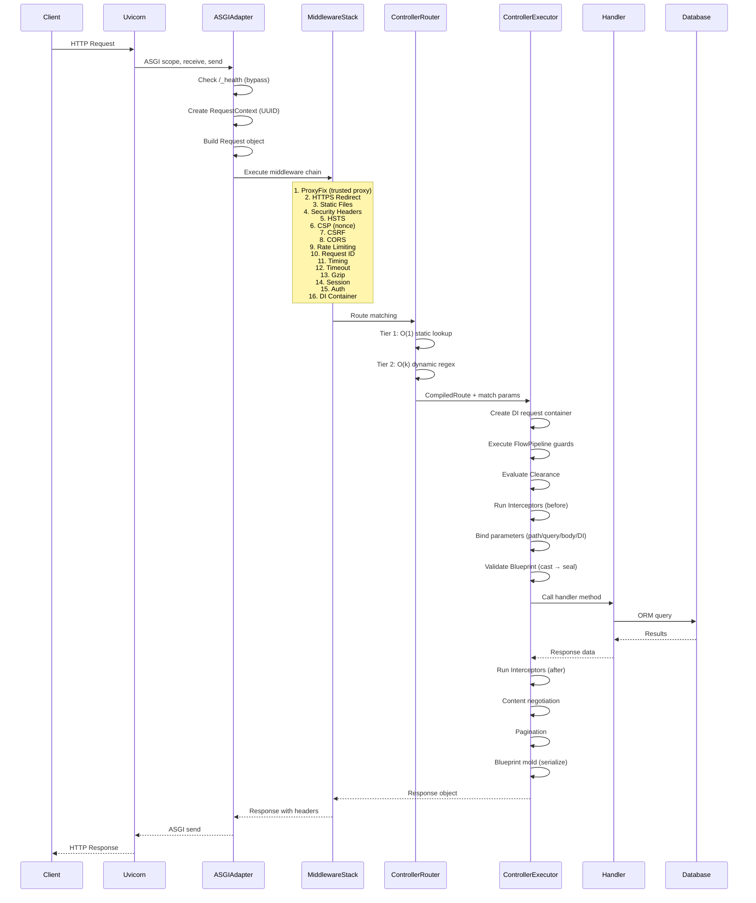

### Detailed Phase Breakdown

#### Phase 1: ASGI Reception
1. Uvicorn receives raw HTTP connection
2. `ASGIAdapter.__call__` invoked with `(scope, receive, send)`
3. Health check (`/_health`) served before middleware if path matches
4. `RequestContext` created with UUID, timestamps

#### Phase 2: Middleware Chain
Deterministic ordering: Global < App < Controller < Route, then by priority within each scope.

```
Request → ProxyFix → HTTPS → Static → Helmet → HSTS → CSP → CSRF → CORS → RateLimit → RequestID → Timing → Timeout → Gzip → Session → Auth → DI → [Next]
```

Each middleware can:
- Short-circuit with a response (e.g., rate limiter returns 429)
- Modify the request (e.g., ProxyFix rewrites client IP)
- Modify the response (e.g., CORS adds headers)
- Wrap execution (e.g., Timeout adds `asyncio.wait_for`)

#### Phase 3: Route Matching
1. Static routes checked via hash map → O(1)
2. Dynamic routes matched via specificity-sorted regex → O(k)
3. Path parameters extracted and type-cast
4. Query parameters validated

#### Phase 4: Controller Execution (12 sub-phases)

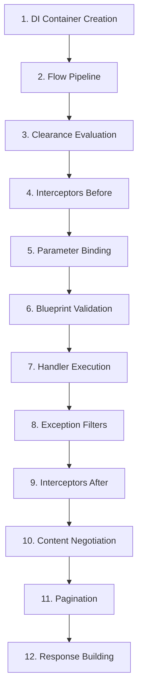

1. **DI Container**: Request-scoped container created as child of app container
2. **Flow Pipeline**: Guards evaluated in priority order → Transform → Effect acquisition
3. **Clearance**: Class + method-level clearance merged and evaluated (level/entitlements/conditions/compartments)
4. **Interceptors**: Before-hooks for cross-cutting concerns
5. **Parameter Binding**: Path params, query params, headers, body → handler arguments via type annotations
6. **Blueprint Validation**: If handler accepts a Blueprint type, request body is cast and sealed
7. **Handler**: User business logic executes
8. **Exception Filters**: Chain of Responsibility for handler errors
9. **Interceptors**: After-hooks
10. **Content Negotiation**: Accept header → renderer selection (JSON, HTML, XML, YAML, etc.)
11. **Pagination**: If QuerySet returned, paginate via configured strategy
12. **Response**: Blueprint mold (serialize), set headers, cookies, status code

---

## 2. Authentication Flow

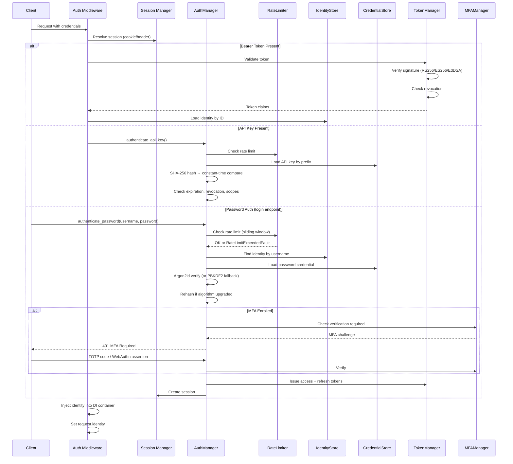

---

## 3. Database Interaction Flow

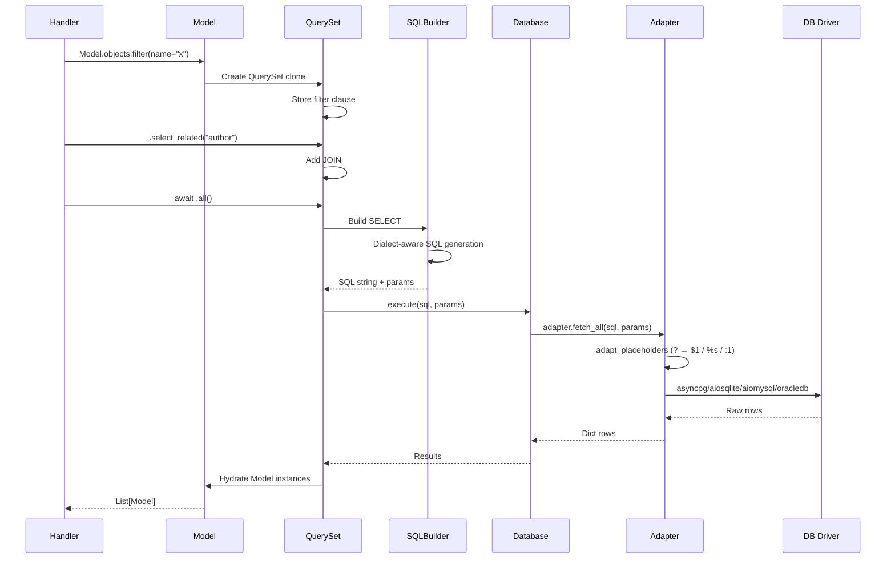

### Transaction Flow

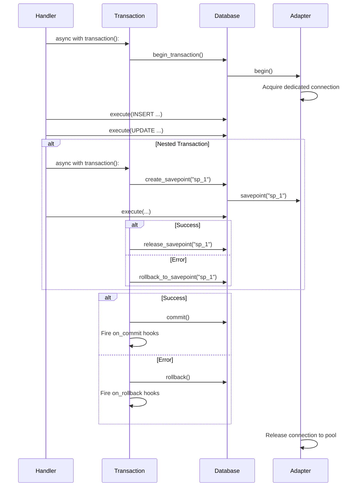

---

## 4. Background Job Flow

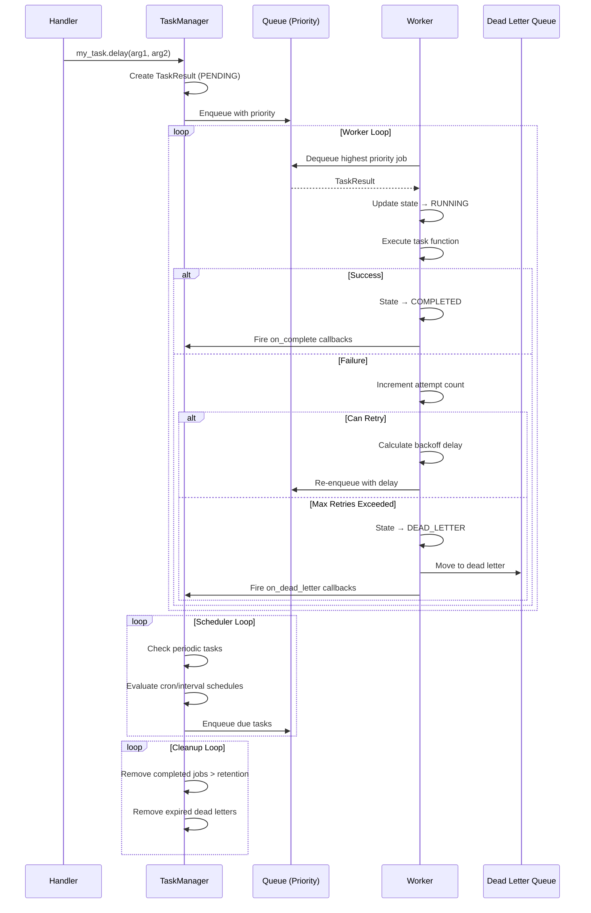

---

## 5. Effect System Flow

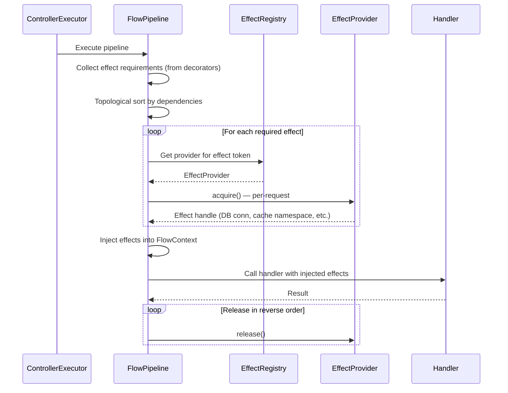

---

## 6. Admin Panel Flow

```mermaid
graph TD
    A[Browser] --> B[/admin/ routes]
    B --> C{Session Auth}
    C -->|No session| D[Login Page]
    C -->|Valid session| E[Permission Check]
    E -->|Denied| F[403 Forbidden]
    E -->|Allowed| G[Admin Controller]
    
    G --> H[Dashboard]
    G --> I[Model CRUD]
    G --> J[Audit Log]
    G --> K[Monitoring]
    G --> L[Query Inspector]
    G --> M[Error Tracker]
    
    I --> N[ModelAdmin Options]
    N --> O[List View]
    N --> P[Detail View]
    N --> Q[Create/Edit Form]
    N --> R[Delete Confirmation]
    
    O --> S[Filters + Search + Pagination]
    Q --> T[Validation + Hooks + Signals]
    T --> U[Audit Entry]
```

---

## 7. ML Inference Flow

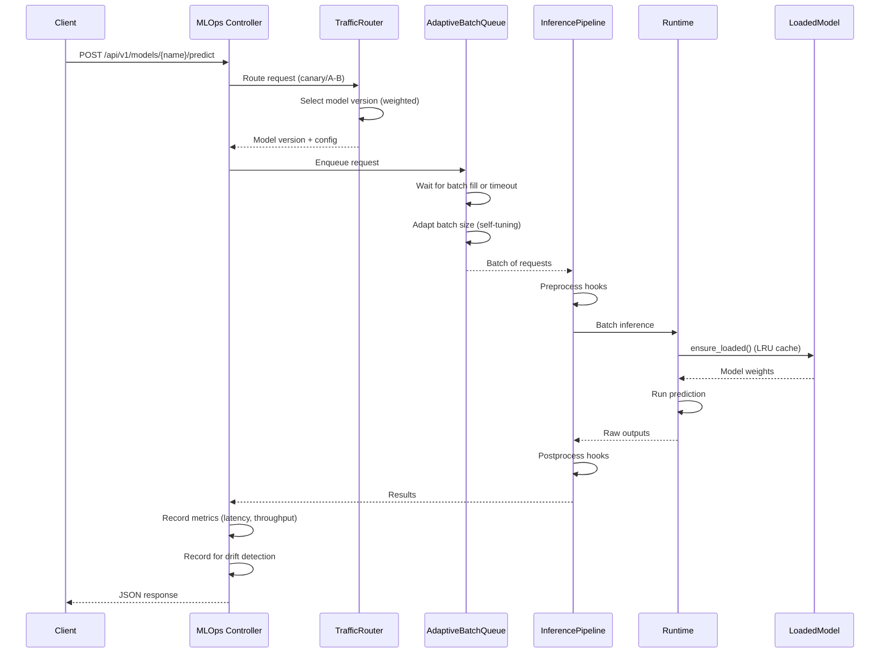

---

## 8. Build & Deploy Flow

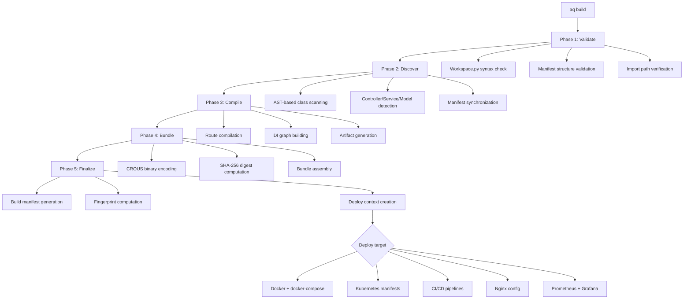

---

## 9. WebSocket Flow

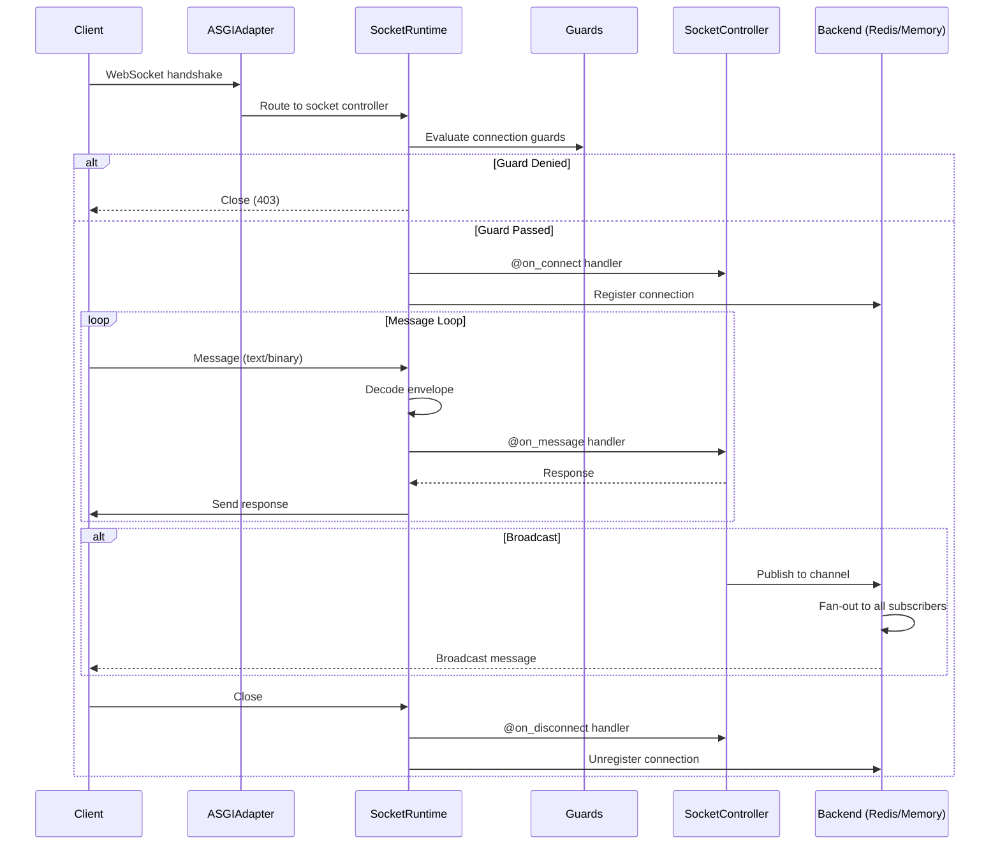

---

## 10. Session Lifecycle

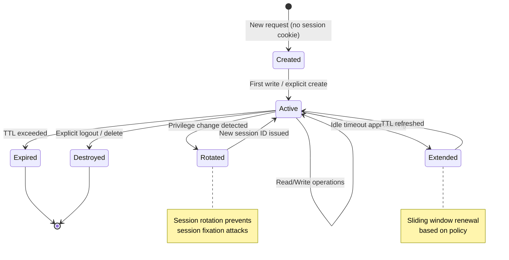
