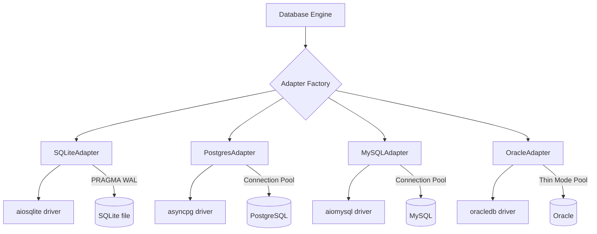
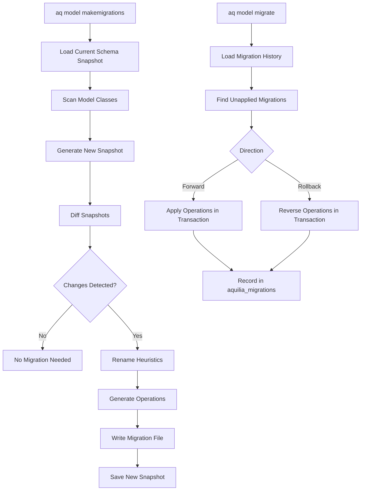

# Aquilia — Database Design

> Schema architecture, ORM system, relationships, indexing, migrations, and multi-backend support.

---

## 1. ORM Architecture

Aquilia implements a **pure-Python async ORM** (no SQLAlchemy dependency) with:

- **Active Record pattern** — models are both data containers and query interfaces
- **Metaclass-driven** — `ModelMeta` handles field collection, auto-PK injection, registration
- **Async-first** — all database operations are `async`/`await`
- **4 database backends** — SQLite, PostgreSQL, MySQL, Oracle
- **Dialect-aware SQL** — each backend generates correct SQL for its dialect

### Model Definition

```python
from aquilia.models import Model, CharField, IntegerField, ForeignKey, CASCADE

class User(Model):
    name = CharField(max_length=100)
    email = CharField(max_length=255, unique=True)
    age = IntegerField(null=True)
    
    class Meta:
        table_name = "users"
        ordering = ["-created_at"]
        indexes = [("email",)]
```

---

## 2. Field System (50+ Field Types)

### Base Fields

| Category | Fields |
|----------|--------|
| **Auto PK** | `AutoField`, `BigAutoField`, `SmallAutoField` |
| **Numeric** | `IntegerField`, `BigIntegerField`, `SmallIntegerField`, `PositiveIntegerField`, `FloatField`, `DecimalField`, `MoneyField` |
| **Text** | `CharField`, `TextField`, `SlugField`, `URLField`, `EmailField`, `UUIDField` |
| **Date/Time** | `DateTimeField`, `DateField`, `TimeField`, `DurationField` |
| **Boolean** | `BooleanField` |
| **Binary** | `BinaryField`, `JSONField` |
| **Network** | `IPAddressField`, `GenericIPAddressField` |
| **File** | `FileField`, `ImageField` |

### Relationship Fields

| Field | Description |
|-------|-------------|
| `ForeignKey(to, on_delete)` | Many-to-one with configurable deletion behavior |
| `OneToOneField(to, on_delete)` | One-to-one relationship |
| `ManyToManyField(to)` | Many-to-many via junction table |

### PostgreSQL-Specific Fields

| Field | SQL Type |
|-------|----------|
| `ArrayField(base_field)` | `TYPE[]` |
| `HStoreField` | `hstore` |
| `JSONBField` | `jsonb` |
| `CITextField` | `citext` |
| `DateRangeField` | `daterange` |
| `IntegerRangeField` | `int4range` |
| `BigIntegerRangeField` | `int8range` |
| `DecimalRangeField` | `numrange` |
| `DateTimeRangeField` | `tstzrange` |
| `TSVectorField` | `tsvector` |
| `CubeField` | `cube` |

### Extended Fields

| Field | Description |
|-------|-------------|
| `EnumField(enum_class)` | Stores Python Enums (value or name) |
| `CompositeField(fields)` | Groups multiple columns (JSON or expand strategy) |
| `CompositePrimaryKey` | Multi-column primary key constraint |
| `EncryptedCharField` | Fernet encryption at rest |
| `EncryptedTextField` | Fernet encryption for large text |
| `VersionField` | Auto-incrementing optimistic locking |

### Field Options

| Option | Default | Description |
|--------|---------|-------------|
| `null` | `False` | Allow NULL values |
| `blank` | `False` | Allow empty strings |
| `default` | — | Default value or callable |
| `unique` | `False` | UNIQUE constraint |
| `db_index` | `False` | Create index |
| `primary_key` | `False` | Primary key |
| `max_length` | — | Maximum character length |
| `choices` | — | Allowed values |
| `validators` | `[]` | Validation functions |
| `db_column` | — | Custom column name |
| `auto_now` | `False` | Update on every save |
| `auto_now_add` | `False` | Set on creation only |

---

## 3. Relationships

### Foreign Key Deletion Behaviors

| Behavior | Description |
|----------|-------------|
| `CASCADE` | Delete related objects |
| `SET_NULL` | Set FK to NULL (requires `null=True`) |
| `SET_DEFAULT` | Set FK to default value |
| `SET(value_or_callable)` | Set FK to specific value or callable result |
| `PROTECT` | Prevent deletion (raises `ProtectedError`) |
| `RESTRICT` | Prevent deletion (raises `RestrictedError`) |
| `DO_NOTHING` | No action (DB-level FK may still enforce) |

### Relationship Querying

```python
# Forward relation
user = await Post.objects.select_related("author").get(id=1)
author_name = user.author.name

# Reverse relation
posts = await User.objects.get(id=1)
user_posts = await posts.posts.all()

# Prefetch (avoid N+1)
users = await User.objects.prefetch_related("posts").all()
```

---

## 4. QuerySet API

The `QuerySet` is an **immutable, lazy query builder** — every chain returns a new clone.

### Chainable Methods

| Method | SQL Equivalent |
|--------|---------------|
| `.filter(**kwargs)` | `WHERE` |
| `.exclude(**kwargs)` | `WHERE NOT` |
| `.order_by(*fields)` | `ORDER BY` |
| `.select_related(*fields)` | `JOIN` |
| `.prefetch_related(*fields)` | Separate query + Python join |
| `.values(*fields)` | `SELECT field1, field2` |
| `.values_list(*fields)` | Returns tuples |
| `.distinct()` | `SELECT DISTINCT` |
| `.annotate(**exprs)` | Computed columns |
| `.using(db_alias)` | Database routing |
| `.only(*fields)` | Deferred loading |
| `.defer(*fields)` | Deferred loading |
| `.limit(n)` | `LIMIT n` |
| `.offset(n)` | `OFFSET n` |

### Terminal Methods (async)

| Method | Description |
|--------|-------------|
| `await .all()` | Execute and return all |
| `await .get(**kwargs)` | Single result (raises if 0 or >1) |
| `await .first()` | First result or None |
| `await .last()` | Last result or None |
| `await .count()` | `SELECT COUNT(*)` |
| `await .exists()` | `SELECT EXISTS(...)` |
| `await .aggregate(**funcs)` | `SUM`, `AVG`, `COUNT`, etc. |
| `await .create(**kwargs)` | `INSERT` |
| `await .bulk_create(objects)` | Batch `INSERT` |
| `await .update(**kwargs)` | `UPDATE` |
| `await .delete()` | `DELETE` |

### Expression System

```python
from aquilia.models import F, Q, Case, When, Value

# F expressions (column references)
Post.objects.filter(views__gt=F("likes") * 2)

# Q objects (complex queries)
Post.objects.filter(Q(status="published") | Q(author=current_user))

# Conditional expressions
Post.objects.annotate(
    popularity=Case(
        When(views__gt=1000, then=Value("high")),
        When(views__gt=100, then=Value("medium")),
        default=Value("low"),
    )
)
```

### Aggregate Functions

| Function | SQL | Dialect Notes |
|----------|-----|---------------|
| `Sum(field)` | `SUM(field)` | — |
| `Avg(field)` | `AVG(field)` | — |
| `Count(field)` | `COUNT(field)` | `COUNT(*)` for no field |
| `Max(field)` | `MAX(field)` | — |
| `Min(field)` | `MIN(field)` | — |
| `StdDev(field)` | `STDDEV(field)` | Dialect-aware |
| `Variance(field)` | `VARIANCE(field)` | Dialect-aware |
| `ArrayAgg(field)` | `ARRAY_AGG(field)` | PostgreSQL; `GROUP_CONCAT` fallback |
| `StringAgg(field, delimiter)` | `STRING_AGG(field, delimiter)` | PostgreSQL |

---

## 5. Database Backends

### Architecture



### Backend Configuration

| Backend | Config Class | Key Options |
|---------|-------------|-------------|
| SQLite | `SQLiteConfig` | `database`, `journal_mode` (WAL), `wal_autocheckpoint` |
| PostgreSQL | `PostgreSQLConfig` | `host`, `port`, `pool_size`, `max_overflow`, `ssl_mode` |
| MySQL | `MySQLConfig` | `host`, `port`, `pool_size`, `max_overflow`, `charset` |
| Oracle | `OracleConfig` | `host`, `port`, `service_name`, `pool_size`, `use_thick_mode` |

### Placeholder Adaptation

Each backend adapts the `?` placeholder to its native format:

| Backend | Native Placeholder | String-Literal Safe |
|---------|-------------------|-------------------|
| SQLite | `?` (no change) | Yes |
| PostgreSQL | `$1`, `$2`, ... | Yes |
| MySQL | `%s` | Yes |
| Oracle | `:1`, `:2`, ... | Yes |

All adaptations skip `?` characters inside string literals to prevent corruption.

### Connection Management

- **SQLite**: Single connection with WAL mode and `PRAGMA foreign_keys=ON`
- **PostgreSQL**: asyncpg connection pool with dedicated transaction connections
- **MySQL**: aiomysql connection pool with autocommit toggling for transactions
- **Oracle**: oracledb pool in thin mode (no Oracle Client required)

---

## 6. Indexing Strategies

### Standard Indexes

```python
class Post(Model):
    title = CharField(max_length=200, db_index=True)  # B-tree index
    
    class Meta:
        indexes = [
            ("author_id", "created_at"),  # Composite index
        ]
        unique_together = [
            ("slug", "author_id"),  # Unique constraint
        ]
```

### PostgreSQL-Specific Indexes

| Index Type | Class | Use Case |
|------------|-------|----------|
| GIN | `GinIndex` | Array, JSONB, full-text search |
| GiST | `GistIndex` | Geometric, range types |
| BRIN | `BrinIndex` | Large tables with natural ordering |
| Hash | `HashIndex` | Equality-only lookups |
| Expression | `ExpressionIndex` | Index on computed expressions |

### Constraints

| Constraint | Class | Description |
|------------|-------|-------------|
| CHECK | `CheckConstraint` | SQL CHECK with dialect-aware rendering |
| EXCLUDE | `ExclusionConstraint` | PostgreSQL EXCLUDE (range non-overlap) |

---

## 7. Migration System

### Migration DSL

```python
from aquilia.models.migration.dsl import Migration, column, CreateTable, AddColumn, RunSQL

class Migration_20240115_001_create_users(Migration):
    revision = "20240115_001"
    description = "Create users table"
    
    operations = [
        CreateTable("users", [
            column("id").integer().primary_key().auto_increment(),
            column("name").varchar(100).not_null(),
            column("email").varchar(255).not_null().unique(),
            column("created_at").datetime().default("CURRENT_TIMESTAMP"),
        ]),
        CreateIndex("users", ["email"], unique=True),
    ]
```

### Migration Operations

| Operation | Description | Reversible |
|-----------|-------------|-----------|
| `CreateTable` | CREATE TABLE with columns | ✅ (DROP TABLE) |
| `DropTable` | DROP TABLE | ✅ (CREATE TABLE) |
| `RenameTable` | ALTER TABLE RENAME | ✅ |
| `AddColumn` | ALTER TABLE ADD COLUMN | ✅ (DROP COLUMN) |
| `DropColumn` | ALTER TABLE DROP COLUMN | ✅ (ADD COLUMN) |
| `AlterColumn` | Alter column type | ✅ |
| `RenameColumn` | RENAME COLUMN | ✅ |
| `CreateIndex` | CREATE INDEX | ✅ (DROP INDEX) |
| `DropIndex` | DROP INDEX | ✅ (CREATE INDEX) |
| `AddConstraint` | Add constraint | ✅ |
| `DropConstraint` | Drop constraint | ✅ |
| `RunSQL` | Raw SQL (forward + reverse) | ✅ if reverse provided |
| `RunPython` | Python callable | ✅ if reverse provided |

### Migration Workflow



### Schema Snapshot & Diff

- Snapshots stored in **CROUS binary format** (with JSON fallback)
- Diff engine uses **rename heuristics** (Jaccard field similarity ≥ 0.6)
- SHA-256 checksums for migration file integrity
- **Transactional execution** — all operations within a migration run in a single transaction

### Migration Tracking

```sql
CREATE TABLE aquilia_migrations (
    id INTEGER PRIMARY KEY,
    revision TEXT NOT NULL UNIQUE,
    slug TEXT,
    applied_at TIMESTAMP,
    checksum TEXT,
    duration_ms REAL
);
```

---

## 8. Transaction Support

### Basic Transaction

```python
from aquilia.models import transaction

async with transaction():
    user = await User.objects.create(name="Alice")
    await Profile.objects.create(user=user, bio="...")
    # Auto-commits on success, auto-rollbacks on exception
```

### Nested Transactions (Savepoints)

```python
async with transaction():
    await User.objects.create(name="Alice")
    
    try:
        async with transaction():  # Creates SAVEPOINT
            await User.objects.create(name="Bob")
            raise ValueError("Oops")
    except ValueError:
        pass  # Savepoint rolled back, Alice still committed
    
    # Alice is committed
```

### Transaction Hooks

```python
async with transaction() as tx:
    await User.objects.create(name="Alice")
    tx.on_commit(lambda: send_welcome_email("Alice"))
    tx.on_rollback(lambda: log_failure())
```

---

## 9. AMDL (Aquilia Model Definition Language)

An alternative to Python class definitions for model declaration:

```amdl
model User {
    slot name: Str [max:100, required]
    slot email: Str [max:255, unique]
    slot age: Int [nullable]
    
    link posts: Post [many]
    
    index email [unique]
    
    hook before_save: validate_email
    
    meta table_name: "users"
    meta ordering: ["-created_at"]
    
    note "Core user model for authentication"
}
```

AMDL is parsed by a single-pass, line-oriented parser (`models/parser.py`) into AST nodes, then converted to dynamic proxy classes at runtime (`models/runtime.py`).

---

## 10. Multi-Database Routing

```python
# Configure multiple databases
databases = {
    "default": SQLiteConfig(database="main.db"),
    "analytics": PostgreSQLConfig(host="analytics-db", database="analytics"),
}

# Route queries
users = await User.objects.using("default").all()
events = await Event.objects.using("analytics").all()
```

The `_databases` registry in `db/database.py` maintains named database instances for routing.
