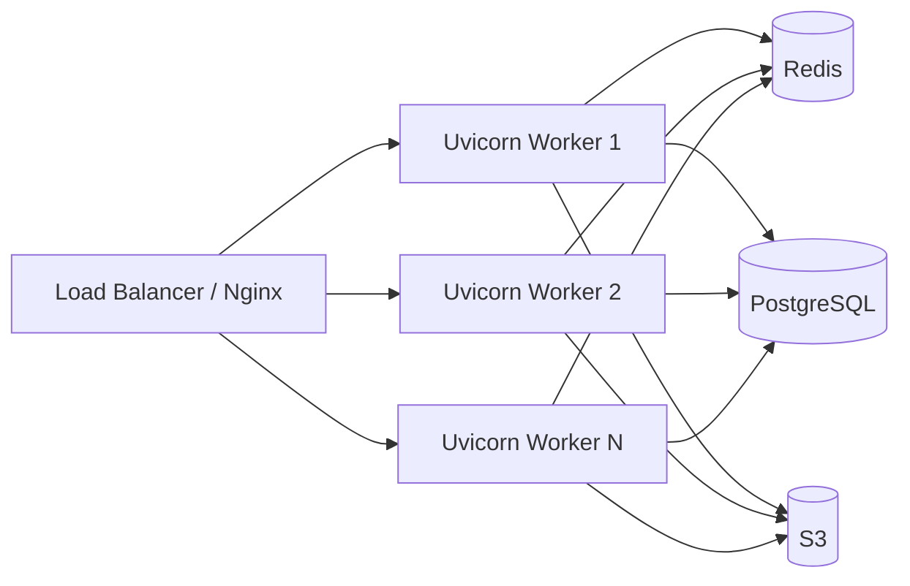

# Aquilia — System Design

> Deep analysis of architectural principles, design decisions, scalability strategies, and engineering tradeoffs.

---

## 1. Architectural Principles

### 1.1 Async-First, Sync-Compatible

Every I/O operation in Aquilia is `async` by default. The ORM, database adapters, cache backends, mail providers, storage backends, and task queue all expose `async` APIs. Sync fallbacks exist where necessary (DI resolution for sync constructors, template rendering) via thread-pool offloading.

**Why:** Python's `asyncio` enables handling thousands of concurrent connections on a single process without threading overhead. ASGI is the natural protocol for this paradigm.

### 1.2 Manifest-Driven Module System

Every Aquilia module is described by a `ModuleManifest` dataclass that declares:
- Identity (name, version, description)
- Components (controllers, services, models, serializers, guards, pipes, interceptors)
- Middleware bindings
- Routing configuration
- Lifecycle hooks
- Database configuration
- Task definitions
- Feature flags
- Cross-module exports/imports

**Why:** Manifests enable:
- **Static analysis** without importing module code
- **Dependency graphing** via Tarjan's SCC for cycle detection
- **Build-time validation** before deployment
- **Deterministic fingerprinting** (SHA-256) for deployment gating
- **Auto-discovery** via AST-based scanning (no code execution)

### 1.3 Typed Effect System

Inspired by Effect-TS, the effect system manages typed resource lifecycles:

```
EffectToken<T>  →  EffectProvider  →  EffectRegistry
     ↓                   ↓                  ↓
  Declaration       Implementation      Orchestration
```

**Lifecycle:** `initialize()` → per-request `acquire()` → `release()` → `shutdown()`

**Why:** Effects prevent resource leaks, enable testability (mock effects), and provide health monitoring. They decouple resource acquisition from business logic.

### 1.4 Fault Domain Architecture

Errors are modeled as typed `Fault` objects with:
- `domain` (AUTH, DATABASE, BLUEPRINT, ADMIN, etc.)
- `code` (structured identifier like `AUTH_001`)
- `severity` (INFO, WARNING, ERROR, CRITICAL, FATAL)
- `metadata` (key-value pairs for debugging)

Faults are handled by a `FaultEngine` with Chain of Responsibility dispatching through scoped handler registries.

**Why:** Structured faults replace exception-based control flow, enabling:
- Consistent HTTP status code mapping
- Domain-specific error handling
- Severity-based alerting
- Machine-readable error responses

### 1.5 Convention over Configuration

Aquilia follows naming conventions:
- Controllers discovered from `controllers/` directories
- Services from `services/` directories
- Models from `models/` directories
- Templates from `templates/` directories
- Migrations from `migrations/` directories

Auto-discovery uses AST scanning (no code execution) with manifest diffing for bidirectional synchronization.

---

## 2. Design Decisions

### 2.1 Pure-Python ORM (No SQLAlchemy)

Aquilia implements its own ORM (`aquilia.models`) rather than wrapping SQLAlchemy.

**Decision rationale:**
- Full control over async query generation
- Dialect-aware SQL output without an intermediate abstraction layer
- Custom migration DSL with rename heuristics
- AMDL (Aquilia Model Definition Language) as an alternative to Python class definitions
- Content-hash-based schema snapshots for migration generation
- Direct integration with the Blueprint system

**Tradeoffs:**
- (+) Simpler dependency tree — no SQLAlchemy/Alembic
- (+) Native async from the ground up
- (+) Tight framework integration (signals, DI, effects)
- (−) Smaller ecosystem than SQLAlchemy
- (−) Feature parity maintenance burden
- (−) Less battle-tested edge cases

### 2.2 Blueprint vs Serializer

Aquilia's `Blueprint` system is a conscious departure from Django REST Framework's `Serializer`:

| Aspect | DRF Serializer | Aquilia Blueprint |
|--------|---------------|-------------------|
| Purpose | Data validation/serialization | Framework-level contract |
| Lifecycle | validate → create/update | cast → seal → mold |
| Projections | — | Named field subsets (SQL view analogy) |
| Facets | Fields | Typed facets with 25+ constraint kwargs |
| Lens | — | Relational views with depth control |
| Integration | Manual | Auto-detected in controller parameters |
| Schema | Requires drf-spectacular | Built-in OpenAPI generation |

**Why:** Blueprints are first-class primitives that define the contract between Model and world. Projections enable returning different field sets from the same Blueprint (e.g., `__minimal__`, `__full__`, custom sets).

### 2.3 Clearance System

Beyond traditional RBAC/ABAC, Aquilia implements a military-style Clearance system with 5 dimensions:

1. **Level** — PUBLIC(0) → AUTHENTICATED(10) → INTERNAL(20) → CONFIDENTIAL(30) → RESTRICTED(40)
2. **Entitlements** — Resource-specific permissions with wildcard matching
3. **Conditions** — Async runtime checks (IP allowlist, business hours, MFA verified)
4. **Compartments** — Multi-tenant isolation with template resolution
5. **Audit** — All access decisions logged

**Why:** This provides defense-in-depth for enterprise applications where simple role checks are insufficient. A single decorator can enforce "user must be CONFIDENTIAL level, have `documents:read` entitlement, be within allowed IP range, and belong to tenant compartment."

### 2.4 CROUS Binary Format

Aquilia uses a custom binary serialization format called CROUS for:
- Build artifact storage
- i18n catalog persistence
- Audit log persistence
- Schema snapshots
- Inter-service communication

**Why:** CROUS provides ~3-5x compression over JSON with built-in integrity checking (XXH64 checksums, LZ4/ZSTD compression). It gracefully degrades to JSON when the native library is unavailable.

### 2.5 Two-Tier Routing

The router uses a two-tier architecture:
1. **Tier 1:** O(1) static route lookup via hash map
2. **Tier 2:** O(k) dynamic regex matching for parameterized routes, sorted by specificity

Specificity scoring: static segments (100) > typed params (50) > untyped params (25) > wildcards (1)

**Why:** Most production traffic hits a small number of static routes. The hash map provides zero-overhead matching for these. Dynamic routes fall back to the regex tier, which is sorted by specificity to prevent route shadowing attacks.

---

## 3. Scalability Strategies

### 3.1 Horizontal Scaling



**Stateless workers:** All state is externalized to Redis (sessions, cache, rate-limit counters) and PostgreSQL. Workers are horizontally scalable behind a load balancer.

**Connection pooling:** PostgreSQL (asyncpg pool), MySQL (aiomysql pool), Oracle (oracledb pool) — all configurable via `pool_size` and `max_overflow`.

### 3.2 Caching Strategy

Three-tier caching architecture:

1. **L1 — In-Memory** (`MemoryBackend`): Per-process, 5 eviction policies (LRU, LFU, FIFO, TTL, Random), asyncio lock-protected
2. **L2 — Redis** (`RedisBackend`): Shared across workers, pipelined batch operations
3. **Tiered** (`TieredBackend`): L1 → L2 with automatic promotion and graceful degradation

**Stampede prevention:** Singleflight pattern via `asyncio.Future` — concurrent requests for the same cache key wait for a single computation.

**TTL jitter:** Random jitter added to TTL to prevent coordinated cache expiry (anti-thundering-herd).

### 3.3 Task Queue

Priority-based job queue with:
- **5 priority levels:** CRITICAL(0), HIGH(1), NORMAL(5), LOW(10), BACKGROUND(20)
- **Retry with exponential backoff**
- **Dead letter queue** for permanently failed jobs
- **Scheduled tasks** via cron expressions or interval definitions
- **Configurable worker pool**

### 3.4 MLOps Scaling

The MLOps platform includes:
- **Adaptive batch queue:** Self-tuning batch sizes based on latency/throughput targets
- **Model auto-scaling:** HPA-like evaluation with cooldown periods
- **Bin-packing placement:** Optimizes model placement across GPU/CPU nodes
- **Canary routing:** Progressive rollouts with automatic rollback on error rate thresholds
- **Circuit breaker:** Prevents cascading failures in inference pipelines

### 3.5 WebSocket Scaling

WebSocket connections scale horizontally via pluggable backends:
- **In-memory** for single-process development
- **Redis Pub/Sub** for multi-worker deployments
- **Custom adapters** via abstract base class

---

## 4. Tradeoffs

### 4.1 Batteries-Included vs Modularity

**Chosen:** Batteries-included (like Django) over microframework (like Flask/Starlette).

| Pro | Con |
|-----|-----|
| Consistent abstractions across all subsystems | Large framework surface area to maintain |
| Single import for the entire API | Steeper learning curve |
| Built-in auth, admin, ORM, templates, i18n, MLOps | Harder to replace individual components |
| Integrated testing framework | Package size |

**Mitigation:** Optional dependencies via `extras_require`. Core has only 3 deps (click, PyYAML, uvicorn). Everything else is opt-in.

### 4.2 Custom ORM vs Established Solutions

**Chosen:** Custom pure-Python ORM over SQLAlchemy.

| Pro | Con |
|-----|-----|
| Native async without wrapper overhead | Less community ecosystem |
| Tight Blueprint/Effect integration | Fewer edge cases covered |
| AMDL DSL for alternative model definition | Additional maintenance burden |
| Built-in migration with rename heuristics | Missing advanced features (polymorphic inheritance, composite FK, etc.) |

### 4.3 Manifest System vs Convention-Only

**Chosen:** Explicit manifest declaration alongside auto-discovery.

| Pro | Con |
|-----|-----|
| Static analysis without code execution | Boilerplate for simple apps |
| Build-time validation | Two sources of truth (manifest + code) |
| Deployment fingerprinting | Synchronization overhead |
| Dependency graphing | Learning curve |

**Mitigation:** Auto-discovery via AST scanning keeps manifests in sync. The `aq discover` command provides one-way sync.

### 4.4 Monolithic Framework vs Service Mesh

**Chosen:** Single-process monolith with subsystem architecture.

| Pro | Con |
|-----|-----|
| Simple deployment | Cannot scale subsystems independently |
| Single event loop for all I/O | Failure in one subsystem affects all |
| Shared DI container | Memory footprint for unused features |
| Atomic lifecycle management | Not suitable for micro-services architecture |

**Mitigation:** Subsystems are independently configurable and can be disabled. The effect system provides isolation. The build system supports artifact-based deployments.

### 4.5 Security Depth vs Performance

**Chosen:** Defense-in-depth with configurable strictness.

| Feature | Cost | Benefit |
|---------|------|---------|
| Argon2id hashing (64MB, 2 passes) | ~200ms per hash | Memory-hard, side-channel resistant |
| HMAC-signed cookies | Crypto overhead per request | Tamper-proof session cookies |
| CSRF double-submit with nonce | Extra header/cookie per request | CSRF protection without session storage |
| Clearance evaluation | Multi-dimensional check per request | Enterprise-grade access control |
| Audit logging | I/O per security event | Compliance and forensics |

**Mitigation:** All security features are configurable. Dev mode automatically relaxes constraints (no Secure cookies on localhost, debug pages enabled).
