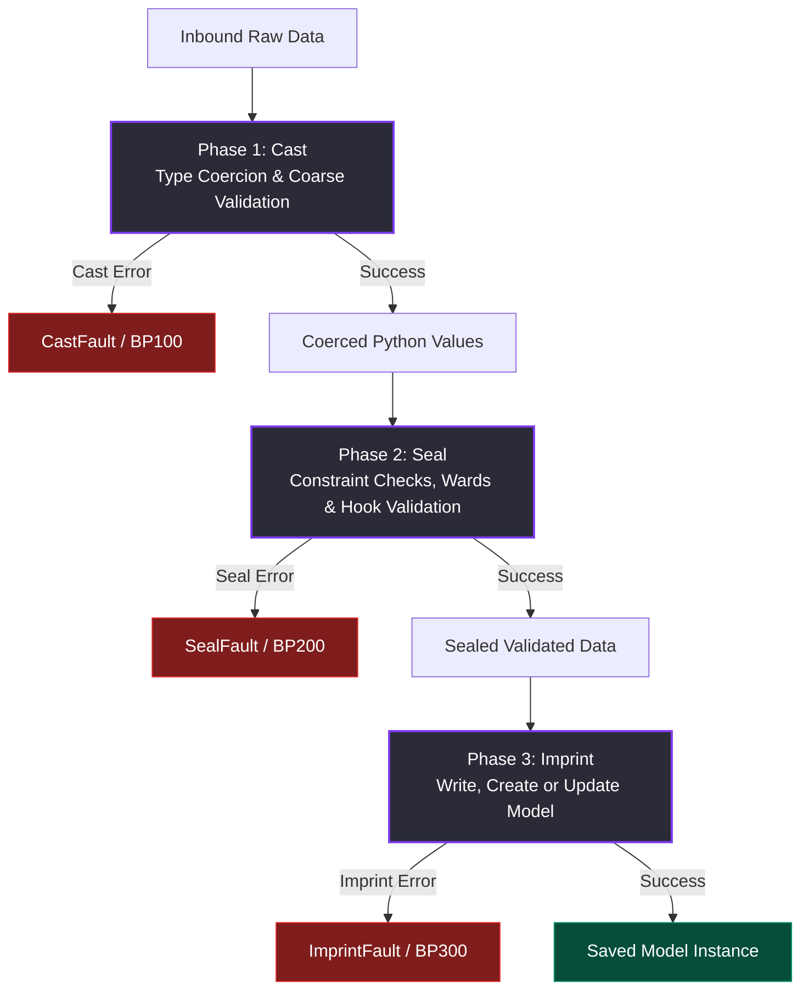
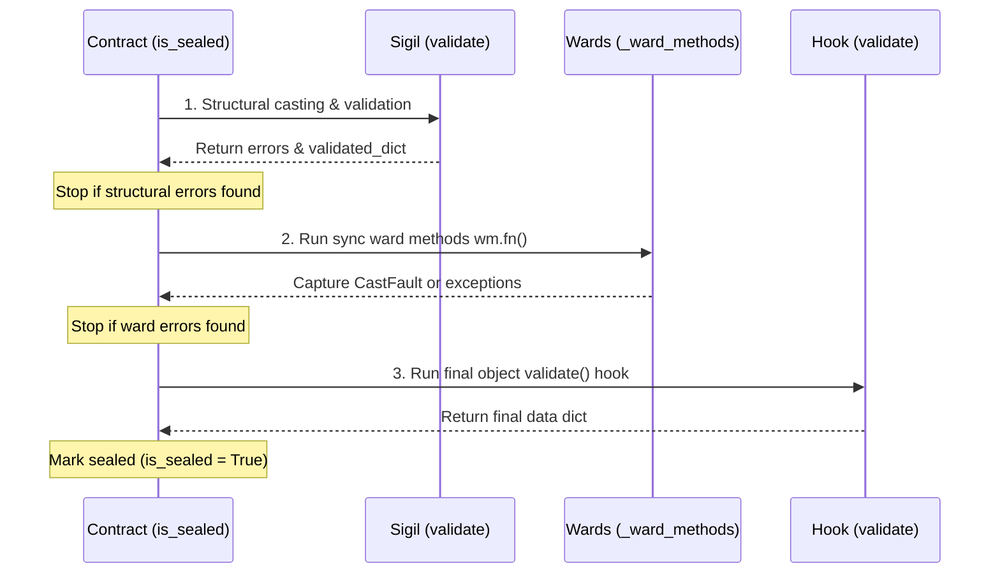
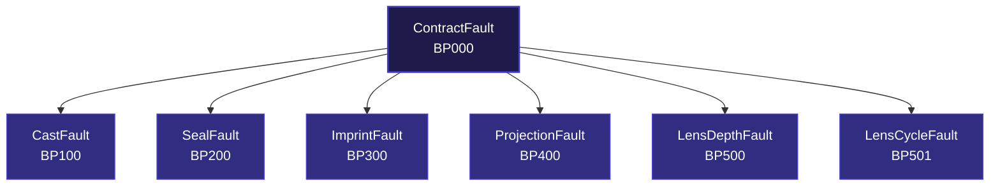

Every Aquilia Contract guides inbound data through a deterministic, multi-phase lifecycle before it ever reaches a persistent state or model. This ensures strict validation, clear error domains, and robust guarantees at the database boundary.

---

## 1. The Three-Phase Lifecycle

The Contract data pipeline operates in three distinct phases: **Cast**, **Seal**, and **Imprint**.



---

## 2. The Cast Phase

The **Cast Phase** is the first line of defense. It parses raw inbound data structures and coerces values into their corresponding Python type representations.

If a value cannot be coerced to the expected type, a [CastFault](file:///Users/kuroyami/TuboxLabProject/aquilia-docs/aquilia/contracts/exceptions.py#L62-L80) is raised.

### Type Coercion by Facet

Each facet implements its coercion logic within its `cast()` method:

*   **`Facet`** ([facets.py:L325-332](file:///Users/kuroyami/TuboxLabProject/aquilia-docs/aquilia/contracts/facets.py#L325-L332)): The base facet simply returns the incoming value as-is without any modification.
*   **`TextFacet`** ([facets.py:L507-519](file:///Users/kuroyami/TuboxLabProject/aquilia-docs/aquilia/contracts/facets.py#L507-L519)): Coerces strings and safe primitive types (integers, floats, booleans) to strings. If `trim=True` (default), it strips whitespace. Raises `CastFault` for complex types.
*   **`EmailFacet`** ([facets.py:L548-550](file:///Users/kuroyami/TuboxLabProject/aquilia-docs/aquilia/contracts/facets.py#L548-L550)): Inherits from `TextFacet` but lowercases the cast string.
*   **`IntFacet`** ([facets.py:L644-650](file:///Users/kuroyami/TuboxLabProject/aquilia-docs/aquilia/contracts/facets.py#L644-L650)): Coerces inputs using `int()`. Booleans are explicitly rejected to prevent `True` / `False` casting to `1` / `0`.
*   **`FloatFacet`** ([facets.py:L695-706](file:///Users/kuroyami/TuboxLabProject/aquilia-docs/aquilia/contracts/facets.py#L695-L706)): Coerces inputs using `float()`. Rejects `NaN` and `Infinity` values unless explicitly allowed via `allow_nan` or `allow_infinity`.
*   **`DecimalFacet`** ([facets.py:L749-755](file:///Users/kuroyami/TuboxLabProject/aquilia-docs/aquilia/contracts/facets.py#L749-L755)): Parses string and numeric inputs into Python `Decimal` objects.
*   **`BoolFacet`** ([facets.py:L797-811](file:///Users/kuroyami/TuboxLabProject/aquilia-docs/aquilia/contracts/facets.py#L797-L811)): Resolves values to booleans. Supports boolean types, integer-matching (`1`/`0`), and truthy/falsy strings (e.g., `"true"`, `"yes"`, `"on"` / `"false"`, `"no"`, `"off"`).
*   **`DateFacet`** ([facets.py:L822-832](file:///Users/kuroyami/TuboxLabProject/aquilia-docs/aquilia/contracts/facets.py#L822-L832)): Parses ISO 8601 strings into standard `date` objects, or extracts the date part from a `datetime` instance.
*   **`DateTimeFacet`** ([facets.py:L880-891](file:///Users/kuroyami/TuboxLabProject/aquilia-docs/aquilia/contracts/facets.py#L880-L891)): Parses ISO 8601 strings (handling trailing `"Z"` offsets) into `datetime` objects.
*   **`DurationFacet`** ([facets.py:L911-935](file:///Users/kuroyami/TuboxLabProject/aquilia-docs/aquilia/contracts/facets.py#L911-L935)): Parses numerical inputs (treated as seconds) or `"HH:MM:SS"` string formats into `timedelta` objects.
*   **`ListFacet`** ([facets.py:L995-1010](file:///Users/kuroyami/TuboxLabProject/aquilia-docs/aquilia/contracts/facets.py#L995-L1010)): Ensures the input value is a list or tuple. If a `child` facet is configured, it recursively casts every element.
*   **`DictFacet`** ([facets.py:L1189-1222](file:///Users/kuroyami/TuboxLabProject/aquilia-docs/aquilia/contracts/facets.py#L1189-L1222)): Verifies inputs are dictionary-like and keys are strings. Parses JSON string representations starting with `{`. Restricts key count to prevent Hash DoS (using `max_keys`). Recursively casts values if `value_facet` is supplied.
*   **`ChoiceFacet`** ([facets.py:L1364-1365](file:///Users/kuroyami/TuboxLabProject/aquilia-docs/aquilia/contracts/facets.py#L1364-L1365)): Passes the value through unchanged during casting (membership checks are deferred to the Seal Phase).
*   **`EnumFacet`** ([facets.py:L1402-1429](file:///Users/kuroyami/TuboxLabProject/aquilia-docs/aquilia/contracts/facets.py#L1402-L1429)): Looks up and returns the corresponding enum member by matching the value against member names or values.

---

## 3. The Seal Phase

The **Seal Phase** enforces contract validation, ensuring that data is complete, meets validation constraints, and respects business rules. Once sealed, a Contract yields a read-only, validated data object.

### Facet Seal Constraints

During `seal()`, each facet runs specific constraint checks:

*   **`Facet`** ([facets.py:L346-360](file:///Users/kuroyami/TuboxLabProject/aquilia-docs/aquilia/contracts/facets.py#L346-L360)): Evaluates all registered custom validators.
*   **`TextFacet`** ([facets.py:L521-530](file:///Users/kuroyami/TuboxLabProject/aquilia-docs/aquilia/contracts/facets.py#L521-L530)): Enforces non-blank constraints (`allow_blank=False` checks for `""`), `min_length`, `max_length`, and regex `pattern` matching.
*   **`EmailFacet`** ([facets.py:L552-555](file:///Users/kuroyami/TuboxLabProject/aquilia-docs/aquilia/contracts/facets.py#L552-L555)): Matches against standard email regex format (`_EMAIL_RE`).
*   **`IntFacet` / `FloatFacet`** ([facets.py:L652-660](file:///Users/kuroyami/TuboxLabProject/aquilia-docs/aquilia/contracts/facets.py#L652-L660), [facets.py:L708-716](file:///Users/kuroyami/TuboxLabProject/aquilia-docs/aquilia/contracts/facets.py#L708-L716)): Enforces boundary limits (`min_value`, `max_value`) and multiple of constraints (`multiple_of`).
*   **`DecimalFacet`** ([facets.py:L757-772](file:///Users/kuroyami/TuboxLabProject/aquilia-docs/aquilia/contracts/facets.py#L757-L772)): Limits boundary ranges, total allowed digits (`max_digits`), and decimal places (`decimal_places`).
*   **`ListFacet`** ([facets.py:L1012-1023](file:///Users/kuroyami/TuboxLabProject/aquilia-docs/aquilia/contracts/facets.py#L1012-L1023)): Checks array size constraints (`min_items`, `max_items`) and seals nested elements.
*   **`DictFacet`** ([facets.py:L1224-1235](file:///Users/kuroyami/TuboxLabProject/aquilia-docs/aquilia/contracts/facets.py#L1224-L1235)): Recursively calls `seal()` on inner values against `value_facet`.
*   **`ChoiceFacet` / `EnumFacet`** ([facets.py:L1367-1373](file:///Users/kuroyami/TuboxLabProject/aquilia-docs/aquilia/contracts/facets.py#L1367-L1373), [facets.py:L1431-1434](file:///Users/kuroyami/TuboxLabProject/aquilia-docs/aquilia/contracts/facets.py#L1431-L1434)): Verifies the value belongs to the set of allowed options or enum values.

### Execution & Wards Pipeline

When validating a Contract, the validation sequence executes as follows:



1.  **Sigil Validation** ([core.py:L1083-1088](file:///Users/kuroyami/TuboxLabProject/aquilia-docs/aquilia/contracts/core.py#L1083-L1088)): Structural validation that runs type coercion (`cast`) and basic facet validations (`seal`) on all properties, generating the initial errors dictionary.
2.  **Cross-Field Wards** ([core.py:L1101-1111](file:///Users/kuroyami/TuboxLabProject/aquilia-docs/aquilia/contracts/core.py#L1101-L1111)): Iterates through sync `@ward` methods (`self._ward_methods`). Wards check cross-field consistency. A ward registers errors via `self.reject(field, message)` which throws a `CastFault`.
3.  **Object validate hook** ([core.py:L1118-1120](file:///Users/kuroyami/TuboxLabProject/aquilia-docs/aquilia/contracts/core.py#L1118-L1120)): Executes the user-defined `validate()` hook on the entire dictionary, which acts as the final gate.

If any phase encounters issues, validation fails.
*   **Synchronous validation** is executed using `is_sealed()` ([core.py:L1014-1142](file:///Users/kuroyami/TuboxLabProject/aquilia-docs/aquilia/contracts/core.py#L1014-L1142)). Calling this on a Contract containing async wards raises a `RuntimeError`.
*   **Asynchronous validation** uses `is_sealed_async()` ([core.py:L1144-1179](file:///Users/kuroyami/TuboxLabProject/aquilia-docs/aquilia/contracts/core.py#L1144-L1179)), which executes sync phases first, then awaits async ward methods.

### Batch Validation Results

*   **`SealOutcome`** ([core.py:L2086-2091](file:///Users/kuroyami/TuboxLabProject/aquilia-docs/aquilia/contracts/core.py#L2086-L2091)): A simple data structure returned by bulk operations like `seal_many` or `seal_stream` to group results per item:
    ```python
    @dataclass(frozen=True, slots=True)
    class SealOutcome:
        index: int
        ok: bool
        value: dict | None
        errors: dict | None
    ```

---

## 4. The Imprint Phase

The **Imprint Phase** takes a successfully sealed contract and persists it back to the database.

Calling `imprint()` ([core.py:L1310-1341](file:///Users/kuroyami/TuboxLabProject/aquilia-docs/aquilia/contracts/core.py#L1310-L1341)) returns the persisted model instance (or a list of instances for bulk prints). It raises an [ImprintFault](file:///Users/kuroyami/TuboxLabProject/aquilia-docs/aquilia/contracts/exceptions.py#L111-L115) if called before sealing or if saving fails.

### Imprint Workflow

1.  **Check Validation State**: If validation has not run or failed, it raises `ImprintFault`.
2.  **Filter Writable Attributes**: The helper method `_filter_imprint_data()` ([core.py:L1398-1429](file:///Users/kuroyami/TuboxLabProject/aquilia-docs/aquilia/contracts/core.py#L1398-L1429)) prepares the payload by excluding:
    *   `Computed`, `Constant`, and `Inject` facets.
    *   Fields not defined on the model or not matching foreign key fields (`{fname}_id`).
3.  **Execute Write Operation**:
    *   *Create*: If no instance was provided, it builds a new model instance and awaits `instance.save()` ([core.py:L1343-1360](file:///Users/kuroyami/TuboxLabProject/aquilia-docs/aquilia/contracts/core.py#L1343-L1360)).
    *   *Update*: If updating an existing instance, it sets fields dynamically on the model object and awaits `instance.save(update_fields=...)` ([core.py:L1362-1380](file:///Users/kuroyami/TuboxLabProject/aquilia-docs/aquilia/contracts/core.py#L1362-L1380)).

---

## 5. Columnar Validation & Reports

Bulk records validate efficiently using `seal_columnar()` ([core.py:L1777-1821](file:///Users/kuroyami/TuboxLabProject/aquilia-docs/aquilia/contracts/core.py#L1777-L1821)). Instead of validating row-by-row, it processes datasets vertically by column, avoiding full Contract instantiation overhead.

This method yields a **`ColumnarReport`** ([core.py:L2094-2096](file:///Users/kuroyami/TuboxLabProject/aquilia-docs/aquilia/contracts/core.py#L2094-L2096)):

```python
@dataclass(frozen=True, slots=True)
class ColumnarReport:
    valid_mask: list[bool]
    errors_by_column: dict[str, list[str | None]]
```

*   `valid_mask`: A list of booleans indicating validation status for each row index.
*   `errors_by_column`: A dictionary mapping each column key to a list of error messages (or `None`) of length equal to the number of records.

---

## 6. Error Hierarchy

All validation and contract errors inherit from a unified base class to participate in structured API responses:



<h3>Fault Definitions</h3>

*   **`ContractFault`** ([exceptions.py:L25-56](file:///Users/kuroyami/TuboxLabProject/aquilia-docs/aquilia/contracts/exceptions.py#L25-L56)): Base class inheriting from Aquilia's root `Fault`. Provides `.field_errors` and the `.as_response_body()` mapping format.
*   **`CastFault`** ([exceptions.py:L62-80](file:///Users/kuroyami/TuboxLabProject/aquilia-docs/aquilia/contracts/exceptions.py#L62-L80)): Raised during type coercion failures. Automatically formats error messages as `"Cast failed for '{field}': {message}"`.
*   **`SealFault`** ([exceptions.py:L82-109](file:///Users/kuroyami/TuboxLabProject/aquilia-docs/aquilia/contracts/exceptions.py#L82-L109)): Raised when validation fails. Groups multiple validation errors. Auto-formats metadata details containing field lists.
*   **`ImprintFault`** ([exceptions.py:L111-115](file:///Users/kuroyami/TuboxLabProject/aquilia-docs/aquilia/contracts/exceptions.py#L111-L115)): Raised during database persistence errors.
*   **`ProjectionFault`** ([exceptions.py:L117-127](file:///Users/kuroyami/TuboxLabProject/aquilia-docs/aquilia/contracts/exceptions.py#L117-L127)): Raised when a requested projection is not configured on the Contract.
*   **`LensDepthFault`** ([exceptions.py:L129-139](file:///Users/kuroyami/TuboxLabProject/aquilia-docs/aquilia/contracts/exceptions.py#L129-L139)): Raised if relational lens traversal exceeds the depth safety limit.
*   **`LensCycleFault`** ([exceptions.py:L141-150](file:///Users/kuroyami/TuboxLabProject/aquilia-docs/aquilia/contracts/exceptions.py#L141-L150)): Raised when lens resolution detects a circular reference.

---

## 7. strict Mode Behavior

The `strict` configuration governs Sigil's casting tolerance:

*   **Configured in Spec**: Default is `False` ([core.py:L200](file:///Users/kuroyami/TuboxLabProject/aquilia-docs/aquilia/contracts/core.py#L200), [core.py:L218](file:///Users/kuroyami/TuboxLabProject/aquilia-docs/aquilia/contracts/core.py#L218)).
*   **Dynamic Overrides**: Overridable via `context={"strict": True/False}` ([core.py:L1082-1088](file:///Users/kuroyami/TuboxLabProject/aquilia-docs/aquilia/contracts/core.py#L1082-L1088)).
*   **Behavior**: When `strict` is enabled, the structural validator rejects loose type coercions (such as coercing numeric strings to integers) and raises a `CastFault` immediately.

---

## 8. extra_fields Setting

The `extra_fields` setting determines how unknown input keys are handled during structural validation:

*   **Configured in Spec**: Default is `"ignore"` ([core.py:L198](file:///Users/kuroyami/TuboxLabProject/aquilia-docs/aquilia/contracts/core.py#L198), [core.py:L216](file:///Users/kuroyami/TuboxLabProject/aquilia-docs/aquilia/contracts/core.py#L216)).
*   **Dynamic Overrides**: Overridable via `context={"extra_fields": "reject"}` ([core.py:L1062-1063](file:///Users/kuroyami/TuboxLabProject/aquilia-docs/aquilia/contracts/core.py#L1062-L1063)).
*   **Comparison**:
    *   `"ignore"` (Default): Safely strips out and ignores keys not declared as facets.
    *   `"reject"` ([core.py:L1065-1079](file:///Users/kuroyami/TuboxLabProject/aquilia-docs/aquilia/contracts/core.py#L1065-L1079)): Identifies extra keys by comparing input keys to `self._bound_facets.keys()`. If extra keys exist, they are appended to the validation errors, failing the validation.

---

## 9. Code Examples

=== "Inbound Flow"

    ```python
    from aquilia.contracts import Contract
    from myapp.models import Product

    class ProductContract(Contract):
        class Spec:
            model = Product
            fields = ["name", "price", "stock"]

    # Raw user input payload
    payload = {"name": "Mechanical Keyboard", "price": "129.99", "stock": 45}

    async def create_product(data_dict: dict) -> Product:
        # Instantiate with input data
        bp = ProductContract(data=data_dict)

        # Phase 1 & 2: Coerce types and validate constraints
        if bp.is_sealed():
            # Phase 3: Persist back to database model
            product_instance = await bp.imprint()
            return product_instance
        else:
            print("Validation failed:", bp.errors)
    ```
=== "Error Handling"

    ```python
    from aquilia.contracts.exceptions import ContractFault
    from myapp.contracts import UserContract

    def handle_user_registration(raw_data: dict) -> dict:
        bp = UserContract(data=raw_data)

        try:
            # Force validation; throws SealFault if check fails
            bp.is_sealed(raise_fault=True)
            return {"status": "success", "data": bp.validated_data}

        except ContractFault as exc:
            # Generate structured response output
            return {
                "status": "error",
                "payload": exc.as_response_body(), # Formats fault code, message & field-specific errors
                "status_code": 400
            }
    ```
=== "Custom Wards"

    ```python
    from aquilia.contracts import Contract
    from aquilia.contracts.ward import ward
    from datetime import date

    class BookingContract(Contract):
        # Fields derived automatically from model

        @ward
        def validate_date_order(self, data) -> None:
            """Synchronous ward checking start & end date constraints."""
            if data.start_date and data.end_date:
                if data.end_date <= data.start_date:
                    # Rejects ending date, raising CastFault internally
                    self.reject("end_date", "End date must be strictly after start date")

        @ward
        async def validate_availability(self, data) -> None:
            """Asynchronous ward verifying room availability."""
            db = self.context.get("db_connection")
            if db:
                available = await db.check_room(data.room_id, data.start_date)
                if not available:
                    self.reject("room_id", "Room is not available on selected start date")
    ```

