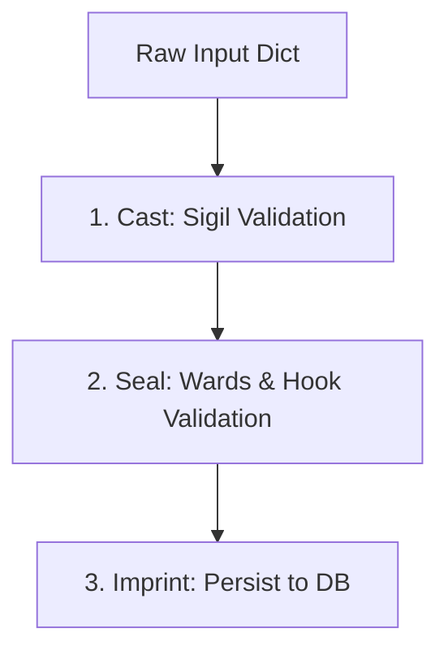
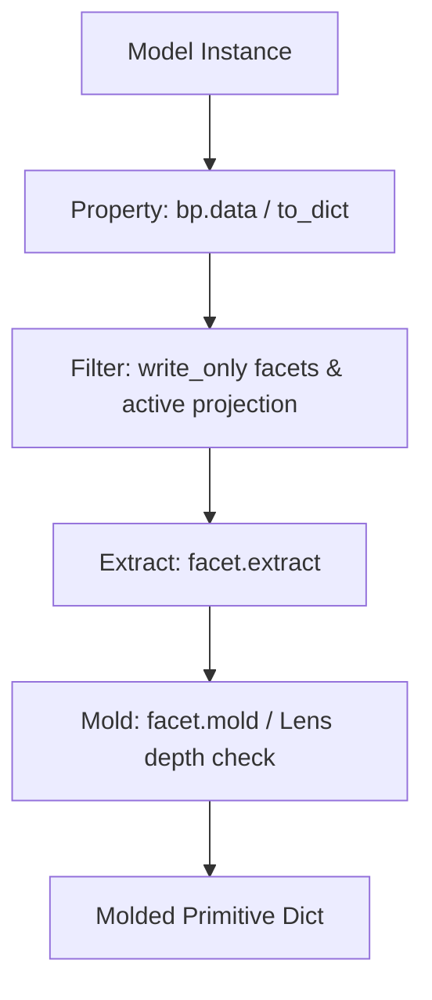

## Blueprint vs Serializer

Based on the official implementation and documentation, Blueprints differ from traditional serializers in the following key ways:
- **Comprehensive Lifecycle Contract**: Traditional serializers typically focus on converting complex object graphs to and from primitive Python types. A Blueprint goes beyond serialization to define the complete model-world boundary: what the world sees (Facets), named subsets (Projections), how data enters (Casts), how integrity is enforced (Seals), and how data is written back (Imprints) [__init__.py:L4-7](file:///Users/kuroyami/TuboxLabProject/aquilia-docs/aquilia/blueprints/__init__.py#L4-L7).
- **Persistence Ownership**: Serializers validate data but leave database operations to external handlers. In Aquilia, the Blueprint itself manages database persistence via `imprint` [core.py:L1310-1341](file:///Users/kuroyami/TuboxLabProject/aquilia-docs/aquilia/blueprints/core.py#L1310-L1341), which automatically distinguishes between model-writable fields and computed/constant facets to create or update database records [core.py:L1398-1429](file:///Users/kuroyami/TuboxLabProject/aquilia-docs/aquilia/blueprints/core.py#L1398-L1429).
- **Composition and Slicing**: Blueprints natively support union composition using the `|` operator [core.py:L630-644](file:///Users/kuroyami/TuboxLabProject/aquilia-docs/aquilia/blueprints/core.py#L630-L644) (producing a compiled [BlueprintUnion](file:///Users/kuroyami/TuboxLabProject/aquilia-docs/aquilia/blueprints/core.py#L676)) and projection-based slicing via subscript syntax [core.py:L609-624](file:///Users/kuroyami/TuboxLabProject/aquilia-docs/aquilia/blueprints/core.py#L609-L624).

---

## The Spec Inner Class

To configure a Blueprint's settings without polluting its class namespace or colliding with database model configuration names, configurations are declared in an inner class named `Spec` [core.py:L163-164](file:///Users/kuroyami/TuboxLabProject/aquilia-docs/aquilia/blueprints/core.py#L163-L164).

!!! warning
    Using the traditional name `Meta` instead of `Spec` raises a [BlueprintFault](file:///Users/kuroyami/TuboxLabProject/aquilia-docs/aquilia/blueprints/exceptions.py#L25) during class construction [core.py:L305-309](file:///Users/kuroyami/TuboxLabProject/aquilia-docs/aquilia/blueprints/core.py#L305-L309).


The metaclass parses this inner class into an internal [_SpecData](file:///Users/kuroyami/TuboxLabProject/aquilia-docs/aquilia/blueprints/core.py#L159) instance [core.py:L186-234](file:///Users/kuroyami/TuboxLabProject/aquilia-docs/aquilia/blueprints/core.py#L186-L234). The supported configuration fields are detailed below:

| Field | Type | Default | Description |
| :--- | :--- | :--- | :--- |
| `model` | `ModelT \| None` | `None` | The associated model class to declare the contract for and derive facets from (core.py:L188, L206). |
| `fields` | `list[str] \| str \| None` | `None` | Specifies which model fields to derive. Set to '__all__' to derive all model fields (core.py:L189, L207). |
| `exclude` | `list[str] \| None` | `None` | Specifies derived model fields to exclude from the Blueprint (core.py:L190, L208). |
| `read_only_fields` | `tuple[str, ...]` | `()` | Specifies fields that should be set to read-only (core.py:L191, L209). |
| `write_only_fields` | `tuple[str, ...]` | `()` | Specifies fields that should be set to write-only (core.py:L192, L210). |
| `extra_facets` | `dict[str, Facet]` |  |  |
| `projections` | `dict[str, list[str] \| str] \| None` | `None` | Configures named subsets of facets for restricted views (core.py:L194, L212). |
| `default_projection` | `str \| None` | `None` | The name of the default projection to use if none is specified (core.py:L195, L213). |
| `depth` | `int` | `3` | Max recursion depth limit for resolving nested relations (core.py:L196, L214). |
| `validators` | `list[Callable]` | `[]` | List of class-level validator functions (core.py:L197, L215). |
| `extra_fields` | `str` | `'ignore'` | Handling mode when unknown fields are received in validation. Options: 'ignore', 'reject' (core.py:L198, L216). |
| `max_many_items` | `int` | `10000` | Max size of lists allowed for bulk validation to avoid resource exhaustion (core.py:L199, L217). |
| `strict` | `bool` | `False` | Enforces strict input type casting and checks (core.py:L200, L218). |
| `revision` | `Any` | `None` | Revision number or identifier for API versioning (core.py:L201, L219). |
| `migrate_from` | `dict[int, type[Blueprint]]` |  |  |
| `discriminator` | `str \| None` | `None` | The name of the discriminator field used to distinguish sub-types in unions (core.py:L203, L233). |


---

## BlueprintMeta Metaclass

The [BlueprintMeta](file:///Users/kuroyami/TuboxLabProject/aquilia-docs/aquilia/blueprints/core.py#L239) metaclass manages class construction, validation, and schema generation behaviors [core.py:L239-644](file:///Users/kuroyami/TuboxLabProject/aquilia-docs/aquilia/blueprints/core.py#L239-L644).

During class instantiation, [BlueprintMeta.__new__](file:///Users/kuroyami/TuboxLabProject/aquilia-docs/aquilia/blueprints/core.py#L252) performs the following tasks:
- **Facet Inheritance**: Gathers explicit and annotated facets declared on parent blueprint classes [core.py:L287-299](file:///Users/kuroyami/TuboxLabProject/aquilia-docs/aquilia/blueprints/core.py#L287-L299).
- **Spec Compilation**: Extracts and validates the inner `Spec` class to configure meta properties [core.py:L311-322](file:///Users/kuroyami/TuboxLabProject/aquilia-docs/aquilia/blueprints/core.py#L311-L322).
- **Type-Annotation Introspection**: Resolves `__annotations__` using `introspect_annotations` to automatically discover facets from type annotations, ensuring support for PEP 649 (Python 3.14+) [core.py:L331-363](file:///Users/kuroyami/TuboxLabProject/aquilia-docs/aquilia/blueprints/core.py#L331-L363).
- **Conflict Validation and Merging**: Performs a deterministic merge of explicit facets and introspected annotations, verifying that target types and cardinality configurations are aligned [core.py:L367-561](file:///Users/kuroyami/TuboxLabProject/aquilia-docs/aquilia/blueprints/core.py#L367-L561).
- **Model Auto-Derivation**: Auto-derives facets from the target database model's fields, resolving foreign key relationships appropriately [core.py:L564-607](file:///Users/kuroyami/TuboxLabProject/aquilia-docs/aquilia/blueprints/core.py#L564-L607) [core.py:L647-670](file:///Users/kuroyami/TuboxLabProject/aquilia-docs/aquilia/blueprints/core.py#L647-L670).
- **Seal Method Discovery**: Auto-detects custom validation methods starting with `seal_` or `async_seal_` [core.py:L426-437](file:///Users/kuroyami/TuboxLabProject/aquilia-docs/aquilia/blueprints/core.py#L426-L437) and collects `ward` methods [core.py:L439-442](file:///Users/kuroyami/TuboxLabProject/aquilia-docs/aquilia/blueprints/core.py#L439-L442).
- **Sigil Compilation**: Generates the underlying validator blueprint schema [core.py:L444-447](file:///Users/kuroyami/TuboxLabProject/aquilia-docs/aquilia/blueprints/core.py#L444-L447).

Additionally, it implements subscript hooks to return sliced projections [core.py:L609-624](file:///Users/kuroyami/TuboxLabProject/aquilia-docs/aquilia/blueprints/core.py#L609-L624) and overrides standard OR (`|`) operations to support discriminated unions [core.py:L630-644](file:///Users/kuroyami/TuboxLabProject/aquilia-docs/aquilia/blueprints/core.py#L630-L644).

---

## BlueprintContext

The [BlueprintContext](file:///Users/kuroyami/TuboxLabProject/aquilia-docs/aquilia/blueprints/core.py#L117) class manages extra variables (e.g. active user, DI containers, request metadata) shared during validation and serialization lifecycles [core.py:L117-153](file:///Users/kuroyami/TuboxLabProject/aquilia-docs/aquilia/blueprints/core.py#L117-L153).

- **DI Container Fallback**: It extends Python's native `dict`. If a lookup fails, it automatically checks if a Dependency Injection container is defined under the key `'container'` and resolves the missing key synchronously via [resolve_sync_safe](file:///Users/kuroyami/TuboxLabProject/aquilia-docs/aquilia/blueprints/core.py#L53) [core.py:L125-134](file:///Users/kuroyami/TuboxLabProject/aquilia-docs/aquilia/blueprints/core.py#L125-L134).
- **Containment Hook**: Overrides `__contains__` to verify whether a key is explicitly defined in the context or registered inside the DI container [core.py:L142-153](file:///Users/kuroyami/TuboxLabProject/aquilia-docs/aquilia/blueprints/core.py#L142-L153).

---

## Inbound Flow (cast → seal → imprint)

Data entry proceeds through three explicit lifecycle stages: casting, sealing, and imprinting.



### 1. Cast (Type Coercion)
When raw data is validation-checked via [is_sealed](file:///Users/kuroyami/TuboxLabProject/aquilia-docs/aquilia/blueprints/core.py#L1014) or [is_sealed_async](file:///Users/kuroyami/TuboxLabProject/aquilia-docs/aquilia/blueprints/core.py#L1144), it first runs through the compiled `self._sigil.validate(...)` schema. This step coerces input values to their appropriate Python data types based on defined facet types and checks basic structural constraints [core.py:L1083-1090](file:///Users/kuroyami/TuboxLabProject/aquilia-docs/aquilia/blueprints/core.py#L1083-L1090).

### 2. Seal (Validation Gates)
After structural coercion passes, advanced validation gates execute:
- **Unknown Field Check**: Unknown keys in input mapping are checked against active blueprint facets. If `Spec.extra_fields` is set to `'reject'`, validation immediately fails [core.py:L1061-1079](file:///Users/kuroyami/TuboxLabProject/aquilia-docs/aquilia/blueprints/core.py#L1061-L1079).
- **Sync Ward validation**: Executes synchronous cross-field validation rules registered via [ward](file:///Users/kuroyami/TuboxLabProject/aquilia-docs/aquilia/blueprints/__init__.py#L108) [core.py:L1098-1111](file:///Users/kuroyami/TuboxLabProject/aquilia-docs/aquilia/blueprints/core.py#L1098-L1111).
- **Validation Hook**: Executes the `validate()` instance hook for manual cross-field calculations [core.py:L1118-1133](file:///Users/kuroyami/TuboxLabProject/aquilia-docs/aquilia/blueprints/core.py#L1118-L1133).
- **Async validation**: If the blueprint declares asynchronous ward methods, trying to call the synchronous [is_sealed](file:///Users/kuroyami/TuboxLabProject/aquilia-docs/aquilia/blueprints/core.py#L1014) triggers a `RuntimeError` [core.py:L1030-1033](file:///Users/kuroyami/TuboxLabProject/aquilia-docs/aquilia/blueprints/core.py#L1030-L1033). Developers must call `await is_sealed_async()` to run async validation phases [core.py:L1144-1179](file:///Users/kuroyami/TuboxLabProject/aquilia-docs/aquilia/blueprints/core.py#L1144-L1179).

### 3. Imprint (Persistence)
Sealed datasets are applied back to the database models by calling [imprint](file:///Users/kuroyami/TuboxLabProject/aquilia-docs/aquilia/blueprints/core.py#L1310-L1341):
- **Filtering**: Invokes `_filter_imprint_data` to automatically strip read-only attributes, computed fields, constants, and dependency injections, ensuring only valid model properties are saved [core.py:L1398-1429](file:///Users/kuroyami/TuboxLabProject/aquilia-docs/aquilia/blueprints/core.py#L1398-L1429).
- **Creation**: If no model instance is currently bound, `_imprint_create` instantiates a new model and calls `await instance.save()` [core.py:L1343-1360](file:///Users/kuroyami/TuboxLabProject/aquilia-docs/aquilia/blueprints/core.py#L1343-L1360).
- **Updates**: If a model instance is bound, `_imprint_update` modifies corresponding database fields and initiates a partial save (`await instance.save(update_fields=...)`) [core.py:L1362-1380](file:///Users/kuroyami/TuboxLabProject/aquilia-docs/aquilia/blueprints/core.py#L1362-L1380).

---

## Outbound Flow (mold → to_dict)

The outbound flow constructs structured dictionary responses from database model instances or validated records.



Accessing the `data` property [core.py:L929-941](file:///Users/kuroyami/TuboxLabProject/aquilia-docs/aquilia/blueprints/core.py#L929-L941) or calling `to_dict()` [core.py:L802](file:///Users/kuroyami/TuboxLabProject/aquilia-docs/aquilia/blueprints/core.py#L802) executes `_to_dict_instance` under the hood [core.py:L943-998](file:///Users/kuroyami/TuboxLabProject/aquilia-docs/aquilia/blueprints/core.py#L943-L998):
1. **Projection Slicing**: Retrieves the active set of fields configured for the active projection [core.py:L972].
2. **Write-Only Exclusions**: Automatically skips any facets flagged as `write_only` [core.py:L977-978].
3. **Projection Filtering**: Skips fields that are not defined in the current projection [core.py:L980-981].
4. **Value Extraction**: Extracts attributes from the model instance [core.py:L984].
5. **Formatting**:
   - Traverses nested schemas via `Lens` instances, verifying recursion depth and cycle detection [core.py:L987-988].
   - Molds primitives using `facet.mold(value)` [core.py:L990].
   - Drops `None` fields unless the facet specifically allows null inputs via `allow_null=True` [core.py:L991-994].

---

## Blueprint Subscript Syntax

Blueprints feature dual-purpose subscript (`[]`) syntax:

### 1. Class-level Slicing (`MyBlueprint["projection_name"]`)
Allows developers to slice a blueprint to create a projected field subset:
- Handled by `BlueprintMeta.__getitem__` [core.py:L609-624](file:///Users/kuroyami/TuboxLabProject/aquilia-docs/aquilia/blueprints/core.py#L609-L624).
- Subscripting with a string projection returns a `_ProjectedRef` configuration.
- Generic types (e.g. `Blueprint[UserModel]`) defer to typing generics class helpers [core.py:L619-622](file:///Users/kuroyami/TuboxLabProject/aquilia-docs/aquilia/blueprints/core.py#L619-L622).

### 2. Instance-level Attribute Access (`bp["field"]` / `bp.field`)
Proxies lookups to the validated internal data container once input validation successfully seals:
- Attribute access (`bp.field`) proxies directly to `self._validated_data` [core.py:L914-920](file:///Users/kuroyami/TuboxLabProject/aquilia-docs/aquilia/blueprints/core.py#L914-L920).
- Key subscripting (`bp["field"]`) returns items from `self.validated_data` [core.py:L922-924](file:///Users/kuroyami/TuboxLabProject/aquilia-docs/aquilia/blueprints/core.py#L922-L924).
- Raises `AttributeError` if accessed before validation seals the data.

---

## Complete Code Examples

### Example 1: Inbound Flow, Validation and Persistence

The following code defines a contract using the `Spec` inner class, performs sync and async validation, and persists data.

```python
from aquilia.blueprints import Blueprint, ward, IntFacet, TextFacet
from myapp.models import Article

class ArticleBlueprint(Blueprint):
    class Spec:
        model = Article
        fields = ["title", "content", "category_id"]
        extra_fields = "reject"
        strict = True

    title = TextFacet(required=True, min_length=5)
    content = TextFacet(required=True)
    category_id = IntFacet(required=True)

    # Sync cross-field validator
    @ward
    def validate_content_length(self, data):
        if len(data.content) < len(data.title):
            self.reject("content", "Content must be longer than the title.")

    # Async validator (e.g., verifying category existence in database)
    @ward
    async def validate_category_exists(self, data):
        from myapp.models import Category
        exists = await Category.objects.filter(id=data.category_id).exists()
        if not exists:
            self.reject("category_id", "Selected category does not exist.")

# Execution Pipeline
async def create_article(payload: dict) -> Article:
    # 1. Cast
    bp = ArticleBlueprint(data=payload)

    # 2. Seal
    # As the blueprint has async wards, we must call is_sealed_async()
    if not await bp.is_sealed_async():
        raise ValueError(f"Validation errors: {bp.errors}")

    # 3. Imprint
    article = await bp.imprint()
    return article
```

### Example 2: Outbound Flow, Projections and Subscript Syntax

This example shows how to configure projections and retrieve molded output representations from model instances, including route annotations.

```python
from aquilia.blueprints import Blueprint
from myapp.models import User

class UserBlueprint(Blueprint):
    class Spec:
        model = User
        projections = {
            "summary": ["id", "username"],
            "detail": "__all__"
        }
        default_projection = "summary"

# Mold serialization
def serialize_user(user_instance: User) -> dict:
    # Outbound: default projection ("summary")
    bp_summary = UserBlueprint(instance=user_instance)
    print(bp_summary.data)
    # Output: {"id": 42, "username": "alice"}

    # Outbound: detail projection
    bp_detail = UserBlueprint(instance=user_instance, projection="detail")
    return bp_detail.data

# Routing Annotation using Subscript Syntax
# UserBlueprint["summary"] creates a projection reference passed to the router
@GET("/users/{id}", response_blueprint=UserBlueprint["summary"])
async def get_user_summary(id: int):
    return await User.objects.get(id=id)
```
