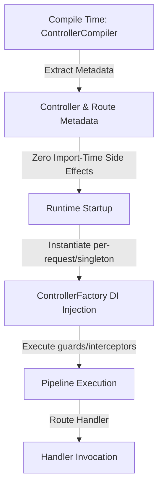
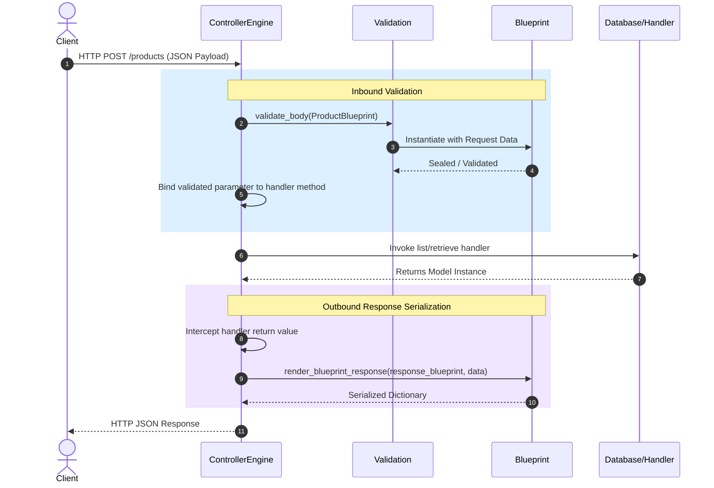

## 1. Controller Mental Model

Aquilia replaces traditional function-based flow handlers with class-based **Controllers**. They are designed under a manifest-first, dependency-injection-first, and pipeline-first philosophy.



### Class-Based & Manifest-First
Instead of dynamically registering routes at import time via side-effecting decorators, Controllers declare route structures statically.
* **Manifest-First**: Controllers are explicitly declared in the `module.aq` manifest.
* **Zero Side Effects**: Importing a controller module has no runtime registration side effects. Routing layouts are resolved at build/compile time.
* **Implementation**: The base [Controller](file:///Users/kuroyami/TuboxLabProject/aquilia-docs/aquilia/controller/base.py#L497-L662) class provides standard lifecycle hooks such as `on_startup`, `on_shutdown`, `on_request`, and `on_response` for request-lifecycle middleware.

### DI-First (Dependency Injection)
Controllers do not manually instantiate their repositories, database connections, or downstream clients. Instead, dependencies are declared via constructor parameters and resolved dynamically.
* **Dynamic Resolution**: At runtime, [ControllerFactory](file:///Users/kuroyami/TuboxLabProject/aquilia-docs/aquilia/controller/factory.py#L24-L402) inspects constructor signatures and method parameters, extracting dependencies from the request/app containers.
* **Instantiation Modes**: Supports both `singleton` and `per-request` instantiation.

An example of class-based DI and routing is shown in [aquilia/controller/\_\_init\_\_.py:L18-32](file:///Users/kuroyami/TuboxLabProject/aquilia-docs/aquilia/controller/__init__.py#L18-L32):

```python
class UsersController(Controller):
    prefix = "/users"
    pipeline = [Auth.guard()]

    def __init__(self, repo: Annotated[UserRepo, Inject(tag="repo")]):
        self.repo = repo

    @GET("/")
    async def list(self, ctx):
        return self.repo.list_all()
```

### Pipeline-First
Controllers support hierarchical, multi-stage request processing pipelines. You can define middleware (such as authentication, logging, and rate-limiting) at both the controller class level and individual route method levels.
* **Orchestration**: The pipeline is handled by `_execute_flow_pipeline` in [aquilia/controller/engine.py:L572-665](file:///Users/kuroyami/TuboxLabProject/aquilia-docs/aquilia/controller/engine.py#L572-L665).
* **Guards & Interceptors**: Exception filters and interceptors run sequentially before executing the endpoint, handling errors and cross-cutting concerns declaratively.

### Static-First (Metadata Extraction)
Routing structures, parameter annotations, and OpenAPI schemas are extracted statically before runtime.
* **Compiler**: [ControllerCompiler](file:///Users/kuroyami/TuboxLabProject/aquilia-docs/aquilia/controller/compiler.py#L72-L611) parses route definitions and validates the route tree.
* **Metadata**: Parameter and route schemas are gathered via `extract_controller_metadata` in [aquilia/controller/metadata.py:L74](file:///Users/kuroyami/TuboxLabProject/aquilia-docs/aquilia/controller/__init__.py#L74) to generate OpenAPI specifications without executing code.

---

## 2. Blueprint Mental Model

A **Blueprint** is not a simple JSON serializer or parser. Instead, it is a **model-to-world contract**. It specifies exactly what database fields are visible, how data enters the application, how constraints are enforced, and how changes are persisted back to the database.

```
       INBOUND FLOW (Write)                   OUTBOUND FLOW (Read)
 ┌──────────────────────────────┐       ┌──────────────────────────────┐
 │     Raw Input Dictionary     │       │     Database Model Class     │
 └──────────────┬───────────────┘       └──────────────┬───────────────┘
                │ (Cast/Coerce)                        │ (Extract Facets)
                ▼                                      ▼
 ┌──────────────────────────────┐       ┌──────────────────────────────┐
 │      Cast Data & Types       │       │    Apply Named Projection    │
 └──────────────┬───────────────┘       └──────────────┬───────────────┘
                │ (Seal/Validate)                      │ (Format Output)
                ▼                                      ▼
 ┌──────────────────────────────┐       ┌──────────────────────────────┐
 │    Sealed Integrity Check    │       │     Serialized JSON Dict     │
 └──────────────┬───────────────┘       └──────────────────────────────┘
                │ (Imprint)
                ▼
 ┌──────────────────────────────┐
 │  Updated Model (DB Persist)  │
 └──────────────────────────────┘
```

The core responsibilities of a Blueprint cover the following pipeline phases (see [aquilia/blueprints/\_\_init\_\_.py:L4-7](file:///Users/kuroyami/TuboxLabProject/aquilia-docs/aquilia/blueprints/__init__.py#L4-L7)):

### Facets (Attributes & Visibility)
Facets represent individual fields mapped from database columns to external endpoints. They declare type constraints, default values, write-only/read-only rules, and computed properties.
* **Base Class**: All fields inherit from `Facet` ([aquilia/blueprints/facets.py:L70](file:///Users/kuroyami/TuboxLabProject/aquilia-docs/aquilia/blueprints/__init__.py#L70)).
* **Special Facets**: Includes `Computed` (outbound values resolved via functions), `Constant`, `Hidden`, `ReadOnly`, and `WriteOnly`.

### Projections (Slices of Visibility)
Rather than writing multiple serializers for different endpoints, a single Blueprint defines multiple named **Projections** (subsets of fields) to reuse models across different views (e.g. `summary` vs `detail`).
* **Slicing**: Resolved via subscript notation on the Blueprint metaclass: `ProductBlueprint["summary"]` ([aquilia/blueprints/core.py:L609-624](file:///Users/kuroyami/TuboxLabProject/aquilia-docs/aquilia/blueprints/core.py#L609-L624)).

### Casts (Type Coercion)
Incoming request data is automatically coerced into appropriate Python types (e.g., parsing a string timestamp into a `datetime` object or verifying integers).
* **Validation Exceptions**: If casting fails, it throws a `CastFault` ([aquilia/blueprints/exceptions.py:L62-79](file:///Users/kuroyami/TuboxLabProject/aquilia-docs/aquilia/blueprints/core.py#L45)).

### Seals (Integrity Enforcement)
Sealing validates that the input payload adheres to business rules, database constraints, and field permissions. 
* **State Check**: Once a payload is validated without errors, the blueprint is marked as "sealed".
* **Methods**: `is_sealed` and `is_sealed_async` ([aquilia/blueprints/core.py:L1014-1179](file:///Users/kuroyami/TuboxLabProject/aquilia-docs/aquilia/blueprints/core.py#L1014-L1179)) run the validation constraints, returning boolean statuses and capturing failures.

### Imprints (Persistence)
Once a blueprint is successfully sealed, it imprints the parsed payload back into actual database models.
* **Operations**: `imprint(self, instance)` handles both creating new database models (`_imprint_create`) and partially updating existing records (`_imprint_update`) ([aquilia/blueprints/core.py:L1287-1380](file:///Users/kuroyami/TuboxLabProject/aquilia-docs/aquilia/blueprints/core.py#L1287-L1380)).

!!! info
    **Key Takeaway**: A Blueprint represents a **unified data contract**. It handles both reading from the database (outbound projections) and writing to the database (inbound validations and updates).


---

## 3. Connecting Controllers & Blueprints

Controllers and Blueprints connect at the route level to automate inbound request validation and outbound response serialization.



### Inbound Flow: Parameter Binding & Request Validation
When a route handler parameter is annotated with a Blueprint, Aquilia intercepts the request body and enforces the contract before invoking the controller method.

1. **Annotation Detection**: During compilation, [ControllerEngine](file:///Users/kuroyami/TuboxLabProject/aquilia-docs/aquilia/controller/engine.py) uses `_is_blueprint_type` ([aquilia/controller/metadata.py:L477-494](file:///Users/kuroyami/TuboxLabProject/aquilia-docs/aquilia/controller/metadata.py#L477-L494)) to detect if a method parameter expects a Blueprint.
2. **Body Validation**: The engine invokes `validate_body` ([aquilia/controller/validation.py:L50-122](file:///Users/kuroyami/TuboxLabProject/aquilia-docs/aquilia/controller/validation.py#L50-L122)) during `_bind_parameters` ([aquilia/controller/engine.py:L647-1154](file:///Users/kuroyami/TuboxLabProject/aquilia-docs/aquilia/controller/engine.py#L647-L1154)).
3. **Request Binding**: Under the hood, `bind_blueprint_to_request` ([aquilia/blueprints/integration.py:L298-538](file:///Users/kuroyami/TuboxLabProject/aquilia-docs/aquilia/blueprints/integration.py#L298-L538)) extracts the JSON body, cookies, query parameters, or form data, parsing and building a sealed blueprint instance injected directly into the handler.

### Outbound Flow: Response Formatting
To return database instances securely, you declare a `response_blueprint` on the route decorator.

1. **Intercepting Output**: The controller engine intercepts the raw return value of your handler function.
2. **Applying Blueprints**: The method `_apply_response_blueprint` in [aquilia/controller/engine.py:L1207-1242](file:///Users/kuroyami/TuboxLabProject/aquilia-docs/aquilia/controller/engine.py#L1207-L1242) maps the output.
3. **Serialization**: It delegates to `render_blueprint_response` in [aquilia/blueprints/integration.py:L541-581](file:///Users/kuroyami/TuboxLabProject/aquilia-docs/aquilia/blueprints/integration.py#L541-L581), which dynamically applies the projection, filters hidden fields, formats types, and renders a clean JSON payload.

### Connection Example
The following snippet showcases how both request body validation and response projection connect seamlessly:

```python
from aquilia import Controller, POST, GET
from aquilia.blueprints import Blueprint
from app.models import Product

class ProductBlueprint(Blueprint):
    class Spec:
        model = Product
        projections = {
            "summary": ["id", "title", "price"],
            "detail": "__all__"
        }

class ProductController(Controller):
    # Outbound: Serialize list output using the "summary" projection contract
    @GET("/", response_blueprint=ProductBlueprint["summary"])
    async def list_products(self, ctx):
        return await Product.objects.all()

    # Inbound: Validate incoming request body directly via ProductBlueprint
    @POST("/")
    async def create_product(self, ctx, payload: ProductBlueprint):
        # The payload is already cast, validated, and sealed at this point!
        product = await payload.imprint()
        return {"id": product.id, "status": "created"}
```
