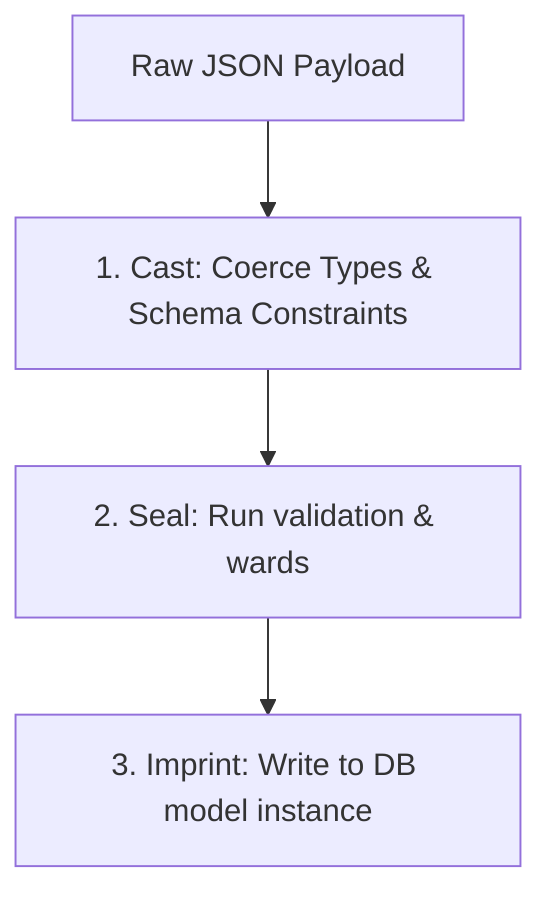

## Prerequisites

Before starting, ensure you have:
- Python 3.10 or higher installed.
- A basic understanding of `async`/`await` in Python.
- Aquilia installed in your local Python environment.

---

## What We're Building

We are building a robust Product Catalog API. The system exposes the following REST endpoints:

| Method | Endpoint | Description |
| :--- | :--- | :--- |
| `GET` | `/products` | List products (with pagination, filtering, and summary view) |
| `GET` | `/products/{id}` | Retrieve details of a single product (with full view and computed fields) |
| `POST` | `/products` | Create a new product (handles request casting, validation, and imprinting) |
| `PUT` | `/products/{id}` | Update an existing product (partial save) |
| `DELETE` | `/products/{id}` | Delete a product |

---

## Step 1: Define `ProductBlueprint`

A **Blueprint** is a first-class primitive in Aquilia that acts as a contract between your database models and the outside world. It governs both inbound data handling (casting, sealing, and imprinting) and outbound serialization (molding).

!!! info
    📎 [core.py:L826](file:///Users/kuroyami/TuboxLabProject/aquilia-docs/aquilia/blueprints/core.py#L826)


First, let's assume a basic `Product` database model is declared in your application (using Aquilia's ORM or an integrated ORM):

```python
# models.py
from aquilia.db import Model, fields

class Product(Model):
    id = fields.IntField(pk=True)
    name = fields.CharField(max_length=255)
    description = fields.TextField()
    price = fields.DecimalField(max_digits=10, decimal_places=2)
    stock = fields.IntField()
    category = fields.CharField(max_length=100)
```

Now, define your `ProductBlueprint` with field-level facets:

```python
# blueprints.py
from aquilia.blueprints import Blueprint
from aquilia.blueprints.facets import TextFacet, IntFacet, DecimalFacet, Computed
from models import Product

class ProductBlueprint(Blueprint):
    class Spec:
        model = Product
        fields = ["id", "name", "description", "price", "stock", "category"]
        projections = {
            "summary": ["id", "name", "price"],
            "detail": "__all__"
        }
        default_projection = "detail"

    # Define facets with explicit constraints
    name = TextFacet(required=True, min_length=3, max_length=100)
    description = TextFacet(required=False, default="")
    price = DecimalFacet(required=True, max_digits=10, decimal_places=2)
    stock = IntFacet(required=True, min_value=0)
    category = TextFacet(required=True)
    
    # A Computed facet is dynamically resolved during response serialization
    discounted_price = Computed("get_discounted_price")

    def get_discounted_price(self, product) -> str:
        """Applies a 10% discount to products priced over $100."""
        price = product.price
        if price > 100:
            return f"${(price * 0.9):.2f}"
        return f"${price:.2f}"
```

### Explaining the Mechanics

1. **`Spec` Configuration**: Configurations are declared in the inner `Spec` class. 
   !!! warning
    Always name this inner class `Spec`. Using the traditional name `Meta` will raise a `BlueprintFault` during class compilation.
    📎 [core.py:L305-309](file:///Users/kuroyami/TuboxLabProject/aquilia-docs/aquilia/blueprints/core.py#L305-L309)

2. **Projections**: Slicing the blueprint via subscript syntax (e.g., `ProductBlueprint["summary"]`) extracts a restricted projection containing only selected facets. 
   📎 [core.py:L609-L624](file:///Users/kuroyami/TuboxLabProject/aquilia-docs/aquilia/blueprints/core.py#L609-L624)
3. **`DecimalFacet`**: Used for exact-precision currency representations to prevent float conversion rounding errors. 
   📎 [facets.py:L729-L784](file:///Users/kuroyami/TuboxLabProject/aquilia-docs/aquilia/blueprints/facets.py#L729-L784)
4. **`Computed`**: A read-only facet populated on outbound rendering by calling a method on the blueprint or model. 
   📎 [facets.py:L1522-L1580](file:///Users/kuroyami/TuboxLabProject/aquilia-docs/aquilia/blueprints/facets.py#L1522-L1580)

---

## Step 2: Define `ProductsController`

Controllers provide a structured, class-based approach to request routing. Create a file named `controllers.py` and register the routing prefix:

```python
# controllers.py
from aquilia import Controller

class ProductsController(Controller):
    prefix = "/products"
    tags = ["products"]
```

!!! info
    📎 [base.py:L497](file:///Users/kuroyami/TuboxLabProject/aquilia-docs/aquilia/controller/base.py#L497)


The `prefix = "/products"` attribute prepends `/products` to all endpoint routes declared within this controller.

---

## Step 3: List Endpoint (GET `/`)

To retrieve a list of products, append a handler to your controller class. We'll use the subscript reference `ProductBlueprint["summary"]` to restrict the returned output to a concise format (showing only `id`, `name`, and `price`):

```python
# controllers.py (continued)
from aquilia import GET
from models import Product
from blueprints import ProductBlueprint

class ProductsController(Controller):
    prefix = "/products"
    tags = ["products"]

    @GET("/", response_blueprint=ProductBlueprint["summary"])
    async def list_products(self, ctx):
        """List all products in the catalog."""
        products = await Product.objects.all()
        return products
```

!!! info
    By passing `ProductBlueprint["summary"]` to `response_blueprint`, the framework automatically filters write-only fields and structures the response payload to match the `"summary"` projection.
    📎 [http-decorators.mdx](../controller/http-decorators.md#L75-L77)


---

## Step 4: Retrieve Endpoint (GET `/{id:int}`)

To retrieve detailed info about a single product, bind the route parameter `id` as an integer:

```python
# controllers.py (continued)

    @GET("/{id:int}", response_blueprint=ProductBlueprint["detail"])
    async def retrieve_product(self, ctx, id: int):
        """Retrieve full details of a single product."""
        try:
            product = await Product.objects.get(id=id)
            return product
        except Product.DoesNotExist:
            return Response.json({"error": "Product not found"}, status=404)
```

The retrieve endpoint uses `ProductBlueprint["detail"]` (which resolves to `__all__` fields plus the computed `discounted_price` facet).

---

## Step 5: Create Endpoint (POST `/`)

For creation, we accept the request body, validate it against our blueprint schema, and save it to the database. This showcases the core inbound flow: **Cast → Seal → Imprint**.



### The Explicit Inbound Lifecycle

When processing inbound payloads:
1. **Cast**: Raw request data is passed into the blueprint. Simple coercion is applied (e.g., matching string numbers to integers/decimals). 
   📎 [core.py:L1083-L1090](file:///Users/kuroyami/TuboxLabProject/aquilia-docs/aquilia/blueprints/core.py#L1083-L1090)
2. **Seal**: Synchronous and asynchronous validation gates verify the coerced values. Calling `bp.is_sealed()` triggers this validation and seals the data container. 
   📎 [core.py:L1014](file:///Users/kuroyami/TuboxLabProject/aquilia-docs/aquilia/blueprints/core.py#L1014)
3. **Imprint**: The sealed blueprint applies changes to the underlying model. Calling `await bp.imprint()` instantiates a new model and writes it to the database. 
   📎 [core.py:L1287](file:///Users/kuroyami/TuboxLabProject/aquilia-docs/aquilia/blueprints/core.py#L1287)

Here is how to implement the endpoint:

```python
# controllers.py (continued)
from aquilia import POST, Response

    @POST("/", status_code=201, response_blueprint=ProductBlueprint["detail"])
    async def create_product(self, ctx):
        """Create a new product."""
        # Retrieve the raw JSON payload
        payload = await ctx.json()
        
        # 1. Cast
        bp = ProductBlueprint(data=payload)
        
        # 2. Seal (Validation check)
        if not bp.is_sealed():
            return Response.json({"errors": bp.errors}, status=400)
            
        # 3. Imprint (Persistence)
        product = await bp.imprint()
        return product
```

---

## Step 6: Update Endpoint (PUT `/{id:int}`)

Updates require binding both the incoming payload and the existing model instance to the blueprint before calling `imprint`. This triggers an update path (`_imprint_update`) rather than a creation path:

```python
# controllers.py (continued)
from aquilia import PUT

    @PUT("/{id:int}", response_blueprint=ProductBlueprint["detail"])
    async def update_product(self, ctx, id: int):
        """Update an existing product."""
        try:
            product = await Product.objects.get(id=id)
        except Product.DoesNotExist:
            return Response.json({"error": "Product not found"}, status=404)
            
        payload = await ctx.json()
        
        # Bind the payload to the existing model instance
        bp = ProductBlueprint(data=payload, instance=product)
        
        if not bp.is_sealed():
            return Response.json({"errors": bp.errors}, status=400)
            
        # Imprint modifies changed fields and triggers a partial database save
        updated_product = await bp.imprint()
        return updated_product
```

!!! info
    By binding the model instance (`instance=product`), `bp.imprint()` automatically invokes `_imprint_update` to update modified fields on the database model.
    📎 [core.py:L1362-1380](file:///Users/kuroyami/TuboxLabProject/aquilia-docs/aquilia/blueprints/core.py#L1362-L1380)


---

## Step 7: Delete Endpoint (DELETE `/{id:int}`)

To delete a record, find the database record and delete it. We return a `204 No Content` status code:

```python
# controllers.py (continued)
from aquilia import DELETE

    @DELETE("/{id:int}", status_code=204)
    async def delete_product(self, ctx, id: int):
        """Delete a product from the catalog."""
        try:
            product = await Product.objects.get(id=id)
            await product.delete()
            return None
        except Product.DoesNotExist:
            return Response.json({"error": "Product not found"}, status=404)
```

---

## Step 8: Add Pagination and Filtering

To make our List endpoint production-ready, we'll add search capabilities, category-filtering, price ranges, and page-number pagination.

First, define a `FilterSet` class in your code:

```python
# filters.py
from aquilia.controller.filters import FilterSet
from models import Product

class ProductFilter(FilterSet):
    class Meta:
        model = Product
        fields = {
            "category": ["exact"],
            "price": ["exact", "gte", "lte", "range"],
        }
```

Now, update the `list_products` route decorator on the controller to include the `FilterSet` and `PageNumberPagination`:

```python
# controllers.py (updated list endpoint)
from aquilia.controller.pagination import PageNumberPagination
from filters import ProductFilter

    @GET(
        "/",
        filterset_class=ProductFilter,
        search_fields=["name", "description"],
        ordering_fields=["price", "id"],
        pagination_class=PageNumberPagination,
        response_blueprint=ProductBlueprint["summary"]
    )
    async def list_products(self, ctx):
        """List products with pagination, filtering, searching, and sorting."""
        products = await Product.objects.all()
        return products
```

### Supported Parameters
- **Pagination**: Use `?page=2` to navigate pages and `?page_size=10` to configure limit.
- **Filtering**: Use `?category=electronics` or `?price__range=10,100`.
- **Search**: Use `?search=phone` to search text fields (`name` or `description`).
- **Ordering**: Use `?ordering=price` (ascending) or `?ordering=-price` (descending).

---

## Step 9: Add Rate Limiting (Throttle)

Rate limiting secures your catalog against brute-force attacks and abuse. Add sliding-window rate limits to the entire controller:

```python
# controllers.py (adding controller throttling)
from aquilia import Throttle

class ProductsController(Controller):
    prefix = "/products"
    tags = ["products"]
    
    # Restrict clients to 60 requests per minute
    throttle = Throttle(limit=60, window=60)
```

!!! info
    The `Throttle` constructor accepts a request `limit` and sliding `window` in seconds. It automatically tracks IP addresses and clients.
    📎 [base.py:L355-460](file:///Users/kuroyami/TuboxLabProject/aquilia-docs/aquilia/controller/base.py#L355-L460)


For sensitive endpoints (like creating new products), you can override the class-level throttling directly on the route decorator:

```python
    @POST(
        "/", 
        status_code=201, 
        response_blueprint=ProductBlueprint["detail"],
        throttle=Throttle(limit=10, window=60) # Overrides class limit to 10 req/min
    )
    async def create_product(self, ctx):
        ...
```

---

## Step 10: Test via curl

Now that the controller is registered on your Aquilia server, you can test it locally using standard `curl` commands.

### 1. Create a Product
```bash
curl -X POST http://localhost:8000/products \
  -H "Content-Type: application/json" \
  -d '{
    "name": "Mechanical Keyboard",
    "description": "Ergonomic tactile mechanical keyboard",
    "price": "129.99",
    "stock": 45,
    "category": "peripherals"
  }'
```
**Response (`201 Created`):**
```json
{
  "id": 1,
  "name": "Mechanical Keyboard",
  "description": "Ergonomic tactile mechanical keyboard",
  "price": "129.99",
  "stock": 45,
  "category": "peripherals",
  "discounted_price": "$116.99"
}
```
*(Notice the computed `discounted_price` applying the 10% discount because the price exceeds $100).*

### 2. Validation Failures
Sending an invalid request (e.g. name too short, negative stock):
```bash
curl -X POST http://localhost:8000/products \
  -H "Content-Type: application/json" \
  -d '{
    "name": "ab",
    "price": "15.00",
    "stock": -5,
    "category": "peripherals"
  }'
```
**Response (`400 Bad Request`):**
```json
{
  "errors": {
    "name": "Ensure this value has at least 3 characters.",
    "stock": "Ensure this value is greater than or equal to 0."
  }
}
```

### 3. List Products (With Filter and Search)
Retrieve products in the `peripherals` category, sorted by price (descending):
```bash
curl "http://localhost:8000/products?category=peripherals&search=Keyboard&ordering=-price"
```
**Response (`200 OK`):**
```json
{
  "count": 1,
  "next": null,
  "previous": null,
  "results": [
    {
      "id": 1,
      "name": "Mechanical Keyboard",
      "price": "129.99"
    }
  ]
}
```
*(Notice the result returns the `"summary"` projection format: only `id`, `name`, and `price` are serialized).*

### 4. Update a Product
```bash
curl -X PUT http://localhost:8000/products/1 \
  -H "Content-Type: application/json" \
  -d '{
    "name": "RGB Mechanical Keyboard",
    "description": "Tactile mechanical keyboard with customizable RGB backlighting",
    "price": "149.99",
    "stock": 30,
    "category": "peripherals"
  }'
```

### 5. Rate Limit Triggered
Making more than 10 requests inside a 60-second window to create products triggers the throttle limit:
```bash
# After exceeding limit
curl -X POST http://localhost:8000/products ...
```
**Response (`429 Too Many Requests`):**
```json
{
  "error": "Request limit exceeded. Please try again later."
}
```
