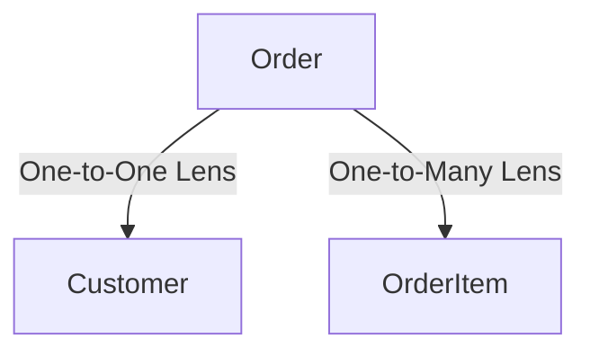

## Scenario: The E-Commerce Order System

We will build a nested serialization setup for an e-commerce order system with the following relationship graph:



Our database models are defined as follows:
- **`Customer`**: A user with `id`, `name`, and a sensitive `email` address.
- **`OrderItem`**: A line item on an order, consisting of `id`, `product_name`, `quantity`, and `price`.
- **`Order`**: The root transaction record, containing `id`, `created_at`, a customer relationship, and a collection of order items.

---

## Step 1: Define the CustomerBlueprint

First, we will define a blueprint for the `Customer` model. We want to expose the customer's ID and name publicly, but restrict access to their email address unless explicitly requested (e.g., in a detail or admin view).

To do this, we configure named **projections** inside the inner `Spec` class ([projections.py:L30-38](file:///Users/kuroyami/TuboxLabProject/aquilia-docs/aquilia/blueprints/projections.py#L30-L38)):

```python
from aquilia.blueprints import Blueprint

class CustomerBlueprint(Blueprint):
    class Spec:
        model = Customer
        # Define named subsets of facets
        projections = {
            "public": ["id", "name"],
            "detail": "__all__"  # Resolves to all non-write-only facets (projections.py:L42)
        }
        # Fall back to "public" if no projection is explicitly requested
        default_projection = "public"

    id: int
    name: str
    email: str
```

!!! info
    By using `default_projection = "public"`, any serialization of a customer instance via `CustomerBlueprint` will automatically exclude the `email` field unless the `"detail"` projection is explicitly selected ([projections.py:L109](file:///Users/kuroyami/TuboxLabProject/aquilia-docs/aquilia/blueprints/projections.py#L109)).


---

## Step 2: Define the OrderItemBlueprint

Next, we define the `OrderItemBlueprint`. This represents the line items stored in our database.

```python
from aquilia.blueprints import Blueprint

class OrderItemBlueprint(Blueprint):
    class Spec:
        model = OrderItem
        fields = ["id", "product_name", "quantity", "price"]

    id: int
    product_name: str
    quantity: int
    price: float
```

---

## Step 3: Define the OrderBlueprint with Lenses

Now, we define our root `OrderBlueprint`. To embed the customer details and the collection of order items, we use the `Lens` facet ([lenses.py:L26](file:///Users/kuroyami/TuboxLabProject/aquilia-docs/aquilia/blueprints/lenses.py#L26)).

A `Lens` acts as an optical focus on related data. It can target a raw `Blueprint` or a subscripted projection class:

```python
from aquilia.blueprints import Blueprint
from aquilia.blueprints.lenses import Lens
from myapp.blueprints import CustomerBlueprint, OrderItemBlueprint

class OrderBlueprint(Blueprint):
    class Spec:
        model = Order
        projections = {
            "summary": ["id", "created_at", "customer"],
            "detail": "__all__"  # Includes customer and items
        }
        default_projection = "summary"

    id: int
    created_at: str

    # 1. One-to-One: Target a specific subscripted projection
    customer = Lens(CustomerBlueprint["public"], source="customer")

    # 2. One-to-Many: Serialize a collection using many=True
    items = Lens(OrderItemBlueprint, many=True, source="order_items")
```

Let's break down the `Lens` configuration:
- **`CustomerBlueprint["public"]`**: By subscripting `CustomerBlueprint` with `"public"`, we create a `_ProjectedRef` ([lenses.py:L187-201](file:///Users/kuroyami/TuboxLabProject/aquilia-docs/aquilia/blueprints/lenses.py#L187-L201)). The lens automatically extracts this and configures the nested customer data to strictly use the public projection ([lenses.py:L65-70](file:///Users/kuroyami/TuboxLabProject/aquilia-docs/aquilia/blueprints/lenses.py#L65-L70)).
- **`OrderItemBlueprint` & `many=True`**: When `many=True` is provided, the lens expects an iterable sequence of records and runs the molding logic on each record ([lenses.py:L56](file:///Users/kuroyami/TuboxLabProject/aquilia-docs/aquilia/blueprints/lenses.py#L56)).
- **`source`**: The model attribute path to extract the relation data from ([lenses.py:L59](file:///Users/kuroyami/TuboxLabProject/aquilia-docs/aquilia/blueprints/lenses.py#L59)). If omitted, Aquilia's `bind()` method will attempt to auto-resolve relationship field mappings directly from the database model specs ([lenses.py:L79-91](file:///Users/kuroyami/TuboxLabProject/aquilia-docs/aquilia/blueprints/lenses.py#L79-L91)).

---

## Step 4: ProjectionRegistry — Summary vs. Detail

Every `Blueprint` class is backed by a `ProjectionRegistry` ([projections.py:L26-28](file:///Users/kuroyami/TuboxLabProject/aquilia-docs/aquilia/blueprints/projections.py#L26-L28)). The registry compiles the projection definitions during class construction ([projections.py:L58-109](file:///Users/kuroyami/TuboxLabProject/aquilia-docs/aquilia/blueprints/projections.py#L58-L109)).

When serializing an instance via `.data` or `to_dict()`, the active projection resolves to a frozen set of facet names ([projections.py:L111-132](file:///Users/kuroyami/TuboxLabProject/aquilia-docs/aquilia/blueprints/projections.py#L111-L132)), controlling which attributes are included:

1. **`summary` Projection**: Includes only `"id"`, `"created_at"`, and `"customer"`. Because `"items"` is excluded, the related order items query will never be evaluated, saving bandwidth and database overhead.
2. **`detail` Projection**: Resolves to `"__all__"` (non-write-only facets), which includes `"id"`, `"created_at"`, `"customer"`, and `"items"`.

```python
# Outbound Flow Execution (core.py:L943-998)
order_summary = OrderBlueprint(instance=order_model, projection="summary")
print(order_summary.data)
# Output:
# {
#   "id": 1001,
#   "created_at": "2026-07-02T12:00:00Z",
#   "customer": {
#     "id": 42,
#     "name": "Alice"
#   }
# }

order_detail = OrderBlueprint(instance=order_model, projection="detail")
print(order_detail.data)
# Output:
# {
#   "id": 1001,
#   "created_at": "2026-07-02T12:00:00Z",
#   "customer": {
#     "id": 42,
#     "name": "Alice"
#   },
#   "items": [
#     {"id": 1, "product_name": "Mechanical Keyboard", "quantity": 1, "price": 120.0},
#     {"id": 2, "product_name": "USB-C Cable", "quantity": 2, "price": 15.0}
#   ]
# }
```

---

## Step 5: Route Customization with Subscript Syntax

To select specific projections at the route/API boundary, you can subscript the `Blueprint` class directly (e.g., `OrderBlueprint["detail"]`).

This invokes `BlueprintMeta.__getitem__` under the hood, returning a `_ProjectedRef` ([core.py:L609-624](file:///Users/kuroyami/TuboxLabProject/aquilia-docs/aquilia/blueprints/core.py#L609-L624)). Aquilia routers recognize this reference and automatically apply the requested projection:

```python
from myapp.models import Order
from myapp.blueprints import OrderBlueprint

# Expose summary details on the list endpoint
@router.get("/orders", response_blueprint=OrderBlueprint["summary"])
async def list_orders():
    return await Order.objects.all()

# Expose full nested details on the detail endpoint
@router.get("/orders/{id}", response_blueprint=OrderBlueprint["detail"])
async def get_order(id: int):
    return await Order.objects.get(id=id)
```

---

## Step 6: Understanding Depth Control

When nesting resources, you want to prevent payload bloat. For example, if a customer lens resolves customer details, and a customer has a lens pointing to all past orders, you could end up serializing the entire database.

To prevent this, Lenses enforce a **depth limit** (configured via `depth`, defaulting to `3`) ([lenses.py:L57](file:///Users/kuroyami/TuboxLabProject/aquilia-docs/aquilia/blueprints/lenses.py#L57)).

During outbound serialization, the engine passes an incrementing `_depth` counter ([lenses.py:L93](file:///Users/kuroyami/TuboxLabProject/aquilia-docs/aquilia/blueprints/lenses.py#L93)). Once `_depth >= self.max_depth`, resolution halts and falls back to primary key extraction using `_pk_fallback()` ([lenses.py:L118-122](file:///Users/kuroyami/TuboxLabProject/aquilia-docs/aquilia/blueprints/lenses.py#L118-L122)):

```python
# Behind the scenes in lenses.py:
if _depth >= self.max_depth:
    if self.many:
        return [self._pk_fallback(item) for item in value]
    return self._pk_fallback(value)
```

### Depth Control Example

Let's modify `OrderItemBlueprint` to include a relationship back to its parent `Order`:

```python
class OrderItemBlueprint(Blueprint):
    id: int
    product_name: str
    # Target OrderBlueprint with depth limit of 1
    order = Lens(lambda: OrderBlueprint, depth=1)
```

If we serialize the order item:
- **`_depth = 0`**: Serializing `OrderItemBlueprint`.
- **`_depth = 1`**: Entering the `order` Lens. Since `_depth >= self.max_depth` (1 >= 1), the engine executes `_pk_fallback(order_instance)`, returning just the integer `1001` (the primary key) instead of nesting another layer of `OrderBlueprint` data ([lenses.py:L118-122](file:///Users/kuroyami/TuboxLabProject/aquilia-docs/aquilia/blueprints/lenses.py#L118-L122)).

---

## Step 7: Cycle Detection

What happens if resources reference each other cyclicly? For example:
- `OrderBlueprint` references `CustomerBlueprint`
- `CustomerBlueprint` references `OrderBlueprint`

If recursion depth was set high enough, or if depth wasn't checked, this would trigger a stack overflow. Aquilia prevents this at runtime using **Cycle Detection** ([lenses.py:L109-115](file:///Users/kuroyami/TuboxLabProject/aquilia-docs/aquilia/blueprints/lenses.py#L109-L115)).

### How it works:
1. The `mold()` method tracks traversed Blueprint class identities via a `_seen` set ([lenses.py:L93](file:///Users/kuroyami/TuboxLabProject/aquilia-docs/aquilia/blueprints/lenses.py#L93)).
2. Prior to descending, it checks if the target Blueprint class identity is in the set: `target_id = id(self._target_cls)` ([lenses.py:L109](file:///Users/kuroyami/TuboxLabProject/aquilia-docs/aquilia/blueprints/lenses.py#L109)).
3. If `target_id` exists in `_seen`, the engine immediately aborts and raises a `LensCycleFault` ([lenses.py:L110-115](file:///Users/kuroyami/TuboxLabProject/aquilia-docs/aquilia/blueprints/lenses.py#L110-L115)):

```python
# Behind the scenes in lenses.py:
if target_id in _seen:
    raise LensCycleFault(
        [cls.__name__ for cls in _seen] + [self._target_cls.__name__]
    )
```

4. If no cycle is detected, the target class ID is added to the set and passed to the next resolution level: `new_seen = _seen | {target_id}` ([lenses.py:L124](file:///Users/kuroyami/TuboxLabProject/aquilia-docs/aquilia/blueprints/lenses.py#L124)).

This safeguards your serialization routes against infinite loops and complex cyclic structures.

!!! warning
    If you encounter a `LensCycleFault` during development, examine your nested Lenses. Ensure you break circular dependencies by setting `depth=1` on one of the opposing relationship boundaries (or omitting the Lens target class entirely to force primary key fallback).

