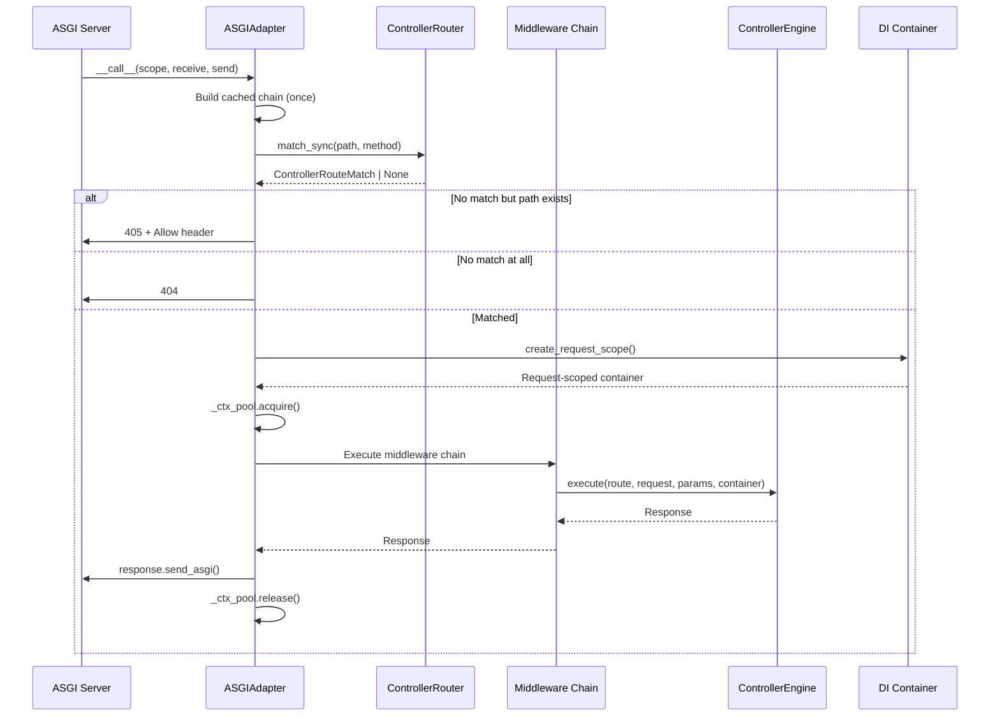
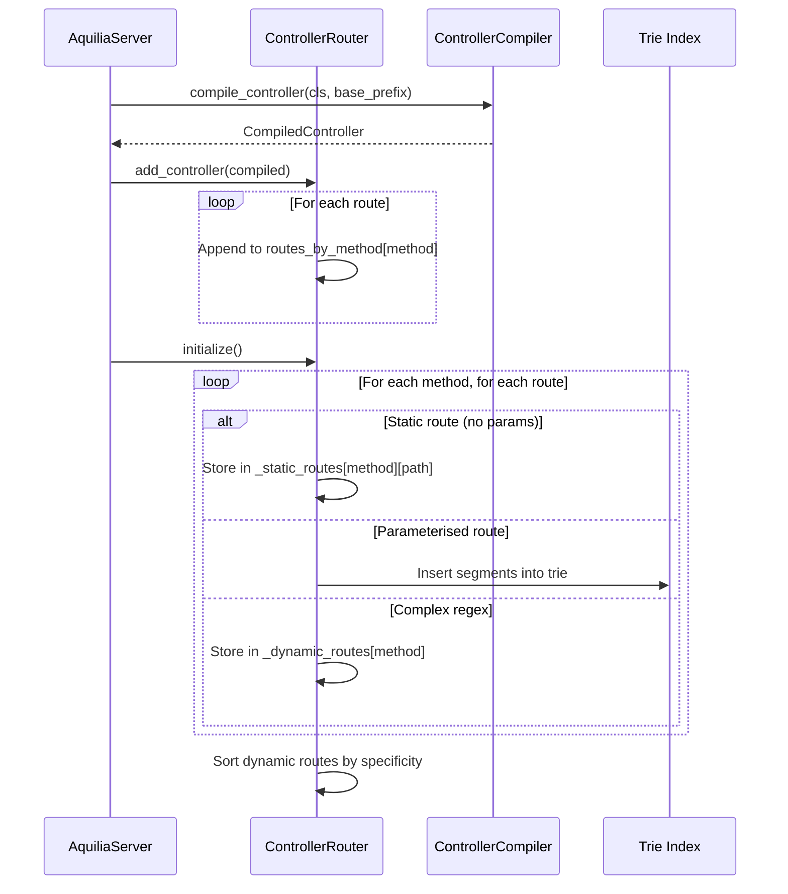
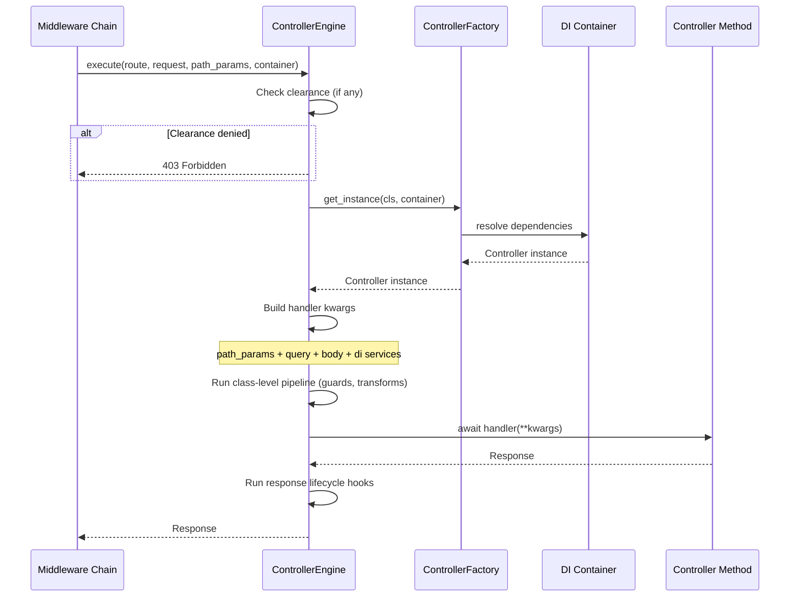
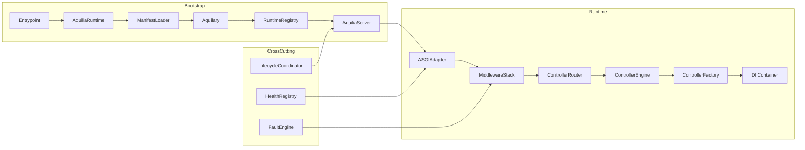

# Architectural Components

This page details every architectural component in Aquilia — its responsibilities, internal structure, and interactions with other components.

---

## ASGIAdapter

**File:** `aquilia/asgi.py:35`  
**Role:** Bridges the ASGI protocol to Aquilia's typed request/response system.

```python
class ASGIAdapter:
    __slots__ = (
        "controller_router", "controller_engine",
        "middleware_stack", "server", "socket_runtime",
        "logger", "_cached_middleware_chain",
        "_default_container", "_debug",
        "_has_routes_cache", "_server_runtime",
    )
```

### Responsibilities

- **Protocol dispatch:** Routes ASGI `scope["type"]` to the appropriate handler — `handle_http`, `handle_websocket`, or `handle_lifespan`.
- **Built-in health endpoint:** Serves `GET /_health` returning liveness probes and engine metrics (in-flight requests, total requests, mean latency). Security headers (`no-store`, `nosniff`, `X-Frame-Options: DENY`) are applied even though this endpoint bypasses the middleware stack.
- **Middleware chain caching:** The full middleware chain is built once during the first request and cached in `_cached_middleware_chain` for subsequent requests.
- **Route matching:** Uses `ControllerRouter.match_sync()` for synchronous path-to-handler resolution. Supports `HEAD` auto-fallback (HTTP/1.1 §9.4) and returns `405 Method Not Allowed` with an `Allow` header when a path exists but the method is not supported.
- **DI container resolution:** Resolves the correct app-scoped DI container based on the matched route's `app_name`, then creates a per-request scope.
- **RequestCtx pooling:** Acquires `RequestCtx` from an object pool (`_ctx_pool.acquire()`) to avoid per-request allocation, and releases it back after the response is sent.
- **Version pre-resolution:** Before middleware execution, the adapter pre-resolves the API version from the URL path to enable route matching that depends on versioned paths (e.g., `/v2/users`).
- **Graceful error recovery:** Catches critical exceptions in the pipeline, renders HTML error pages in debug mode (`render_debug_exception_page`), and returns structured JSON errors in production.

### Request Flow



### Lifespan Management

```python
async def handle_lifespan(self, scope, receive, send):
    while True:
        message = await receive()
        if message["type"] == "lifespan.startup":
            await self.server.startup()
            await send({"type": "lifespan.startup.complete"})
        elif message["type"] == "lifespan.shutdown":
            await self.server.shutdown()
            await send({"type": "lifespan.shutdown.complete"})
            break
```

On startup, the adapter invalidates all internal caches (`_cached_middleware_chain`, `_default_container`, etc.) so that the server's fully initialised state is reflected. It handles `DatabaseNotReadyError` (a `SystemExit` subclass) gracefully by completing the lifespan handshake with a warning.

---

## AquiliaServer

**File:** `aquilia/server.py:50`  
**Role:** Main orchestrator — owns all subsystems, middleware, controllers, and the ASGI adapter.

```python
class AquiliaServer:
    def __init__(
        self,
        manifests: ManifestCollection | None = None,
        config: ConfigLoader | None = None,
        mode: RegistryMode = RegistryMode.PROD,
        aquilary_registry: AquilaryRegistry | None = None,
        workspace_modules: dict | None = None,
    )
```

### Architecture

```
Manifests → Aquilary → RuntimeRegistry → Controllers → ASGI
```

### Initialisation Sequence

1. **Signing bootstrap:** Configures the `aquilia.signing` engine from config or environment (`AQ_SECRET_KEY`, `SECRET_KEY`), with insecure dev fallback and fallback secrets for key rotation.

2. **Health registry:** Creates a `HealthRegistry` for centralised subsystem health tracking.

3. **Fault engine:** Initialises `FaultEngine` with debug-aware defaults and patches all subsystems via `faults.integrations.patch_all_subsystems()`.

4. **Aquilary construction:** Builds `Aquilary` from manifests or uses a pre-built `AquilaryRegistry`. The `Aquilary` validates manifests, resolves dependencies, and produces `AppContext` objects.

5. **Runtime registry:** Creates `RuntimeRegistry.from_metadata()` which builds DI containers per app and compiles metadata. Services are registered immediately via `_register_services()`.

6. **DI wiring:** Registers `FaultEngine` and `EffectRegistry` as value providers in all DI containers.

7. **Lifecycle coordinator:** Creates `LifecycleCoordinator` for startup/shutdown hook orchestration in dependency order.

8. **Middleware setup:** `_setup_middleware()` — the most complex initialisation step — builds the full middleware stack:
    - **Internal (always):** `FaultMiddleware` (priority 2), `request_scope_mw` (priority 5)
    - **Config-driven or defaults:** `ExceptionMiddleware` (priority 1), `RequestIdMiddleware` (priority 10)
    - **Conditional subsystems:** Auth/Session (priority 15), CSRF (priority 20), I18n (priority 24), Templates (priority 25), Cache (priority 26)
    - **Security infrastructure:** ProxyFix (3), HTTPS redirect (4), Static files (6), Security headers/Helmet (7), HSTS (8), CSP (9), CORS (11), Rate limiting (12)
    - **Versioning:** `VersionMiddleware` (priority 5, aligned with request-scope)

9. **Subsystem initialisation:** Each optional subsystem is set up conditionally:
    - `_setup_mail()` — Creates `MailService` with provider auto-discovery
    - `_setup_cache()` — Creates `CacheService` with backend resolution (memory/Redis)
    - `_setup_storage()` — Creates `StorageRegistry` from backend configs
    - `_setup_i18n()` — Creates `I18nService` with locale resolver chain
    - `_setup_tasks()` — Creates `TaskManager` with `MemoryBackend`
    - `_setup_error_tracker()` — Wires admin error tracker to `FaultEngine`

10. **Controller components:** Creates `ControllerFactory`, `ControllerEngine`, and `ControllerCompiler`.

11. **WebSocket infrastructure:** Creates `SocketRouter` and `AquilaSockets` with an in-memory adapter and DI container factory for per-connection scopes.

12. **ASGI adapter:** Constructs `ASGIAdapter` with all components and a `server=self` back-reference for lifecycle callbacks.

### Subsystem Wiring (Example: Tasks)

```python
def _setup_tasks(self):
    tasks_config = self.config.get_tasks_config()
    if not tasks_config.get("enabled", False):
        self._task_manager = None
        return

    from .tasks import MemoryBackend, TaskManager
    backend = MemoryBackend()
    manager = TaskManager(
        backend=backend,
        num_workers=tasks_config.get("num_workers", 4),
        default_queue=tasks_config.get("default_queue", "default"),
    )
    self._task_manager = manager

    # Register in DI containers
    for container in self.runtime.di_containers.values():
        container.register(ValueProvider(
            value=manager, token=TaskManager, scope="app",
        ))

    # Wire dead-letter hook to FaultEngine
    manager.on_dead_letter(_task_dead_letter_fault)
```

### Startup and Shutdown

The server's `startup()` method (called during ASGI lifespan) orchestrates:

1. Controller loading (`_load_controllers`) — imports controller classes, compiles routes, validates the route tree, registers version bindings, loads OpenAPI/docs routes, wires admin integration.
2. Lifecycle hooks — runs `on_startup` callbacks in dependency order via `LifecycleCoordinator`.
3. Subsystem initialisation (async) — initialises cache backends, storage backends, mail providers.
4. Task manager startup — `await manager.start()`.
5. Health registry population — registers subsystem health checks.

`shutdown()` performs the reverse: graceful connection draining, task worker shutdown, lifecycle `on_shutdown` hooks, and DI container teardown.

---

## ControllerRouter

**File:** `aquilia/controller/router.py:66`  
**Role:** Pattern-based router for controller routes with a two-tier matching strategy.

```python
class ControllerRouter:
    def __init__(self):
        self.compiled_controllers: list[CompiledController]
        self.routes_by_method: dict[str, list[CompiledRoute]]
        self.matcher: PatternMatcher
        self._static_routes: dict[str, dict]    # {method: {path: route}}
        self._dynamic_routes: dict[str, list]   # {method: [(regex, route)]}
        self._tries: dict[str, _TrieNode]       # {method: radix trie}
```

### Two-Tier Matching

| Tier | Structure | Complexity | Use Case |
|------|-----------|------------|----------|
| Static | Hash map `{method: {path: route}}` | O(1) | Routes with no parameters (`/users`, `/health`) |
| Trie | Segment radix trie `{method: _TrieNode}` | O(k) where k = path depth | Parameterised routes (`/users/<id>`, `/posts/<slug:str>`) |
| Regex fallback | Compiled regex list | O(n) | Complex patterns the trie cannot represent |

### Trie Architecture

```python
class _TrieNode:
    __slots__ = ("children", "param_child", "param_name",
                 "param_castor", "route", "query_params")

    def __init__(self):
        self.children: dict[str, _TrieNode]     # static segment → child
        self.param_child: _TrieNode | None       # single param child
        self.param_name: str | None
        self.param_castor: Any | None            # type-cast function
        self.route: CompiledRoute | None         # terminal node
        self.query_params: dict | None
```

Each URL segment is a trie node. Static segments go into `children`, parameterised segments (`<name>`, `<name:type>`) go into `param_child`. Terminal nodes store the `CompiledRoute`. The trie is built during `initialize()` and queried via `_match_trie(method, path)` which walks the trie, collecting parameter values with inline casting.

### Route Registration Flow



---

## ControllerEngine

**File:** `aquilia/controller/engine.py:33`  
**Role:** Executes controller methods with full integration — DI instantiation, parameter binding, pipeline execution, clearance enforcement, and error handling.

```python
class ControllerEngine:
    def __init__(
        self,
        factory: ControllerFactory,
        enable_lifecycle: bool = True,
        fault_engine: Any | None = None,
        effect_registry: Any | None = None,
        clearance_engine: Any | None = None,
    )
```

### Execution Pipeline



### Key Integration Points

| Integration | Mechanism |
|-------------|-----------|
| DI | `ControllerFactory.get_instance()` resolves controller via DI container |
| Auth | Identity bound to `RequestCtx.identity` before handler execution |
| Session | Session state loaded from `SessionEngine`, available via `RequestCtx.session` |
| Clearance | Merged clearance from class + method decorators, enforced before execution |
| Effects | `@requires(Effect(...))` decorators inject effect providers as kwargs |
| Interceptors | `@before_request` / `@after_response` hooks run around handler |
| Exception filters | `@exception_handler(ExceptionType)` methods catch and handle errors |
| Lifecycle | `on_request()` / `on_response()` hooks on controller classes |
| Throttling | Rate limit checks against per-handler or per-controller limits |
| Timeouts | `@timeout(seconds)` enforces handler execution deadlines |

---

## ControllerCompiler

**File:** `aquilia/controller/compiler.py`  
**Role:** Compiles controller classes into `CompiledController` objects with typed route metadata.

```python
class ControllerCompiler:
    def compile_controller(self, cls, base_prefix: str = "") -> CompiledController:
        # 1. Extract @Controller metadata (prefix, tags, guards, etc.)
        # 2. Iterate methods, detect decorators (@GET, @POST, etc.)
        # 3. For each route method, build CompiledRoute:
        #    - Compile URL pattern
        #    - Extract parameter metadata (path, query, body)
        #    - Calculate specificity score
        #    - Apply blueprint validation info
        # 4. Validate the route tree
        # 5. Return CompiledController
```

### CompiledRoute Structure

```python
@dataclass
class CompiledRoute:
    controller_class: type            # Controller class reference
    controller_metadata: Any          # Controller-level metadata
    route_metadata: RouteMetadata     # HTTP method, path, handler name
    compiled_pattern: Any             # Compiled regex/pattern
    full_path: str                    # Resolved full path (with prefix)
    http_method: str                  # GET, POST, PUT, DELETE, etc.
    specificity: int                  # Higher = more specific
    app_name: str | None              # Assigned during loading
    version_metadata: dict | None     # From @version() decorator
    handler: Callable | None          # Set after compilation
```

---

## MiddlewareStack

**File:** `aquilia/middleware.py:76`  
**Role:** Manages composable middleware with deterministic priority-based ordering.

```python
class MiddlewareStack:
    """Order: Global < App < Controller < Route, then by priority."""

    def add(self, middleware, scope="global", priority=50, name="middleware")
    def build_handler(self, final_handler) -> Handler
    def build_fast_handler(self, final_handler) -> Handler  # Skips logging/timeout
```

### Middleware Execution Model

```python
# Each middleware is a callable:
async def my_middleware(request: Request, ctx: RequestCtx, next_handler):
    # Before: pre-processing
    response = await next_handler(request, ctx)
    # After: post-processing
    return response
```

### Priority Layout

| Priority | Middleware | Scope |
|----------|------------|-------|
| 1 | `ExceptionMiddleware` (legacy) | global |
| 2 | `FaultMiddleware` (internal, always) | global |
| 3 | `ProxyFixMiddleware` | global |
| 4 | `HTTPSRedirectMiddleware` | global |
| 5 | `VersionMiddleware` / `request_scope_mw` | global |
| 6 | `StaticMiddleware` | global |
| 7 | `SecurityHeadersMiddleware` (Helmet) | global |
| 8 | `HSTSMiddleware` | global |
| 9 | `CSPMiddleware` | global |
| 10 | `RequestIdMiddleware` (legacy) | global |
| 11 | `CORSMiddleware` | global |
| 12 | `RateLimitMiddleware` | global |
| 15 | `AquilAuthMiddleware` / `SessionMiddleware` | global |
| 20 | `CSRFMiddleware` | global |
| 24 | `I18nMiddleware` | global |
| 25 | `TemplateMiddleware` | global |
| 26 | `CacheMiddleware` (response cache) | global |
| — | App-specific middleware (from manifest) | app |
| — | Controller-specific middleware | controller |

Lower priority numbers execute first (wrap outer). The `FaultMiddleware` at priority 2 wraps the entire chain below it, catching exceptions and routing them through the `FaultEngine`. The `request_scope_mw` at priority 5 ensures DI container cleanup in its `finally` block.

---

## RuntimeRegistry

**File:** `aquilia/aquilary/core.py` (via `aquilia/aquilary`)  
**Role:** Compiles `Aquilary` metadata into runtime-ready structures — DI containers, service registrations, and route metadata.

```python
class RuntimeRegistry:
    meta: Aquilary          # App contexts, dependencies, manifests
    di_containers: dict     # {app_name: Container}
    _service_registry: dict # Compiled service metadata

    @classmethod
    def from_metadata(cls, aquilary: Aquilary, config) -> RuntimeRegistry

    def _register_services(self):
        """Register all services from app contexts into DI containers."""
```

The `RuntimeRegistry` is the bridge between static manifest declarations and runtime behaviour. It:

1. Creates one DI `Container(scope="app")` per application
2. Iterates through `AppContext.services` and registers each service in DI
3. Handles singleton, app-scoped, and factory providers
4. Compiles service dependency graphs for validation

---

## Aquilary / AquilaryRegistry

**File:** `aquilia/aquilary/core.py`  
**Role:** Manifest-driven application registry — validates manifests, builds dependency graphs, produces `AppContext` objects.

```python
class Aquilary:
    app_contexts: list[AppContext]
    dependency_graph: DependencyGraph
    registry_fingerprint: RegistryFingerprint | None
    mode: RegistryMode  # DEV, PROD, TEST

    @classmethod
    def from_manifests(cls, manifests, config, mode) -> Aquilary
```

### AppContext Structure

```python
@dataclass
class AppContext:
    name: str                          # Application name
    manifest: AppManifest              # The original manifest
    controllers: list[str]             # Dotted paths to controller classes
    services: list[ServiceConfig]      # Service configurations
    middleware: list[MiddlewareConfig]  # App-specific middleware
    models: list[str]                  # Model class paths
    route_prefix: str                  # URL prefix from workspace
    dependencies: list[str]            # Names of required apps
    config_namespace: dict             # App-specific config keys
    on_startup: Callable | None        # Startup hook
    on_shutdown: Callable | None       # Shutdown hook
```

### Registry Modes

| Mode | Behaviour |
|------|-----------|
| `DEV` | Hot-reload enabled, validation warnings, debug pages, coloured logging |
| `PROD` | Strict validation, frozen manifest checks, minimal logging, secure defaults |
| `TEST` | Relaxed validation, no security warnings, test-optimised defaults |

---

## ManifestLoader

**File:** `aquilia/aquilary/loader.py`  
**Role:** Discovers and imports manifest classes from module directories.

```python
class ManifestLoader:
    @staticmethod
    def discover(modules_dir: Path) -> list[ManifestSource]
    @staticmethod
    def load(source: ManifestSource) -> AppManifest
```

The `ManifestLoader` handles:

- **Static discovery:** Importing `modules/<name>/manifest.py` and extracting the `manifest` attribute
- **Dynamic discovery:** Scanning the `modules/` directory for packages with `manifest.py` that were not declared in `workspace.py`
- **Validation:** Checking that manifests conform to the `AppManifest` schema
- **Dependency resolution:** Building a `DependencyGraph` from declared `dependencies`

---

## RouteCompiler (Pattern System)

**File:** `aquilia/patterns/`  
**Role:** Compiles URL path patterns into matchable structures.

The pattern system supports:

- **Static segments:** `/users/list`
- **Named parameters:** `/users/<id:int>`, `/posts/<slug:str>`
- **Type casting:** `<id:int>`, `<uuid:uuid>`, `<slug:slug>`, `<filename:path>`
- **Optional segments:** `/api/<version:str>/<resource:str>`

Patterns are compiled once at registration time and matched per-request via the `ControllerRouter`'s two-tier system.

---

## Interaction Summary

