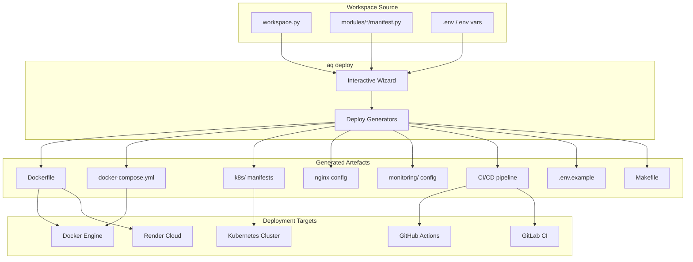
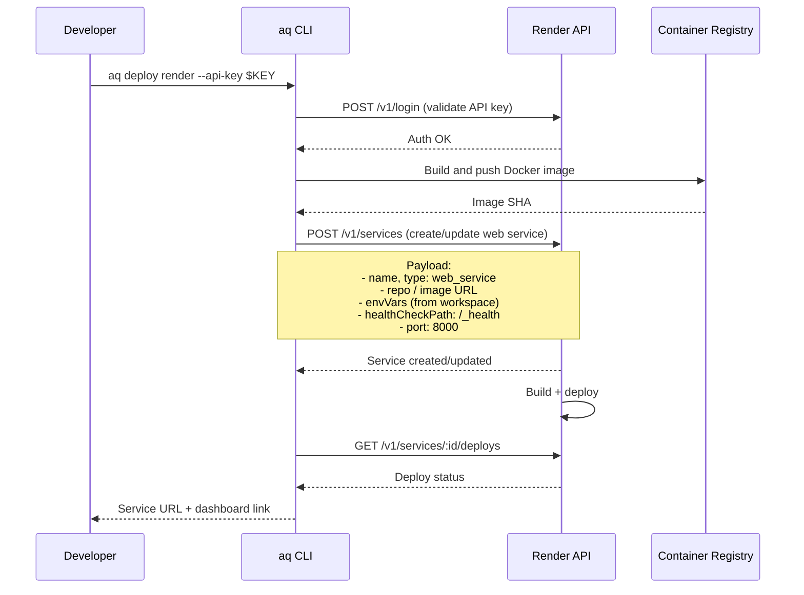

# Deployment Architecture

Aquilia generates production-ready deployment artefacts from the workspace configuration. The `aq deploy` command group introspects the live workspace — detecting enabled integrations, module structure, and environment configuration — and produces tailored Docker, Kubernetes, CI/CD, and monitoring files.

---

## Overview



---

## CLI Commands

```bash
# Interactive wizard (choose what to generate)
aq deploy

# Individual artefact generation
aq deploy dockerfile      # Generate Dockerfile
aq deploy compose         # Generate docker-compose.yml
aq deploy kubernetes      # Generate full K8s manifest suite
aq deploy nginx           # Generate Nginx reverse-proxy config
aq deploy ci              # Generate CI/CD pipeline
aq deploy monitoring      # Generate Prometheus + Grafana config
aq deploy env             # Generate .env.example
aq deploy makefile        # Generate Makefile with dev/build/deploy targets

# Generate everything at once
aq deploy all

# Deploy directly to Render PaaS
aq deploy render

# Flags
aq deploy --force         # Overwrite existing files
aq deploy --dry-run       # Preview without writing
```

The generators use `--force` to overwrite existing files and `--dry-run` to preview output. Without these flags, existing files are skipped with a warning.

---

## Docker

### Dockerfile Generation

The `aq deploy dockerfile` command produces a multi-stage Dockerfile tailored to the workspace:

```dockerfile
# ──────────────────────────────────────────────────────────────────
# Generated by aq deploy dockerfile
# Workspace: myapp (mode: prod)
# Modules: users, admin, api
# Enabled: cache (Redis), storage (S3), tasks
# ──────────────────────────────────────────────────────────────────

FROM python:3.10-slim AS builder
WORKDIR /app
COPY requirements.txt .
RUN pip install --user --no-cache-dir -r requirements.txt

FROM python:3.10-slim
WORKDIR /app
COPY --from=builder /root/.local /root/.local
COPY . .
ENV PATH=/root/.local/bin:$PATH
ENV AQUILIA_WORKSPACE=/app
ENV AQUILIA_ENV=prod
ENV PYTHONUNBUFFERED=1

RUN useradd --create-home --shell /bin/bash aquilia \
    && chown -R aquilia:aquilia /app
USER aquilia

EXPOSE 8000
HEALTHCHECK --interval=30s --timeout=3s --retries=3 \
    CMD curl -f http://localhost:8000/_health || exit 1

CMD ["uvicorn", "aquilia.entrypoint:app", "--host", "0.0.0.0", "--port", "8000"]
```

The generator introspects the workspace to detect:
- **Python version** from `pyproject.toml` (minimum: 3.10)
- **Dependencies** from `requirements.txt` / `pyproject.toml`
- **Database integration** — adds wait-for-db scripts if PostgreSQL is configured
- **Non-root user** — creates `aquilia` user for security
- **Health check** — points to the built-in `/_health` endpoint

### Docker Compose

`aq deploy compose` generates a `docker-compose.yml` with all detected services:

```yaml
version: "3.8"

services:
  app:
    build:
      context: .
      dockerfile: Dockerfile
    ports:
      - "${PORT:-8000}:8000"
    environment:
      - AQUILIA_WORKSPACE=/app
      - AQUILIA_ENV=${AQUILIA_ENV:-prod}
      - AQ_SECRET_KEY=${AQ_SECRET_KEY}
    env_file:
      - .env
    depends_on:
      redis:
        condition: service_healthy
      postgres:
        condition: service_healthy
    healthcheck:
      test: ["CMD", "curl", "-f", "http://localhost:8000/_health"]
      interval: 30s
      timeout: 3s
      retries: 3
    restart: unless-stopped
    volumes:
      - storage_data:/app/storage

  redis:
    image: redis:7-alpine
    ports:
      - "6379:6379"
    healthcheck:
      test: ["CMD", "redis-cli", "ping"]
      interval: 10s
      timeout: 3s
      retries: 3
    restart: unless-stopped
    volumes:
      - redis_data:/data

  postgres:
    image: postgres:15-alpine
    environment:
      - POSTGRES_DB=${DB_NAME:-myapp}
      - POSTGRES_USER=${DB_USER:-myapp}
      - POSTGRES_PASSWORD=${DB_PASSWORD}
    ports:
      - "5432:5432"
    healthcheck:
      test: ["CMD-SHELL", "pg_isready -U ${DB_USER:-myapp}"]
      interval: 10s
      timeout: 3s
      retries: 5
    restart: unless-stopped
    volumes:
      - pgdata:/var/lib/postgresql/data

  nginx:
    image: nginx:alpine
    ports:
      - "80:80"
      - "443:443"
    depends_on:
      - app
    volumes:
      - ./nginx/nginx.conf:/etc/nginx/nginx.conf:ro
      - ./nginx/ssl:/etc/nginx/ssl:ro
    restart: unless-stopped

volumes:
  pgdata:
  redis_data:
  storage_data:
```

Services are conditionally included:
- **Redis** — if cache or tasks integrations are enabled
- **PostgreSQL** — if database integration is enabled with `engine: "postgresql"`
- **Nginx** — if nginx config is generated
- **Volumes** — only for the storage paths configured in `Integration.storage()`

---

## Kubernetes

`aq deploy kubernetes` generates a full suite of Kubernetes manifests:

### File Structure

```
k8s/
├── namespace.yaml           # Namespace definition
├── configmap.yaml           # App configuration
├── secret.yaml              # Secret references
├── deployment.yaml          # Main app deployment
├── service.yaml             # ClusterIP service
├── ingress.yaml             # Ingress with TLS
├── hpa.yaml                 # Horizontal Pod Autoscaler
├── pdb.yaml                 # Pod Disruption Budget
├── serviceaccount.yaml      # Service account + RBAC
├── networkpolicy.yaml       # Network policies
└── kustomization.yaml       # Kustomize overlay
```

### Deployment

```yaml
apiVersion: apps/v1
kind: Deployment
metadata:
  name: myapp
  namespace: myapp
  labels:
    app: myapp
spec:
  replicas: 3
  strategy:
    type: RollingUpdate
    rollingUpdate:
      maxUnavailable: 0
      maxSurge: 1
  selector:
    matchLabels:
      app: myapp
  template:
    metadata:
      labels:
        app: myapp
      annotations:
        prometheus.io/scrape: "true"
        prometheus.io/path: "/_health"
        prometheus.io/port: "8000"
    spec:
      serviceAccountName: myapp
      containers:
        - name: app
          image: myapp:latest
          ports:
            - containerPort: 8000
              protocol: TCP
          envFrom:
            - configMapRef:
                name: myapp-config
            - secretRef:
                name: myapp-secrets
          resources:
            requests:
              cpu: 100m
              memory: 128Mi
            limits:
              cpu: 500m
              memory: 512Mi
          livenessProbe:
            httpGet:
              path: /_health
              port: 8000
            initialDelaySeconds: 10
            periodSeconds: 15
            timeoutSeconds: 3
          readinessProbe:
            httpGet:
              path: /_health
              port: 8000
            initialDelaySeconds: 5
            periodSeconds: 5
            timeoutSeconds: 3
          lifecycle:
            preStop:
              exec:
                command: ["/bin/sh", "-c", "sleep 5"]
```

### Service and Ingress

```yaml
# service.yaml
apiVersion: v1
kind: Service
metadata:
  name: myapp
  namespace: myapp
spec:
  type: ClusterIP
  selector:
    app: myapp
  ports:
    - name: http
      port: 80
      targetPort: 8000
      protocol: TCP

---
# ingress.yaml
apiVersion: networking.k8s.io/v1
kind: Ingress
metadata:
  name: myapp
  namespace: myapp
  annotations:
    cert-manager.io/cluster-issuer: letsencrypt-prod
    nginx.ingress.kubernetes.io/proxy-body-size: "10m"
    nginx.ingress.kubernetes.io/websocket-services: myapp
spec:
  ingressClassName: nginx
  tls:
    - hosts:
        - api.myapp.com
      secretName: myapp-tls
  rules:
    - host: api.myapp.com
      http:
        paths:
          - path: /
            pathType: Prefix
            backend:
              service:
                name: myapp
                port:
                  number: 80
```

### Horizontal Pod Autoscaler

```yaml
apiVersion: autoscaling/v2
kind: HorizontalPodAutoscaler
metadata:
  name: myapp
  namespace: myapp
spec:
  scaleTargetRef:
    apiVersion: apps/v1
    kind: Deployment
    name: myapp
  minReplicas: 2
  maxReplicas: 10
  metrics:
    - type: Resource
      resource:
        name: cpu
        target:
          type: Utilization
          averageUtilization: 70
    - type: Resource
      resource:
        name: memory
        target:
          type: Utilization
          averageUtilization: 80
```

### Network Policy

```yaml
apiVersion: networking.k8s.io/v1
kind: NetworkPolicy
metadata:
  name: myapp
  namespace: myapp
spec:
  podSelector:
    matchLabels:
      app: myapp
  policyTypes:
    - Ingress
    - Egress
  ingress:
    - from:
        - namespaceSelector:
            matchLabels:
              kubernetes.io/metadata.name: ingress-nginx
      ports:
        - port: 8000
          protocol: TCP
  egress:
    - to:
        - podSelector:
            matchLabels:
              app: redis
      ports:
        - port: 6379
    - to:
        - podSelector:
            matchLabels:
              app: postgres
      ports:
        - port: 5432
```

---

## Nginx Configuration

`aq deploy nginx` generates an Nginx reverse-proxy configuration:

```nginx
# Generated by aq deploy nginx
upstream myapp {
    server app:8000;
    keepalive 32;
}

server {
    listen 80;
    server_name _;
    return 301 https://$host$request_uri;
}

server {
    listen 443 ssl http2;
    server_name api.myapp.com;

    ssl_certificate     /etc/nginx/ssl/cert.pem;
    ssl_certificate_key /etc/nginx/ssl/key.pem;
    ssl_protocols       TLSv1.2 TLSv1.3;
    ssl_ciphers         HIGH:!aNULL:!MD5;

    client_max_body_size 10m;

    # Static files served directly by Nginx
    location /static/ {
        alias /app/static/;
        expires 30d;
        add_header Cache-Control "public, immutable";
    }

    location /media/ {
        alias /app/storage/media/;
        expires 7d;
    }

    # API requests proxied to the app
    location / {
        proxy_pass http://myapp;
        proxy_http_version 1.1;
        proxy_set_header Upgrade $http_upgrade;
        proxy_set_header Connection "upgrade";
        proxy_set_header Host $host;
        proxy_set_header X-Real-IP $remote_addr;
        proxy_set_header X-Forwarded-For $proxy_add_x_forwarded_for;
        proxy_set_header X-Forwarded-Proto $scheme;

        # Timeouts
        proxy_connect_timeout 10s;
        proxy_send_timeout 60s;
        proxy_read_timeout 60s;

        # Buffering
        proxy_buffering off;
        proxy_request_buffering off;
    }
}
```

The WebSocket upgrade headers (`Upgrade`, `Connection`) are included automatically if the workspace has socket controllers registered.

---

## CI/CD Pipeline

`aq deploy ci` generates CI/CD configuration for GitHub Actions and/or GitLab CI.

### GitHub Actions

```yaml
name: CI/CD
on:
  push:
    branches: [main, develop]
  pull_request:
    branches: [main]

jobs:
  lint:
    runs-on: ubuntu-latest
    steps:
      - uses: actions/checkout@v4
      - uses: actions/setup-python@v5
        with:
          python-version: "3.13"
      - run: pip install ruff
      - run: ruff check aquilia/ --output-format=github
      - run: ruff format --check aquilia/

  test:
    needs: lint
    runs-on: ubuntu-latest
    strategy:
      fail-fast: false
      matrix:
        python-version: ["3.10", "3.11", "3.12", "3.13"]
    steps:
      - uses: actions/checkout@v4
      - uses: actions/setup-python@v5
        with:
          python-version: ${{ matrix.python-version }}
      - run: pip install -e ".[dev]"
      - run: pytest tests/ -v --tb=short -q --cov=aquilia --cov-report=xml
      - uses: codecov/codecov-action@v4
        if: matrix.python-version == '3.13'
        with:
          file: ./coverage.xml

  security:
    needs: test
    runs-on: ubuntu-latest
    steps:
      - uses: actions/checkout@v4
      - run: pip install bandit safety
      - run: bandit -r aquilia/ -ll
      - run: safety check

  build:
    needs: security
    if: github.ref == 'refs/heads/main'
    runs-on: ubuntu-latest
    steps:
      - uses: actions/checkout@v4
      - name: Build Docker image
        run: docker build -t ghcr.io/${{ github.repository }}:${{ github.sha }} .
      - name: Push to registry
        run: |
          echo "${{ secrets.GITHUB_TOKEN }}" | docker login ghcr.io -u ${{ github.actor }} --password-stdin
          docker push ghcr.io/${{ github.repository }}:${{ github.sha }}

  deploy:
    needs: build
    if: github.ref == 'refs/heads/main'
    runs-on: ubuntu-latest
    steps:
      - uses: actions/checkout@v4
      - name: Deploy to Render
        run: |
          pip install aquilia
          aq deploy render --api-key ${{ secrets.RENDER_API_KEY }}
```

### GitLab CI

```yaml
stages:
  - lint
  - test
  - security
  - build
  - deploy

variables:
  PIP_CACHE_DIR: "$CI_PROJECT_DIR/.cache/pip"

cache:
  paths:
    - .cache/pip

lint:
  stage: lint
  image: python:3.13-slim
  before_script:
    - pip install ruff
  script:
    - ruff check aquilia/
    - ruff format --check aquilia/

.parallel_tests: &parallel_tests
  image: python:$PYTHON_VERSION-slim
  before_script:
    - pip install -e ".[dev]"
  script:
    - pytest tests/ -v --tb=short -q

test:3.10:
  <<: *parallel_tests
  stage: test
  parallel:
    matrix:
      - PYTHON_VERSION: ["3.10", "3.11", "3.12", "3.13"]

security:
  stage: security
  image: python:3.13-slim
  script:
    - pip install bandit safety
    - bandit -r aquilia/ -ll
    - safety check

build:
  stage: build
  image: docker:latest
  services:
    - docker:dind
  script:
    - docker build -t $CI_REGISTRY_IMAGE:$CI_COMMIT_SHA .
    - docker push $CI_REGISTRY_IMAGE:$CI_COMMIT_SHA
  only:
    - main

deploy:
  stage: deploy
  image: python:3.13-slim
  script:
    - pip install aquilia
    - aq deploy render
  only:
    - main
```

---

## Render Cloud Provider

`aq deploy render` deploys the application directly to [Render](https://render.com) — a Platform-as-a-Service provider.

```bash
aq deploy render --api-key $RENDER_API_KEY
```

### Provider Integration

```python
# aquilia/cli/commands/provider.py
class RenderProvider:
    def login(self, api_key: str) -> None
    def status(self) -> dict
    def deploy(self, workspace_config: dict) -> dict
    def destroy(self, service_id: str) -> None
    def get_env_vars(self, service_id: str) -> dict
    def set_env_vars(self, service_id: str, vars: dict) -> None
```

### Deploy Flow



### Credential Store

Render API keys are stored securely in the Aquilia credential store (`.aquilia-store/` or OS keychain), never persisted in plain text in the workspace:

```python
# aquilia/providers/
class CredentialStore:
    def store(self, provider: str, key: str, value: str) -> None
    def get(self, provider: str, key: str) -> str | None
    def delete(self, provider: str, key: str) -> None
    def list_providers(self) -> list[str]
```

---

## Monitoring

`aq deploy monitoring` generates Prometheus and Grafana configuration for infrastructure observability.

### Prometheus Configuration

```yaml
# monitoring/prometheus.yml
global:
  scrape_interval: 15s
  evaluation_interval: 15s

scrape_configs:
  - job_name: "aquilia"
    metrics_path: "/_health"
    kubernetes_sd_configs:
      - role: pod
    relabel_configs:
      - source_labels: [__meta_kubernetes_pod_annotation_prometheus_io_scrape]
        action: keep
        regex: true
      - source_labels: [__meta_kubernetes_pod_annotation_prometheus_io_path]
        action: replace
        target_label: __metrics_path__
        regex: (.+)
```

### Key Metrics from /_health

```json
{
  "status": "healthy",
  "metrics": {
    "inflight": 12,
    "total_requests": 154783,
    "mean_latency_ms": 23.4,
    "p50_latency_ms": 18.2,
    "p95_latency_ms": 45.1,
    "p99_latency_ms": 89.3,
    "errors_total": 42
  },
  "subsystems": {
    "cache": {"status": "ok"},
    "storage": {"status": "ok", "backends": {"default": "ok", "avatars": "ok"}},
    "mail": {"status": "ok"},
    "tasks": {"status": "ok", "queue_depth": 3},
    "database": {"status": "ok", "migrations_applied": 5}
  }
}
```

### Grafana Dashboards

The generator includes pre-built dashboard JSON for:
- **Request Overview:** Total requests, error rate, mean/P50/P95/P99 latency
- **Subsystem Health:** Per-subsystem status indicators with alert thresholds
- **Task Queue:** Queue depth, processing rate, dead-letter count
- **Cache Performance:** Hit rate, miss rate, backend latency
- **Database:** Connection pool stats, query latency distribution

---

## Environment Configuration

### .env.example Generation

`aq deploy env` produces a `.env.example` file based on all integrations detected in the workspace:

```bash
# ─── Generated by aq deploy env ─────────────────────────────────────
# Workspace: myapp
# Rend required variables for production deployment

# Core
AQUILIA_ENV=prod
AQ_SECRET_KEY=<generate-a-strong-random-key>

# Database
DB_NAME=myapp
DB_USER=myapp
DB_PASSWORD=<database-password>
DB_HOST=postgres
DB_PORT=5432

# Cache (Redis)
REDIS_URL=redis://redis:6379/0

# Auth (JWT signing) — use: python -c "import secrets; print(secrets.token_hex(32))"
# AQ_SECRET_KEY already used for signing by default

# Storage (S3)
AWS_ACCESS_KEY_ID=<aws-access-key>
AWS_SECRET_ACCESS_KEY=<aws-secret-key>
AWS_REGION=us-east-1

# Mail (SMTP)
SMTP_HOST=smtp.example.com
SMTP_PORT=587
SMTP_USER=<smtp-username>
SMTP_PASSWORD=<smtp-password>

# Deploy
PORT=8000
```

### Makefile

`aq deploy makefile` produces a `Makefile` with standardised targets:

```makefile
# ─── Generated by aq deploy makefile ─────────────────────────────────

.PHONY: help install dev lint test coverage build deploy clean

help: ## Show this help
	@grep -E '^[a-zA-Z_-]+:.*?## .*$$' $(MAKEFILE_LIST) | sort | \
		awk 'BEGIN {FS = ":.*?## "}; {printf "\033[36m%-15s\033[0m %s\n", $$1, $$2}'

install: ## Install production dependencies
	pip install -e .

dev: ## Install development dependencies
	pip install -e ".[dev]"
	pip install -r requirements-dev.txt

lint: ## Run linting checks
	ruff check aquilia/
	ruff format --check aquilia/

fmt: ## Auto-format code
	ruff format aquilia/

test: ## Run test suite
	pytest tests/ -v --tb=short -q

coverage: ## Run tests with coverage
	pytest tests/ --cov=aquilia --cov-report=term-missing --cov-report=html

build: ## Build Docker image
	docker build -t myapp:latest .

push: ## Push Docker image
	docker push myapp:latest

up: ## Start services with Docker Compose
	docker compose up -d

down: ## Stop services
	docker compose down

logs: ## View app logs
	docker compose logs -f app

shell: ## Open shell in app container
	docker compose exec app bash

deploy: ## Deploy to Render
	aq deploy render

deploy-k8s: ## Deploy to Kubernetes
	kubectl apply -f k8s/

clean: ## Clean build artefacts
	find . -type d -name __pycache__ -exec rm -rf {} + 2>/dev/null || true
	find . -type f -name '*.pyc' -delete
	rm -rf .pytest_cache .mypy_cache .ruff_cache dist build *.egg-info
```

---

## Environment Variable Resolution

The deployment system resolves environment variables using a cascading priority:

| Priority | Source | Description |
|----------|--------|-------------|
| 1 | `--set` flag | `aq deploy render --set PORT=9000` |
| 2 | Shell environment | `export AQ_SECRET_KEY=xxx` |
| 3 | `.env` file | Project-local `.env` file |
| 4 | `workspace.py` | `Integration.storage(backends=[{"secret_key_env": "AWS_KEY"}])` |
| 5 | Provider defaults | Render auto-injects `PORT`, `RENDER_SERVICE_NAME` |

### Secret Handling

Secrets are referenced by environment variable name, never inlined:

```python
# workspace.py — correct: reference to env var
Integration.database(password_env="DB_PASSWORD")

# Generated .env.example
DB_PASSWORD=<database-password>

# In CI/CD
DB_PASSWORD: ${{ secrets.DB_PASSWORD }}
```

For Render deployments, `aq deploy render` sets environment variables on the Render service from the `.env` file or `--set` values. The `secret_key_env` pattern in storage/database config ensures credentials are loaded safely at runtime.

---

## Deployment Patterns

### Development (Local)

```bash
# One-time setup
aq deploy all

# Daily development
make dev           # Install dev deps
aq serve           # Start dev server with hot reload
make test          # Run tests
make lint          # Run linter
```

### Staging (Docker Compose)

```bash
docker compose up -d          # Start all services
docker compose logs -f app    # Follow app logs
docker compose exec app bash  # Shell access
docker compose down           # Stop all services
```

### Production (Kubernetes)

```bash
kubectl apply -f k8s/         # Deploy all manifests
kubectl get pods -n myapp     # Check pod status
kubectl logs -f deployment/myapp -n myapp  # Follow logs
kubectl rollout restart deployment/myapp -n myapp  # Rolling restart
kubectl port-forward svc/myapp 8000:80 -n myapp  # Local debugging
```

### Production (Render)

```bash
aq deploy render                     # Deploy latest
aq deploy render --api-key $KEY      # With explicit API key
aq provider render status            # Check deployment status
aq provider render destroy myapp     # Tear down service
```

### Blue-Green with Kubernetes

```yaml
# Service with blue-green selectors
apiVersion: v1
kind: Service
metadata:
  name: myapp
spec:
  selector:
    app: myapp
    version: green  # Switch to "blue" for rollback
  ports:
    - port: 80
      targetPort: 8000
```

Deploy the new version (`blue`), validate health, then update the service selector. Keep the previous version (`green`) running for instant rollback.