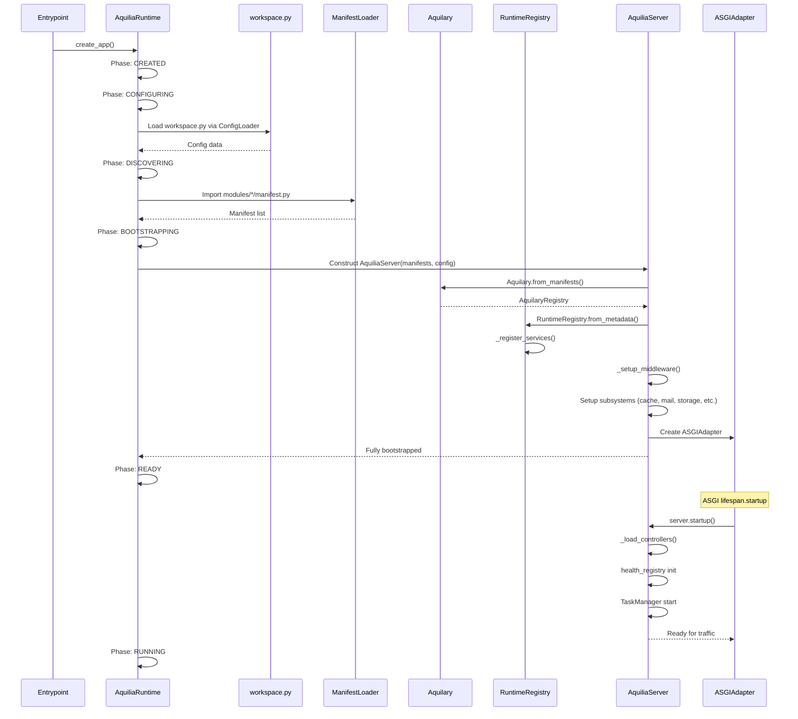
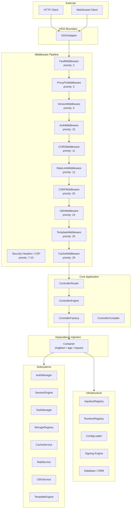

# Architecture Overview

Aquilia is an async-native, manifest-first Python web framework. It auto-discovers modules, wires dependency injection, and generates infrastructure artefacts. This page describes the high-level architecture, layered design, and component relationships.

## Architectural Layers

Aquilia follows a clean layered architecture with four primary tiers:

```
┌──────────────────────────────────────────────────────────────────┐
│                    Presentation Layer                              │
│  ASGIAdapter │ MiddlewareStack │ Request/Response │ Templates     │
├──────────────────────────────────────────────────────────────────┤
│                    Application Layer                               │
│  Controllers │ Router │ Engine │ Versioning │ Fault Engine         │
├──────────────────────────────────────────────────────────────────┤
│                      Domain Layer                                  │
│  Auth │ Sessions │ Storage │ Tasks │ Cache │ Mail │ i18n           │
├──────────────────────────────────────────────────────────────────┤
│                  Infrastructure Layer                              │
│  DI │ Aquilary │ Manifest Loader │ Config │ DB/ORM │ Signing      │
└──────────────────────────────────────────────────────────────────┘
```

### Presentation Layer

The outermost layer responsible for HTTP protocol handling. The `ASGIAdapter` (`aquilia/asgi.py`) bridges the ASGI protocol to Aquilia's typed request/response system. It handles HTTP, WebSocket, and lifespan events. The `MiddlewareStack` (`aquilia/middleware.py`) provides composable, ordered middleware execution for cross-cutting concerns like authentication, CORS, CSRF, rate limiting, and static file serving.

### Application Layer

Contains the controller system — routing, execution, and API versioning. The `ControllerRouter` (`aquilia/controller/router.py`) performs path-to-handler matching with a two-tier strategy (O(1) static hash maps + O(k) segment tries for parameterised routes). The `ControllerEngine` (`aquilia/controller/engine.py`) orchestrates handler execution with full DI integration, lifecycle hooks, interceptors, and clearance enforcement.

### Domain Layer

Houses the framework's business capabilities as composable subsystems: authentication and authorisation (`aquilia/auth/`), session management (`aquilia/sessions/`), background task processing (`aquilia/tasks/`), file storage abstraction (`aquilia/storage/`), caching (`aquilia/cache/`), mail delivery (`aquilia/mail/`), and internationalisation (`aquilia/i18n/`). Each subsystem is independently configurable and can be enabled or disabled at the workspace level.

### Infrastructure Layer

Provides the foundation: hierarchical dependency injection (`aquilia/di/`), manifest discovery and validation (`aquilia/aquilary/`), configuration loading (`aquilia/config/`), the signing engine (`aquilia/signing.py`), and the ORM/database layer (`aquilia/models/`, `aquilia/db/`).

## Boot Sequence

The application lifecycle follows a deterministic pipeline:



## Component Diagram



## Key Design Principles

### Manifest-First Module Boundaries

Every module declares its controllers, services, middleware, and models through an `AppManifest` in `modules/<name>/manifest.py`. The `workspace.py` at the project root is orchestration metadata only — it declares which modules are active and configures integrations. This separation ensures clean module boundaries and enables tooling (CLI generators, validation, discovery).

### Structured Faults

All framework errors use `Fault` subclasses from `aquilia/faults/` with stable `code`, `message`, `domain`, and `severity` fields. The `FaultEngine` processes these faults through registered handlers, and the `FaultMiddleware` (always registered at priority 2) provides a safety net for unhandled exceptions. Raw Python exceptions are never raised for framework failures.

### DI Scope Discipline

Aquilia's DI system supports three scopes:

| Scope | Lifetime | Example |
|-------|----------|---------|
| `singleton` | Process lifetime | `TaskManager` instance |
| `app` | Application lifetime | `AuthManager`, `CacheService` |
| `request` | Single HTTP request | `RequestCtx`, per-request objects |

The `request` scope is created from the `app` container via `create_request_scope()` and is cleaned up after each request by the `request_scope_mw` middleware.

### Async-Native Pipeline

The entire request pipeline — from ASGI event reception through middleware execution, controller dispatch, and response generation — is fully asynchronous. Controllers and services use `async def`, and blocking operations (like gzip compression) are offloaded to thread pools.

## Directory Structure

```
project/
├── workspace.py              # Workspace orchestration
├── modules/                  # Application modules
│   ├── users/
│   │   ├── manifest.py       # AppManifest for the users module
│   │   ├── controllers.py    # Controller classes
│   │   ├── services.py       # Service classes
│   │   └── templates/        # Module-specific templates
│   └── admin/
│       ├── manifest.py
│       └── controllers.py
├── runtime/                  # Generated runtime artefacts (optional)
│   └── app.py
├── .env                      # Environment variables
└── Dockerfile                # Deployment configuration
```

## Environment Configuration

| Variable | Default | Description |
|----------|---------|-------------|
| `AQUILIA_WORKSPACE` | `/app` | Workspace root path |
| `AQUILIA_ENV` | `prod` | Runtime mode: `dev`, `test`, `prod` |
| `AQ_SECRET_KEY` | — | Signing secret for sessions/CSRF |
| `AQ_SERVER_WORKERS` | — | Number of uvicorn workers |
| `AQ_SERVER_PORT` | — | Listening port |

## Versioning and Compatibility

Aquilia supports API versioning through URL-prefix, header-based, query-parameter, and media-type strategies. The `VersionMiddleware` runs early in the pipeline (priority 5) and populates `request.state` with the resolved version. Routes can be bound to specific versions using `@version()` and `@version_range()` decorators, with automatic sunset enforcement via `SunsetPolicy`.