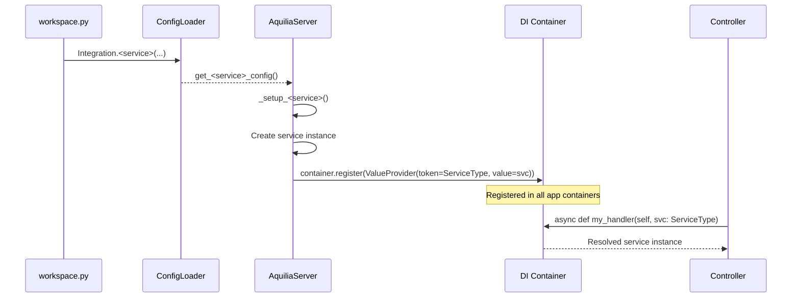

# Services

Aquilia provides eight core services as independently configurable subsystems. Each service follows a consistent pattern: declared in workspace configuration, initialised by `AquiliaServer`, registered in all DI containers, and injectable into controllers via type hints.

---

## Service Registration Pattern

All services follow this lifecycle:



---

## AuthManager

**File:** `aquilia/auth/manager.py`  
**Token:** `AuthManager`  
**Scope:** `app`

### Overview

`AuthManager` is the central coordinator for all authentication operations. It orchestrates identity verification, token issuance, session management, multi-factor authentication, account lockout, and API key management.

### Architecture

```python
class AuthManager:
    def __init__(
        self,
        identity_store: IdentityStore,
        credential_store: CredentialStore,
        token_manager: TokenManager,
        password_hasher: PasswordHasher | None = None,
    )
```

| Subcomponent | Interface | Default | Purpose |
|-------------|-----------|---------|---------|
| `identity_store` | `IdentityStore` | `MemoryIdentityStore` | CRUD for `Identity` objects (users, services, bots) |
| `credential_store` | `CredentialStore` | `MemoryCredentialStore` | Stores hashed passwords, API keys, OAuth links |
| `token_manager` | `TokenManager` | JWT-based with `KeyRing` | Token signing, verification, refresh, and revocation |
| `password_hasher` | `PasswordHasher` | Argon2 via Passlib | Password hashing and verification |

### Key API Methods

```python
class AuthManager:
    # Authentication flows
    async def authenticate_password(self, identity_id: str, password: str) -> AuthResult
    async def authenticate_api_key(self, api_key: str) -> AuthResult
    async def authenticate_oauth(self, provider: str, code: str) -> AuthResult

    # Token management
    async def issue_tokens(self, identity_id: str) -> tuple[str, str]  # (access, refresh)
    async def refresh_access_token(self, refresh_token: str) -> str
    async def revoke_token(self, token: str) -> None
    async def verify_access_token(self, token: str) -> TokenClaims

    # Identity management
    async def create_identity(self, identity: Identity) -> Identity
    async def get_identity(self, identity_id: str) -> Identity | None
    async def update_identity(self, identity_id: str, updates: dict) -> Identity
    async def set_password(self, identity_id: str, password: str) -> None

    # Account security
    async def lock_account(self, identity_id: str, reason: str) -> None
    async def unlock_account(self, identity_id: str) -> None
    async def record_failed_attempt(self, identity_id: str) -> None

    # Multi-factor authentication
    async def setup_mfa(self, identity_id: str, method: str) -> dict
    async def verify_mfa(self, identity_id: str, code: str) -> bool
    async def disable_mfa(self, identity_id: str) -> None

    # API keys
    async def create_api_key(self, identity_id: str, name: str) -> ApiKeyCredential
    async def revoke_api_key(self, key_id: str) -> None

    # Session binding
    async def create_session(self, identity_id: str, scope: SessionScope) -> str
    async def destroy_session(self, session_id: str) -> None
```

### Rate Limiting

`AuthManager` includes a built-in `RateLimiter` (in-memory) that tracks failed authentication attempts per key. After `max_attempts` (default: 5) within `window_seconds` (default: 900), the account is locked for `lockout_duration` (default: 3600 seconds). Lockout events emit structured faults through the `FaultEngine`.

### DI Registration

```python
# In AquiliaServer._setup_middleware(), when auth is enabled:
for container in self.runtime.di_containers.values():
    container.register(ValueProvider(
        token=AuthManager, value=auth_manager, scope="app"
    ))
    container.register(ValueProvider(
        value=auth_manager.identity_store,
        token="aquilia.auth.stores.MemoryIdentityStore", scope="app",
    ))
    container.register(ValueProvider(
        value=auth_manager.token_manager,
        token="aquilia.auth.tokens.TokenManager", scope="app",
    ))
    container.register(ValueProvider(
        value=password_policy,
        token=PasswordPolicy, scope="app",
    ))
```

### Controller Usage

```python
from aquilia import Controller, GET, RequestCtx, Response
from aquilia.auth.manager import AuthManager

class UsersController(Controller):
    prefix = "/users"

    @GET("/me")
    async def current_user(self, ctx: RequestCtx, auth: AuthManager):
        identity = await auth.get_identity(ctx.identity.id)
        return Response.json(identity.to_dict())
```

### Auth Subcomponents Registered in DI

| Token | Type | Purpose |
|-------|------|---------|
| `AuthManager` | `AuthManager` | Full auth coordinator |
| `aquilia.auth.stores.MemoryIdentityStore` | `MemoryIdentityStore` | Identity storage |
| `aquilia.auth.stores.MemoryCredentialStore` | `MemoryCredentialStore` | Credential storage |
| `aquilia.auth.tokens.TokenManager` | `TokenManager` | JWT token operations |
| `aquilia.auth.hashing.PasswordHasher` | `PasswordHasher` | Password hashing |
| `PasswordPolicy` | `PasswordPolicy` | Password complexity rules |

---

## CacheService

**File:** `aquilia/cache/`  
**Token:** `CacheService`  
**Scope:** `app`

### Overview

`CacheService` provides a unified caching abstraction with pluggable backends (in-memory, Redis). It supports TTL-based expiry, namespacing, atomic operations, and decorator-based caching.

### Configuration

```python
# workspace.py
from aquilia.config_builders import Integration

workspace = Workspace("myapp").integrate(
    Integration.cache(
        backend="memory",     # or "redis"
        default_ttl=300,      # seconds
        namespace="myapp",
        middleware={
            "enabled": True,  # HTTP response cache middleware
            "ttl": 300,
        },
    )
)
```

### API

```python
class CacheService:
    async def get(self, key: str, namespace: str = "default") -> Any | None
    async def set(self, key: str, value: Any, ttl: int | None = None, namespace: str = "default")
    async def delete(self, key: str, namespace: str = "default")
    async def exists(self, key: str, namespace: str = "default") -> bool
    async def increment(self, key: str, amount: int = 1, namespace: str = "default") -> int
    async def decrement(self, key: str, amount: int = 1, namespace: str = "default") -> int
    async def get_or_set(self, key: str, factory: Callable, ttl: int | None = None) -> Any
    async def clear_namespace(self, namespace: str)
    async def flush(self)
    async def ping(self) -> bool  # Health check
```

### Decorator API

```python
from aquilia.cache.decorators import cached

@cached(ttl=600, namespace="users")
async def get_user_profile(user_id: str) -> dict:
    # Result cached for 10 minutes
    ...
```

### CacheMiddleware

When HTTP response caching is enabled, the `CacheMiddleware` (priority 26) intercepts responses and caches them based on request method, path, and cache-control headers. Cached responses bypass the controller pipeline entirely.

---

## MailService

**File:** `aquilia/mail/`  
**Token:** `MailService`  
**Scope:** `app`

### Overview

`MailService` provides async email delivery with provider auto-discovery, template rendering, attachment support, and a module-level convenience API (`send_mail` / `asend_mail`).

### Configuration

```python
# workspace.py
workspace.integrate(
    Integration.mail(
        default_from="noreply@example.com",
        provider="smtp",       # or "sendgrid", "mailgun", "console"
        smtp_host="smtp.example.com",
        smtp_port=587,
        smtp_user="user",
        smtp_password_env="SMTP_PASSWORD",
    )
)
```

### API

```python
class MailService:
    async def send(self, message: MailMessage) -> bool
    async def send_many(self, messages: list[MailMessage]) -> list[bool]
    async def render_and_send(self, template: str, context: dict, to: str, subject: str) -> bool
    async def ping(self) -> bool  # Provider health check
```

### MailMessage Structure

```python
@dataclass
class MailMessage:
    to: str | list[str]
    subject: str
    body: str | None = None
    html: str | None = None
    from_address: str | None = None
    cc: list[str] = field(default_factory=list)
    bcc: list[str] = field(default_factory=list)
    attachments: list[MailAttachment] = field(default_factory=list)
    reply_to: str | None = None
    headers: dict[str, str] = field(default_factory=dict)
    tags: list[str] = field(default_factory=list)
```

### Provider Auto-Discovery

`MailService` uses Aquilia's `PackageScanner` to automatically discover `IMailProvider` implementations registered via the provider pattern. At initialisation time, all discovered providers are loaded into the `MailProviderRegistry`.

### Convenience API

```python
# Module-level convenience functions
from aquilia.mail import send_mail, asend_mail

# Synchronous convenience (auto-schedules on event loop)
send_mail(to="user@example.com", subject="Welcome", body="Hello!")

# Async convenience
await asend_mail(to="user@example.com", subject="Welcome", body="Hello!")
```

The module-level singleton is set during `AquiliaServer._setup_mail()` via `set_mail_service(svc)`.

---

## I18nService

**File:** `aquilia/i18n/`  
**Token:** `I18nService`  
**Scope:** `app`

### Overview

`I18nService` provides internationalisation and localisation with locale detection, message catalog loading, plural form handling, date/number formatting, and template integration.

### Configuration

```python
workspace.integrate(
    Integration.i18n(
        default_locale="en",
        supported_locales=["en", "fr", "de", "ja"],
        locale_dir="locales",
        fallback_locale="en",
        detect_locale_from=["header", "cookie", "query", "path"],
        cookie_name="lang",
        query_param="lang",
        path_pattern="/<locale:str>/",
    )
)
```

### API

```python
class I18nService:
    def translate(self, key: str, locale: str | None = None, **kwargs) -> str
    async def load_catalog(self, locale: str) -> MessageCatalog
    def format_number(self, value: float, locale: str | None = None) -> str
    def format_date(self, value: datetime, locale: str | None = None) -> str
    def format_currency(self, value: float, currency: str, locale: str | None = None) -> str
    def pluralize(self, key: str, count: int, locale: str | None = None) -> str
    def get_current_locale(self, request: Request) -> str
```

### Locale Resolution Chain

The `I18nMiddleware` (priority 24) resolves the locale using a configurable chain of resolvers:

```python
# Resolution order (configurable):
1. URL path segment  →  /fr/users/profile
2. Query parameter   →  /users/profile?lang=fr
3. Cookie            →  lang=fr
4. Accept-Language   →  fr,en;q=0.9
5. Default locale    →  en
```

### Template Integration

When a `TemplateEngine` is active, `I18nService` automatically registers template globals:

```jinja
<!-- In templates -->
<h1>{{ _('welcome.title') }}</h1>
<p>{{ _n('notification.count', count) }}</p>
<span>{{ _d(created_at) }}</span>  <!-- Formatted date -->
```

### CLI Commands

```bash
# Extract translatable strings
aq i18n extract

# Compile message catalogs
aq i18n compile

# Initialize a new locale
aq i18n init fr
```

---

## TaskManager

**File:** `aquilia/tasks/`  
**Token:** `TaskManager`  
**Scope:** `app`

### Overview

`TaskManager` provides a priority-based background task execution system with worker pools, retry policies, cron scheduling, dead-letter queues, and FaultEngine integration.

### Configuration

```python
workspace.integrate(
    Integration.tasks(
        backend="memory",         # "memory" or "redis"
        num_workers=4,
        default_queue="default",
        cleanup_interval=300.0,   # seconds
        cleanup_max_age=3600.0,   # seconds
    )
)
```

### Defining Tasks

```python
from aquilia.tasks import task, Task, Interval, CronSchedule

@task(queue="emails", retries=3, retry_delay=60)
async def send_welcome_email(user_id: str) -> None:
    ...

@task(interval=Interval(hours=1))
async def cleanup_expired_sessions() -> None:
    ...

@task(schedule=CronSchedule(minute="0", hour="*/6"))
async def generate_reports() -> None:
    ...
```

### API

```python
class TaskManager:
    async def start(self) -> None
    async def stop(self) -> None
    async def enqueue(self, task_name: str, *args, queue: str | None = None, **kwargs) -> str  # Returns job ID
    async def get_result(self, job_id: str) -> Any
    async def cancel(self, job_id: str) -> bool
    async def retry(self, job_id: str) -> str  # Returns new job ID
    async def get_queue_stats(self, queue: str | None = None) -> dict
    def on_dead_letter(self, callback: Callable) -> None
```

### Dead-Letter Integration

When a task exhausts its retries, the `TaskManager` invokes the dead-letter callback, which emits a `TASK_DEAD_LETTER` fault through the `FaultEngine`:

```python
def _task_dead_letter_fault(job):
    fault = Fault(
        code="TASK_DEAD_LETTER",
        message=f"Task {job.name} permanently failed after {job.retry_count} retries",
        domain=FaultDomain.custom("TASKS", "Background task faults"),
    )
    loop.create_task(fault_engine.process(fault, app="tasks"))
```

### Queue Effect Integration

The `TaskManager` integrates with Aquilia's effect system via `TaskQueueProvider`:

```python
from aquilia.effects import Effect, EffectKind, requires

@requires(Effect("queue", kind=EffectKind.QUEUE))
async def order_handler(req, queue: TaskQueueProvider):
    await queue.enqueue("process_order", order_id="123")
```

---

## SqliteService

**File:** `aquilia/sqlite/`  
**Token:** `SqliteService` (or injected as `AquiliaDatabase` from `aquilia/db/`)  
**Scope:** `app` or `request`

### Overview

Aquilia provides native async SQLite support through `SqliteService` and the higher-level `AquiliaDatabase` abstraction. The ORM layer (`aquilia/models/`) builds on this with model definitions, query building, and migrations.

### Configuration

```python
workspace.integrate(
    Integration.database(
        engine="sqlite",
        path="data/app.db",          # File path for SQLite
        # or connection params for PostgreSQL:
        # engine="postgresql",
        # host="localhost",
        # port=5432,
        # database="myapp",
        # user="myuser",
        # password_env="DB_PASSWORD",
    )
)
```

### Migration Commands

```bash
aq migrate makemigrations    # Create migration files
aq migrate migrate           # Apply pending migrations
aq migrate sqlmigrate        # Show SQL for a migration
aq migrate inspectdb         # Introspect existing database
aq migrate status            # Show migration status
```

---

## FilesystemService

**File:** `aquilia/filesystem/`  
**Token:** `FilesystemService`  
**Scope:** `app`

### Overview

`FilesystemService` provides safe, async file operations on the local filesystem with built-in security hardening — path traversal prevention, null byte filtering, symlink validation, and permission checks.

### API

```python
class FilesystemService:
    async def read_text(self, path: str | Path, encoding: str = "utf-8") -> str
    async def read_bytes(self, path: str | Path) -> bytes
    async def write_text(self, path: str | Path, content: str, encoding: str = "utf-8") -> None
    async def write_bytes(self, path: str | Path, data: bytes) -> None
    async def delete(self, path: str | Path) -> None
    async def exists(self, path: str | Path) -> bool
    async def mkdir(self, path: str | Path, parents: bool = True) -> None
    async def list_dir(self, path: str | Path) -> list[str]
    async def stat(self, path: str | Path) -> dict
    async def copy(self, src: str | Path, dst: str | Path) -> None
    async def move(self, src: str | Path, dst: str | Path) -> None
    def validate_path(self, path: str | Path, base_dir: str | Path | None = None) -> Path
```

### Security Guarantees

All paths are validated through `FilesystemService.validate_path()`:
- Null byte rejection (`\x00`)
- Normalised to absolute paths
- `..` traversal blocked (resolved paths must stay within `base_dir`)
- Symlink target validation
- Permission checks before write operations

---

## StorageRegistry

**File:** `aquilia/storage/registry.py`  
**Token:** `StorageRegistry`  
**Scope:** `app`

### Overview

`StorageRegistry` is a named registry of `StorageBackend` instances. Each backend is registered with an alias (e.g., `"default"`, `"avatars"`, `"media"`) and can be accessed by name. See the [Storage Architecture](./storage.md) page for comprehensive documentation.

### Quick Usage

```python
# Configuration
workspace.integrate(
    Integration.storage(
        backends=[
            {"name": "default", "backend": "local", "root": "/data"},
            {"name": "avatars", "backend": "s3", "bucket": "my-avatars"},
            {"name": "media", "backend": "gcs", "bucket": "my-media"},
        ]
    )
)

# Controller usage
class UploadController(Controller):
    @POST("/upload")
    async def upload(self, ctx: RequestCtx, storage: StorageRegistry):
        backend = storage["avatars"]
        filename = await backend.save(f"users/{ctx.identity.id}/avatar.png", data)
        url = await backend.url(filename)
        return Response.json({"url": url})
```

---

## Service DI Resolution in Controllers

All services are injectable through Aquilia's DI system. The resolution strategy is:

1. **Type annotation:** The controller method parameter has a type hint matching a registered token.
2. **DI lookup:** `ControllerFactory.get_instance()` resolves the controller's `__init__` and method parameters via the container.
3. **Scope matching:** App-scoped services return the same instance across requests. Request-scoped services create new instances.

```python
class DashboardController(Controller):
    prefix = "/dashboard"

    @GET("/")
    async def index(
        self,
        ctx: RequestCtx,
        auth: AuthManager,       # App-scoped
        cache: CacheService,      # App-scoped
        tasks: TaskManager,       # App-scoped
    ):
        stats = await cache.get_or_set("dashboard:stats", compute_stats, ttl=60)
        return Response.json(stats)
```

### DI Registration Overview

| Service | Token | Scope | Auto-registered |
|---------|-------|-------|-----------------|
| `AuthManager` | `AuthManager` | app | Yes (via `_setup_middleware`) |
| `CacheService` | `CacheService` | app | Yes (via `_setup_cache`) |
| `MailService` | `MailService` | app | Yes (via `_setup_mail`) |
| `I18nService` | `I18nService` | app | Yes (via `_setup_i18n`) |
| `TaskManager` | `TaskManager` | app | Yes (via `_setup_tasks`) |
| `StorageRegistry` | `StorageRegistry` | app | Yes (via `_setup_storage`) |
| `TemplateEngine` | `TemplateEngine` | app | Yes (via `_setup_middleware`) |
| `SessionEngine` | `SessionEngine` | app | Yes (via `_setup_middleware`) |
| `FaultEngine` | `FaultEngine` | app | Always registered |
| `EffectRegistry` | `EffectRegistry` | app | Always registered |
| `PasswordPolicy` | `PasswordPolicy` | app | Yes (if auth enabled) |
| `HealthRegistry` | — | server attr | Not in DI (accessed via `server.health_registry`) |

---

## LifecycleCoordinator

**File:** `aquilia/lifecycle.py:68`  
**Role:** Orchestrates startup and shutdown hooks across all apps in dependency order.

```python
class LifecycleCoordinator:
    def __init__(self, runtime: Any, config: ConfigLoader | None = None)
    async def startup(self) -> None
    async def shutdown(self) -> None
    def on_event(self, observer: Callable[[LifecycleEvent], None])
```

### Lifecycle Phases

```
INIT → STARTING → READY → (running) → STOPPING → STOPPED
```

Hooks registered in `AppManifest.on_startup` and `AppManifest.on_shutdown` are executed in topological order based on the dependency graph. Errors during startup are captured as `LifecycleEvent` with `event.error` populated, and emitted to registered observers.

### Observer Integration

```python
def _lifecycle_fault_observer(event: LifecycleEvent):
    if event.error:
        self.logger.error(
            f"Lifecycle fault in phase {event.phase.value}: "
            f"app={event.app_name}, error={event.error}"
        )

self.coordinator.on_event(_lifecycle_fault_observer)
```