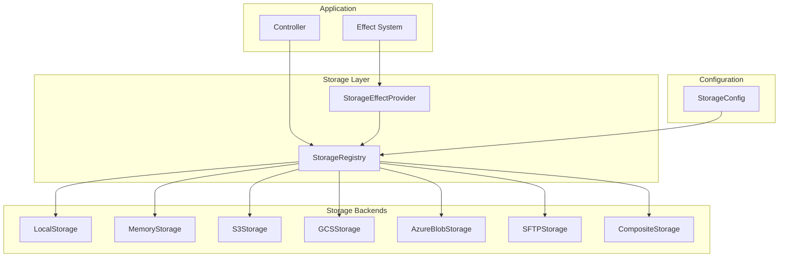

# Storage Architecture

Aquilia's storage subsystem provides a unified, async-native abstraction over multiple storage backends — local filesystem, in-memory, Amazon S3, Google Cloud Storage, Azure Blob Storage, and SFTP. The `StorageRegistry` acts as a named backend registry, and `StorageEffectProvider` bridges storage into Aquilia's effect system.

---

## Architecture Overview



---

## StorageRegistry

**File:** `aquilia/storage/registry.py:82`  
**Role:** Named registry of `StorageBackend` instances with dict-like access.

```python
class StorageRegistry:
    def register(self, alias: str, backend: StorageBackend) -> None
    def set_default(self, alias: str) -> None
    def __getitem__(self, alias: str) -> StorageBackend
    async def initialize_all(self) -> None
    async def shutdown_all(self) -> None
    async def health_all(self) -> dict[str, bool]

    @property
    def default(self) -> StorageBackend

    @classmethod
    def from_config(cls, backend_configs: list[dict]) -> StorageRegistry
```

### Registry Access Patterns

```python
registry = StorageRegistry()
registry.register("avatars", LocalStorage(config))
registry.register("media", S3Storage(config))
registry.set_default("media")

# Named access
avatars = registry["avatars"]
media = registry["media"]

# Default alias
assert registry.default is registry["media"]

# Iteration
for alias, backend in registry:
    print(f"{alias}: {backend.__class__.__name__}")

# Bulk operations
await registry.initialize_all()   # Init all backends
status = await registry.health_all()  # {"avatars": True, "media": False}

# Shortcut property
data = await registry.default.read("report.pdf")
```

### Backend Factory Map

The registry resolves backend shorthand names to import paths:

| Shorthand | Class | Module |
|-----------|-------|--------|
| `"local"` | `LocalStorage` | `aquilia.storage.backends.local` |
| `"memory"` | `MemoryStorage` | `aquilia.storage.backends.memory` |
| `"s3"` | `S3Storage` | `aquilia.storage.backends.s3` |
| `"gcs"` | `GCSStorage` | `aquilia.storage.backends.gcs` |
| `"azure"` | `AzureBlobStorage` | `aquilia.storage.backends.azure` |
| `"sftp"` | `SFTPStorage` | `aquilia.storage.backends.sftp` |
| `"composite"` | `CompositeStorage` | `aquilia.storage.backends.composite` |

Custom backends can be registered with a dotted import path (e.g., `"mypackage.storage.MyCustomStorage"`).

---

## StorageBackend (Abstract Base)

**File:** `aquilia/storage/base.py`  
**Role:** Defines the async contract that every storage backend must implement.

```python
class StorageBackend(ABC):
    def __init__(self, config: StorageConfig)

    # Core I/O
    @abstractmethod
    async def save(self, path: str, data: bytes | AsyncIterator[bytes],
                   metadata: dict | None = None) -> str
    @abstractmethod
    async def read(self, path: str) -> bytes
    @abstractmethod
    async def delete(self, path: str) -> None
    @abstractmethod
    async def exists(self, path: str) -> bool

    # Streaming
    @abstractmethod
    async def open(self, path: str, mode: str = "rb") -> AsyncIterator[bytes]

    # Metadata
    @abstractmethod
    async def stat(self, path: str) -> StorageMetadata
    @abstractmethod
    async def list(self, prefix: str = "", recursive: bool = False) -> list[StorageMetadata]

    # Utilities
    @abstractmethod
    async def url(self, path: str, expires: int | None = None) -> str

    # Lifecycle
    @abstractmethod
    async def initialize(self) -> None
    @abstractmethod
    async def shutdown(self) -> None
    @abstractmethod
    async def ping(self) -> bool

    # Path helpers
    def normalize_path(self, path: str) -> str
```

### StorageMetadata

```python
@dataclass
class StorageMetadata:
    path: str                    # Normalised path
    size: int                    # File size in bytes
    content_type: str | None     # MIME type
    created_at: datetime | None  # Creation timestamp
    modified_at: datetime | None # Last modified timestamp
    etag: str | None             # Entity tag (for caching)
    metadata: dict[str, str]     # Custom user metadata
    is_dir: bool = False         # Whether this is a directory-like object
```

### StorageFile (Async Context Manager)

```python
class StorageFile:
    """Async context manager wrapping a backend file handle."""
    async def __aenter__(self) -> StorageFile
    async def __aexit__(self, *args)
    async def read(self, size: int = -1) -> bytes
    async def write(self, data: bytes) -> int
    async def seek(self, offset: int, whence: int = 0) -> int
    async def close(self) -> None
```

---

## Error Hierarchy

All storage errors are structured `Fault` subclasses from `aquilia/storage/base.py`:

```python
StorageError(Fault)                 # Base fault (code: STORAGE_ERROR)
├── FileNotFoundError               # File does not exist (code: STORAGE_FILE_NOT_FOUND)
├── PermissionError                 # Access denied (code: STORAGE_PERMISSION_DENIED)
├── BackendUnavailableError         # Backend unreachable (code: STORAGE_BACKEND_UNAVAILABLE)
├── ConfigurationError              # Invalid config (code: STORAGE_CONFIG_INVALID)
├── FileTooLargeError               # Size limit exceeded (code: STORAGE_FILE_TOO_LARGE)
├── IntegrityError                  # Checksum/ETag mismatch (code: STORAGE_INTEGRITY_ERROR)
└── QuotaExceededError              # Storage quota reached (code: STORAGE_QUOTA_EXCEEDED)
```

Each error carries `backend_name_str`, `path`, and structured metadata.

---

## Backend Implementations

### LocalStorage

**File:** `aquilia/storage/backends/local.py`

Wraps the local filesystem with async operations. Uses `aiofiles` for non-blocking I/O.

```python
class LocalConfig(StorageConfig):
    root: str               # Root directory path (resolved to absolute)
    create_if_missing: bool = True
    permissions_mask: int = 0o644
    directory_mask: int = 0o755
    use_hard_links: bool = False

class LocalStorage(StorageBackend):
    def __init__(self, config: LocalConfig)
```

**Initialisation:** Creates root directory if `create_if_missing=True`. Validates that root is a writable directory. Resolves symlinks to prevent path traversal.

**URL generation:** Returns `file://` URLs or generates signed temporary URLs for non-public roots.

**Security:** All paths are validated against path traversal. Null byte injection blocked. Operations are confined to the configured root directory.

```python
# Configuration
storage.integrate(
    Integration.storage(
        backends=[{
            "name": "media",
            "backend": "local",
            "root": "/data/media",
            "create_if_missing": True,
        }]
    )
)

# Usage
backend = registry["media"]
filename = await backend.save("images/banner.png", image_bytes, metadata={"alt": "Hero banner"})
stat = await backend.stat(filename)
data = await backend.read(filename)
url = await backend.url(filename)  # "file:///data/media/images/banner.png"
```

### MemoryStorage

**File:** `aquilia/storage/backends/memory.py`

In-process storage backed by a Python dict. Useful for testing, caching, and ephemeral data.

```python
class MemoryConfig(StorageConfig):
    max_size_bytes: int | None = None      # Total memory limit
    max_file_size_bytes: int | None = None  # Per-file size limit

class MemoryStorage(StorageBackend):
    def __init__(self, config: MemoryConfig)
```

**Initialisation:** No-op.

**URL generation:** Returns `memory://` URLs. No external access possible.

**Persistence:** All data is lost on process restart. Use for tests, development, and transient storage only.

```python
# Configuration
storage.integrate(
    Integration.storage(
        backends=[{
            "name": "cache",
            "backend": "memory",
            "max_size_bytes": 104857600,  # 100 MB
            "max_file_size_bytes": 10485760,  # 10 MB per file
        }]
    )
)
```

### S3Storage

**File:** `aquilia/storage/backends/s3.py`

Amazon S3-compatible storage using `aiobotocore` for async operations.

```python
class S3Config(StorageConfig):
    bucket: str
    region: str = "us-east-1"
    access_key: str | None = None
    secret_key_env: str | None = None     # Env var name for secret
    endpoint_url: str | None = None        # For S3-compatible services (MinIO, etc.)
    use_path_style: bool = False
    acl: str = "private"
    server_side_encryption: str | None = None
    storage_class: str = "STANDARD"
    public_read: bool = False
    signature_version: str = "s3v4"
    max_pool_connections: int = 10
    prefix: str = ""                       # Key prefix for all objects
```

**Initialisation:** Creates the bucket if it doesn't exist (and `create_if_missing=True`). Validates credentials by performing a `HeadBucket` call.

**URL generation:** Returns pre-signed URLs with configurable expiry for private objects, or public URLs for objects with `public_read=True`.

**Lifecycle:** Multipart upload for large files (>8 MB). Automatic retry with exponential backoff.

```python
# Configuration
storage.integrate(
    Integration.storage(
        backends=[{
            "name": "assets",
            "backend": "s3",
            "bucket": "myapp-assets",
            "region": "eu-west-1",
            "secret_key_env": "AWS_SECRET_ACCESS_KEY",
            "acl": "private",
            "public_read": False,
            "prefix": "prod/",
        }]
    )
)

# Usage
backend = registry["assets"]
url = await backend.url("reports/quarterly.pdf", expires=3600)  # 1-hour signed URL
```

### GCSStorage

**File:** `aquilia/storage/backends/gcs.py`

Google Cloud Storage backend using async HTTP via `google-cloud-storage` with `aiohttp`.

```python
class GCSConfig(StorageConfig):
    bucket: str
    project: str | None = None
    credentials_path: str | None = None
    credentials_json_env: str | None = None
    storage_class: str = "STANDARD"
    public_read: bool = False
    prefix: str = ""
```

**Initialisation:** Authenticates using service account credentials (from file or environment variable). Creates bucket if missing and authorised.

**URL generation:** Returns signed URLs (service account required) or public URLs for publicly readable objects.

```python
# Configuration
storage.integrate(
    Integration.storage(
        backends=[{
            "name": "exports",
            "backend": "gcs",
            "bucket": "myapp-exports",
            "credentials_json_env": "GCS_CREDENTIALS_JSON",
            "storage_class": "NEARLINE",
            "prefix": "exports/",
        }]
    )
)
```

### AzureBlobStorage

**File:** `aquilia/storage/backends/azure.py`

Azure Blob Storage backend using `azure-storage-blob` with async support.

```python
class AzureConfig(StorageConfig):
    container: str
    connection_string_env: str | None = None
    account_name: str | None = None
    account_key_env: str | None = None
    sas_token_env: str | None = None
    access_tier: str = "Hot"
    public_read: bool = False
    prefix: str = ""
```

**Initialisation:** Authenticates using connection string or account key from environment variables. Creates container if authorised.

**URL generation:** Returns blob URLs with optional SAS tokens for private access.

### SFTPStorage

**File:** `aquilia/storage/backends/sftp.py`

SFTP/SSH-based storage using `asyncssh`.

```python
class SFTPConfig(StorageConfig):
    host: str
    port: int = 22
    username: str
    password_env: str | None = None
    private_key_path: str | None = None
    private_key_env: str | None = None
    root: str = "/"
    known_hosts: str | None = None
    auto_add_host_key: bool = False
    connection_timeout: int = 30
```

**Initialisation:** Connects to the SFTP server, authenticates using password or private key, and validates the root path.

**URL generation:** Returns `sftp://` URLs or generates temporary local copies for HTTP serving.

**Security:** Path validation prevents traversal outside the configured root. Host key verification via `known_hosts` file.

### CompositeStorage

**File:** `aquilia/storage/backends/composite.py`

Delegates operations to multiple child backends based on configurable routing rules.

```python
class CompositeConfig(StorageConfig):
    backends: list[CompositeBackendEntry]
    default_backend: str
    routing_rules: list[CompositeRoutingRule]

class CompositeBackendEntry:
    alias: str
    backend: str
    config: dict

class CompositeRoutingRule:
    pattern: str            # Glob pattern for path matching
    backend_alias: str      # Target backend for matching paths
    action: str = "write"   # "read", "write", or "both"
```

```python
# Configuration
storage.integrate(
    Integration.storage(
        backends=[{
            "name": "content",
            "backend": "composite",
            "backends": [
                {"alias": "cdn", "backend": "s3", "config": {"bucket": "cdn-bucket"}},
                {"alias": "archive", "backend": "local", "config": {"root": "/archive"}},
                {"alias": "uploads", "backend": "gcs", "config": {"bucket": "uploads"}},
            ],
            "default_backend": "cdn",
            "routing_rules": [
                {"pattern": "archive/*", "backend_alias": "archive", "action": "both"},
                {"pattern": "uploads/*", "backend_alias": "uploads", "action": "write"},
                {"pattern": "users/avatars/*", "backend_alias": "cdn", "action": "both"},
            ],
        }]
    )
)
```

---

## Effect System Integration

**File:** `aquilia/storage/effects.py`

The `StorageEffectProvider` bridges storage into Aquilia's effect system, enabling controllers to declare storage dependencies declaratively.

```python
class StorageEffectProvider(EffectProvider):
    kind = EffectKind.STORAGE  # EffectKind.STORAGE

    def __init__(self, registry: StorageRegistry | None = None)
    def set_registry(self, registry: StorageRegistry)
    async def acquire(self, mode: str | None = None) -> StorageBackend

    # mode=None returns the default backend
    # mode="avatars" returns registry["avatars"]
```

### Declarative Usage

```python
from aquilia.effects import Effect, EffectKind, requires
from aquilia.storage.base import StorageBackend

class UploadsController(Controller):
    prefix = "/uploads"

    @POST("/avatars")
    @requires(Effect("avatars", kind=EffectKind.STORAGE))
    async def upload_avatar(self, ctx: RequestCtx, avatars: StorageBackend):
        data = await ctx.request.body()
        filename = await avatars.save(f"avatars/{ctx.identity.id}.png", data)
        url = await avatars.url(filename)
        return Response.json({"url": url, "filename": filename})

    @GET("/exports")
    @requires(Effect("exports", kind=EffectKind.STORAGE))
    async def download_export(self, ctx: RequestCtx, exports: StorageBackend):
        data = await exports.read(f"exports/report-{ctx.identity.id}.csv")
        return Response(
            content=data,
            headers={"content-type": "text/csv", "content-disposition": "attachment"}
        )
```

### EffectProvider Lifecycle

The `StorageEffectProvider` is registered during `AquiliaServer._setup_storage()`:

```python
# In server.py
from .effects import EffectRegistry
from .storage.effects import StorageEffectProvider

effect_registry = EffectRegistry()
storage_provider = StorageEffectProvider(registry=storage_registry)
effect_registry.register(storage_provider)
```

When a controller method is decorated with `@requires(Effect("alias", kind=EffectKind.STORAGE))`, the `ControllerEngine` calls `provider.acquire("alias")` to resolve the backend and inject it as a keyword argument.

---

## Configuration in workspace.py

### Basic Configuration

```python
from aquilia.config_builders import Integration

workspace = Workspace("myapp").integrate(
    Integration.storage(
        backends=[
            {
                "name": "default",
                "backend": "local",
                "root": "storage/",
                "create_if_missing": True,
            },
            {
                "name": "avatars",
                "backend": "s3",
                "bucket": "myapp-avatars",
                "region": "us-east-1",
                "secret_key_env": "AWS_SECRET_ACCESS_KEY",
                "acl": "private",
            },
        ]
    )
)
```

### Multi-Cloud Setup

```python
workspace.integrate(
    Integration.storage(
        backends=[
            {
                "name": "media",
                "backend": "s3",
                "bucket": "myapp-media",
                "region": "eu-west-1",
                "secret_key_env": "AWS_SECRET_KEY",
                "prefix": "prod/",
            },
            {
                "name": "backups",
                "backend": "gcs",
                "bucket": "myapp-backups",
                "credentials_json_env": "GCS_CREDENTIALS",
                "storage_class": "ARCHIVE",
            },
            {
                "name": "logs",
                "backend": "azure",
                "container": "app-logs",
                "connection_string_env": "AZURE_STORAGE_CS",
                "access_tier": "Cool",
            },
            {
                "name": "legacy",
                "backend": "sftp",
                "host": "legacy.example.com",
                "username": "aquilia",
                "private_key_env": "SFTP_PRIVATE_KEY",
                "root": "/data/exports",
            },
        ]
    )
)
```

### Composite / Tiered Storage

```python
workspace.integrate(
    Integration.storage(
        backends=[{
            "name": "tiered",
            "backend": "composite",
            "backends": [
                {"alias": "hot",  "backend": "local",  "config": {"root": "/cache/hot"}},
                {"alias": "warm", "backend": "s3",     "config": {"bucket": "warm-storage"}},
                {"alias": "cold", "backend": "gcs",     "config": {"bucket": "cold-archive", "storage_class": "ARCHIVE"}},
            ],
            "default_backend": "hot",
            "routing_rules": [
                {"pattern": "hot/*",   "backend_alias": "hot",  "action": "both"},
                {"pattern": "warm/*",  "backend_alias": "warm", "action": "both"},
                {"pattern": "cold/*",  "backend_alias": "cold", "action": "both"},
            ],
        }]
    )
)
```

---

## Health and Monitoring

Each backend implements `ping()` which returns `True` if the backend is reachable. The `StorageRegistry.health_all()` method checks all backends:

```python
# Built-in /_health endpoint includes subsystem status
health = await registry.health_all()
# {"default": True, "avatars": True, "exports": False}

# In _serve_health():
body["subsystems"] = {
    "storage": {
        "status": "ok",
        "backends": {"default": "ok", "avatars": "ok", "exports": "error"},
    }
}
```

### Backend Health Checks

| Backend | Health Check Method |
|---------|-------------------|
| `LocalStorage` | `os.access(root, os.W_OK)` + test file I/O |
| `MemoryStorage` | Always healthy (in-process) |
| `S3Storage` | `HeadBucket` API call |
| `GCSStorage` | `get_bucket()` API call |
| `AzureBlobStorage` | `get_container_properties()` API call |
| `SFTPStorage` | Connection check + `stat(root)` |
| `CompositeStorage` | Aggregates health of all child backends |

---

## DI Registration

The `StorageRegistry` is registered as a singleton `ValueProvider` in every DI container:

```python
# In AquiliaServer._setup_storage():
for container in self.runtime.di_containers.values():
    container.register(
        ValueProvider(
            value=registry,
            token=StorageRegistry,
            scope="app",
        )
    )
```

Controllers inject it as a typed parameter:

```python
from aquilia.storage.registry import StorageRegistry

class MediaController(Controller):
    @GET("/files")
    async def list_files(self, ctx: RequestCtx, storage: StorageRegistry):
        backend = storage["default"]
        files = await backend.list("uploads/")
        return Response.json({"files": [f.path for f in files]})
```

---

## Security Considerations

1. **Path traversal:** All backends normalise and validate paths, blocking `..` segments, null bytes, and absolute path escapes.
2. **Credential isolation:** Backend credentials are loaded from environment variables via `secret_key_env` patterns — never hardcoded in config.
3. **S3/Blob ACLs:** Default to `private`. Public read must be explicitly enabled.
4. **SFTP host key verification:** Uses `known_hosts` file. Default is to reject unknown hosts (`auto_add_host_key=False`).
5. **Signed URLs:** For private backends, `url()` generates time-limited signed URLs instead of exposing permanent public URLs.
6. **Memory limits:** `MemoryStorage` enforces configurable per-file and total memory limits.