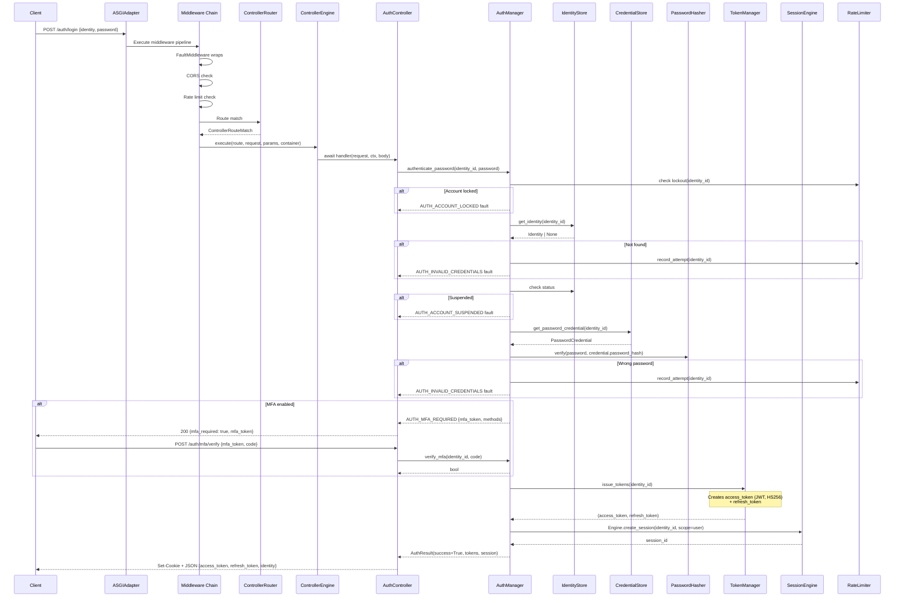
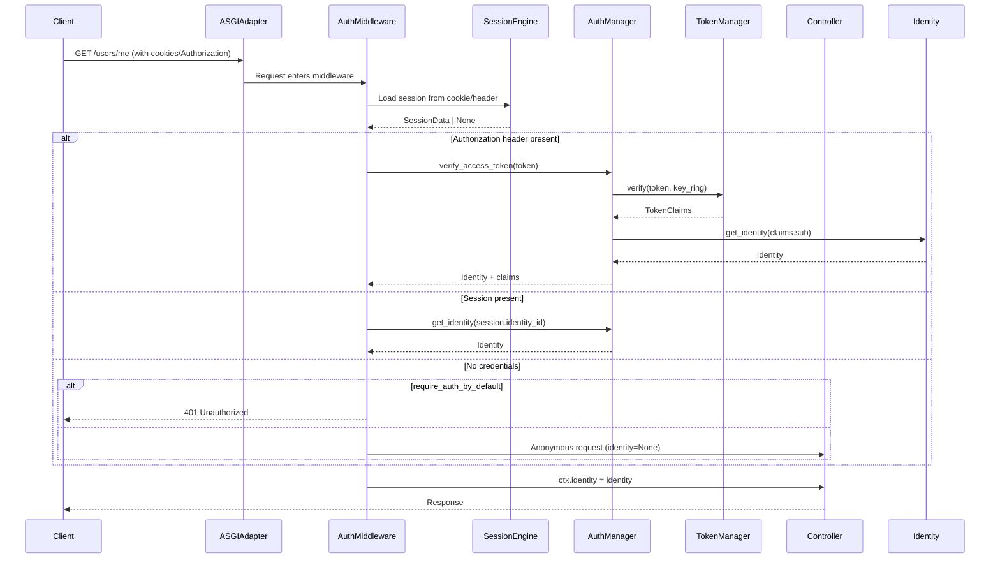
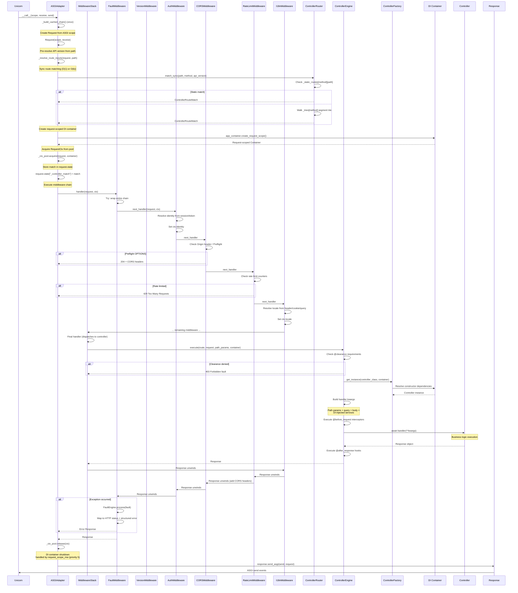
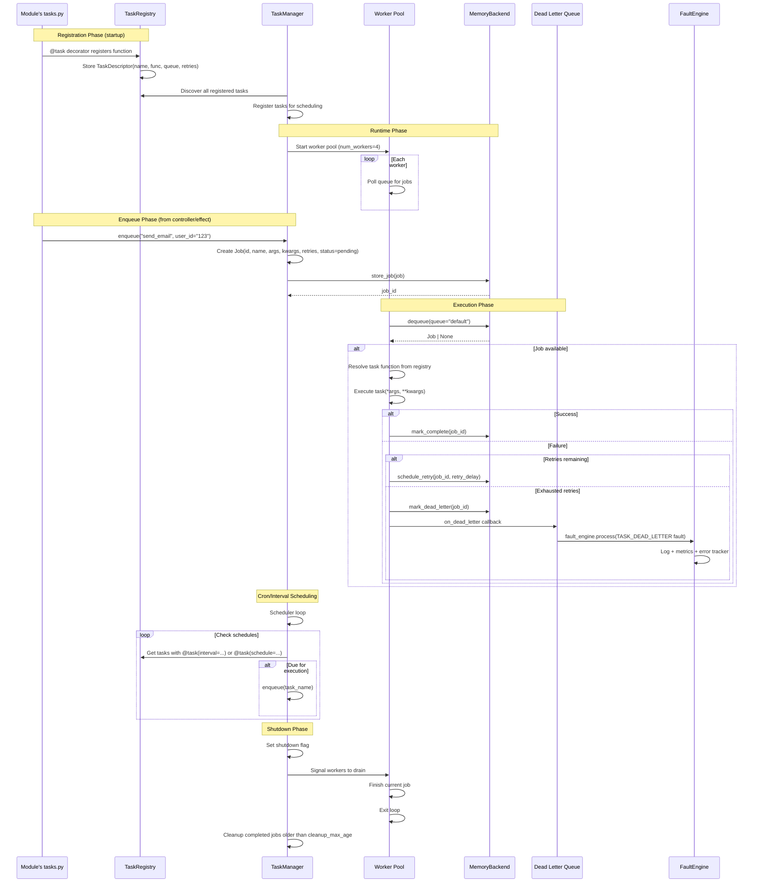
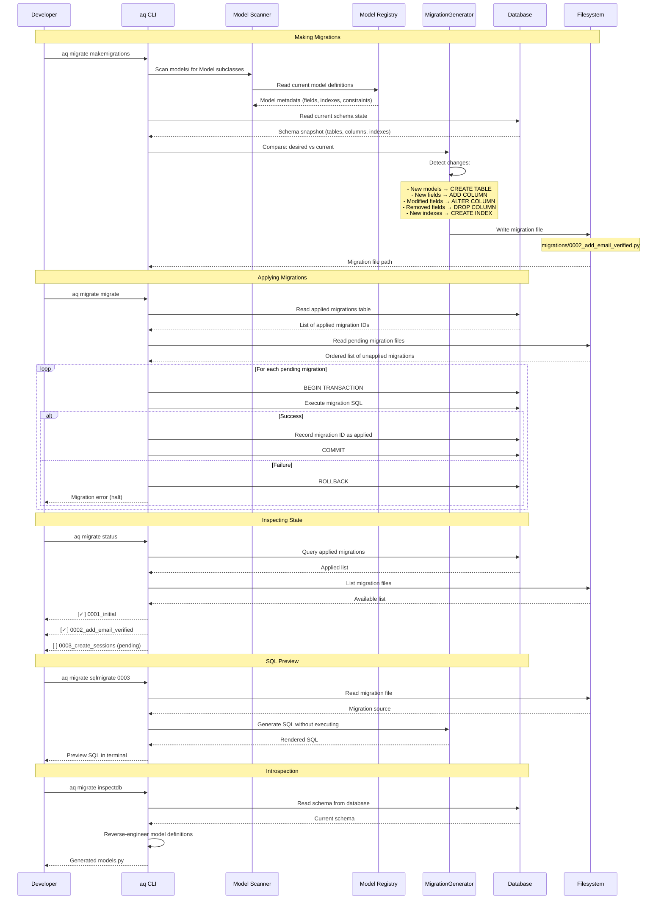
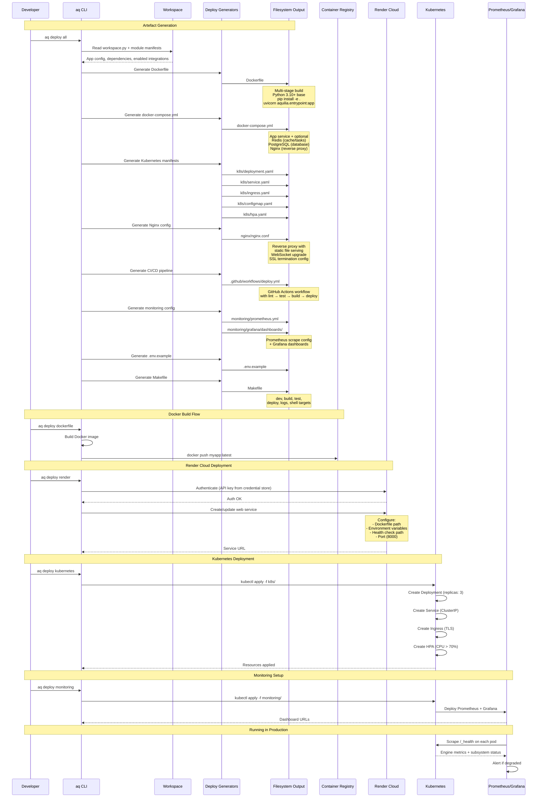

# Workflows

This page documents the four key system workflows as Mermaid sequence diagrams, showing the exact component interactions at each step.

---

## Authentication Flow

Password-based authentication with token issuance, session creation, and optional MFA.



### Auth Middleware (Per-Request)



---

## Request Pipeline

The complete HTTP request lifecycle from ASGI event to response.



### Error Handling in the Pipeline

The `FaultMiddleware` (priority 2) wraps the entire chain. When any middleware or controller raises a `Fault`:

1. `FaultMiddleware` catches the fault
2. Passes it to `FaultEngine.process(fault, app=app_name)`
3. `FaultEngine` runs registered handlers (logging, metrics, error tracker)
4. The fault is converted to an HTTP response:
    - **HTML clients:** Rendered Tubox error page (debug: stack traces; prod: sanitised)
    - **API clients:** Structured JSON `{"error": {"code": "...", "message": "...", "status": N}}`

The `request_scope_mw` (priority 5) has a `finally` block that always runs (even during exceptions, because `FaultMiddleware` catches them first) to ensure DI container cleanup.

---

## Background Task Execution

How tasks are defined, enqueued, scheduled, executed, and monitored.



### Task Decorator API

```python
@task(
    queue="priority",           # Queue name (default: "default")
    retries=3,                  # Max retry attempts
    retry_delay=60,             # Seconds between retries
    retry_backoff=2.0,          # Exponential backoff multiplier
    timeout=300,                # Max execution time in seconds
    priority=5,                 # 1-10 (higher = more urgent)
)
async def process_order(order_id: str) -> dict:
    ...

@task(interval=Interval(minutes=30))
async def hourly_cleanup() -> None:
    ...

@task(schedule=CronSchedule(minute="0", hour="2"))
async def nightly_report() -> None:
    ...
```

---

## Migration Workflow

Database schema management with migration generation, application, and rollback.



### Migration File Structure

```python
# migrations/0002_add_email_verified.py
from aquilia.db.migrations import Migration, operations

class Migration:
    dependencies = ["0001_initial"]

    operations = [
        operations.AddField(
            model="User",
            name="email_verified",
            field=operations.BooleanField(default=False),
        ),
        operations.AddField(
            model="User",
            name="verified_at",
            field=operations.DateTimeField(null=True),
        ),
        operations.CreateIndex(
            model="User",
            name="idx_user_email_verified",
            fields=["email_verified"],
        ),
    ]
```

---

## Deployment Workflow

End-to-end deployment pipeline from workspace to production.



### Generated Dockerfile

```dockerfile
# Multi-stage build generated by aq deploy dockerfile
FROM python:3.10-slim as builder
WORKDIR /app
COPY requirements.txt .
RUN pip install --user -r requirements.txt

FROM python:3.10-slim
WORKDIR /app
COPY --from=builder /root/.local /root/.local
COPY . .
ENV PATH=/root/.local/bin:$PATH
ENV AQUILIA_WORKSPACE=/app
ENV AQUILIA_ENV=prod
EXPOSE 8000
CMD ["uvicorn", "aquilia.entrypoint:app", "--host", "0.0.0.0", "--port", "8000"]
```

### Generated docker-compose.yml

```yaml
version: "3.8"
services:
  app:
    build: .
    ports:
      - "8000:8000"
    environment:
      - AQUILIA_WORKSPACE=/app
      - AQUILIA_ENV=prod
      - AQ_SECRET_KEY=${AQ_SECRET_KEY}
    depends_on:
      - redis
      - postgres
    healthcheck:
      test: ["CMD", "curl", "-f", "http://localhost:8000/_health"]
      interval: 30s
      retries: 3

  redis:
    image: redis:7-alpine
    ports:
      - "6379:6379"

  postgres:
    image: postgres:15-alpine
    environment:
      - POSTGRES_DB=myapp
      - POSTGRES_USER=myapp
      - POSTGRES_PASSWORD=${DB_PASSWORD}
    volumes:
      - pgdata:/var/lib/postgresql/data

volumes:
  pgdata:
```

### Environment Configuration Tiers

| Priority | Source | Example |
|----------|--------|---------|
| 1 (highest) | `.env` file (loaded by `ConfigLoader`) | `SECRET_KEY=xxx` |
| 2 | Environment variables | `AQ_SECRET_KEY=xxx` |
| 3 | `workspace.py` config | `Integration.cache(backend="redis")` |
| 4 | Module defaults | `AppManifest.defaults` |
| 5 (lowest) | Framework defaults | `mode="prod"` |

### CI/CD Pipeline (GitHub Actions)

```yaml
name: Deploy
on:
  push:
    branches: [main]
jobs:
  lint:
    runs-on: ubuntu-latest
    steps:
      - uses: actions/checkout@v4
      - uses: actions/setup-python@v5
        with: { python-version: "3.13" }
      - run: pip install ruff
      - run: ruff check aquilia/
      - run: ruff format --check aquilia/

  test:
    needs: lint
    runs-on: ubuntu-latest
    strategy:
      matrix:
        python-version: ["3.10", "3.11", "3.12", "3.13"]
    steps:
      - uses: actions/checkout@v4
      - uses: actions/setup-python@v5
        with: { python-version: ${{ matrix.python-version }} }
      - run: pip install -e ".[dev]"
      - run: pytest tests/ -v --tb=short -q

  build-and-push:
    needs: test
    runs-on: ubuntu-latest
    steps:
      - uses: actions/checkout@v4
      - run: docker build -t myapp:${{ github.sha }} .
      - run: docker push myapp:${{ github.sha }}

  deploy:
    needs: build-and-push
    runs-on: ubuntu-latest
    steps:
      - uses: actions/checkout@v4
      - run: pip install aquilia
      - run: aq deploy render
```