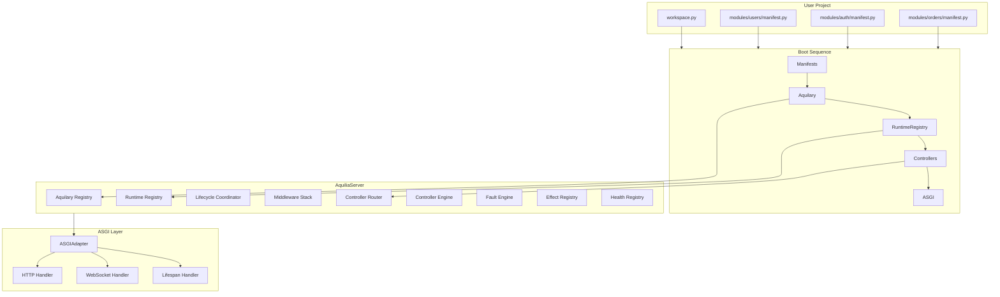
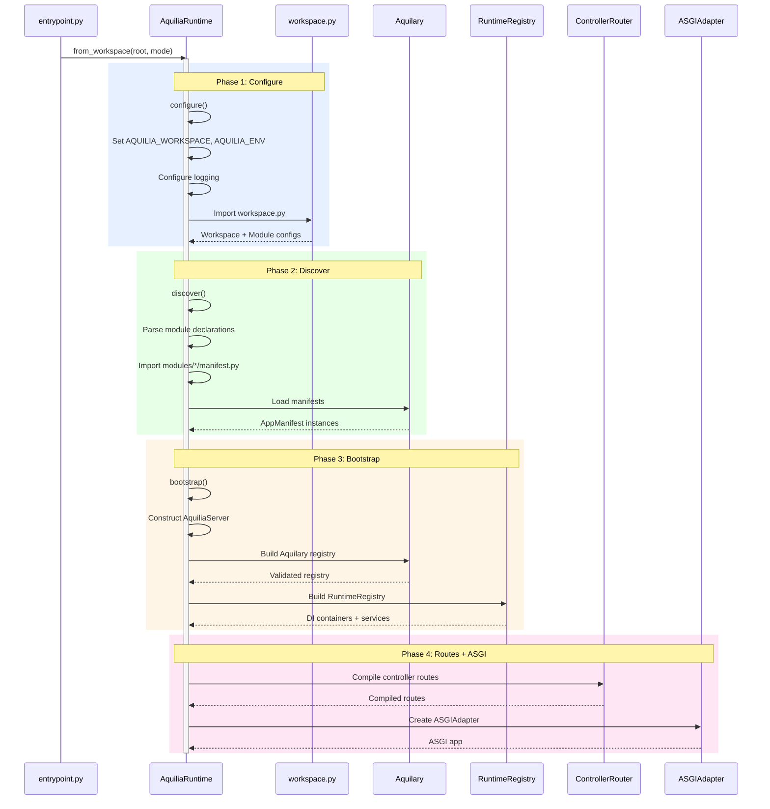
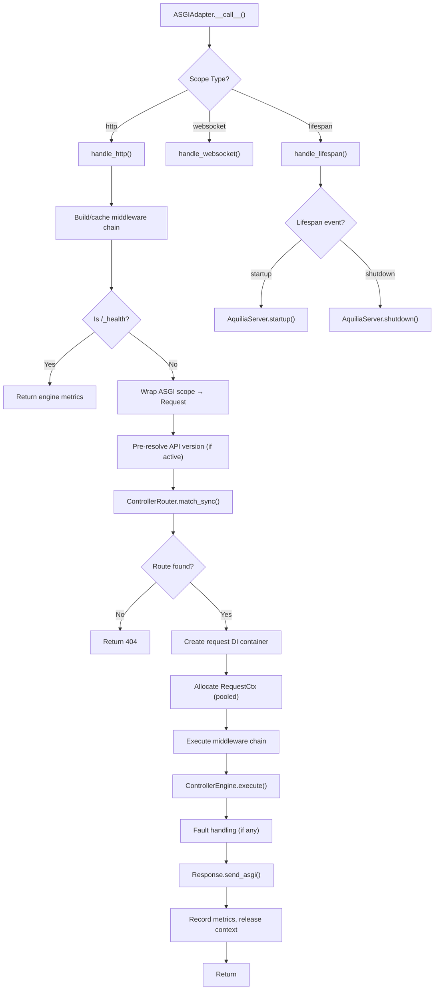

# Architecture

Aquilia follows a **manifest-first, layered composition** architecture. The boot sequence progresses through five deterministic phases: manifests are discovered, metadata is compiled into the Aquilary registry, DI containers are built, controllers are routed, and finally an ASGI adapter bridges everything to the protocol layer.

## High-Level Architecture



## Boot Sequence in Detail

The five-phase boot sequence is the backbone of every Aquilia application:



### Phase 1: Configuration

`AquiliaRuntime.configure()` sets the workspace root in `sys.path`, resolves `AQUILIA_ENV` and `AQUILIA_WORKSPACE` environment variables, configures structured logging, verifies the existence of `workspace.py`, and loads configuration through `ConfigLoader`. The loader merges workspace structure, `.env` files, and `AQ_` prefixed environment variable overlays.

### Phase 2: Discovery

`AquiliaRuntime.discover()` imports `workspace.py`, extracts declared `Module` pointers, imports each `modules/<name>/manifest.py`, and performs dynamic module discovery for directories containing a `manifest.py`. Each manifest's `AppManifest` declares its controllers, services, middleware, models, task handlers, socket controllers, and fault handlers via dotted component references.

### Phase 3: Bootstrap — Aquilary Registry

`AquiliaServer` builds the **Aquilary registry** — the central metadata store. The registry validates manifest compatibility, resolves dependency ordering between modules, checks for route conflicts, and produces a `RuntimeRegistry` with compiled component metadata. A cryptographic fingerprint is generated for deterministic deployments.

### Phase 4: Dependency Injection

The `RuntimeRegistry` builds hierarchical **DI containers**: singleton scope (process-wide), app scope (per-module), and request scope (per-request). Service providers, factory functions, and value providers are registered with their lifecycle policies. Cross-module dependency imports/exports are enforced.

### Phase 5: Controller Routing

`ControllerRouter` compiles all controller route decorators into a segment trie: static routes use `O(1)` dict lookups per HTTP method, dynamic routes use `O(k)` trie traversal (where `k` is URL path depth), and complex patterns fall back to regex matching.

## Component Architecture

```mermaid
flowchart LR
    subgraph Workspace["Workspace Orchestration"]
        direction TB
        WCONF["Workspace<br/>Name, Version, Mode"]
        WMOD["Module<br/>route_prefix, depends_on, tags"]
        WINT["Integration<br/>Database, Cache, Storage, Mail"]
    end

    subgraph Manifest["Module Manifest"]
        direction TB
        MCTRL["Controllers"]
        MSVC["Services"]
        MMW["Middleware"]
        MMODEL["Models"]
        MSOCK["Socket Controllers"]
        MTASK["Background Tasks"]
        MFAULT["Fault Handlers"]
    end

    subgraph Registry["Aquilary Registry"]
        direction TB
        AVAL["Validator<br/>Dependencies, Routes, Config"]
        ALOAD["Loader<br/>Import manifests, Resolve refs"]
        AFINGER["Fingerprint<br/>Deterministic build hash"]
    end

    subgraph DI["Runtime Registry"]
        direction TB
        DID["DI Containers<br/>Singleton / App / Request"]
        DIPROV["Providers<br/>Class, Factory, Value, Pool"]
        DILIFE["Lifecycle Hooks<br/>startup / shutdown / dispose"]
    end

    subgraph Runtime["Request Runtime"]
        direction TB
        RRMW["Middleware Stack<br/>Global → App → Controller → Route"]
        RRCTRL["Controller Engine<br/>Execute compiled route"]
        RREFF["Effect System<br/>DB, Cache, HTTP, Queue, Storage"]
        RRFM["Fault Middleware<br/>Convert faults to HTTP responses"]
    end

    Workspace --> Manifest
    Manifest --> Registry
    Registry --> DI
    DI --> Runtime
```



## Request Lifecycle



## Key Architectural Properties

| Property | Implementation |
|---|---|
| **Manifest-first** | No import-time side effects. All components declared in manifests, loaded on demand. |
| **Segmented routing** | Segment trie for `O(k)` dynamic route matching. Static routes use `O(1)` dict lookups. |
| **Pooled contexts** | `RequestCtx` uses a pre-allocated ring buffer pool, eliminating per-request allocations. |
| **Hierarchical DI** | Singleton → App → Request scopes with cycle detection and lazy resolution. |
| **Structured faults** | Every error is a `Fault` subclass with domain, code, severity, and recovery strategy. |
| **Effect awareness** | Handlers declare required capabilities. The runtime acquires and releases resources automatically. |
| **Deterministic builds** | Registry fingerprinting enables frozen deployments and integrity verification. |
| **Health tracking** | `HealthRegistry` monitors every subsystem with composable `HealthStatus` checks. |

## Directory Layout

```
my-project/
├── workspace.py              # Workspace + Module + Integration declarations
├── modules/
│   ├── users/
│   │   ├── manifest.py       # AppManifest: controllers, services, models
│   │   ├── controllers.py    # Controller classes
│   │   ├── services.py       # Business logic services
│   │   ├── models.py         # ORM models
│   │   └── blueprints.py     # Request/response Blueprints
│   ├── auth/
│   │   ├── manifest.py
│   │   ├── controllers.py
│   │   ├── guards.py
│   │   └── services.py
│   └── orders/
│       ├── manifest.py
│       ├── controllers.py
│       ├── services.py
│       └── models.py
├── templates/                # Jinja2 templates
├── migrations/               # Database migrations
├── .env                     # Environment variables
└── config/                   # Additional Python config (optional)
```

## Design Decisions

### Why Manifest-First?

Traditional Python frameworks often rely on import-time side effects (decorator registration, global route tables) that make testing, tooling, and introspection fragile. Aquilia's manifest-first design means:

- **No global state** — every piece of metadata is declared explicitly in `manifest.py`.
- **Tooling-friendly** — the `aq` CLI can inspect, validate, and freeze manifests without executing application code.
- **Test isolation** — test suites can construct `AquiliaServer` with a subset of manifests.
- **Deterministic deployment** — the registry fingerprint guarantees that what was tested is what gets deployed.

### Why Segment Trie Routing?

`ControllerRouter` uses a radix (segment) trie rather than regex iteration:

- Static paths (`/users`, `/users/profile`) use `O(1)` dict lookups.
- Dynamic paths (`/users/{id:int}`, `/posts/{slug}`) use `O(k)` trie traversal with inline type casting.
- Regex is only a fallback for patterns the trie cannot express (e.g., `/{filename}.{ext}`).

### Why Pooled RequestCtx?

Per-request heap allocation of context objects adds measurable overhead at scale. `_RequestCtxPool` pre-allocates a ring buffer of `RequestCtx` instances with `__slots__` for compact memory. `acquire()` resets fields in-place, eliminating allocations from the hot path.