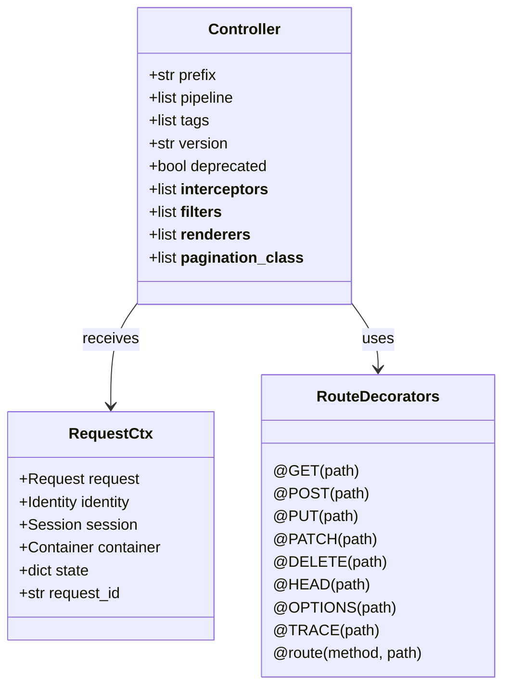
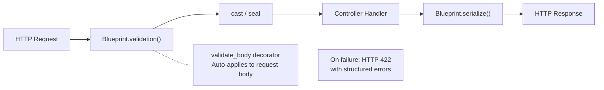
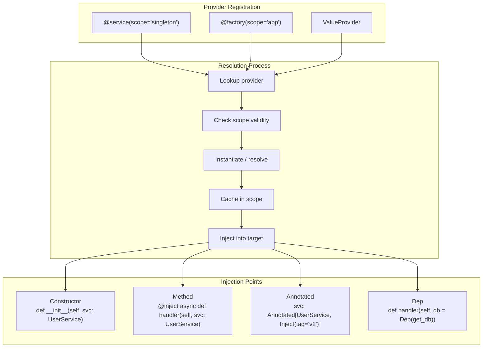
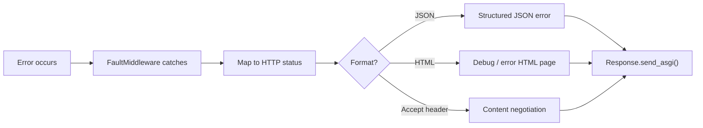
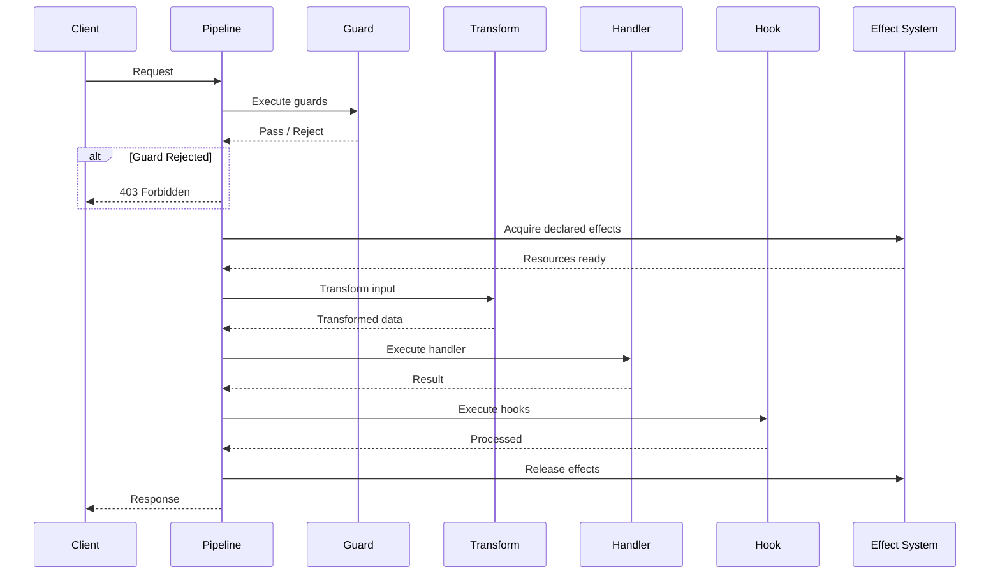

# Core Concepts

This page explains every foundational concept in Aquilia with practical code examples.

## Controllers

Controllers are the primary unit of HTTP request handling. A controller is a class inheriting from `Controller` with route-decorated async methods.



### Basic Controller

```python
from aquilia import Controller, GET, POST, PUT, DELETE, RequestCtx, Response

class UsersController(Controller):
    prefix = "/users"
    tags = ["users"]

    @GET("/")
    async def list_users(self, ctx: RequestCtx):
        users = await self.user_service.list_all()
        return Response.json(users)

    @GET("/{id:int}")
    async def get_user(self, ctx: RequestCtx, id: int):
        user = await self.user_service.get_by_id(id)
        if not user:
            raise UserNotFoundFault(user_id=id)
        return Response.json(user)

    @POST("/")
    async def create_user(self, ctx: RequestCtx):
        body = await ctx.request.json()
        user = await self.user_service.create(body)
        return Response.json(user, status=201)

    @PUT("/{id:int}")
    async def update_user(self, ctx: RequestCtx, id: int):
        body = await ctx.request.json()
        user = await self.user_service.update(id, body)
        return Response.json(user)

    @DELETE("/{id:int}")
    async def delete_user(self, ctx: RequestCtx, id: int):
        await self.user_service.delete(id)
        return Response.json({"deleted": True})
```

### Route Parameters

Aquilia supports typed path parameters and query parameter injection:

```python
class ReportsController(Controller):
    prefix = "/reports"

    @GET("/{year:int}/{month:int}")
    async def monthly_report(self, ctx: RequestCtx, year: int, month: int):
        data = await self.report_service.generate(year, month)
        return Response.json(data)

    @GET("/search")
    async def search(self, ctx: RequestCtx, q: str = "", limit: int = 20, offset: int = 0):
        results = await self.search_service.query(q, limit=limit, offset=offset)
        return Response.json(results)
```

| Parameter Syntax | Type | Example |
|---|---|---|
| `{name}` | `str` (default) | `/users/{username}` |
| `{name:int}` | `int` | `/users/{id:int}` |
| `{name:float}` | `float` | `/metrics/{value:float}` |
| `{name:uuid}` | `uuid.UUID` | `/items/{id:uuid}` |
| `{name:path}` | `str` (greedy) | `/files/{path:path}` |
| `{name:slug}` | `str` (slug) | `/articles/{slug:slug}` |

### Controller Features

```python
from aquilia import Controller, GET, Interceptor, Throttle

class AuditInterceptor(Interceptor):
    async def before(self, ctx):
        ctx.state["start_time"] = time.time()

    async def after(self, ctx, response):
        duration = time.time() - ctx.state["start_time"]
        logger.info(f"{ctx.request.method} {ctx.request.url.path} took {duration:.3f}s")

class SecureController(Controller):
    prefix = "/secure"
    pipeline = [JWTAuthGuard()]
    tags = ["secure", "protected"]
    __interceptors__ = [AuditInterceptor()]

    @GET("/")
    @Throttle(limit=100, window=60)
    async def dashboard(self, ctx: RequestCtx):
        return Response.json({"message": "Secure dashboard"})
```

## Blueprints

Blueprints define **typed contracts** for request and response bodies. They validate, transform, and serialize data flowing in and out of controllers.



### Defining a Blueprint

```python
from aquilia.blueprints import Blueprint, Field, validators

class CreateUserBlueprint(Blueprint):
    name: str = Field(min_length=1, max_length=100)
    email: str = Field(validator=validators.Email())
    age: int = Field(ge=0, le=150)
    role: str = Field(default="user", choices=["user", "admin", "moderator"])
    tags: list[str] = Field(default_factory=list, max_items=10)

    class Meta:
        strict = True  # Reject unknown fields
        frozen = True  # Immutable after creation
```

### Using Blueprints in Controllers

```python
from aquilia.controller.validation import validate_body

class UsersController(Controller):
    prefix = "/users"

    @POST("/")
    @validate_body(CreateUserBlueprint)
    async def create_user(self, ctx: RequestCtx, body: CreateUserBlueprint):
        # body is a validated, typed CreateUserBlueprint instance
        user = await self.user_service.create(body)
        return Response.json(user.model_dump(), status=201)
```

### Blueprint Features

| Feature | Description |
|---|---|
| `Field(ge=, le=, min_length=, max_length=)` | Numeric and string constraints |
| `Field(validator=)` | Custom validation callables |
| `Field(choices=)` | Enumerated value constraints |
| `Field(default=)` | Default values |
| `Field(default_factory=)` | Default factory functions |
| `Meta.strict = True` | Reject unknown fields |
| `Meta.frozen = True` | Immutable instances |
| `nested Blueprints` | Composition and reuse |
| `Facets` | Subset views for different contexts |
| `Lenses` | Transformations between Blueprint shapes |

## Dependency Injection



### Service Registration

```python
from aquilia.di import service, factory, Container

@service(scope="singleton")
class Database:
    def __init__(self, config: DatabaseConfig):
        self.pool = config.create_pool()

@service(scope="app")
class UserRepository:
    def __init__(self, db: Database):
        self.db = db

    async def find_all(self):
        async with self.db.session() as s:
            return await s.execute("SELECT * FROM users")

@service(scope="request")
class RequestMetrics:
    def __init__(self):
        self.start_time = time.time()
        self.queries = 0
```

### Constructor Injection

```python
from aquilia import Controller, GET, RequestCtx

class UsersController(Controller):
    prefix = "/users"

    def __init__(self, user_repo: UserRepository, metrics: RequestMetrics):
        self.user_repo = user_repo
        self.metrics = metrics

    @GET("/")
    async def list_users(self, ctx: RequestCtx):
        users = await self.user_repo.find_all()
        return Response.json(users)
```

### Method Injection with `@inject`

```python
from aquilia.di import inject

class ReportsController(Controller):
    prefix = "/reports"

    @GET("/")
    @inject
    async def generate_report(self, ctx: RequestCtx, report_service: ReportService):
        return await report_service.generate()
```

### Using `Dep` for Explicit Dependencies

```python
from aquilia.di import Dep

async def get_current_user(ctx: RequestCtx):
    token = ctx.request.headers.get("Authorization")
    return await verify_token(token)

class ProfileController(Controller):
    prefix = "/profile"

    @GET("/")
    async def view(self, ctx: RequestCtx, user = Dep(get_current_user)):
        return Response.json(user)
```

## Faults

All framework errors use structured `Fault` subclasses rather than raw exceptions.



### Raising Faults

```python
from aquilia.faults import Fault, FaultDomain, Severity
from aquilia.faults.domains import HTTPFault

class UserNotFoundFault(Fault):
    def __init__(self, user_id: int):
        super().__init__(
            code="USER_NOT_FOUND",
            message=f"User {user_id} not found",
            domain=FaultDomain.custom("USERS"),
            severity=Severity.ERROR,
            retryable=False,
            public=True,
            metadata={"user_id": user_id},
        )

# Built-in HTTP fault shortcuts
def get_user(ctx, id: int):
    user = find_user(id)
    if not user:
        raise HTTPFault.not_found(f"User {id} not found")
    return user
```

### Fault Response Format

```json
{
    "error": {
        "code": "USER_NOT_FOUND",
        "message": "User 42 not found",
        "domain": "users",
        "severity": "error",
        "trace_id": "a1b2c3d4e5f6",
        "metadata": {
            "user_id": 42
        }
    }
}
```

### Fault Engine Configuration

```python
from aquilia.faults.engine import FaultEngine

# In production: hide internal details
fault_engine = FaultEngine(debug=False)

# In development: full tracebacks
fault_engine = FaultEngine(debug=True)
```

## Flow Pipeline

The Flow system provides typed, composable request pipelines:

```
Guard → Transform → Handler → Hook
```



### Pipeline Node Types

| Node Type | Purpose | Execution Order |
|---|---|---|
| `Guard` | Authorization, validation gate | First — can short-circuit |
| `Transform` | Input transformation | Before handler |
| `Handler` | Core business logic | Main execution |
| `Hook` | Post-processing, side effects | After handler |

### Defining a Pipeline

```python
from aquilia.flow import FlowPipeline, FlowNode, FlowNodeType

async def auth_guard(ctx):
    token = ctx.request.headers.get("Authorization")
    if not token:
        raise HTTPFault.unauthorized("Missing token")
    ctx.identity = await verify_token(token)
    return ctx

async def sanitize_input(ctx):
    ctx.state["body"] = strip_xss(ctx.state.get("body", {}))
    return ctx

async def log_request(ctx, result):
    logger.info(f"{ctx.request.method} {ctx.request.url.path} → {result.status}")
    return result

pipeline = FlowPipeline(
    nodes=[
        FlowNode(name="auth", fn=auth_guard, kind=FlowNodeType.GUARD, priority=10),
        FlowNode(name="sanitize", fn=sanitize_input, kind=FlowNodeType.TRANSFORM, priority=20),
        FlowNode(name="audit", fn=log_request, kind=FlowNodeType.HOOK, priority=90),
    ],
)
```

### Per-Route Pipelines

```python
class AdminController(Controller):
    prefix = "/admin"

    @GET("/users")
    @requires(pipeline=admin_pipeline)
    async def admin_list_users(self, ctx: RequestCtx):
        return Response.json(await self.repo.list_all())
```

## Effects

Effects represent **typed capabilities** that handlers declare and the runtime provides.

```python
from aquilia.effects import Effect, EffectKind, requires
from aquilia.flow import requires

DBTx = Effect("db_tx", kind=EffectKind.DB)
Cache = Effect("cache", kind=EffectKind.CACHE)
Queue = Effect("queue", kind=EffectKind.QUEUE)

@requires(DBTx["read"], Cache["user"])
async def get_user(user_id: int, db, cache):
    cached = await cache.get(f"user:{user_id}")
    if cached:
        return cached
    user = await db.fetch_one("SELECT * FROM users WHERE id = ?", user_id)
    await cache.set(f"user:{user_id}", user, ttl=300)
    return user
```

## Manifests

Every module has a `manifest.py` that declares its components:

```python
# modules/orders/manifest.py
from aquilia.manifest import AppManifest, ComponentRef, ComponentKind

manifest = AppManifest(
    name="orders",
    version="1.0.0",
    description="Order management module",

    controllers=[
        ComponentRef("modules.orders.controllers:OrdersController", ComponentKind.CONTROLLER),
        ComponentRef("modules.orders.controllers:InvoicesController", ComponentKind.CONTROLLER),
    ],

    services=[
        ComponentRef("modules.orders.services:OrderService", ComponentKind.SERVICE),
        ComponentRef("modules.orders.services:PricingService", ComponentKind.SERVICE),
    ],

    models=[
        ComponentRef("modules.orders.models:Order", ComponentKind.MODEL),
        ComponentRef("modules.orders.models:LineItem", ComponentKind.MODEL),
    ],

    middleware=[
        ComponentRef("modules.orders.middleware:OrderContextMiddleware", ComponentKind.MIDDLEWARE,
                     metadata={"scope": "app:orders", "priority": 150}),
    ],

    guards=[
        ComponentRef("modules.orders.guards:OrderOwnerGuard", ComponentKind.GUARD),
    ],

    fault_handlers={
        "orders": ComponentRef("modules.orders.faults:handle_order_fault", ComponentKind.FAULT_HANDLER),
    },

    task_handlers=[
        ComponentRef("modules.orders.tasks:send_invoice", ComponentKind.TASK),
    ],

    imports=["auth:AuthManager", "payments:PaymentGateway"],
    exports=["OrderService", "PricingService"],

    auto_discover=True,
)
```

### Workspace Registration

```python
# workspace.py
from aquilia.workspace import Workspace, Module
from aquilia.integrations import CacheIntegration, DatabaseIntegration, MailIntegration

workspace = (
    Workspace("myapp", version="1.0.0")
    .runtime(mode="dev", port=8000)
    .module(
        Module("users")
        .route_prefix("/users")
        .depends_on("auth")
        .tags(["core", "public"])
    )
    .module(
        Module("orders")
        .route_prefix("/orders")
        .depends_on("users", "payments")
        .tags(["core", "protected"])
    )
    .module(
        Module("auth")
        .route_prefix("/auth")
        .tags(["core", "internal"])
    )
    .integrate(
        DatabaseIntegration(engine="postgresql", url="postgresql://..."),
        CacheIntegration(backend="redis", url="redis://..."),
        MailIntegration(provider="smtp"),
    )
)
```

## Middleware

Middleware wraps the entire request pipeline in composable layers:

```python
from aquilia.middleware import Middleware

async def timing_middleware(request, handler):
    start = time.time()
    response = await handler(request)
    duration = time.time() - start
    response.headers["X-Response-Time"] = str(duration)
    return response
```

Middleware is registered in manifests with scope and priority:

| Scope | Priority Range | Description |
|---|---|---|
| `global` | 0–99 | Applies to every request across all modules |
| `app:<name>` | 100–199 | Applies to all routes under a module |
| `controller:<Name>` | 200–299 | Applies to all routes of a specific controller |
| `route:<pattern>` | 300–399 | Applies to a specific route pattern |