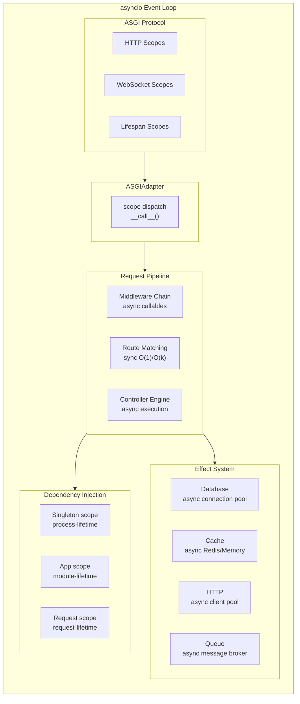
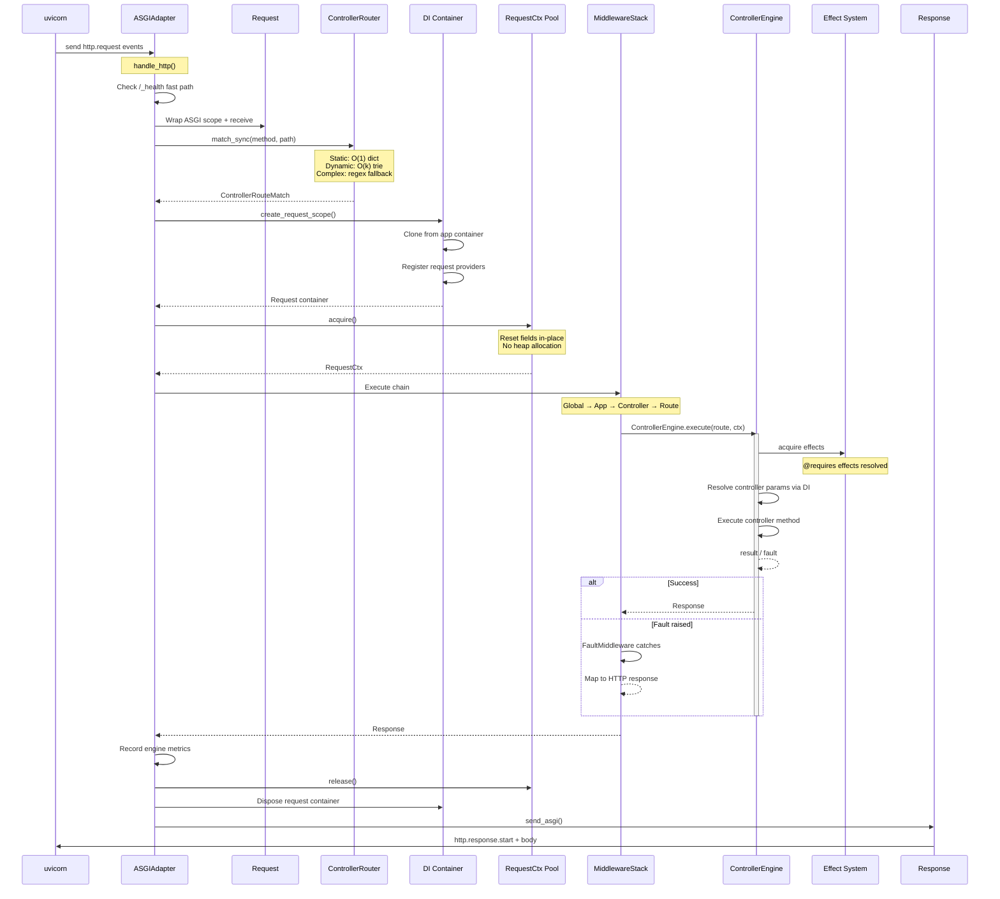
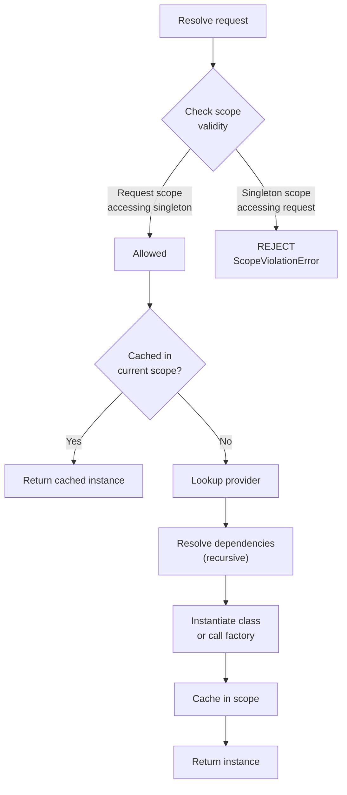
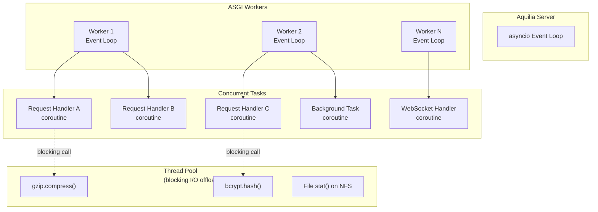
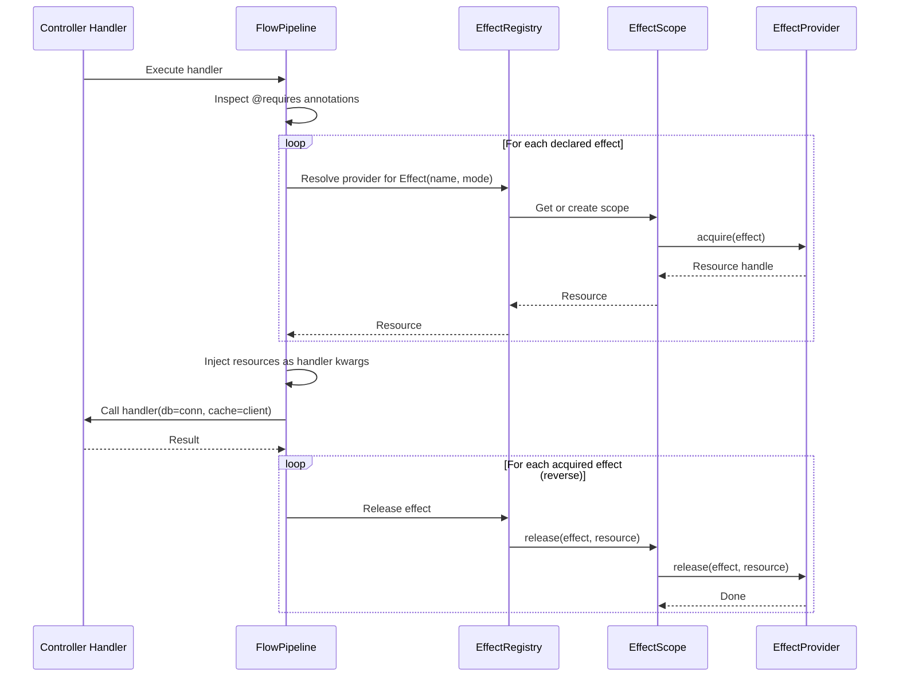
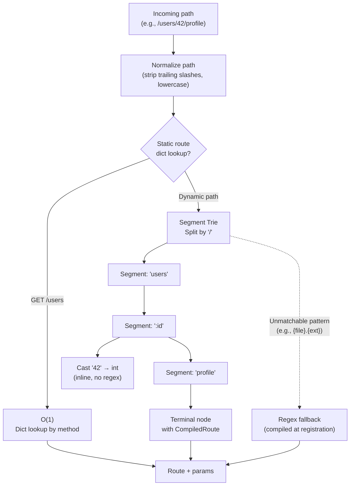
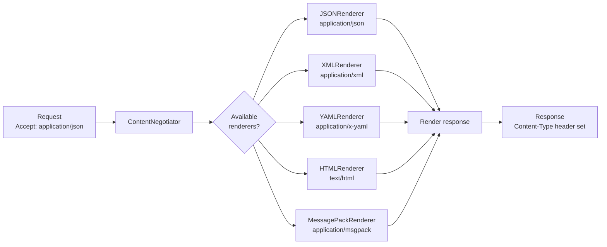
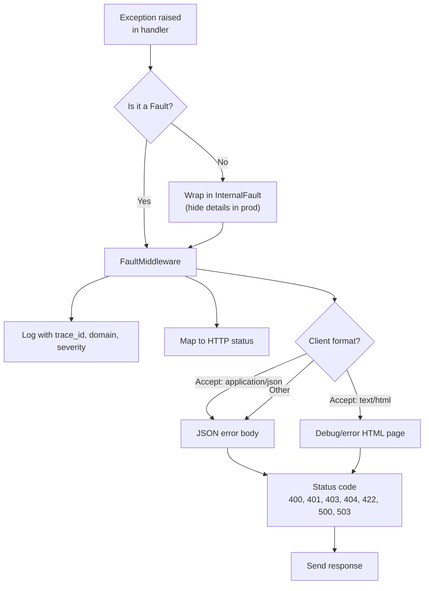

# Execution Model

Aquilia's execution model is **fully asynchronous** from the ASGI socket to the controller response. This page details how requests flow through the system, how concurrency is managed, and how each subsystem participates in request processing.

## Async Architecture



## Request Pipeline (Detailed)



## DI Resolution Model



### Scope Rules

| Parent Scope | Can Resolve From | Example |
|---|---|---|
| `request` | `request`, `app`, `singleton` | Controller constructor can inject an `app`-scoped repo |
| `app` | `app`, `singleton` | An `app`-scoped service can inject a `singleton`-scoped pool |
| `singleton` | `singleton` only | A singleton cannot depend on request-scoped providers |

Attempting to resolve a narrower scope from a wider scope raises `ScopeViolationError`:

```python
# This will fail at startup:
@service(scope="singleton")
class BadService:
    def __init__(self, request_metrics: RequestMetrics):  # RequestMetrics is request-scoped!
        ...
# Error: ScopeViolationError: singleton cannot depend on request-scoped provider
```

## Middleware Execution Chain

```mermaid
flowchart LR
    subgraph "Request →"
        direction LR
        MW1["FaultMiddleware<br/>Priority: 0, Global"]
        MW2["RequestScopeMiddleware<br/>Priority: 1, Global"]
        MW3["SecurityMiddleware<br/>Priority: 10, Global"]
        MW4["SessionMiddleware<br/>Priority: 20, Global"]
        MW5["AuthMiddleware<br/>Priority: 30, Global"]
        MW6["Custom App MW<br/>Priority: 150, app:users"]
        MW7["Controller MW<br/>Priority: 250, controller:Admin"]
        MW8["Route MW<br/>Priority: 350, route:/secure"]
    end

    subgraph "← Response"
        direction RL
        MW8R["Route MW<br/>post-processing"]
        MW7R["Controller MW<br/>post-processing"]
        MW6R["Custom App MW<br/>post-processing"]
        MW5R["AuthMiddleware<br/>post-processing"]
        MW4R["SessionMiddleware<br/>post-processing"]
        MW3R["SecurityMiddleware<br/>post-processing"]
        MW2R["RequestScopeMiddleware<br/>dispose scope"]
        MW1R["FaultMiddleware<br/>catch faults"]
    end

    MW1 --> MW2 --> MW3 --> MW4 --> MW5 --> MW6 --> MW7 --> MW8 --> HANDLER["Controller Handler"]
    HANDLER --> MW8R --> MW7R --> MW6R --> MW5R --> MW4R --> MW3R --> MW2R --> MW1R
```



### Middleware Function Signature

Every middleware follows the onion pattern:

```python
from aquilia.request import Request
from aquilia.response import Response
from aquilia.middleware import Handler

async def my_middleware(request: Request, next_handler: Handler) -> Response:
    # Pre-processing (before the handler)
    print(f"→ {request.method} {request.url.path}")

    # Call the next middleware or the final controller handler
    response = await next_handler(request)

    # Post-processing (after the handler)
    print(f"← {response.status}")

    return response
```

### Fast Path Optimization

For latency-sensitive routes, `build_fast_handler()` constructs a minimal middleware chain that skips non-essential middleware (Logging, Timeout):

```python
@GET("/health-check")
async def health_check(self, ctx: RequestCtx):
    return Response.json({"status": "ok"})
```

## Concurrency Model



### Concurrency Key Points

1. **One event loop per worker** — Each ASGI worker runs its own asyncio event loop. Multiple workers provide process-level parallelism.

2. **Cooperative concurrency** — All framework code uses `await` for I/O. There are no blocking calls on the event loop. Heavy CPU work should be offloaded.

3. **Blocking I/O offload** — The `CompressionMiddleware` offloads `gzip.compress()` to a thread pool via `loop.run_in_executor()` to avoid event loop stalls.

4. **No shared mutable state** — The `singleton` scope is process-local (not shared across workers). Request-scoped state is strictly per-request.

5. **In-flight tracking** — `EngineMetrics` tracks active request count for graceful shutdown draining.

## Effect Resolution



### Effect Lifecycle

```python
from aquilia.effects import EffectProvider, Effect

class DatabaseProvider(EffectProvider):
    async def acquire(self, effect: Effect):
        # Called before the handler executes
        conn = await self.pool.acquire()
        await conn.begin()
        return conn

    async def release(self, effect: Effect, resource):
        # Called after the handler returns (or raises)
        try:
            await resource.commit()
        except Exception:
            await resource.rollback()
        finally:
            await self.pool.release(resource)
```

## Route Matching Performance



### Trie Structure

```
/users                              → static node (GET, POST, PUT)
    /:id                            → param node
        /profile                    → static node (GET)
        /orders                     → static node (GET)
    /search                         → static node (GET)
    /export                         → static node (POST)
/products                           → static node (GET)
    /:slug                          → param node (GET)
```

Static routes (`/users`, `/products`) use `O(1)` dict lookups keyed by HTTP method. Dynamic routes (`/users/42/profile`) walk `O(k)` trie segments where `k` is the path depth (typically 2–4 for REST APIs).

## Content Negotiation & Serialization



Controllers can specify preferred renderers:

```python
class APIController(Controller):
    prefix = "/api"
    __renderers__ = [JSONRenderer(), XMLRenderer()]

    @GET("/data")
    async def get_data(self, ctx: RequestCtx):
        data = await self.service.fetch()
        return data  # Renderer serializes based on Accept header
```

## Error Handling Flow



### Fault to HTTP Status Mapping

| Fault Domain | Default Status | Overridable |
|---|---|---|
| `config` | 500 | No (server error) |
| `registry` | 500 | No (server error) |
| `di` | 500 | No (server error) |
| `routing` | 404 | Yes (per fault code) |
| `flow` | 403 / 500 | Yes |
| `effect` | 503 | Yes |
| `security` | 401 / 403 | Yes |
| `http` | 400 / 415 / 422 | Yes |
| `model` | 500 | Yes |
| `io` | 500 | Yes |

## Metrics & Observability

The execution model is instrumented throughout:

```python
from aquilia.engine import get_engine_metrics

metrics = get_engine_metrics()
# {
#     "requests_total": 15042,
#     "requests_active": 3,
#     "responses_2xx": 14800,
#     "responses_4xx": 200,
#     "responses_5xx": 42,
#     "avg_response_time_ms": 12.4,
#     "p50_ms": 8.2,
#     "p95_ms": 34.7,
#     "p99_ms": 120.3,
# }
```

OpenTelemetry integration provides distributed tracing across the entire execution path:

- **Span per request** — HTTP method, path, status code
- **Span per middleware** — Timing for each middleware layer
- **Span per DI resolution** — Provider lookup and instantiation
- **Span per effect** — Acquire/release timing
- **Span per DB query** — Query text and timing (parameterized, no data leakage)