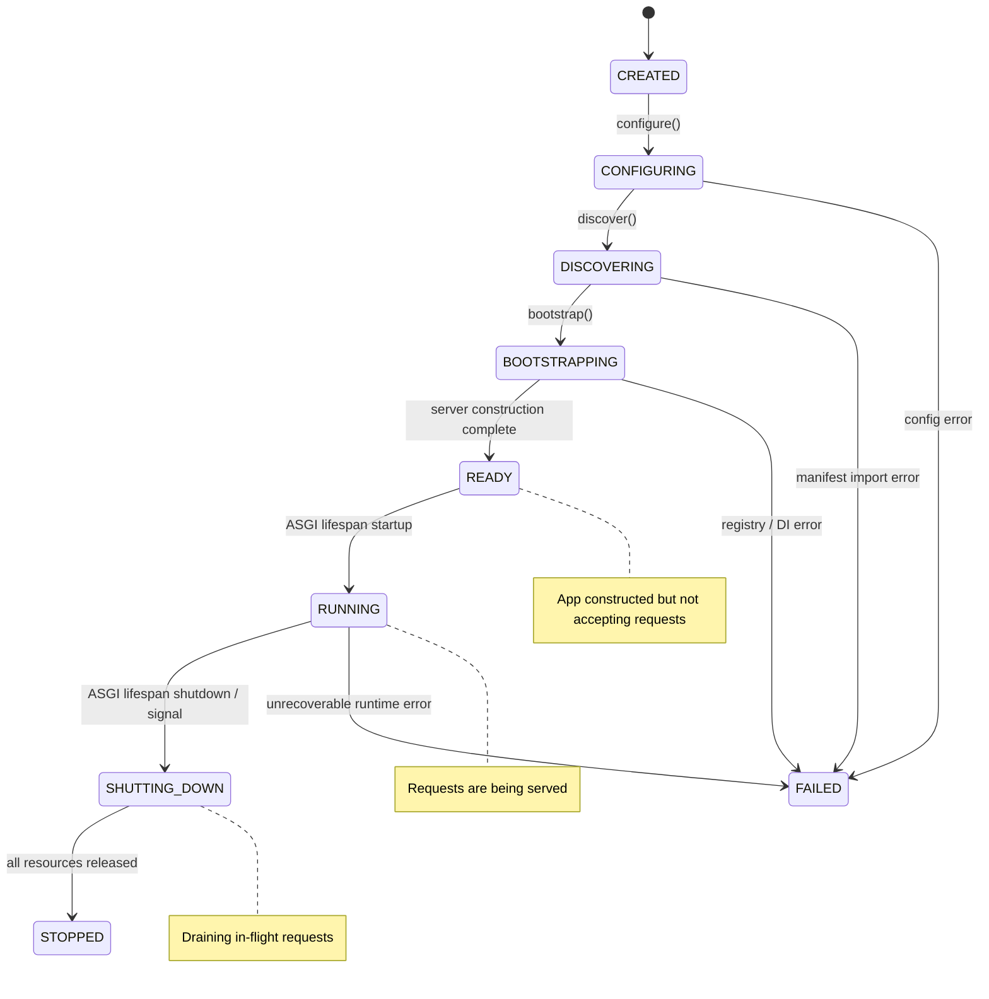
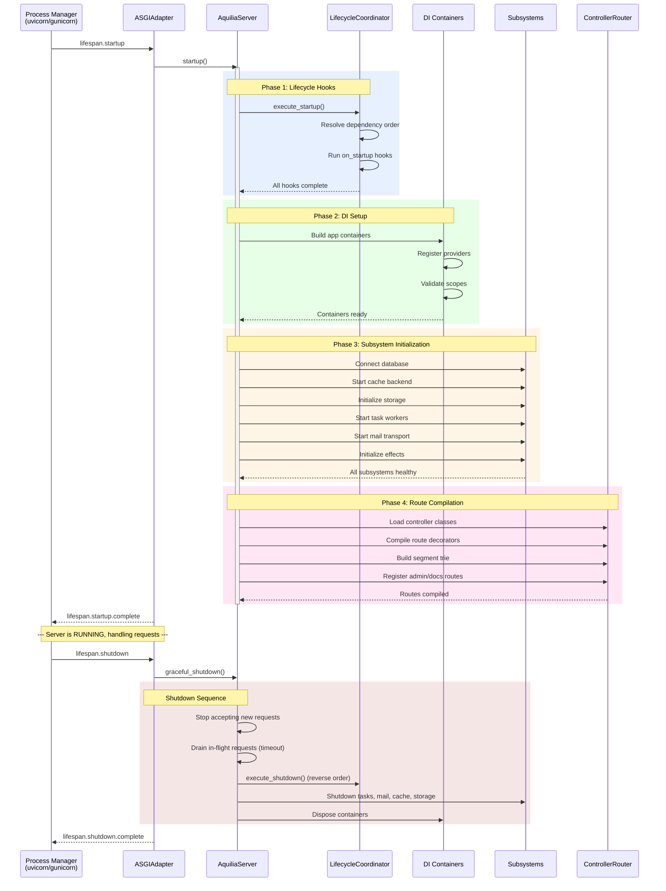
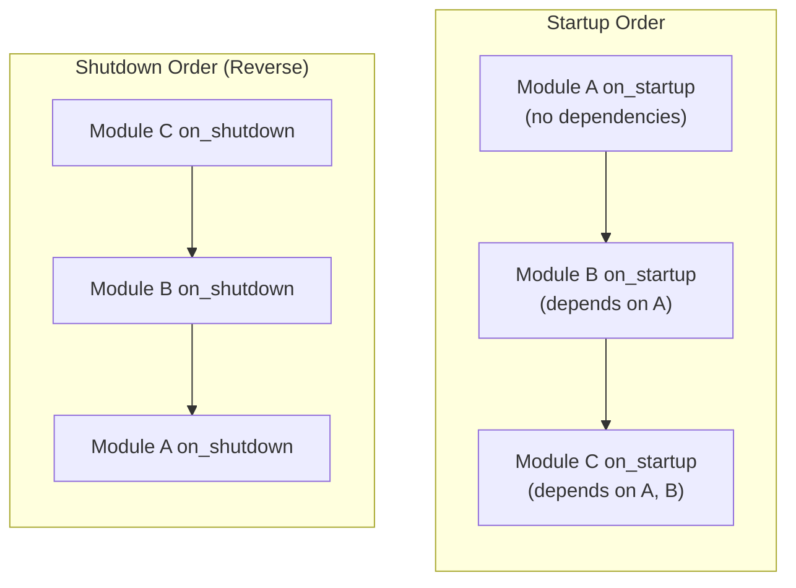
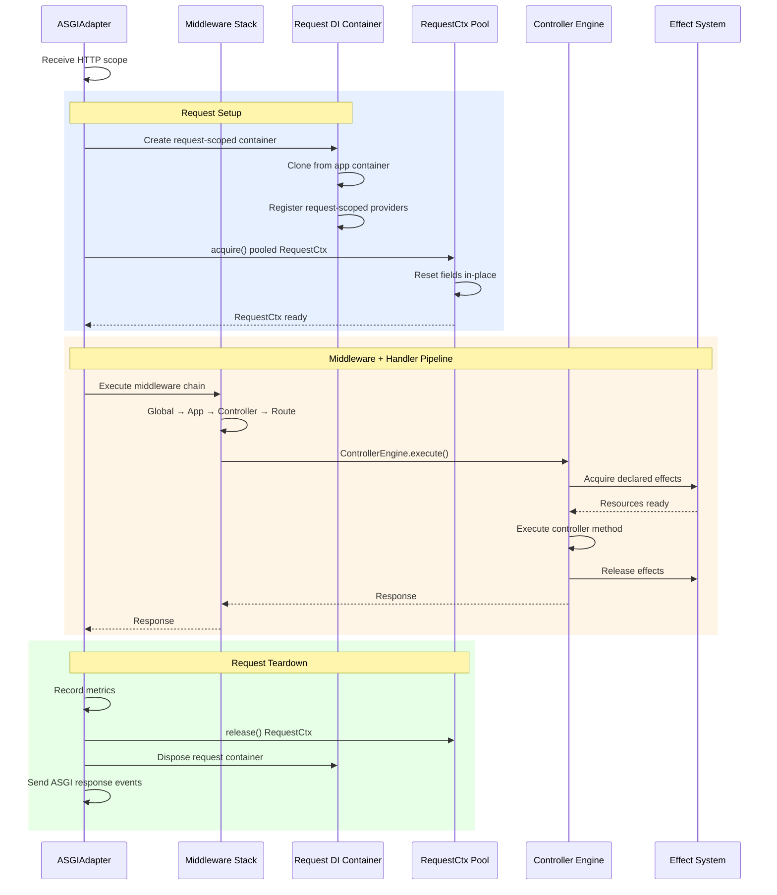
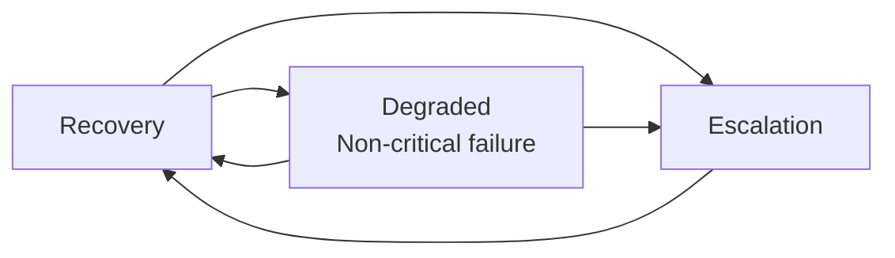
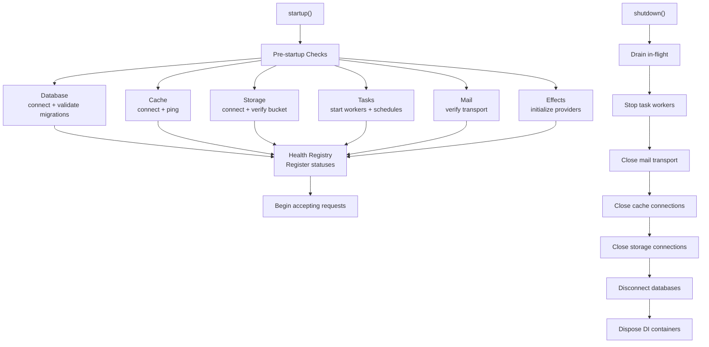
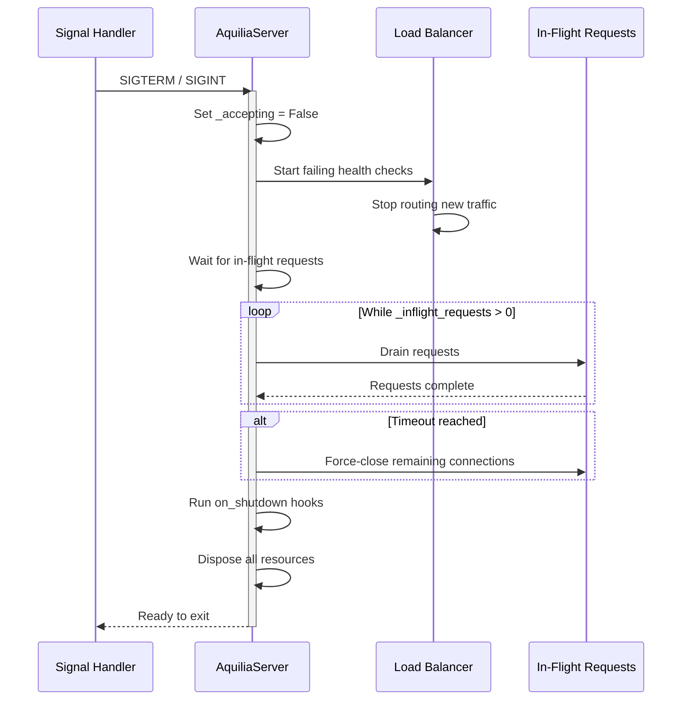

# Application Lifecycle

Aquilia manages application state through a well-defined lifecycle with explicit phases, hooks, and coordination across all modules. Every phase is observable, and failures are handled gracefully with rollback support.

## Lifecycle State Machine



## Runtime Phases

### CREATED

The initial state. No configuration has been loaded, no modules discovered. The runtime is a blank slate.

### CONFIGURING

`configure()` loads environment variables, sets up logging, imports `workspace.py`, and loads configuration via `ConfigLoader`. This phase verifies that the workspace file exists and is valid before proceeding.

```
AQUILIA_WORKSPACE=/app → workspace.py found → ConfigLoader merges .env + AQ_* vars
```

### DISCOVERING

`discover()` imports module manifests, resolves component references, performs dynamic module discovery, and rebuilds namespace configuration. Every `ComponentRef` with a `"module.path:ClassName"` format is validated for importability.

### BOOTSTRAPPING

`bootstrap()` constructs `AquiliaServer` with the compiled registry, builds DI containers, creates the lifecycle coordinator, initializes the middleware stack, compiles controller routes, and prepares the ASGI adapter.

### READY

The server is fully constructed and validated. The ASGI application exists but the lifespan startup event has not yet been received. Routes are compiled and middleware is built.

### RUNNING

The ASGI lifespan `startup` event has been received. `AquiliaServer.startup()` has executed all `on_startup` hooks. Requests are being accepted and served.

### SHUTTING_DOWN

The ASGI lifespan `shutdown` event was received OR a `SIGTERM`/`SIGINT` signal was caught. New requests are rejected. In-flight requests are drained up to a configurable grace period. `on_shutdown` hooks execute in reverse dependency order.

### STOPPED

All resources are released. DI containers are disposed. Database connections are closed. Cache connections are terminated. The process is ready to exit.

### FAILED

An unrecoverable error occurred. The runtime logs the failure with full context and transitions to this terminal state.

## ASGI Lifespan Protocol



## Lifecycle Hooks

Lifecycle hooks allow modules to execute startup and shutdown logic. Hooks execute in **dependency order** on startup and **reverse dependency order** on shutdown.



### Defining Hooks in Manifests

```python
# modules/database/manifest.py
manifest = AppManifest(
    name="database",
    on_startup="modules.database.lifecycle:setup_pool",
    on_shutdown="modules.database.lifecycle:teardown_pool",
)

# modules/database/lifecycle.py
async def setup_pool(app):
    app.state.db_pool = await create_pool(app.config.get("database.url"))
    logger.info("Database pool created")

async def teardown_pool(app):
    await app.state.db_pool.close()
    logger.info("Database pool closed")
```

### Hooks via Decorators

```python
from aquilia.lifecycle import on_startup, on_shutdown

@on_startup
async def initialize_cache(app):
    app.state.cache = await create_cache_client(app.config.get("cache.url"))

@on_shutdown
async def close_cache(app):
    await app.state.cache.close()
```

### Hook Execution Guarantees

| Guarantee | Description |
|---|---|
| **Dependency order** | Hooks from dependent modules run after their dependencies' hooks on startup |
| **Reverse order** | Shutdown runs in reverse dependency order |
| **Error isolation** | One hook failing does not prevent others from running (errors are collected) |
| **Rollback** | If a startup hook fails, already-executed hooks are rolled back |
| **Timeout** | Hooks have a configurable timeout (default 30s) |
| **Observability** | Hook execution is traced with OpenTelemetry spans |

## Request-Scoped Lifecycle

Individual requests have their own lifecycle within the running server:



## Health & Liveness

The built-in `/_health` endpoint provides liveness, readiness, and subsystem status:

```json
{
    "status": "healthy",
    "uptime": 3600.5,
    "version": "1.1.0",
    "subsystems": {
        "database": {"status": "healthy", "latency_ms": 2.3},
        "cache": {"status": "healthy", "latency_ms": 0.8},
        "storage": {"status": "healthy", "latency_ms": 5.1},
        "tasks": {"status": "healthy", "workers": 4},
        "mail": {"status": "healthy"},
        "effects": {"status": "healthy", "registered": 12}
    },
    "metrics": {
        "requests_total": 15042,
        "requests_active": 3,
        "avg_response_time_ms": 12.4,
        "error_rate": 0.001
    }
}
```

### Health Status States



## Lifecycle Events

The `LifecycleCoordinator` emits events at every phase transition. These are consumed by logging, metrics, and the health registry:

```python
from aquilia.lifecycle import LifecyclePhase, LifecycleEvent

# Events emitted during lifecycle:
# LifecyclePhase.INIT      → "Initializing..."
# LifecyclePhase.STARTING  → "Starting module: users"
# LifecyclePhase.READY     → "Server ready on :8000"
# LifecyclePhase.STOPPING  → "Shutting down..."
# LifecyclePhase.STOPPED   → "Server stopped"
# LifecyclePhase.ERROR     → "Startup failed: ..."
```

## Subsystem Lifecycle Integration



## Graceful Shutdown



The graceful shutdown period is configurable:

```python
# workspace.py
workspace = (
    Workspace("myapp", version="1.0.0")
    .runtime(
        shutdown_timeout=30,  # seconds to drain requests
        shutdown_grace=5,     # seconds after health check fails
    )
)
```