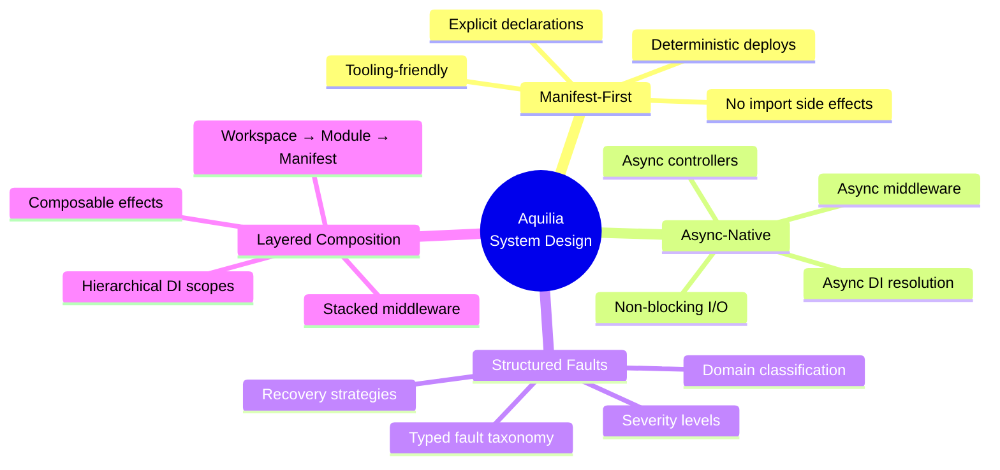
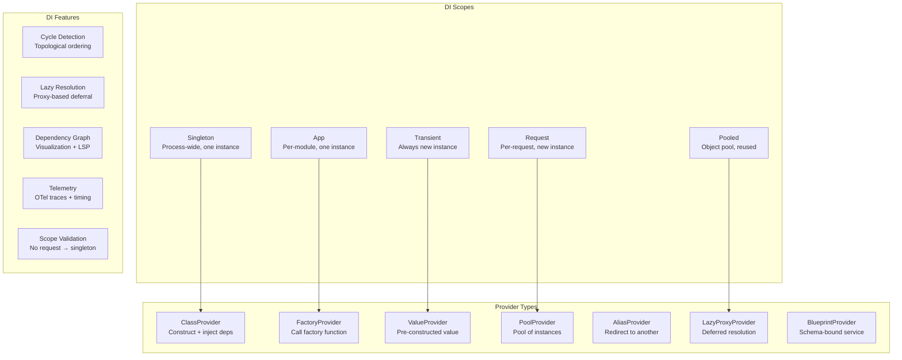
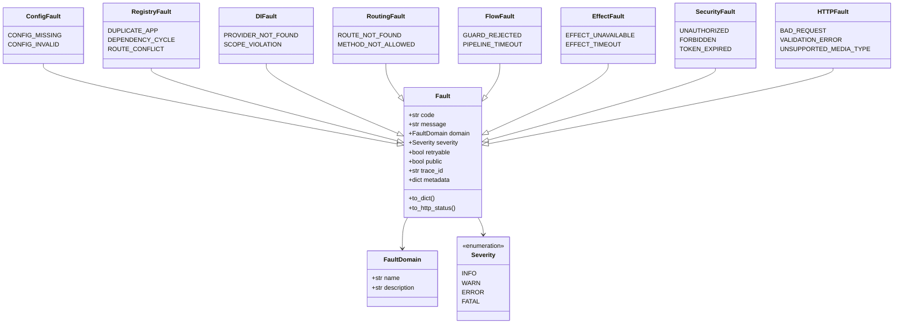
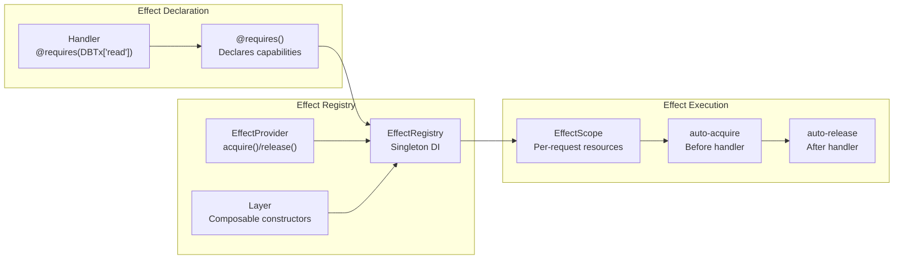
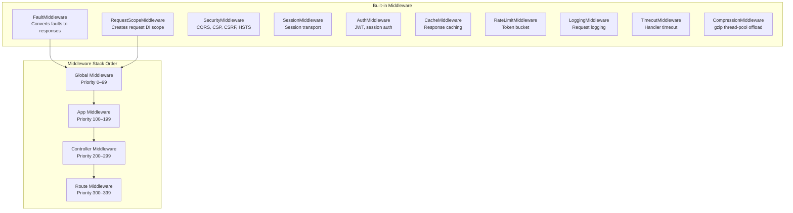

# System Design

Aquilia's design is built around a set of first principles that inform every architectural decision. This page explains the design philosophy and the key models that shape the framework.

## Design Principles



### Principle 1: Manifest-First

**Every component is explicitly declared, never implicitly discovered through side effects.**

In traditional frameworks, decorators or conventions often wire components at import time. This creates fragile state, complicates testing, and makes tooling unreliable. Aquilia inverts this: each module's `manifest.py` is a **data declaration** containing dotted references to all components.

=== "Manifest Declaration"

    ```python
    # modules/users/manifest.py
    from aquilia.manifest import AppManifest, ComponentRef, ComponentKind

    manifest = AppManifest(
        name="users",
        version="1.0.0",
        controllers=[
            ComponentRef("modules.users.controllers:UsersController", ComponentKind.CONTROLLER),
            ComponentRef("modules.users.controllers:ProfileController", ComponentKind.CONTROLLER),
        ],
        services=[
            ComponentRef("modules.users.services:UserService", ComponentKind.SERVICE),
            ComponentRef("modules.users.services:ProfileService", ComponentKind.SERVICE),
        ],
        models=[
            ComponentRef("modules.users.models:User", ComponentKind.MODEL),
        ],
        middleware=[
            ComponentRef("modules.users.middleware:UserAuditMiddleware", ComponentKind.MIDDLEWARE),
        ],
    )
    ```

=== "Component Reference Format"

    Components use the `"module.path:ClassName"` format:
    
    - Controllers: `ComponentKind.CONTROLLER`
    - Services: `ComponentKind.SERVICE`
    - Middleware: `ComponentKind.MIDDLEWARE`
    - Guards: `ComponentKind.GUARD`
    - Models: `ComponentKind.MODEL`
    - Effects: `ComponentKind.EFFECT`

This decoupling means the CLI can validate all manifests, detect route conflicts, and check dependency chains without executing a single line of application code.

### Principle 2: Async-Native

**Every layer of the framework is designed for async execution from the ground up.**

There is no WSGI compatibility layer, no sync-to-async bridging. Controllers, middleware, DI providers, lifecycle hooks, and fault handlers are all `async`. This eliminates the performance cliffs that occur when sync code blocks the event loop.

```python
from aquilia import Controller, GET, RequestCtx

class ProductsController(Controller):
    prefix = "/products"

    @GET("/")
    async def list_products(self, ctx: RequestCtx):
        results = await self.repo.find_all()  # async DB call
        return Response.json(results)

    @GET("/{id:int}")
    async def get_product(self, ctx: RequestCtx, id: int):
        product = await self.repo.find_by_id(id)
        if product is None:
            raise ProductNotFoundFault(id=id)
        return Response.json(product)
```

### Principle 3: Structured Faults

**Every error has a domain, a stable code, a severity, and a defined recovery strategy.**

Raw exceptions carry no semantic meaning. Aquilia replaces all framework-domain errors with typed `Fault` subclasses. This enables:

- **Consistent error responses** — the `FaultMiddleware` converts any `Fault` to a structured JSON or HTML error page.
- **Observability** — every fault carries a trace ID, domain, and severity for log aggregation.
- **Recovery** — retryable faults are distinguished from fatal faults.
- **Security** — public flags control whether internal details are exposed to clients.

### Principle 4: Layered Composition

**Each layer builds on the layer below, with well-defined boundaries and dependency direction.**

```
Workspace (orchestration metadata)
    └── Module (pointer to manifest)
            └── AppManifest (component declarations)
                    └── Aquilary Registry (metadata compilation)
                            └── Runtime Registry (DI + routing)
                                    └── ASGI Adapter (protocol bridge)
```

Dependencies flow downward only. Modules declare dependencies via `depends_on` and exports via `exports`. The Aquilary registry enforces topological ordering at startup.

## Dependency Injection Model



### Scope Hierarchy

| Scope | Lifetime | Use Case |
|---|---|---|
| `singleton` | Process lifetime | Database connection pool, config |
| `app` | Module lifetime | Module-level caches, service registries |
| `request` | Single HTTP request | Unit-of-work, request-scoped repos |
| `transient` | Every resolution | Stateless utilities, validators |
| `pooled` | Configurable pool | Heavy objects (HTTP clients) |

```python
from aquilia.di import Container, service, Inject

@service(scope="singleton")
class DatabasePool:
    def __init__(self, config: DatabaseConfig):
        self.pool = await create_pool(config.url)

@service(scope="app")
class UserRepository:
    def __init__(self, db: DatabasePool):
        self.db = db

@service(scope="request")
class UnitOfWork:
    def __init__(self, db: DatabasePool):
        self._transaction = await db.begin()
```

### Cross-Module DI

Modules declare their exports and imports in `manifest.py`. The DI system enforces that a module can only consume services that are explicitly exported by their owning module:

```python
# modules/auth/manifest.py
manifest = AppManifest(
    name="auth",
    exports=["AuthManager", "JWTService"],
    ...
)

# modules/users/manifest.py
manifest = AppManifest(
    name="users",
    imports=["auth:AuthManager"],
    ...
)
```

## Fault Model



### Fault Taxonomy

| Domain | Source | Examples |
|---|---|---|
| `config` | Configuration loading | Missing keys, invalid values, YAML migration errors |
| `registry` | Aquilary registry | Duplicate apps, dependency cycles, route conflicts |
| `di` | Dependency injection | Missing providers, scope violations, circular deps |
| `routing` | Route matching | 404, 405, malformed URLs |
| `flow` | Pipeline execution | Guard rejection, timeout, cancellation |
| `effect` | Side-effect providers | DB unavailable, cache timeout |
| `security` | Auth & authorization | Invalid tokens, insufficient permissions |
| `http` | HTTP protocol | Bad requests, validation failures, unsupported types |
| `model` | ORM / database | Constraint violations, migration errors |
| `io` | I/O operations | File read/write, network timeouts |

### Defining Custom Faults

```python
from aquilia.faults import Fault, FaultDomain, Severity

class InsufficientInventoryFault(Fault):
    def __init__(self, product_id: str, requested: int, available: int):
        super().__init__(
            code="INVENTORY_INSUFFICIENT",
            message=f"Product {product_id}: requested {requested}, available {available}",
            domain=FaultDomain.custom("INVENTORY"),
            severity=Severity.ERROR,
            retryable=False,
            public=True,
            metadata={"product_id": product_id, "requested": requested, "available": available},
        )
```

## Effect System



The effect system is inspired by functional effect architectures (Effect-TS). Handlers **declare** what capabilities they need; the runtime **provides** them. This separation means:

- Handlers are testable — mock effects replace real providers.
- Resources are managed — acquire/release is guaranteed.
- Dependencies are visible — `@requires()` makes side-effects explicit.

```python
from aquilia.effects import Effect, EffectKind, EffectProvider
from aquilia.flow import requires

DBTx = Effect("db_tx", kind=EffectKind.DB)

class PostgresProvider(EffectProvider):
    async def acquire(self, effect):
        conn = await self.pool.acquire()
        return conn

    async def release(self, effect, resource):
        await self.pool.release(resource)

@requires(DBTx["read"])
async def list_users(db):
    return await db.fetch_all("SELECT * FROM users")
```

| Effect Kind | Built-in Providers | Description |
|---|---|---|
| `DB` | PostgresProvider, SQLiteProvider | Database transactions |
| `CACHE` | RedisProvider, MemoryProvider | Cache read/write |
| `HTTP` | HTTPClientProvider | Outbound HTTP requests |
| `QUEUE` | RedisQueueProvider, MemoryQueueProvider | Message queues |
| `STORAGE` | LocalProvider, S3Provider, GCSProvider, AzureProvider | File storage |
| `CUSTOM` | User-defined | Any typed capability |

## Middleware Architecture



The middleware chain follows a strict ordering: **Global → App → Controller → Route**, then sorted by priority within each scope. Each middleware wraps the chain below it, so Global middleware executes first on the way in and last on the way out.

```python
from aquilia.manifest import AppManifest, ComponentRef, ComponentKind

manifest = AppManifest(
    name="users",
    middleware=[
        ComponentRef("modules.users.middleware:AuditMiddleware", ComponentKind.MIDDLEWARE,
                     metadata={"scope": "app:users", "priority": 150}),
        ComponentRef("modules.users.middleware:RateLimiter", ComponentKind.MIDDLEWARE,
                     metadata={"scope": "route:/users/sensitive", "priority": 310}),
    ],
)
```