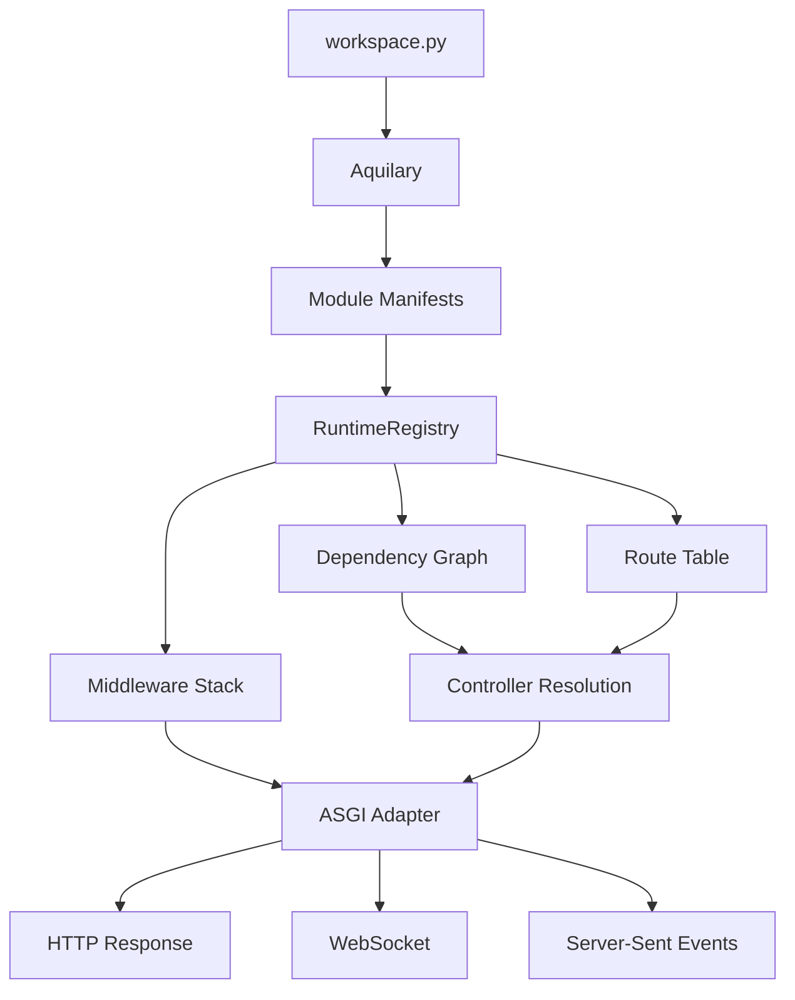

# What is Aquilia?

**Aquilia** is an async-native, manifest-first Python web framework for building HTTP APIs, real-time applications, and background job systems. It is designed for teams who want the batteries of a full-stack framework like Django, with the composability of micro-frameworks like FastAPI, and the infrastructure awareness of modern deployment platforms.

Version **1.1.2** "Crimson Gale" runs on Python **3.10+** and powers everything from single-file prototypes to multi-module production services.

---

## Design Philosophy

### Manifest-First

Every module in an Aquilia workspace declares *what it provides* in a `manifest.py` file — controllers, services, models, middleware, background tasks, socket controllers. There is no central route registry, no manual `app.include_router()`, no decorator-based side effects that depend on import order.

Aquilia's `PackageScanner` traverses the workspace at boot, finds every `manifest.py`, compiles the route table, resolves the dependency graph, and constructs an immutable `RuntimeRegistry`. The resulting ASGI app is a pure function of the declared manifests.

```
workspace.py → Aquilary → RuntimeRegistry → ControllerRouter → ASGI
```

### Structured Errors

Every error in Aquilia is a typed `Fault` subclass with:

- A stable `code` (e.g., `NOT_FOUND`, `CONFLICT`, `UNAUTHORIZED`)
- A human-readable `message`
- A `domain` (e.g., `HTTP`, `SECURITY`, `DATABASE`, `STORAGE`)
- A `severity` level (`DEBUG` through `FATAL`)
- A recovery strategy (`propagate`, `retry`, `circuit_break`)

Raw `ValueError`, `RuntimeError`, and `TypeError` are never used for framework errors. The `FaultEngine` catches all faults, applies configured handlers, and maps them to appropriate HTTP responses.

### Dependency Injection as a First-Class Concern

Aquilia provides hierarchical DI with three scopes:

| Scope | Lifetime | Example |
|---|---|---|
| `singleton` | Process-wide | Database connection pool, config |
| `app` | Application lifecycle | Cached data, template engine |
| `request` | Per HTTP request | Auth principal, DB session |

Providers are declared with `@service`, `@factory`, and `@inject` decorators. The `RuntimeRegistry` validates the full dependency DAG at boot — circular dependencies and missing providers are caught before the first request.

### Explicit Over Implicit

There are no `@app.middleware` side effects, no `@app.on_event` registration, and no implicit dependency injection based on type annotations alone. Every integration, every middleware, every security policy is declared explicitly through the `Workspace` builder and `AppManifest`.

---

## When to Use Aquilia

Aquilia is a good fit when:

- You need **structured error handling** with domain-aware faults instead of string-based HTTP exceptions
- You want **declarative access control** — multi-dimensional clearance with entitlements, conditions, and compartments
- You organize code as **modules** with clear boundaries and explicit dependencies
- You need **async-native** everything — controllers, ORM, storage, cache, mail
- You value **infrastructure generation** — `aq deploy dockerfile`, `aq deploy kubernetes`, `aq deploy compose`
- You want **API versioning** with sunset policies and multi-strategy resolution
- You prefer **Python-native configuration** over YAML/JSON/toml sprawl
- You need **WebSockets** and **SSE** streaming in the same application

Aquilia is **not** the best choice when:

- You need to deploy to Python 3.9 or earlier
- You prefer micro-frameworks with ~200 lines of routing code
- You need Django's admin out of the box (though Aquilia has its own `AdminSite`)

---

## Comparison with Other Frameworks

| Feature | Aquilia | FastAPI | Django | Flask |
|---|---|---|---|---|
| **Paradigm** | Manifest-first | Decorator-first | Convention-over-config | Micro |
| **Async** | Native throughout | Native, optional sync | Partial (3.2+) | Via extensions |
| **DI** | Scoped, DAG-validated | Depends() injection | Class-based views | Extensions |
| **Faults** | Typed Fault hierarchy | HTTPException | Http404, etc. | abort() |
| **ORM** | Native async ORM | SQLAlchemy (external) | Django ORM | SQLAlchemy (external) |
| **Validation** | Blueprints with facets | Pydantic | Forms + serializers | WTForms / marshmallow |
| **Auth** | JWT, sessions, OAuth, MFA, RBAC, ABAC, clearance | OAuth2 via libs | Session + permissions | Flask-Login |
| **Versioning** | Multi-strategy + sunset | Manual | Manual | Manual |
| **WebSockets** | SocketController decorators | WebSocket routes | Channels | Flask-SocketIO |
| **Admin** | Auto-discovering AdminSite | Manual | auto-generated admin | Flask-Admin |
| **Infra gen** | Docker, K8s, Compose, Nginx | Manual | Manual | Manual |
| **CLI** | 25+ `aq` commands | fastapi-cli | manage.py | flask CLI |
| **Min Python** | 3.10 | 3.8 | 3.10 | 3.9 |

---

## Architecture at a Glance



The `workspace.py` declares orchestration: runtime mode, modules, integrations, and security policies. Each module's `manifest.py` declares its controllers, services, models, and middleware. Aquilary compiles these declarations into metadata. The `RuntimeRegistry` consumes that metadata, builds the DI container hierarchy, compiles the route table, and assembles the middleware stack. The result is an ASGI application served by Uvicorn (development) or Gunicorn + Uvicorn workers (production).

---

## Key Subsystems

| Subsystem | Module | Purpose |
|---|---|---|
| **Controllers** | `aquilia.controller` | HTTP route handling with `@GET`, `@POST`, `@PUT`, `@PATCH`, `@DELETE`, filtering, pagination, rendering |
| **Blueprints** | `aquilia.blueprints` | Request/response validation contracts with facets, sealing, lenses, and OpenAPI schema generation |
| **Faults** | `aquilia.faults` | 80+ typed fault classes across 14 domains with runtime engine, handlers, and HTTP mapping |
| **DI** | `aquilia.di` | Hierarchical scoped injection with `Container`, `Provider`, `Inject`, and DAG validation |
| **Auth** | `aquilia.auth` | JWT, sessions, OAuth, MFA, password hashing, RBAC/ABAC engines, clearance system |
| **Models** | `aquilia.models` | Async ORM with `Model`, `Field` types, `Q` queries, foreign keys, and migrations |
| **Cache** | `aquilia.cache` | Multi-backend caching with decorators, middleware, and key signing |
| **Storage** | `aquilia.storage` | Async file storage (local, S3, GCS, Azure, SFTP, memory) with registry |
| **Tasks** | `aquilia.tasks` | Background job system with `@task`, priority queues, scheduling, retries |
| **Mail** | `aquilia.mail` | Multi-provider email (SMTP, SES, SendGrid) with templates |
| **Templates** | `aquilia.templates` | Sandboxed Jinja2 with bytecode caching and HMAC integrity |
| **Sessions** | `aquilia.sessions` | Cryptographic sessions with policies, stores, and transports |
| **Sockets** | `aquilia.sockets` | WebSocket controllers with event/subscription/guard decorators |
| **SSE** | `aquilia.sse` | Server-Sent Events streaming with `SSEResponse` and `SSEEvent` |
| **Versioning** | `aquilia.versioning` | API versioning with multi-strategy resolution and sunset lifecycle |
| **I18n** | `aquilia.i18n` | Internationalization with locale negotiation, catalogs, and formatting |
| **HTTP Client** | `aquilia.http` | Native async HTTP client with sessions, retries, and middleware |
| **OTel** | `aquilia.otel` | OpenTelemetry distributed tracing middleware and configuration |
| **Filesystem** | `aquilia.filesystem` | Native async filesystem API with path security and streaming |
| **Admin** | `aquilia.admin` | Auto-detecting admin dashboard with audit logging and role-based UI |
| **Artifacts** | `aquilia.artifacts` | Typed artifact system for config, code, migration, and route freeze bundles |
| **Flow** | `aquilia.flow` | Typed routing and composable request pipelines with effect scopes |
| **Signing** | `aquilia.signing` | HMAC signing with rotation, timestamp signing, and subsystem signers |
| **Providers** | `aquilia.providers` | Cloud provider integration (Render) with encrypted credential store |
| **MCP** | `aquilia.mcp` | MCP server for AI agent integration |

---

## Ready to Start?

Pick your path:

<div class="grid cards" markdown>

-   :material-rocket-launch:{ .lg .middle } **Quickstart**

    ---

    Create a workspace, define a controller, and serve it — all in under 5 minutes.

    [:octicons-arrow-right-24: Quickstart](quickstart.md)

-   :material-school:{ .lg .middle } **First Project**

    ---

    Build a complete CRUD API step by step: workspace, module, controller, service, blueprint, and testing.

    [:octicons-arrow-right-24: First project walkthrough](first-project.md)

-   :material-book:{ .lg .middle } **Core Concepts**

    ---

    Deep dive into manifests, the boot sequence, DI, faults, blueprints, and middleware.

    [:octicons-arrow-right-24: Core concepts](../concepts/core-concepts.md)

-   :material-file-code:{ .lg .middle } **Examples**

    ---

    Checked, runnable example applications covering every major subsystem.

    [:octicons-arrow-right-24: Browse examples](../examples/index.md)

</div>