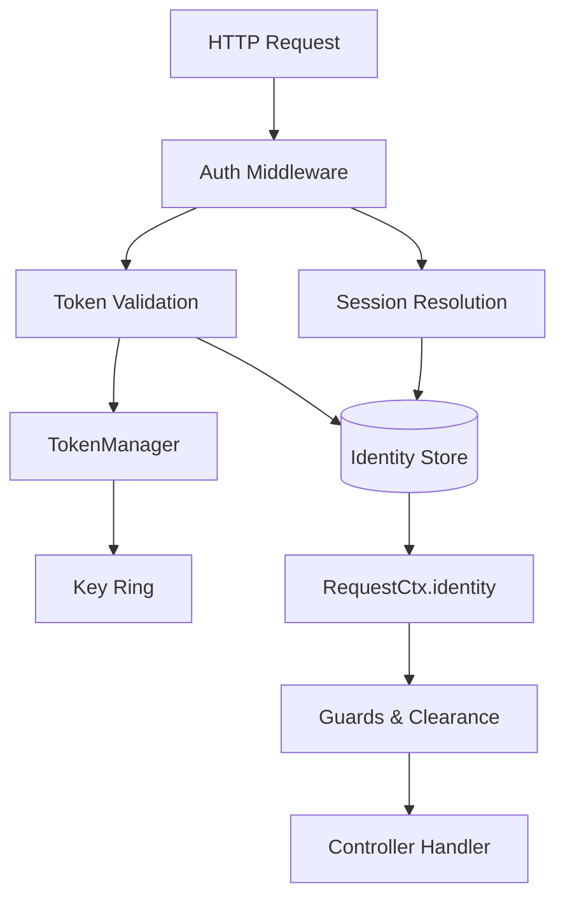

# Authentication Guide

Aquilia's authentication system (`aquilia.auth`) provides a complete identity, token, session, and authorization pipeline — all built on the framework's structured fault system and DI container.

## Architecture



## Identity model

`Identity` is a frozen dataclass representing an authenticated principal:

```python
from aquilia.auth.core import Identity, IdentityType, IdentityStatus
from datetime import datetime, timezone

user = Identity(
    id="usr_abc123",
    type=IdentityType.USER,
    attributes={
        "email": "user@example.com",
        "roles": ["user", "editor"],
        "scopes": ["profile", "articles:read"],
        "department": "engineering",
    },
    status=IdentityStatus.ACTIVE,
    tenant_id="tenant-001",
    created_at=datetime.now(timezone.utc),
    updated_at=datetime.now(timezone.utc),
)
```

### Identity types

| Type | Value | Use case |
|------|-------|----------|
| `IdentityType.USER` | `"user"` | Human user |
| `IdentityType.SERVICE` | `"service"` | Machine-to-machine |
| `IdentityType.DEVICE` | `"device"` | IoT / edge device |
| `IdentityType.ANONYMOUS` | `"anonymous"` | Unauthenticated visitor |

### Identity status

| Status | Description |
|--------|-------------|
| `ACTIVE` | Fully active, can authenticate |
| `SUSPENDED` | Temporarily blocked |
| `DELETED` | Soft-deleted, cannot authenticate |
| `PENDING` | Awaiting email verification |

### Helper methods

```python
user.has_role("editor")           # True
user.has_scope("articles:read")  # True
user.has_scope("admin:*")        # uses "*" wildcard
user.is_active()                  # True
user.get_attribute("email")       # "user@example.com"
```

## AuthManager setup

`AuthManager` is the central coordinator for all authentication operations:

```python
from aquilia.auth.manager import AuthManager
from aquilia.auth.tokens import TokenManager
from aquilia.auth.hashing import PasswordHasher

# Create with default in-memory stores (for dev/test)
auth_manager = AuthManager(
    token_manager=TokenManager(
        secret_key="super-secret",
        algorithm="HS256",
        issuer="myapp",
    ),
    password_hasher=PasswordHasher(algorithm="argon2id"),
)

# Production: with custom stores
auth_manager = AuthManager(
    token_manager=token_manager,
    identity_store=postgres_identity_store,
    credential_store=postgres_credential_store,
    password_hasher=password_hasher,
    rate_limiter=RateLimiter(max_attempts=5),
    login_identifier_attributes=("email", "username", "login"),
)
```

## Password hashing

`PasswordHasher` supports five algorithms, selected via PHC-format self-describing hashes:

```python
from aquilia.auth.hashing import PasswordHasher

# Argon2id (recommended — requires pip install argon2-cffi)
hasher = PasswordHasher(algorithm="argon2id")

# scrypt (stdlib — no extra deps)
hasher = PasswordHasher(algorithm="scrypt")

# bcrypt (requires pip install bcrypt)
hasher = PasswordHasher(algorithm="bcrypt")

# PBKDF2-HMAC-SHA512 (stdlib — no extra deps)
hasher = PasswordHasher(algorithm="pbkdf2_sha512")

# PBKDF2-HMAC-SHA256 (stdlib, legacy)
hasher = PasswordHasher(algorithm="pbkdf2_sha256")
```

Basic operations:

```python
# Hash a password
password_hash = hasher.hash("correct-battery-horse-staple")

# Verify
is_valid = hasher.verify(password_hash, "correct-battery-horse-staple")

# Check if rehash is needed (algorithm upgrade)
needs_rehash = hasher.check_needs_rehash(password_hash)
```

### AquilaConfig configuration

Configure hasher parameters via `AquilaConfig`:

```python
from aquilia import AquilaConfig

class BaseEnv(AquilaConfig):
    class auth(AquilaConfig.Auth):
        password_hasher = AquilaConfig.PasswordHasher.argon2id(
            time_cost=3,
            memory_cost=131072,   # 128 MiB
            parallelism=4,
        )
```

Factory methods:

```python
PasswordHasher.argon2id(time_cost=2, memory_cost=65536, parallelism=4)
PasswordHasher.scrypt(n=32768, r=8, p=1, dklen=32)
PasswordHasher.bcrypt(rounds=12)
PasswordHasher.pbkdf2_sha512(iterations=210000)
PasswordHasher.pbkdf2_sha256(iterations=600000)
```

## Token management

### TokenManager

`TokenManager` handles JWT-like token generation, validation, and a key ring:

```python
from aquilia.auth.tokens import TokenManager, KeyRing

token_manager = TokenManager(
    secret_key="super-secret-key",
    algorithm="HS256",         # HS256 | HS384 | HS512 (stdlib) or RS256 | ES256 | EdDSA (requires cryptography)
    issuer="myapp",
    audience="myapp",
    access_token_ttl=3600,     # 1 hour
    refresh_token_ttl=2592000, # 30 days
)

# Issue tokens
access_token = await token_manager.issue_access_token(
    identity_id="usr_123",
    scopes=["profile", "articles:read"],
    roles=["user"],
    session_id="sess_xyz",
    tenant_id="tenant-001",
)
refresh_token = await token_manager.issue_refresh_token(
    identity_id="usr_123",
    scopes=["profile"],
    session_id="sess_xyz",
)

# Validate
claims = await token_manager.validate_access_token(access_token)
print(claims["sub"])   # "usr_123"
print(claims["exp"])   # unix timestamp

# Refresh
new_access, new_refresh = await token_manager.refresh_access_token(refresh_token)

# Revoke
await token_manager.revoke_token(refresh_token)
await token_manager.revoke_tokens_by_identity("usr_123")
await token_manager.revoke_tokens_by_session("sess_xyz")
```

### TokenClaims

```python
from aquilia.auth.core import TokenClaims

claims = TokenClaims(
    iss="aquilia",
    sub="usr_123",
    aud=["aquilia-app"],
    exp=1735689600,
    iat=1735686000,
    nbf=1735686000,
    jti="jti_unique_id",
    scopes=["profile"],
    sid="sess_xyz",
    roles=["user"],
    tenant_id="tenant-001",
)

claims.is_expired()
claims.has_scope("profile")
```

### Algorithm selection

| Algorithm | Type | Dependencies | Description |
|-----------|------|-------------|-------------|
| `HS256` | HMAC-SHA-256 | None (stdlib) | Default |
| `HS384` | HMAC-SHA-384 | None (stdlib) | Stronger |
| `HS512` | HMAC-SHA-512 | None (stdlib) | Strongest HMAC |
| `RS256` | RSA + SHA-256 | `cryptography` | Asymmetric |
| `ES256` | ECDSA P-256 | `cryptography` | Asymmetric |
| `EdDSA` | Ed25519 | `cryptography` | Modern elliptic |

## Authentication flows

### Password authentication

```python
from aquilia.auth.manager import AuthManager

result = await auth_manager.authenticate_password(
    username="user@example.com",
    password="secure-pass",
    scopes=["profile", "articles:read"],
    client_metadata={"ip": "192.168.1.1", "user_agent": "..."},
)

# result.access_token    -> JWT string
# result.refresh_token   -> Refresh token string
# result.identity        -> Identity object
# result.session_id      -> Session identifier
# result.expires_in      -> TTL in seconds
```

### Ergonomic sign_in

The `sign_in` method provides higher-level ergonomics with auto-provisioning:

```python
result = await auth_manager.sign_in(
    username="user@example.com",
    password="secure-pass",
    scopes=["profile"],
    session="auto",  # "auto" | "new" | "explicit-session-id"
    client_metadata={"ip": "..."},
)
```

**Session modes**:
- `"auto"` — Bind to the active runtime session if present, otherwise create one
- `"new"` — Force a new synthetic session ID
- `"<string>"` — Use an explicit session ID

### Sign out

```python
await auth_manager.sign_out(
    scope="all",           # "session" | "identity" | "all"
    identity_id="usr_123",
    session_id="sess_xyz",
    access_token="eyJ...",
    refresh_token="rt_...",
)

# Or high-level logout
await auth_manager.logout(
    identity_id="usr_123",
    session_id="sess_xyz",
    access_token="eyJ...",
    refresh_token="rt_...",
)
```

### API key authentication

```python
result = await auth_manager.authenticate_api_key(
    api_key="ak_live_abc123...",
    required_scopes=["articles:read"],
)
```

API keys use the format `ak_<env>_<random>` (e.g., `ak_live_abcdef...`). Keys are HMAC-SHA256 hashed before storage and verified with constant-time comparison to prevent timing attacks.

### Token verification

```python
# Verify and decode
claims = await auth_manager.verify_token(access_token)

# Get identity from token
identity = await auth_manager.get_identity_from_token(access_token)

# Resume current identity from session or token
identity = await auth_manager.resume_identity(access_token="eyJ...")

# Check active session
has_session = auth_manager.has_active_session()
current_session = auth_manager.current_session()
current_identity = auth_manager.current_identity_id()
```

## Session authentication

Aquilia seamlessly bridges tokens with session-based authentication:

```python
from aquilia.auth.integration.aquila_sessions import (
    SessionAuthBridge,
    AuthPrincipal,
    bind_identity,
    user_session_policy,
    api_session_policy,
)

# Bind identity to a session
bind_identity(session, identity)

# Configure session policies
from aquilia.sessions import SessionPolicy

# Web users — cookie-based, longer TTL
web_policy = SessionPolicy.for_web_users().with_smart_defaults()

# API clients — header-based, shorter TTL
api_policy = SessionPolicy.for_api_clients().with_smart_defaults()
```

## Guards and clearance

### Guards (decorator-based)

```python
from aquilia import authenticated, AdminGuard, VerifiedEmailGuard
from aquilia.auth.integration.flow_guards import (
    require_auth,
    require_scopes,
    require_roles,
    require_permission,
)

class AdminController(Controller):
    prefix = "/admin"

    @GET("/")
    @authenticated
    async def dashboard(self, ctx):
        # Only authenticated users
        ...

    @POST("/users")
    @require_roles("admin")
    async def create_user(self, ctx):
        # Only users with "admin" role
        ...

    @GET("/reports")
    @require_scopes("reports:read")
    async def view_reports(self, ctx):
        # Only users with the "reports:read" scope
        ...

    @DELETE("/data")
    @require_permission("can_delete_sensitive_data")
    async def delete_data(self, ctx):
        ...

    # Class-level guard — applies to all methods
    @AdminGuard
    def all_admin_methods(self):
        ...
```

### Flow guards (declarative)

```python
from aquilia.auth.integration.flow_guards import (
    FlowGuard,
    RequireAuthGuard,
    RequireScopesGuard,
    RequireRolesGuard,
    RequirePermissionGuard,
    RequirePolicyGuard,
)

# Require authentication
guard = RequireAuthGuard()

# Require specific scopes
guard = RequireScopesGuard(
    scopes=["documents:write"],
    require_all=True,  # All scopes must be present
)

# Require specific roles
guard = RequireRolesGuard(roles=["editor", "admin"], require_all=False)
```

### Clearance system

Aquilia's unique declarative access control combines access levels, entitlements, conditions, and compartments:

```python
from aquilia.auth.clearance import (
    Clearance, AccessLevel,
    grant, exempt,
    is_owner_or_admin, is_same_tenant,
    is_verified, within_quota,
)

class DocumentController(Controller):
    prefix = "/documents"

    # Baseline — all routes require INTERNAL clearance
    clearance = Clearance(
        level=AccessLevel.INTERNAL,
        entitlements=["documents:read"],
        compartment="tenant:{tenant_id}",
    )

    @GET("/")
    @grant(level=AccessLevel.PUBLIC)  # Override: open to everyone
    async def list_public(self, ctx):
        ...

    @POST("/")
    @grant(
        entitlements=["documents:write"],
        conditions=[is_verified, within_quota],
    )
    async def create(self, ctx):
        ...

    @DELETE("/{doc_id}")
    @grant(
        level=AccessLevel.CONFIDENTIAL,
        entitlements=["documents:delete"],
        conditions=[is_owner_or_admin],
    )
    async def delete(self, ctx, doc_id: str):
        ...

    @GET("/tenant/{tenant_id}")
    @grant(conditions=[is_same_tenant])
    async def tenant_docs(self, ctx, tenant_id: str):
        ...

    # Exempt this route from all clearance checks
    @GET("/health")
    @exempt
    async def health(self, ctx):
        ...
```

**Access levels** (hierarchical — higher levels include all lower):

| Level | Ordinal | Description |
|-------|---------|-------------|
| `PUBLIC` | 0 | No auth required |
| `AUTHENTICATED` | 10 | Any authenticated identity |
| `INTERNAL` | 20 | Internal/staff identities |
| `CONFIDENTIAL` | 30 | Elevated clearance (managers, leads) |
| `RESTRICTED` | 40 | Highest clearance (admins, security) |

**Built-in conditions**:

| Condition | Description |
|-----------|-------------|
| `is_verified` | Email/phone must be verified |
| `is_owner_or_admin` | Resource owner or admin role |
| `is_same_tenant` | Same tenant ID as resource |
| `within_quota` | Within usage quota |

### Auth middleware

```python
from aquilia.auth.integration.middleware import (
    AquilAuthMiddleware,
    create_auth_middleware_stack,
)

# The middleware automatically resolves tokens and sessions,
# injecting Identity into RequestCtx for every request.
middleware = create_auth_middleware_stack(
    auth_manager=auth_manager,
    session_policy=web_policy,
)
```

## Multi-Factor Authentication (MFA)

```python
from aquilia.auth.core import MFACredential

# TOTP setup (Google Authenticator style)
mfa = MFACredential(
    identity_id="usr_123",
    mfa_type="totp",
    mfa_secret=MFACredential.generate_totp_secret(),
    backup_codes=MFACredential.generate_backup_codes(count=10),
)

# WebAuthn (FIDO2 hardware keys)
mfa = MFACredential(
    identity_id="usr_123",
    mfa_type="webauthn",
    webauthn_credentials=[...],
)

# SMS/Email OTP
mfa = MFACredential(
    identity_id="usr_123",
    mfa_type="sms",
    phone_number="+1234567890",
)

# Check MFA enrollment
mfa_creds = await credential_store.get_mfa("usr_123")
if mfa_creds:
    # MFA is enrolled — require second factor
    ...
```

## OAuth2 / OIDC

```python
from aquilia.auth.core import OAuthClient

client = OAuthClient(
    client_id=OAuthClient.generate_client_id(),
    client_secret_hash=OAuthClient.hash_client_secret(
        OAuthClient.generate_client_secret()
    ),
    name="My Web App",
    grant_types=["authorization_code", "refresh_token"],
    redirect_uris=["https://app.example.com/callback"],
    scopes=["openid", "profile", "email"],
    require_pkce=True,
    require_consent=True,
    token_endpoint_auth_method="client_secret_post",
    access_token_ttl=3600,
    refresh_token_ttl=2592000,
)
```

## Audit trail

```python
from aquilia.auth.audit import (
    AuditTrail,
    AuditEvent,
    AuditEventType,
    AuditSeverity,
    MemoryAuditStore,
)

audit = AuditTrail(store=MemoryAuditStore())

event = AuditEvent(
    event_type=AuditEventType.LOGIN_SUCCESS,
    severity=AuditSeverity.INFO,
    identity_id="usr_123",
    ip_address="192.168.1.1",
    details={"method": "password"},
)

await audit.record(event)
```

## Rate limiting

`AuthManager` includes an in-memory `RateLimiter`:

```python
from aquilia.auth.manager import RateLimiter

limiter = RateLimiter(
    max_attempts=5,        # 5 attempts
    window_seconds=900,    # Within 15 minutes
    lockout_duration=3600, # Lockout for 1 hour
)

# The AuthManager automatically rate-limits password login attempts.
# The rate key is "auth:password:{username}".

# Check
is_locked = limiter.is_locked_out("auth:password:user@example.com")
remaining = limiter.get_remaining_attempts("auth:password:user@example.com")
```

## Credential stores

Protocol-based storage decouples auth logic from persistence:

```python
from aquilia.auth.core import (
    IdentityStore, CredentialStore, OAuthClientStore,
)

# Built-in memory stores (for dev/test)
from aquilia.auth.stores import MemoryIdentityStore, MemoryCredentialStore

identity_store = MemoryIdentityStore()
credential_store = MemoryCredentialStore()

# Implement custom stores for production
class PostgresIdentityStore:
    async def create(self, identity: Identity) -> None: ...
    async def get(self, identity_id: str) -> Identity | None: ...
    async def get_by_attribute(self, key: str, value: Any) -> Identity | None: ...
    async def update(self, identity: Identity) -> None: ...
    async def delete(self, identity_id: str) -> None: ...
    async def list_by_tenant(self, tenant_id: str) -> list[Identity]: ...
```

## Password credential lifecycle

```python
from aquilia.auth.core import PasswordCredential, CredentialStatus

cred = PasswordCredential(
    identity_id="usr_123",
    password_hash=hasher.hash("secure-pass"),
)

# Check if password needs rotation
if cred.should_rotate(max_age_days=90):
    # Notify user to change password

# Force password change on next login
cred.must_change = True

# Track usage
cred.touch()  # Updates last_used_at
```