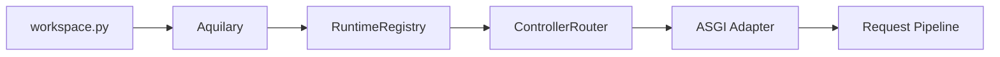

# Welcome to Aquilia

**Aquilia** is an async-native, manifest-first Python web framework. Declare what your application *is* — controllers, services, models, middleware — and Aquilia discovers, wires, and serves it. No routing glue code, no manual dependency graphs, no boilerplate infrastructure.

<div class="grid cards" markdown>

-   :material-rocket-launch:{ .lg .middle } **Manifest-First Architecture**

    ---

    Every module declares its controllers, services, and models in a single `manifest.py`. Aquilia's `PackageScanner` discovers them at boot, compiles the route table, resolves the dependency graph, and builds the ASGI app — automatically.

    [:octicons-arrow-right-24: Learn the architecture](getting-started/overview.md)

-   :material-puzzle:{ .lg .middle } **Scoped Dependency Injection**

    ---

    Hierarchical DI with `singleton`, `app`, and `request` scopes. Declare providers with `@service`, `@factory`, and `Inject` annotations. The `RuntimeRegistry` resolves the full DAG at boot and creates per-request containers automatically.

    [:octicons-arrow-right-24: Read about DI](concepts/core-concepts.md)

-   :material-shield-alert:{ .lg .middle } **Structured Fault System**

    ---

    Every error is a typed `Fault` subclass with a stable `code`, `message`, `domain`, and `severity`. The `FaultEngine` maps faults to HTTP responses, retries recoverable errors, and integrates with middleware. No raw exceptions, ever.

    [:octicons-arrow-right-24: Explore faults](reference/api/faults.md)

-   :material-shield-account:{ .lg .middle } **Declarative Access Control**

    ---

    The Clearance system provides multi-dimensional authorization with `AccessLevel`, entitlements, conditions, and tenant compartments. Apply class-level and method-level `@grant` and `@exempt` decorators. Integrated with RBAC and ABAC engines.

    [:octicons-arrow-right-24: Secure your app](guides/authentication.md)

-   :material-api:{ .lg .middle } **Blueprint Validation**

    ---

    Define request/response contracts with `Blueprint` classes. Faceted sealing, casting, and imprinting validate incoming data and project outgoing responses. Extra field rejection, custom `seal_*` methods, and OpenAPI schema generation built in.

    [:octicons-arrow-right-24: Validate requests](reference/classes/blueprint.md)

-   :material-database:{ .lg .middle } **Async ORM & Migrations**

    ---

    Pure-Python async ORM with `Model`, `Field` types, `Q` query expressions, foreign keys, and migrations. SQLite native, PostgreSQL via `asyncpg`, MySQL, and Oracle adapters. Schema snapshots and `aq migrate` CLI.

    [:octicons-arrow-right-24: Model your data](reference/modules/models/index.md)

-   :material-webhook:{ .lg .middle } **WebSockets & SSE**

    ---

    First-class `SocketController` with `@OnConnect`, `@OnDisconnect`, `@Event`, `@Subscribe` decorators. Room-based pub/sub with acknowledgements. SSE streaming via `SSEResponse` and `SSEEvent` for real-time data and LLM token streaming.

    [:octicons-arrow-right-24: Build real-time apps](reference/api/websockets.md)

-   :material-clock-fast:{ .lg .middle } **Background Tasks**

    ---

    `@task` decorator with priority queues, retries, timeouts, and cron schedules. `TaskManager` with `MemoryBackend` (dev) and pluggable backends. Worker loops run concurrently with the HTTP server.

    [:octicons-arrow-right-24: Schedule tasks](reference/modules/tasks/index.md)

-   :material-cached:{ .lg .middle } **Multi-Backend Caching**

    ---

    `CacheService` with `MemoryBackend`, `RedisBackend`, `CompositeBackend`, and `NullBackend`. `@cached` and `@cache_aside` decorators, `CacheMiddleware` for HTTP caching, and HMAC-signed cache keys.

    [:octicons-arrow-right-24: Cache smart](reference/modules/cache/index.md)

-   :material-cloud-upload:{ .lg .middle } **Pluggable Storage**

    ---

    Async storage with `LocalStorage`, `S3Storage`, `GCSStorage`, `AzureBlobStorage`, `SFTPStorage`, `MemoryStorage`, and `CompositeStorage`. Typed configs, registry auto-discovery, and effect provider integration.

    [:octicons-arrow-right-24: Store files](reference/modules/storage/index.md)

-   :material-email:{ .lg .middle } **Mail & Templates**

    ---

    Multi-provider email (SMTP, SES, SendGrid) with `send_mail`, `MailService`, HTML/plain-text envelopes, and template-based messages. Sandboxed Jinja2 templates with bytecode caching and HMAC integrity.

    [:octicons-arrow-right-24: Send emails](reference/modules/mail/index.md)

-   :material-translate:{ .lg .middle } **Internationalization**

    ---

    `I18nService` with locale negotiation, translation catalogs, plural rules, lazy strings, date/number/currency formatting, and `I18nMiddleware`. CLI for extraction and compilation.

    [:octicons-arrow-right-24: Go global](reference/modules/i18n/index.md)

</div>

---

## Quick Example

```python
# workspace.py — the orchestration root
from aquilia import Module, Workspace
from aquilia.integrations import DiIntegration, RoutingIntegration, FaultHandlingIntegration

workspace = (
    Workspace("my-api", version="1.0.0", description="A JSON API")
    .runtime(mode="dev", port=8000, reload=True)
    .module(Module("users", version="1.0.0").route_prefix("/users").tags("users"))
    .integrate(DiIntegration(auto_wire=True))
    .integrate(RoutingIntegration(strict_matching=True))
    .integrate(FaultHandlingIntegration(default_strategy="propagate"))
    .security(cors_enabled=True, helmet_enabled=True)
)
```

```python
# modules/users/manifest.py — declares the module's components
from aquilia import AppManifest
from aquilia.manifest import FaultHandlingConfig

manifest = AppManifest(
    name="users",
    version="1.0.0",
    description="User management module",
    controllers=["modules.users.controllers:UsersController"],
    services=["modules.users.services:UsersService"],
    models=["modules.users.models:User"],
    base_path="modules.users",
    tags=["users"],
    faults=FaultHandlingConfig(default_domain="USERS", strategy="propagate"),
)
```

```python
# modules/users/controllers.py — HTTP endpoint handler
from aquilia import Controller, DELETE, GET, PATCH, POST, RequestCtx, Response
from aquilia.faults import NotFoundFault

class UsersController(Controller):
    prefix = "/users"
    tags = ["users"]

    @GET("/")
    async def list_users(self, ctx: RequestCtx):
        return Response.json({"users": []})

    @POST("/", status_code=201)
    async def create_user(self, ctx: RequestCtx):
        body = await ctx.json()
        return Response.json({"created": body}, status=201)

    @GET("/<user_id:str>")
    async def get_user(self, ctx: RequestCtx, user_id: str):
        raise NotFoundFault(detail=f"User {user_id} not found")
```

```bash
# One command to start the dev server
$ aq serve
⚓ Aquilia 1.1.2 "Crimson Gale" — http://127.0.0.1:8000
```

---

## Installation

=== "Core"
    ```bash
    pip install aquilia
    ```
    Includes controllers, DI, ORM, templates, filesystem, and SQLite.

=== "Full"
    ```bash
    pip install aquilia[full]
    ```
    Everything: auth, postgres, redis, otel, mail, server, multipart.

=== "From source"
    ```bash
    git clone https://github.com/anomalyco/Aquilia
    cd Aquilia
    pip install -e ".[dev]"
    ```

[:octicons-arrow-right-24: Full installation guide](getting-started/installation.md)

---

## CLI at a Glance

| Command | Purpose |
|---|---|
| `aq init workspace <name>` | Scaffold a new workspace with `workspace.py`, config, and starter page |
| `aq add module <name>` | Generate a module with manifest, controller, service, and model stubs |
| `aq serve` | Start development server with hot reload |
| `aq validate` | Validate manifests, routes, and DI graph |
| `aq inspect routes` | Print the compiled route table |
| `aq inspect providers` | Print the DI container graph |
| `aq compile` | Freeze manifests into a deployment artifact |
| `aq migrate` | Run database migrations |
| `aq deploy dockerfile` | Generate a production Dockerfile |
| `aq test` | Run the project test suite |

[:octicons-arrow-right-24: Full CLI reference](reference/cli/index.md)

---

## Runtime Modes

Aquilia supports three runtime environments controlled by `AQUILIA_ENV`:

| Mode | `AQUILIA_ENV` | Behavior |
|---|---|---|
| **Development** | `dev` | Hot reload, debug pages, verbose fault details |
| **Test** | `test` | Isolated DI scopes, test client, fixtures |
| **Production** | `prod` | Optimized compilation, suppressed debug info |

[:octicons-arrow-right-24: Runtime lifecycle](concepts/lifecycle.md)

---

## Boot Sequence



The server boot path: **Workspace → Aquilary metadata → RuntimeRegistry (DI + services) → Controller compilation → ASGI app**. Every step validates, fingerprints, and produces immutable runtime structures before accepting traffic.

---

## Next Steps

<div class="grid cards" markdown>

-   :material-speedometer:{ .lg .middle } **Quickstart**

    ---

    Create a workspace, define a controller, and run the dev server — all in under 5 minutes.

    [:octicons-arrow-right-24: Get started](getting-started/quickstart.md)

-   :material-book-open-page-variant:{ .lg .middle } **First Project Walkthrough**

    ---

    Build a complete CRUD API with workspace, module, controller, service, blueprint validation, and DI.

    [:octicons-arrow-right-24: Build your first project](getting-started/first-project.md)

-   :material-toy-brick:{ .lg .middle } **Core Concepts**

    ---

    Deep dive into manifests, controllers, DI, faults, blueprints, models, and middleware.

    [:octicons-arrow-right-24: Understand the concepts](concepts/core-concepts.md)

-   :material-file-code:{ .lg .middle } **Examples**

    ---

    Checked examples: CRUD, auth, WebSockets, background jobs, admin dashboard, storage, mail, i18n, and more.

    [:octicons-arrow-right-24: Browse examples](examples/index.md)

</div>