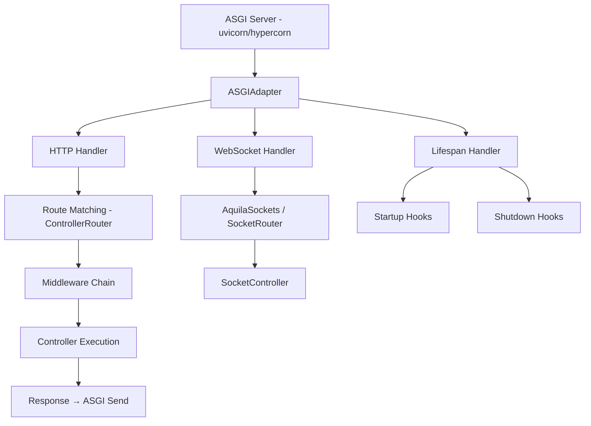

# ASGI Adapter

> `aquilia.asgi` — Bridges the ASGI protocol to Aquilia

The `ASGIAdapter` converts raw ASGI events into Aquilia's typed `Request`/`Response` objects, performs synchronous route matching, creates per-request DI containers, and manages WebSocket and lifespan events.

## Architecture



## Key Class

```python
class ASGIAdapter:
    """ASGI application adapter.
    Converts ASGI events to Aquilia Request/Response.
    Uses controller-based routing exclusively.
    """

    def __init__(
        self,
        controller_router: ControllerRouter,
        controller_engine: Any,
        middleware_stack: MiddlewareStack,
        server: Any | None = None,
        socket_runtime: Any | None = None,
    ):
        ...
```

## Protocol Handling

### HTTP

The adapter handles standard HTTP request/response cycles:

1. Receive ASGI `http.request` events
2. Construct a `Request` from the ASGI scope
3. Match the route via `ControllerRouter`
4. Execute the middleware chain with the matched controller as the final handler
5. Send the `Response` via ASGI send

```python
# Incoming ASGI scope:
# {"type": "http", "method": "GET", "path": "/users/42", ...}

# The adapter:
# 1. Creates Request(scope)
# 2. router.match("GET", "/users/42")  → ControllerRouteMatch
# 3. middleware_chain(request, controller_handler)
# 4. Send response via ASGI send callable
```

### WebSocket

```python
# ASGI scope type "websocket"
# Delegates to AquilaSockets / SocketRouter
# Handles connect, receive, disconnect events
```

### Lifespan

```python
# ASGI scope type "lifespan"
# Calls startup hooks on "lifespan.startup"
# Calls shutdown hooks on "lifespan.shutdown"
# Returns "lifespan.startup.complete" / "lifespan.shutdown.complete"
```

## Performance Optimizations

| Optimization | Description |
|---|---|
| **Cached middleware chain** | Built once after startup, reused for all requests |
| **Sync route matching** | `ControllerRouter` uses O(1) hash-based matching |
| **Request context pooling** | `RequestCtx` objects are pooled for reuse |
| **Lazy query parsing** | Query string parsed once, inside Request constructor |
| **DI container reference** | Cached app container avoids per-request lookups |
| **Thread-pool compression** | `CompressionMiddleware` offloads gzip to thread pool |

## Health Endpoint

The adapter exposes a built-in `/_health` endpoint:

```json
{
    "status": "healthy",
    "uptime_seconds": 3600,
    "inflight_requests": 3,
    "subsystems": {
        "database": {"status": "healthy", "latency_ms": 1.2},
        "cache": {"status": "healthy", "latency_ms": 0.5}
    }
}
```

## Usage

The adapter is created automatically by `AquiliaServer`. You typically never instantiate it directly.

```python
# Created internally by AquiliaServer
from aquilia.asgi import ASGIAdapter

adapter = ASGIAdapter(
    controller_router=router,
    controller_engine=engine,
    middleware_stack=stack,
    server=server,
    socket_runtime=sockets,
)

# The adapter IS the ASGI application
# uvicorn.run(adapter, ...)
```

The adapter exposes these ASGI-conformant methods:

```python
async def __call__(self, scope, receive, send):
    """ASGI 3.0 entry point."""
    if scope["type"] == "http":
        await self._handle_http(scope, receive, send)
    elif scope["type"] == "websocket":
        await self._handle_websocket(scope, receive, send)
    elif scope["type"] == "lifespan":
        await self._handle_lifespan(scope, receive, send)
```

## Error Recovery

- Graceful error recovery with structured logging
- Lifespan guard for `DatabaseNotReadyError`
- In-flight request tracking via `EngineMetrics`
- Fallback HTML for double-fault scenarios (error handler itself crashes)

## Related

- [Middleware](middleware.md) — How the middleware chain is built and executed
- [Flow](flow.md) — Per-route flow pipelines within controllers
- [Sockets](../sockets/index.md) — WebSocket routing and controller system
- [Server](server.md) — How `AquiliaServer` constructs the ASGI adapter