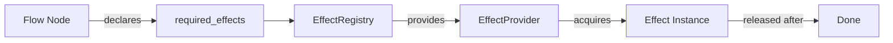

# Effects System

> `aquilia.effects` — Typed effect management with auto-acquire/release

The Effects system provides a typed, composable way to manage external resources (database connections, cache clients, HTTP sessions, storage backends) as explicit dependencies. Effects are automatically acquired before use and released afterward, with full lifecycle management.

## Architecture



## Key Classes

| Class | Purpose |
|---|---|
| `Effect` | Base class for effect tokens |
| `EffectKind` | Enum classifying effect types |
| `EffectProvider` | Protocol for effect lifecycle management |
| `EffectRegistry` | Central registry of effect providers |
| `DBTx` | Database transaction effect |
| `CacheEffect` | Cache client effect |
| `QueueEffect` | Message queue effect |
| `HTTPEffect` | HTTP client effect |
| `StorageEffect` | Storage backend effect |

## Effect Kinds

```python
class EffectKind(str, Enum):
    DB = "db"
    CACHE = "cache"
    QUEUE = "queue"
    HTTP = "http"
    STORAGE = "storage"
    # Extensible via EffectRegistry
```

## EffectRegistry

```python
from aquilia.effects import EffectRegistry

registry = EffectRegistry()

# Register a provider
registry.register("db", db_provider)
registry.register("cache", cache_provider)

# Acquire an effect (auto-managed lifecycle)
async with registry.acquire("db") as db:
    await db.execute("SELECT 1")
# Effect is automatically released

# Acquire multiple effects
async with registry.acquire_many(["db", "cache", "queue"]) as effects:
    db = effects["db"]
    cache = effects["cache"]
    queue = effects["queue"]
```

## Built-in Providers

### DBTxProvider

```python
from aquilia.effects import DBTx, DBTxProvider

provider = DBTxProvider(database)
# Acquiring DBTx starts a transaction
# Releasing commits/rolls back based on exception state
```

### CacheProvider

```python
from aquilia.effects import CacheEffect, CacheProvider

provider = CacheProvider(cache_service)
# Acquiring CacheEffect gets a cache client
```

### HTTPProvider

```python
from aquilia.effects import HTTPEffect, HTTPProvider

provider = HTTPProvider(client_session)
# Acquiring HTTPEffect gets an HTTP session
```

### QueueProvider

```python
from aquilia.effects import QueueEffect, QueueProvider

provider = QueueProvider(task_manager)
# Acquiring QueueEffect gets a task queue handle
```

### StorageProvider

```python
from aquilia.effects import StorageEffect, StorageProvider

provider = StorageProvider(storage_registry)
# Acquiring StorageEffect gets a storage backend
```

## Writing a Custom Provider

```python
from aquilia.effects import Effect, EffectProvider

class CustomEffect(Effect):
    kind = "custom"
    client: Any

class CustomProvider:
    def __init__(self, config):
        self.config = config
    
    async def acquire(self) -> CustomEffect:
        client = await connect(self.config.url)
        return CustomEffect(client=client)
    
    async def release(self, effect: CustomEffect) -> None:
        await effect.client.close()

# Register
registry.register("custom", CustomProvider(config))
```

## Integration with Flow Pipelines

```python
from aquilia import requires

@requires("db", "cache")
async def my_handler(ctx: FlowContext):
    # Effects are auto-acquired
    db = ctx.effects["db"]
    cache = ctx.effects["cache"]
    
    # Use effects...
    await db.execute("INSERT INTO ...")
    await cache.set("key", "value")
    
    # Effects are auto-released after the handler returns
```

## Lifecycle

```
Declare (@requires) → Acquire (registry.acquire) → Use (in handler) → Release (after handler)
```

1. A flow node declares its required effects via `@requires("db", "cache")`
2. Before the node executes, the registry acquires all declared effects
3. The effects are available in `ctx.effects`
4. After the node completes, effects are released
5. If any acquire fails, previously acquired effects are rolled back

## Related

- [Flow](flow.md) — How flow nodes declare and consume effects
- [Middleware](middleware.md) — `EffectMiddleware` auto-manages per-request effects
- [DB](../db/index.md) — Database effect implementation
- [Cache](../cache/index.md) — Cache effect implementation