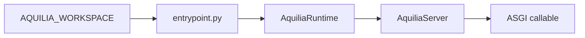

# Entrypoint

> `aquilia.entrypoint` — Zero-config production application factory

The entrypoint module provides a universal ASGI entrypoint for Aquilia applications. It eliminates the need for code generation during Docker builds and delegates to `AquiliaRuntime` for the full bootstrap lifecycle.

## Architecture



The entrypoint module:

1. Resolves workspace root from `AQUILIA_WORKSPACE` env var or `/app`
2. Loads `workspace.py` via `ConfigLoader`
3. Discovers module manifests from `modules/*/manifest.py`
4. Constructs `AquiliaServer` with full manifest list
5. Exports `app` (ASGI callable) and `server` (AquiliaServer instance)

## Key Functions

| Function | Purpose |
|---|---|
| `create_app()` | Full application factory; returns (app, server) tuple |
| `create_app_async()` | Async version with startup hook execution |

## Exports

```python
# Module-level exports — directly usable by ASGI servers
from aquilia.entrypoint import app, server
```

## Usage

### Docker (recommended)

```dockerfile
CMD ["uvicorn", "aquilia.entrypoint:app", \
     "--host", "0.0.0.0", "--port", "8000", "--workers", "4"]
```

### Gunicorn

```dockerfile
CMD ["gunicorn", "aquilia.entrypoint:app", \
     "-k", "uvicorn.workers.UvicornWorker", "-w", "4"]
```

### Hypercorn

```dockerfile
CMD ["hypercorn", "aquilia.entrypoint:app", "--bind", "0.0.0.0:8000"]
```

### Direct (testing)

```bash
python -c "import aquilia.entrypoint; print(aquilia.entrypoint.app)"
```

## Environment Variables

| Variable | Purpose | Default |
|---|---|---|
| `AQUILIA_WORKSPACE` | Path to workspace root directory | `/app` |
| `AQUILIA_ENV` | Runtime mode (`dev`, `test`, `prod`) | `prod` |
| `AQ_SERVER_WORKERS` | Number of uvicorn workers | handled by uvicorn |
| `AQ_SERVER_PORT` | Listening port | handled by uvicorn |

## Security

- No `eval()` or `exec()` — all imports are explicit
- Module discovery uses `importlib` with validated paths
- Environment variables are sanitized before use
- Logging never exposes secrets or credentials

## Related

- [Runtime](runtime.md) — The `AquiliaRuntime` that entrypoint delegates to
- [Server](server.md) — The `AquiliaServer` instance produced
- [Dotenv](dotenv.md) — Environment loading that feeds the entrypoint