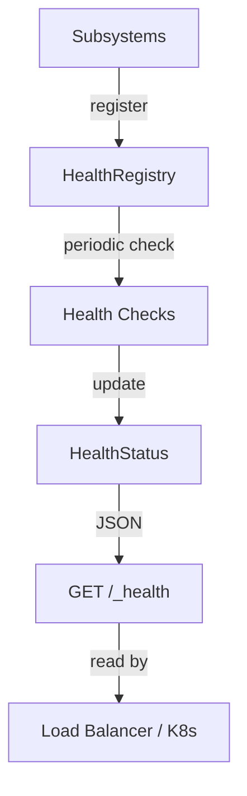

# Health Registry

> `aquilia.health` — Centralized subsystem health tracking

The Health Registry provides centralized health status reporting for all Aquilia subsystems, enabling graceful degradation and load balancer health check endpoints.

## Architecture



## Key Classes

| Class | Purpose |
|---|---|
| `HealthRegistry` | Central registry of subsystem health statuses |
| `HealthStatus` | Dataclass representing a single subsystem's health |
| `SubsystemStatus` | Enum of possible status values |

## SubsystemStatus

```python
class SubsystemStatus(str, Enum):
    HEALTHY = "healthy"       # Operating normally
    DEGRADED = "degraded"     # Reduced functionality
    UNHEALTHY = "unhealthy"   # Not operational
    UNKNOWN = "unknown"       # Status not yet determined
    STARTING = "starting"     # Still initializing
    STOPPED = "stopped"       # Gracefully stopped
```

## HealthStatus

```python
@dataclass
class HealthStatus:
    name: str                              # Subsystem name
    status: SubsystemStatus                # Current status
    latency_ms: float = 0.0                # Last check latency
    message: str = ""                      # Human-readable message
    details: dict[str, Any] = {}           # Subsystem-specific data
    checked_at: datetime                   # Timestamp of last check

    def to_dict(self) -> dict:
        """Serialize for JSON health endpoint."""
```

## HealthRegistry

```python
from aquilia.health import HealthRegistry, HealthStatus, SubsystemStatus

registry = HealthRegistry()

# Register a subsystem
registry.register("database", HealthStatus(
    name="database",
    status=SubsystemStatus.HEALTHY,
    latency_ms=1.2,
    message="Connected to primary",
))

# Register a health check function
def check_database() -> HealthStatus:
    try:
        start = time.monotonic()
        db.execute("SELECT 1")
        latency = (time.monotonic() - start) * 1000
        return HealthStatus(
            name="database",
            status=SubsystemStatus.HEALTHY,
            latency_ms=latency,
            message="OK",
        )
    except Exception as e:
        return HealthStatus(
            name="database",
            status=SubsystemStatus.UNHEALTHY,
            message=str(e),
        )

registry.register_check("database", check_database)

# Update status
registry.update("database", SubsystemStatus.DEGRADED, "Replica lag: 5s")

# Run all checks
results = await registry.run_checks()

# Get aggregate status
overall = registry.overall_status
# UNHEALTHY if any subsystem is UNHEALTHY
# DEGRADED if any is DEGRADED and none are UNHEALTHY
# HEALTHY if all are HEALTHY

# Get JSON for /health endpoint
health_json = registry.to_dict()
```

## Health Check Endpoint

The ASGI adapter exposes `GET /_health` automatically:

```json
{
    "status": "healthy",
    "subsystems": {
        "database": {
            "status": "healthy",
            "latency_ms": 1.2,
            "message": "Connected to primary",
            "checked_at": "2026-06-14T12:00:00Z"
        },
        "cache": {
            "status": "healthy",
            "latency_ms": 0.8,
            "message": "Connected to Redis",
            "checked_at": "2026-06-14T12:00:00Z"
        },
        "storage": {
            "status": "degraded",
            "latency_ms": 45.3,
            "message": "High latency on read operations",
            "checked_at": "2026-06-14T12:00:00Z"
        }
    }
}
```

## Integration with AquiliaServer

The Health Registry is created automatically by `AquiliaServer`:

```python
server = AquiliaServer(manifests=[...])

# Subsystems register themselves during startup
server.health_registry.register("database", ...)
server.health_registry.register("cache", ...)

# Access from anywhere
from aquilia import HealthRegistry
# The server's registry is the single source of truth
```

## Related

- [Server](server.md) — How `AquiliaServer` owns the HealthRegistry
- [Lifecycle](lifecycle.md) — Health during lifecycle transitions
- [ASGI](asgi.md) — The built-in `/_health` endpoint