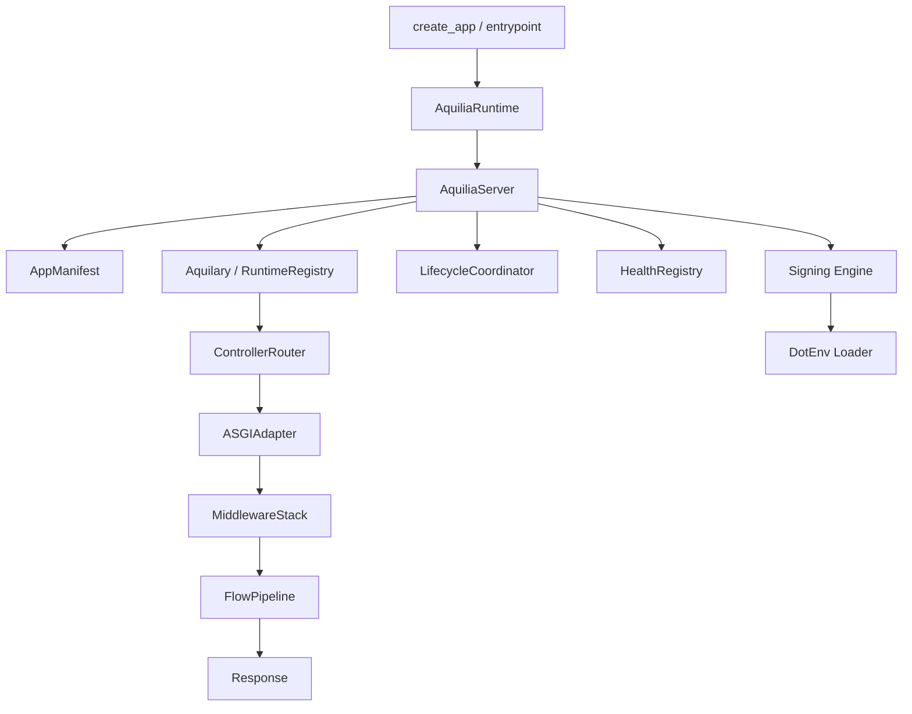

# Core Module

> `aquilia` — The framework root namespace

The **core module** is the heart of Aquilia. It contains the framework's foundation: the server bootstrapper, ASGI adapter, manifest system, request/response primitives, middleware engine, flow pipeline runtime, effects system, health registry, lifecycle coordinator, signing engine, and dotenv loader. Every other module builds on these primitives.

## When to Use

You use the core module **implicitly** — every `aquilia` import resolves through it. You interact with it directly when:

- Writing `workspace.py` and module `manifest.py` files
- Accessing `Request`, `Response`, and `RequestCtx` in controllers
- Configuring the server (`AquiliaServer` / `AquiliaRuntime`)
- Building custom middleware
- Defining flow pipelines for route handlers
- Registering effects providers
- Setting up signing keys and dotenv loading

## Architecture



## Sub-module Pages

| Page | Description |
|---|---|
| [Manifest](manifest.md) | `AppManifest`, `ComponentRef`, `ServiceConfig`, lifecycle configuration |
| [Server](server.md) | `AquiliaServer` orchestrator, boot sequence, configuration |
| [Runtime](runtime.md) | `AquiliaRuntime`, `RuntimeConfig`, `RuntimePhase` lifecycle |
| [Entrypoint](entrypoint.md) | `create_app()` factory, zero-config production bootstrap |
| [Middleware](middleware.md) | `MiddlewareStack`, built-in middleware, composition rules |
| [Request](request.md) | `Request` class, `UploadFile`, `FormData`, body parsing |
| [Response](response.md) | `Response` class, streaming, cookies, caching helpers |
| [ASGI](asgi.md) | `ASGIAdapter`, HTTP/WebSocket/lifespan protocol handling |
| [Flow](flow.md) | `FlowPipeline`, `FlowNode`, `FlowContext`, pipeline composition |
| [Effects](effects.md) | `EffectRegistry`, effect providers, effect tokens |
| [Lifecycle](lifecycle.md) | `LifecycleCoordinator`, `LifecycleManager`, phase transitions |
| [Health](health.md) | `HealthRegistry`, `HealthStatus`, subsystem health checks |
| [Signing](signing.md) | `Signer`, `TimestampSigner`, HMAC backends, subsystem signers |
| [Dotenv](dotenv.md) | `DotEnv`, `DotEnvLoader`, `.env` file parsing and loading |

## Quick Example

```python
from aquilia import (
    AquiliaServer,
    AppManifest,
    Request,
    Response,
)

# Define a module manifest
manifest = AppManifest(
    name="myapp",
    version="1.0.0",
    controllers=["myapp.controllers:MainController"],
)

# The server wires everything together
server = AquiliaServer(manifests=[manifest])
```

```python
# In a controller
from aquilia import Controller, GET, RequestCtx

class MainController(Controller):
    @GET("/")
    async def home(self, ctx: RequestCtx):
        request = ctx.request
        return Response.json({"path": request.path})
```

## Related Modules

- **[aquilary](../aquilary/index.md)** — Manifest registry, dependency graph, route compilation
- **[admin](../admin/index.md)** — Auto-discovering admin dashboard
- **[di](../di/index.md)** — Dependency injection container and providers
- **[faults](../faults/index.md)** — Structured error handling system