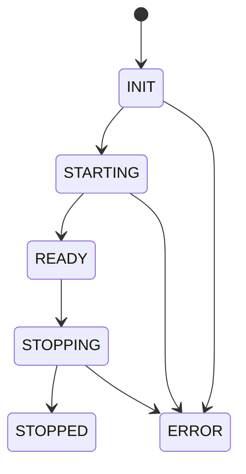

# Lifecycle

> `aquilia.lifecycle` — Startup and shutdown hook orchestration

The Lifecycle system manages startup and shutdown hooks across the entire application, ensuring hooks execute in dependency order with proper error handling and rollback capabilities.

## Architecture



## Key Classes

| Class | Purpose |
|---|---|
| `LifecycleCoordinator` | Orchestrates startup/shutdown hooks across apps |
| `LifecycleManager` | Per-service lifecycle with init/start/stop phases |
| `LifecyclePhase` | Enum of lifecycle phases |
| `LifecycleEvent` | Event emitted during phase transitions |
| `LifecycleError` | Raised when a lifecycle operation fails |

## LifecyclePhase

```python
class LifecyclePhase(Enum):
    INIT = "init"           # Initialization phase
    STARTING = "starting"   # Hooks are starting
    READY = "ready"         # Application is ready
    STOPPING = "stopping"   # Shutdown in progress
    STOPPED = "stopped"     # Application stopped
    ERROR = "error"         # Unrecoverable error
```

## LifecycleCoordinator

```python
from aquilia.lifecycle import LifecycleCoordinator

# Created automatically by AquiliaServer
coordinator = LifecycleCoordinator(runtime, config)

# Startup hooks execute in dependency order
await coordinator.startup()

# Shutdown hooks execute in reverse order
await coordinator.shutdown()
```

### Responsibilities

- Execute startup hooks in **dependency order**
- Execute shutdown hooks in **reverse order** (LIFO)
- Handle errors and perform **rollback** of started services
- Track lifecycle state through phase transitions
- Emit lifecycle events for subscribers

## LifecycleManager

```python
from aquilia.lifecycle import LifecycleManager, LifecyclePhase

class MyService:
    """A service with lifecycle hooks."""
    
    async def on_init(self):
        """Called during INIT phase."""
        self.pool = await create_pool()
    
    async def on_startup(self):
        """Called during STARTING phase."""
        await self.pool.connect()
    
    async def on_shutdown(self):
        """Called during STOPPING phase."""
        await self.pool.disconnect()
```

### LifecycleEvent

```python
@dataclass
class LifecycleEvent:
    phase: LifecyclePhase
    app_name: str | None = None
    message: str | None = None
    error: Exception | None = None
```

## Usage Example

```python
from aquilia.lifecycle import LifecycleCoordinator, LifecyclePhase

coordinator = LifecycleCoordinator(runtime)

# Register a subscriber for lifecycle events
@coordinator.on(LifecyclePhase.READY)
async def on_ready(event: LifecycleEvent):
    logger.info("Application is ready to serve")

@coordinator.on(LifecyclePhase.STOPPING)
async def on_stopping(event: LifecycleEvent):
    await cleanup_resources()
```

## Error Recovery

When a startup hook fails:

1. The coordinator enters the `ERROR` phase
2. Already-started services receive `on_shutdown()` calls in reverse order
3. The error is propagated to the caller

```python
try:
    await coordinator.startup()
except LifecycleError as e:
    logger.error(f"Startup failed: {e}")
    # Already-started services have been rolled back
```

## Related

- [Runtime](runtime.md) — `AquiliaRuntime` manages lifecycle transitions
- [Health](health.md) — Health checks during lifecycle phases
- [Server](server.md) — How `AquiliaServer` uses lifecycle coordination