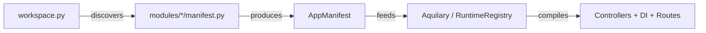

# AppManifest

> `aquilia.manifest` — Data-driven module declaration

`AppManifest` is the declarative module descriptor. Every Aquilia module exposes a `manifest.py` containing an `AppManifest` instance that tells the framework which controllers, services, middleware, models, and socket controllers belong to the module.

## Architecture



The manifest is a pure-data structure — no import-time side effects. The Aquilary registry reads it, resolves the `ComponentRef` references via `importlib`, validates the dependency graph, and compiles the runtime structures.

## Key Classes

| Class | Purpose |
|---|---|
| `AppManifest` | Top-level module descriptor |
| `ComponentRef` | Universal typed reference to any framework component |
| `ComponentKind` | Enum classifying components (controller, service, middleware, guard...) |
| `ServiceScope` | Lifecycle scope enum (singleton, app, request, transient, pooled) |
| `ServiceConfig` | Typed service registration with scope, tags, and metadata |
| `MiddlewareConfig` | Middleware registration with priority and scope |
| `LifecycleConfig` | Startup/shutdown hook configuration |

## AppManifest Fields

```python
@dataclass
class AppManifest:
    name: str                              # Module name (e.g., "users")
    version: str                           # Semantic version
    description: str = ""                  # Human-readable description
    controllers: list[str] = []            # "module.path:ClassName" strings
    services: list[str | ServiceConfig] = []  # Service registrations
    middleware: list[str | MiddlewareConfig] = [] # Middleware registrations
    models: list[str] = []                 # Model class paths
    socket_controllers: list[str] = []     # WebSocket controller paths
    base_path: str = ""                    # Module base import path
    tags: list[str] = []                   # OpenAPI grouping tags
    exports: list[str] = []                # Providers exported to other modules
    imports: list[str] = []                # Providers imported from other modules
    auto_discover: bool = True             # Enable AST-based auto-discovery
```

## Simple Example

```python
# modules/users/manifest.py
from aquilia import AppManifest

manifest = AppManifest(
    name="users",
    version="1.0.0",
    description="User management module",
    controllers=[
        "modules.users.controllers:UsersController",
    ],
    services=[
        "modules.users.services:UsersService",
    ],
    models=[
        "modules.users.models:User",
    ],
    base_path="modules.users",
    tags=["users"],
)
```

## ComponentRef

```python
from aquilia.manifest import ComponentRef, ComponentKind

# Universal typed reference
ref = ComponentRef(
    class_path="modules.auth.guards:JWTGuard",
    kind=ComponentKind.GUARD,
    metadata={"priority": 10},
)

print(ref.module_path)  # "modules.auth.guards"
print(ref.class_name)   # "JWTGuard"
```

## Service Scopes

| Scope | Lifetime |
|---|---|
| `singleton` | Single instance for the entire application |
| `app` | Single instance per module |
| `request` | New instance per HTTP request |
| `transient` | Always new instance on each resolution |
| `pooled` | Object pool with configurable size |

## Related

- [Server](server.md) — How `AppManifest` feeds into `AquiliaServer`
- [aquilary](../aquilary/index.md) — Manifest loading, validation, and registry
- [di](../di/index.md) — How services declared in manifests are wired
- [discovery](../discovery/index.md) — Auto-discovery of components from file system