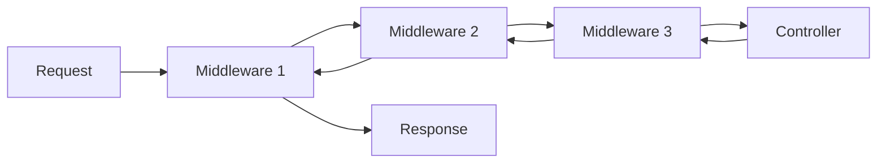

# Middleware Stack

> `aquilia.middleware` — Composable, async-first middleware system

The middleware system provides a composable, ordered pipeline for processing HTTP requests and responses. Every request flows through the middleware chain before reaching the controller, and every response flows back through it.

## Architecture



## Key Classes

| Class | Purpose |
|---|---|
| `MiddlewareStack` | Ordered middleware registry with deterministic ordering |
| `MiddlewareDescriptor` | Descriptor for middleware registration |
| `Middleware` | Type alias for `MiddlewareCallable` |
| `Handler` | Type alias for `RequestHandler` |

## Built-in Middleware

| Middleware | Package | Purpose |
|---|---|---|
| `RequestIdMiddleware` | `aquilia.middleware` | Adds unique `X-Request-ID` header |
| `LoggingMiddleware` | `aquilia.middleware` | Request/response timing logs |
| `ExceptionMiddleware` | `aquilia.middleware` | Converts faults to HTTP responses |
| `TimeoutMiddleware` | `aquilia.middleware` | Enforces per-request timeout |
| `CompressionMiddleware` | `aquilia.middleware` | Gzip/brotli response compression |
| `CORSMiddleware` | `aquilia.middleware_ext` | CORS headers and preflight |
| `CSPMiddleware` | `aquilia.middleware_ext` | Content-Security-Policy headers |
| `CSRFMiddleware` | `aquilia.middleware_ext` | Cross-site request forgery protection |
| `HSTSMiddleware` | `aquilia.middleware_ext` | HTTP Strict Transport Security |
| `SecurityHeadersMiddleware` | `aquilia.middleware_ext` | Multi-header security hardening |
| `RateLimitMiddleware` | `aquilia.middleware_ext` | Request rate limiting |
| `StaticMiddleware` | `aquilia.middleware_ext` | Static file serving with caching |
| `SessionMiddleware` | `aquilia.middleware_ext` | Session persistence |
| `TemplateMiddleware` | `aquilia.templates` | Template context injection |
| `CacheMiddleware` | `aquilia.cache` | HTTP response caching |
| `I18nMiddleware` | `aquilia.i18n` | Locale negotiation |
| `VersionMiddleware` | `aquilia.versioning` | API version resolution |
| `AquilAuthMiddleware` | `aquilia.auth` | Authentication integration |

## MiddlewareStack

```python
from aquilia.middleware import MiddlewareStack

stack = MiddlewareStack()

# Middleware are ordered by scope, then priority:
# Global < Module < Controller < Route
# Within each scope: lower priority = earlier execution

stack.add(RequestIdMiddleware(), scope="global", priority=10)
stack.add(SessionMiddleware(), scope="global", priority=20)
stack.add(CORSMiddleware(origins=["*"]), scope="global", priority=30)
```

### Ordering Rules

| Scope | Order | Example |
|---|---|---|
| `global` | Executes first | Request ID, logging, CORS |
| `app:<name>` | Per-module | Auth for specific module |
| `controller:<name>` | Per-controller | Controller-specific guards |
| `route:<pattern>` | Per-route | Route-specific transforms |

Lower `priority` numbers execute earlier in request processing. For the response path, higher priority numbers return first (reverse order).

## Writing Custom Middleware

```python
from aquilia import Request, Response
from aquilia.middleware import Middleware

async def timing_middleware(request: Request, next_handler) -> Response:
    import time
    start = time.monotonic()
    response = await next_handler(request)
    elapsed = time.monotonic() - start
    response.set_header("X-Response-Time", f"{elapsed:.4f}s")
    return response

# Register in manifest
# manifest = AppManifest(
#     middleware=["myapp.middleware:timing_middleware"],
# )
```

## MiddlewareDescriptor

```python
from aquilia.middleware import MiddlewareDescriptor

desc = MiddlewareDescriptor(
    middleware=my_middleware_fn,
    scope="controller:UsersController",
    priority=15,
    name="custom_auth",
)
```

## Performance Features

- `build_fast_handler()` builds a minimal chain skipping observability middleware for latency-sensitive routes
- `CompressionMiddleware` offloads gzip compression to a thread pool
- Middleware chain is built once at startup and cached

## Related

- [Flow](flow.md) — `FlowPipeline` for per-route pipeline composition
- [Server](server.md) — How the middleware stack integrates with `AquiliaServer`
- [middleware_ext](../middleware_ext/index.md) — Extended middleware (CORS, CSRF, rate limiting)