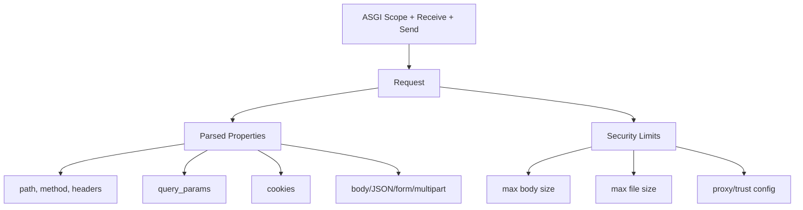

# Request

> `aquilia.request` — Production-grade ASGI request wrapper

`Request` wraps the raw ASGI scope, receive, and send callables into a typed, async HTTP request object with streaming body support, content negotiation, multipart parsing, and security limits.

## Architecture



## Key Classes

| Class | Purpose |
|---|---|
| `Request` | ASGI request wrapper with typed accessors |
| `UploadFile` | Async file upload wrapper with streaming |
| `FormData` | Multipart/form-data parsed form |
| `URL` | Typed URL parser with components |
| `Headers` | Case-insensitive header mapping |
| `MultiDict` | Multi-value dictionary for query parameters |

## Request Properties

```python
request: Request

# Identity
request.method        # "GET", "POST", etc.
request.path          # "/users/42"
request.url           # URL object with components
request.headers       # Headers (case-insensitive)

# Query
request.query_params  # MultiDict of parsed query string
request.query["page"] # Get single query param

# Body (async)
body = await request.body()     # Full raw body as bytes
data = await request.json()     # Parse as JSON
form = await request.form()     # Parse as form data
mp = await request.multipart()  # Parse multipart/form-data
```

## UploadFile

```python
from aquilia import UploadFile

upload: UploadFile
upload.filename          # Original filename
upload.content_type      # MIME type from the client
upload.size              # File size in bytes

# Read content
content = await upload.read()     # Read all bytes
chunk = await upload.read(4096)   # Read chunk

# Save to disk
await upload.save_to("/path/to/destination")

# Stream content
async for chunk in upload:
    process(chunk)
```

## FormData

```python
from aquilia import FormData

# Parse multipart/form-data
form = await request.form()

# Access fields
email = form.get("email")            # Returns str
files = form.getlist("attachment")   # Returns list[UploadFile]

# Iterate all fields
for name, value in form.items():
    if isinstance(value, UploadFile):
        await value.save_to(f"/uploads/{value.filename}")
    else:
        print(f"{name}: {value}")
```

## Content Negotiation

```python
# Check accepted content types
if "application/json" in request.accepts:
    data = await request.json()

# Get best matching content type
best_type = request.accepts.best_match(["application/json", "text/html"])

# Content type of the request body
request.content_type  # e.g., "application/json; charset=utf-8"
```

## Security Features

- **Max body size** — Rejects requests exceeding configurable limit
- **Max fields** — Limits form field count to prevent DoS
- **Max file size** — Caps individual upload file sizes
- **Proxy trust** — Configurable trusted proxy CIDRs for `client_ip` detection
- **Path sanitization** — Null byte and traversal prevention
- **Multipart limits** — Streaming parser with configurable thresholds

## Usage Example

```python
from aquilia import Controller, POST, RequestCtx, Response

class UploadController(Controller):
    @POST("/upload")
    async def upload_file(self, ctx: RequestCtx):
        request = ctx.request
        
        # Check content type
        if request.content_type != "multipart/form-data":
            return Response.json({"error": "Expected multipart"}, status=400)
        
        # Parse multipart
        form = await request.multipart()
        user_id = form.get("user_id")
        
        files = form.getlist("files")
        saved = []
        for upload_file in files:
            path = f"/uploads/{upload_file.filename}"
            await upload_file.save_to(path)
            saved.append(path)
        
        return Response.json({"user_id": user_id, "files": saved})
```

## Related

- [Response](response.md) — Response builder with streaming and caching
- [ASGI](asgi.md) — How the adapter creates Request instances
- [filesystem](../filesystem/index.md) — Async file operations for uploads