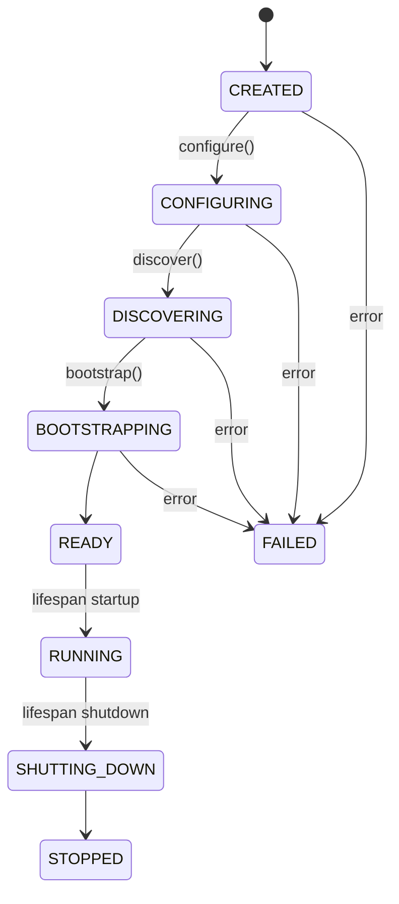

# AquiliaRuntime

> `aquilia.runtime` — Structured ASGI bootstrap lifecycle manager

`AquiliaRuntime` is a typed, phase-gated class that encapsulates the full application lifecycle from workspace discovery through to the running ASGI server. It replaces the brittle code-generation pattern with a single, reusable orchestrator.

## Lifecycle Phases



## Key Classes

| Class | Purpose |
|---|---|
| `AquiliaRuntime` | Phase-gated lifecycle orchestrator |
| `RuntimeConfig` | Typed configuration dataclass |
| `RuntimePhase` | Enum of lifecycle phases |

## RuntimeConfig

```python
@dataclass
class RuntimeConfig:
    workspace_root: Path          # Path to workspace root
    mode: str = "prod"            # "dev", "test", or "prod"
    modules_dir: str = "modules"  # Directory containing module packages
    env_file: str | None = None   # Path to .env file
    config_module: str = "workspace"  # Name of workspace config module
    auto_discover: bool = True    # Enable auto-discovery
    validate_on_startup: bool = True  # Validate manifests during bootstrap
```

## Simple Example

### API Reference

```python
from aquilia.runtime import AquiliaRuntime, RuntimeConfig
from pathlib import Path

# Fluent API
config = RuntimeConfig(workspace_root=Path.cwd(), mode="dev")
runtime = AquiliaRuntime(config)
runtime.configure().discover().bootstrap()
app = runtime.app

# One-liner shortcut
app = AquiliaRuntime.create_app()
```

### Phase Checking

```python
runtime = AquiliaRuntime(RuntimeConfig(workspace_root=Path("/app")))

print(runtime.phase)  # RuntimePhase.CREATED

runtime.configure()
print(runtime.phase)  # RuntimePhase.CONFIGURING

runtime.discover()
print(runtime.phase)  # RuntimePhase.DISCOVERING

runtime.bootstrap()
print(runtime.phase)  # RuntimePhase.READY

print(runtime.server)   # AquiliaServer instance
print(runtime.app)      # ASGI callable
```

## Error Handling

When a phase transition fails, the runtime enters the `FAILED` phase:

```python
try:
    runtime.configure()
except Exception as e:
    print(runtime.phase)     # RuntimePhase.FAILED
    print(runtime.last_error)  # The exception that caused failure
```

## Environment Variables

| Variable | Purpose | Default |
|---|---|---|
| `AQUILIA_WORKSPACE` | Workspace root path | `/app` |
| `AQUILIA_ENV` | Runtime mode (`dev`/`test`/`prod`) | `prod` |

## Related

- [Server](server.md) — `AquiliaServer` orchestrated by the runtime
- [Entrypoint](entrypoint.md) — The `create_app()` entrypoint
- [Lifecycle](lifecycle.md) — Lifecycle coordination during phases
- [Dotenv](dotenv.md) — Environment loading before configuration