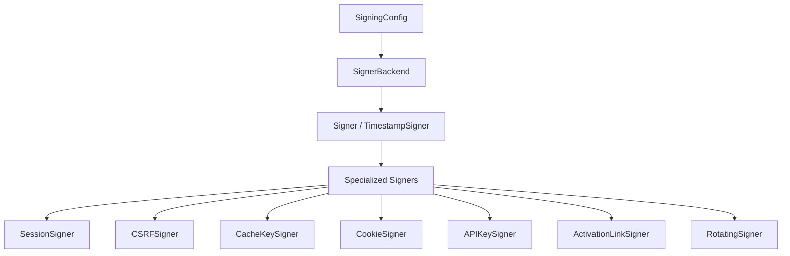

# Signing

> `aquilia.signing` — Zero-dependency HMAC signing engine

The signing engine provides cryptographic signing for all Aquilia subsystems — sessions, CSRF tokens, cache keys, cookies, activation links, and API keys. It uses HMAC with configurable algorithms, supports key rotation, and includes timestamped signing for expiry.

## Architecture



## Key Classes

| Class | Purpose |
|---|---|
| `Signer` | Core signer — signs/unsigns values with HMAC |
| `TimestampSigner` | Time-based signer with automatic expiry |
| `RotatingSigner` | Signer that supports key rotation |
| `SignerBackend` | Protocol for HMAC backend implementations |
| `HmacSignerBackend` | Default HMAC-SHA256 backend |
| `SigningConfig` | Configuration dataclass for the signing engine |
| `SessionSigner` | Pre-configured signer for session data |
| `CSRFSigner` | Pre-configured signer for CSRF tokens |
| `CacheKeySigner` | Pre-configured signer for cache keys |
| `CookieSigner` | Pre-configured signer for cookies |
| `APIKeySigner` | Pre-configured signer for API keys |
| `ActivationLinkSigner` | Pre-configured signer for email activation links |

## Basic Usage

```python
from aquilia.signing import Signer, TimestampSigner

# Create a signer
signer = Signer(secret_key="my-secret-key")
signed = signer.sign("hello")
value = signer.unsign(signed)  # "hello"

# Timestamp-based signer with expiry
ts_signer = TimestampSigner(secret_key="my-secret-key")
signed = ts_signer.sign("data")
value = ts_signer.unsign(signed, max_age=3600)  # Valid for 1 hour
```

## Exceptions

| Exception | Purpose |
|---|---|
| `SigningError` | Base signing exception |
| `BadSignature` | Signature verification failed |
| `SignatureExpired` | Timestamp signer found expired data |
| `SignatureMalformed` | Signed value has invalid format |
| `UnsupportedAlgorithmError` | Algorithm not supported by backend |

## Structured Payloads

```python
from aquilia.signing import signing_dumps, signing_loads

# Sign arbitrary Python objects (JSON + HMAC)
signed = signing_dumps({"user_id": 42, "role": "admin"}, secret="key")
data = signing_loads(signed, secret="key")  # {"user_id": 42, "role": "admin"}
```

## Specialized Signers

### SessionSigner

```python
from aquilia import SessionSigner

session_signer = SessionSigner(secret_key="session-secret")
signed_session = session_signer.sign(session_data)
# Automatically uses the session-specific salt
```

### CSRFSigner

```python
from aquilia import CSRFSigner

csrf = CSRFSigner(secret_key="csrf-secret")
token = csrf.sign(user_id)
```

### APIKeySigner

```python
from aquilia import APIKeySigner

api_signer = APIKeySigner(secret_key="api-secret")
api_key = api_signer.generate_key(user_id="user_42")
```

### CookieSigner

```python
from aquilia import CookieSigner

cookie_signer = CookieSigner(secret_key="cookie-secret")
value = cookie_signer.sign("data")
```

## Key Rotation

```python
from aquilia.signing import RotatingSigner

signer = RotatingSigner(
    secret_keys=["new-key", "old-key"],  # Newest first
)

# Signs with the first (newest) key
token = signer.sign("data")

# Verifies against any key in the list
data = signer.unsign(token)  # Works even if signed with old-key
```

## Configuration

```python
from aquilia.signing import SigningConfig, configure_signing

config = SigningConfig(
    secret_key="my-app-secret",
    algorithm="sha256",
    salt="my-app",
    separator=":",
)

# Configure the signing engine globally
configure_signing(config)
```

## Low-Level Primitives

```python
from aquilia.signing import (
    b64_encode,
    b64_decode,
    constant_time_compare,
    derive_key,
    make_signer,
    make_timestamp_signer,
)

# Constant-time comparison (prevents timing attacks)
is_equal = constant_time_compare(a.encode(), b.encode())

# Derive a key from a secret + salt
derived = derive_key(secret, salt, algorithm="sha256")

# Create signers with config
signer = make_signer(secret="key", salt="my-salt")
ts_signer = make_timestamp_signer(secret="key", salt="my-salt")
```

## Security

- **Constant-time comparison** — Prevents timing attacks on signature verification
- **HMAC-SHA256 by default** — Industry-standard algorithm
- **Key derivation** — Salts prevent key reuse across subsystems
- **No pickle** — Payloads use JSON, not pickle
- **Bootstrap** — Keys configured once at server startup, shared across all subsystems

## Related

- [Middleware](middleware.md) — CSRF middleware uses CSRFSigner
- [Sessions](../sessions/index.md) — Session engine uses SessionSigner
- [Cache](../cache/index.md) — Cache keys are HMAC-signed
- [Server](server.md) — Signing bootstrap during server init