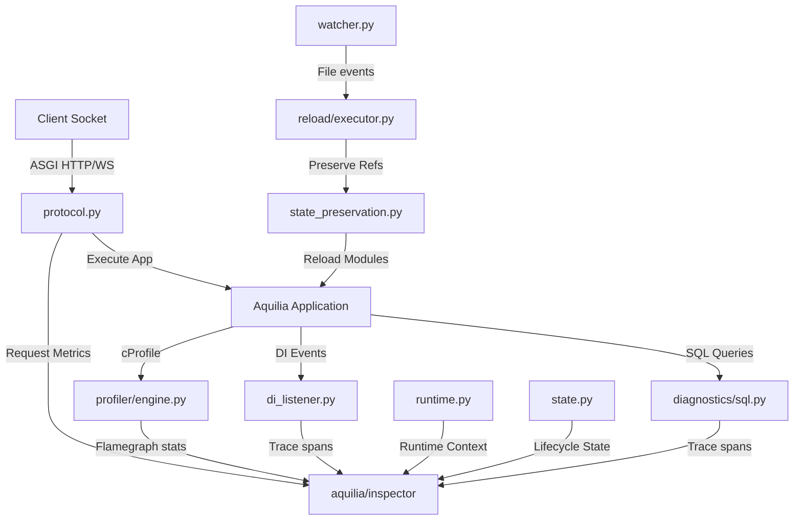
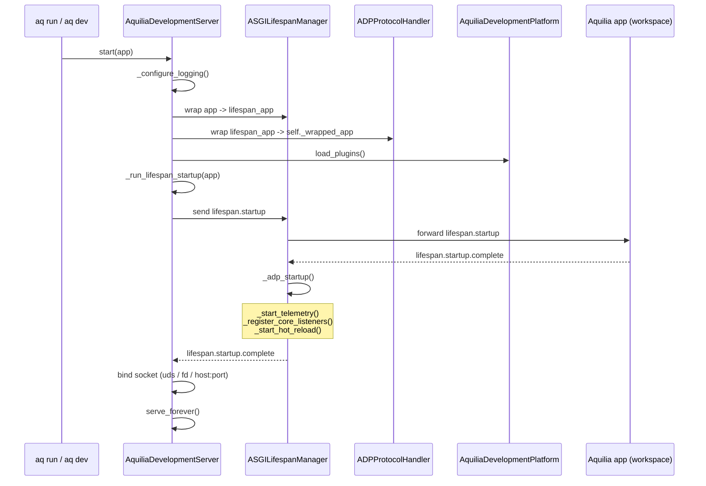
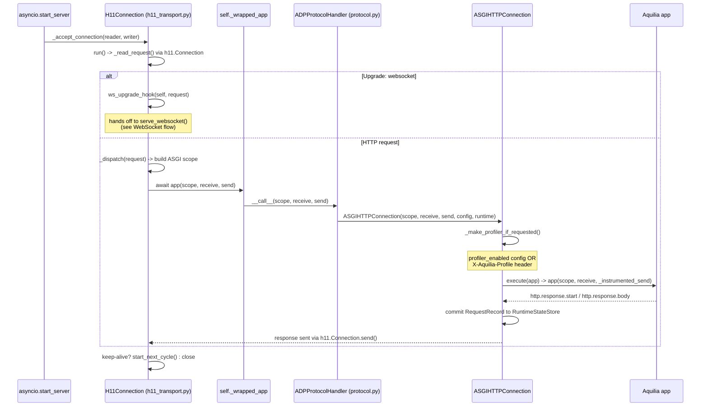
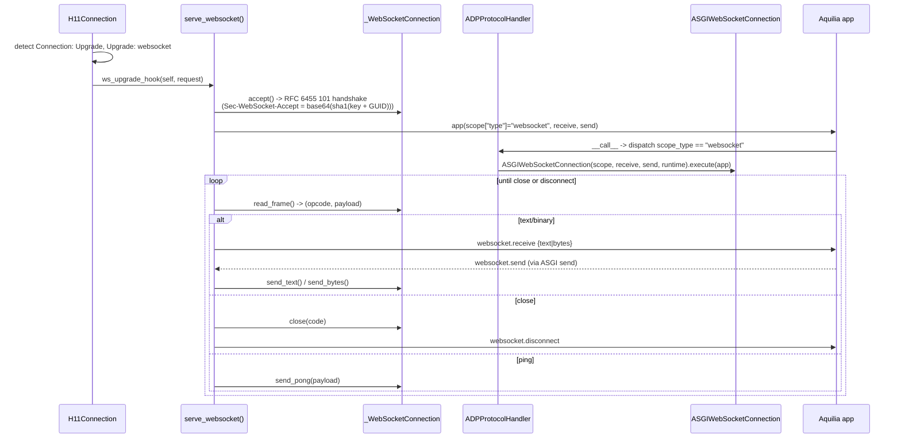
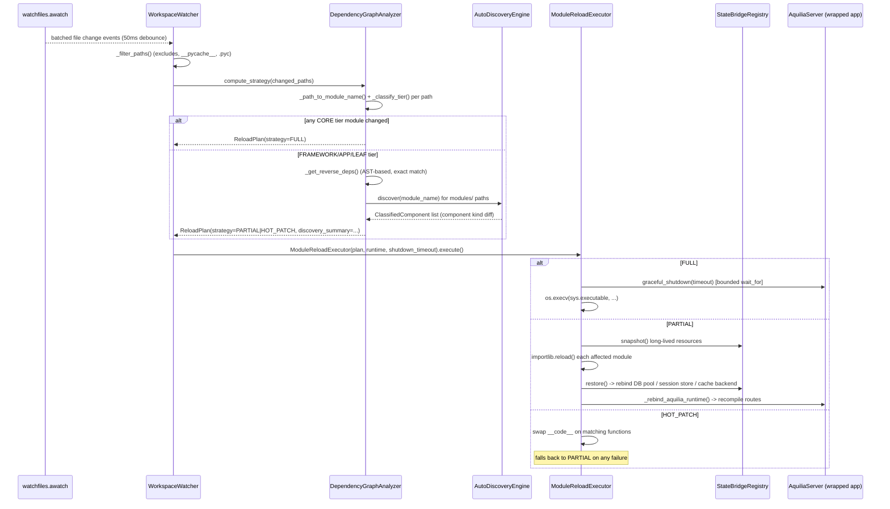
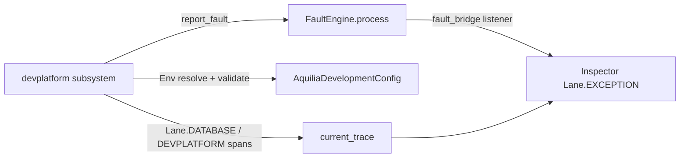

# ADP Architecture — v1.4.0b0

All diagrams below trace actual call paths in `aquilia/devplatform/`, verified
against the source for this release. Class/function names match the code
exactly.

### 1. Component Interaction Diagram

---

## Boot Sequence

`AquiliaDevelopmentServer.start()` (`aquilia/devplatform/devserver.py`):

`_adp_startup()` (`core/lifespan.py`) boots, in order:

1. `_start_telemetry()` — starts `MemoryUsageTracker` (if `inspector_enabled`) and `EventLoopMonitor` unconditionally.
2. `_register_core_listeners()` — attaches `InspectorDiagnosticListener` to any DI containers reachable via `app.server.runtime.di_containers`.
3. `_start_hot_reload()` — spawns `WorkspaceWatcher.watch()` as a background task, if `config.reload` is true.

## HTTP Request Flow

Socket accept → `H11Connection` (native h11 transport) → `ADPProtocolHandler` → `ASGIHTTPConnection` → the Aquilia app.

Notes verified against `h11_transport.py`:
- `H11Connection` keeps one `h11.Connection(h11.SERVER)` per TCP connection — keep-alive and pipelining are handled by h11's own state machine (`start_next_cycle()`), not re-implemented.
- On an unhandled exception from the app with no response yet started, `H11Connection._dispatch()` sends a `500` and does **not** re-raise. If the app raised after already sending `http.response.start`, the exception propagates and the connection is closed (no safe partial response to send).
- `App` above is whatever `ASGILifespanManager` wraps — for `http`/`websocket` scope types `ASGILifespanManager.__call__` passes through directly to the real Aquilia app unchanged; only `lifespan` scope is intercepted.

## WebSocket Upgrade Flow

`aquilia/devplatform/core/websocket_transport.py`. Handshake happens directly
against the raw socket (h11 is HTTP/1.1 only — it hands off once the Upgrade
request is parsed).

The ASGI app receives `websocket.connect` *before* it may call
`send({"type": "websocket.accept"})` — `receive()` in `serve_websocket()` is a
plain `asyncio.Queue.get()` with no gating on acceptance, which is required by
the ASGI spec's connect-then-accept ordering.

## Hot Reload Flow

`aquilia/devplatform/reload/`.

`_classify_tier()` maps path fragments to `StabilityTier`:

| Tier | Path fragments | Strategy |
|---|---|---|
| `CORE` (1) | `aquilary`, `/di/`, `patterns` | `FULL` |
| `FRAMEWORK` (2) | `/db/`, `routing`, `middleware` | `PARTIAL` |
| `APP` (3, default) | `controller`, `models`, `auth`, `sessions` | `PARTIAL` |
| `LEAF` (4) | `debug`, `testing`, `devplatform` | `HOT_PATCH` |

If a changed file isn't resolvable to a loaded module (`_path_to_module_name()`
returns `None`, or it's not in `sys.modules`), the plan always defaults to
`FULL` — this covers new files and config changes the running process has no
way to hot-patch.

## Framework Integration Points

The ADP is a first-class Aquilia subsystem, wired into the same core
machinery every other subsystem uses rather than a parallel architecture.

**Faults.** `aquilia/devplatform/faults.py` defines `DEVPLATFORM_DOMAIN`
(`FaultDomain.DEVPLATFORM`, registered in `aquilia/faults/core.py`) and the
`DevPlatformFault` hierarchy: `StartupFault`, `ReloadFault`,
`InspectorFault`, `WorkerFault`, `ConfigurationFault`. Non-fatal failures
throughout the subsystem call `report_fault(fault, app=...)`, which forwards
to the wrapped app's `FaultEngine.process()` when reachable. Because
`aquilia/inspector/fault_bridge.py`'s listener is already registered on that
engine (`server.py`), DevPlatform faults surface in Inspector's
`Lane.EXCEPTION` automatically — no Inspector-side code. Fatal faults
(`StartupFault`, `ConfigurationFault`) propagate to the CLI boundary and exit
non-zero.

**Config.** `AquiliaDevelopmentConfig` resolves each field through
`aquilia.pyconfig.Env` and validates in `__post_init__` (raising
`ConfigurationFault`). `to_dict()` is the single serialization source of
truth, consumed by both `_build_adp_config()` and the codegen'd
`runtime/_adp_app.py` wrapper.

**Typing / datastructures.** Types live in `aquilia/typing/devplatform.py`
(re-exported from `aquilia.typing`). The six state stores share
`core/_base.SingletonMixin`; `core/_cache.BoundedCache` bounds the reload
import-graph memo; header redaction uses `aquilia._datastructures.Headers`.

**Inspector spans & profile serving.** SQL diagnostics read
`Lane.DATABASE` spans off the request trace (see [diagnostics.md](diagnostics.md));
a dedicated `Lane.DEVPLATFORM` carries reload/plugin events; captured
profiles are served at
`/__aquilia__/inspector/devplatform/profile/{request_id}/`.

